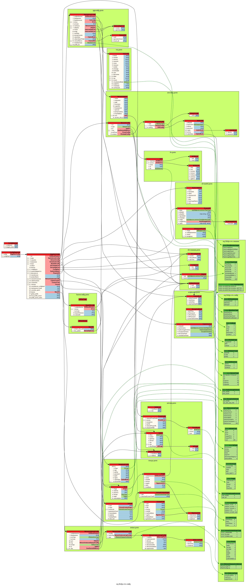

# Device API

This is the "Device API", for communications between an edge device and a controller.

See [https://www.lfedge.org/projects/eve/](https://www.lfedge.org/projects/eve/)

This directory defines only the API itself. It is in two parts:

* documentation in the file [APIv2.md](./APIv2.md) for the protocol
* documentation in the file [PROFILE.md](./PROFILE.md) for local profile override
* message definitions as [protobufs](https://developers.google.com/protocol-buffers/) in subdirectories to this directory

To use the protobufs, you need to compile them into the target language of your choice, such as Go, Python or Node.
The actual compiled language-specific libraries are in the [go/](go/) and [python/](python/) folders of this repository, and are compiled via the command `make proto` in the root of this repository.

In addition to the language-specific libraries, `make proto` generates visualizations of the protobuf structure,
beginning with the root of an edge device config. These are
available as `.svg`, `.dot` and `.png` as below. Click to zoom in.

* 
* [svg](./images/devconfig.dot.svg)
* [dot](./images/devconfig.dot)
