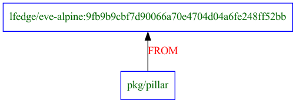
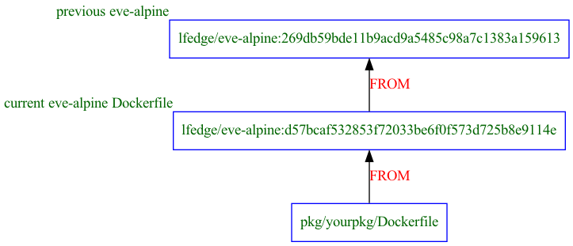
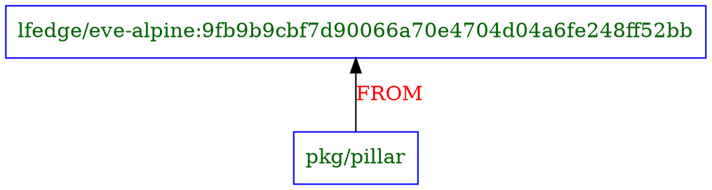
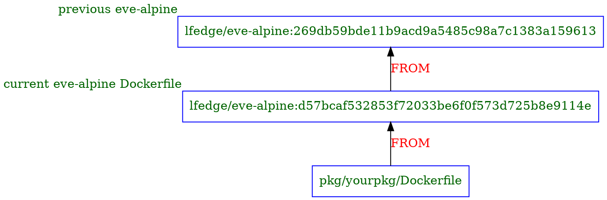

# Alpine

The basics of using the build system are in [BUILD.md](./BUILD.md).
It is highly recommended you start there. This document describes how to update eve.

[Alpine Linux](https://pkgs.alpinelinux.org/packages) is the base
packaging system used for software dependencies in eve, and its
`apk` packaging system is the base for binary artifacts.

A base image `lfedge/eve-alpine` is composed from the source in
[pkg/alpine](../pkg/alpine/) and is used as the `FROM` image for all
other packages in [pkg/](../pkg/).

As long as eve-alpine _already_ contains the packages you need, you simply
reference it in your Dockerfile:

```Dockerfile
FROM lfedge/eve-alpine:<hash>
```

For example, as of this writing, the [uefi Dockerfile](../pkg/uefi/Dockerfile) begins:

```Dockerfile
FROM lfedge/eve-alpine:9fb9b9cbf7d90066a70e4704d04a6fe248ff52bb as build
```

If you need to add a package to eve-alpine, you need to update eve-alpine itself.

## What eve-alpine provides

Alpine's `apk` packaging system is small, lightweight, and efficient.
It also has an excellent dependency resolution graph, enabling you to
require just one package, and have it determine all additional dependencies
and their install order.

apk's shortcoming is in the inconsistencies of installs.

First, installing a package, e.g. `apk install curl`, does not guarantee
any specific version. It can and will take the latest version available.
This makes it difficult to impossible to provide reproducible builds.

Second, even if you pin to a specific version, Alpine's apk maintainers
reserver the right to update the bits behind a specific package behind
the covers, normally for bugfixes or security concerns. That means that
even if you install `curl=8.1.0-r0`, and the next time install the exact same version, you still might get changed bits.

Third, and this is not unique to Alpine, every time you install packages,
in the case of Alpine via `apk add`, you are downloading packages from the
Internet. This makes every eve package that needs, well, packages dependent
on downloading over and over again.

For this reason, `eve-alpine` exists. Its purpose is to be a consistent cache.

* cache: it already has all of the desired packages (`.apk` files) installed
* consistent: because it already has all of the desired packages installed, you are guaranteed to get the exact same version _and_ bits with each install

For this reason, _every_ downstream package in `pkg/`, except for
`pkg/alpine` itself, of course, **must** take all of its packages from
`eve-alpine` and not plain old `alpine`.

Or, in other words:

```Dockerfile
# ALWAYS do this:
FROM lfedge/eve-alpine:<hash>

# NEVER do this:
FROM alpine:3.17 # or any other version
```

So long as your specific version of `eve-alpine` has the packages you need,
do the above, and you are done. `apk add` will provide it for you.



What do you do if you need new packages? Or if you need to update `eve-alpine`
itself to be based on a new version of Alpine?

## Adding new packages to eve-alpine

The process of adding new packages to eve-alpine and using them is:

1. Update [pkg/alpine/Dockerfile](../pkg/alpine/Dockerfile) to depend on the current cache
1. Update the list of packages in [pkg/alpine/mirrors/](../pkg/alpine/mirrors) to add the new package(s)
1. Commit your changes
1. Rebuild `eve-alpine`
1. Update your downstream dependency to consume the new version of `eve-alpine`

### Update pkg/alpine/Dockerfile

As described above, eve-alpine itself is a cache. To be a successful cache,
we don't want to download all of our packages in the cache, either, just
because we added one new package. Instead, we want to add the new package
_alone_, and leave the rest of the cache untouched.

To do this, we rely on _previous_ versions of `eve-alpine`. Thus, we do
**not** build the cache this way:

```Dockerfile
FROM alpine:3.17
RUN apk add \
acl \
acpi \
alpine-baselayout \
alpine-keys \
apk-tools \
argp-standalone \
attr-dev \
autoconf \
...
```

Doing so would reinstall _all_ of the packages from scratch each build,
and could lead to changed versions and bits.
Instead, we use the previous version. Let's say we last finished building
`eve-alpine`, and the last version was `lfedge/eve-alpine:269db59bde11b9acd9a5485c98a7c1383a159613`.

Then the next time we need to add a package, we update the `FROM` line to be
our previous build.

```Dockerfile
# change this line from what it was before
FROM lfedge/eve-alpine:269db59bde11b9acd9a5485c98a7c1383a159613
```

### Update the list of packages to install

Where are those packages listed, so we can add our new ones? They are stored in [pkg/alpine/mirrors](../pkg/alpine/mirrors).
In that directory, there is a folder for each Alpine release, allowing you
to add packages you wish to pull from specific releases of Alpine,
independent of what version your current build is based upon.

Thus, `eve-alpine` might be based on alpine `3.17`, and you could
add a package from `3.16` and from `edge`, just be creating the directories:

* `pkg/alpine/mirrors/3.16/`
* `pkg/alpine/mirrors/edge/`

Inside each such directory is a file per repository - `main` or `community`.
Any package listed on its own line in one of those files will be installed
for all eve architectures.

If you want a package just for a specific architecture, you can list if in
a file named `main.<arch>` or `community.<arch>`, e.g. `main.x86_64`.

Look in the existing directories for examples.

### Commit your changes

You should commit your changes before you go on.
You do not absolutely _have_ to commit your changes for this to work.
However, the tag for your new `eve-alpine` image is calculated from
the contents of the directory [pkg/alpine](../pkg/alpine). If there are
uncommitted changes, then the tag will be different than you expect,
containing the word `-dirty` and a hash of all of the file contents.

You can check what that is by running `linuxkit pkg show-tag pkg/alpine`.

For example, as of this writing:

```shell
$ linuxkit pkg show-tag pkg/alpine
lfedge/eve-alpine:269db59bde11b9acd9a5485c98a7c1383a159613
```

If I change a file and do not commit it:

```shell
$ linuxkit pkg show-tag pkg/alpine
lfedge/eve-alpine:269db59bde11b9acd9a5485c98a7c1383a159613-dirty-564e0f5
```

You _never_ will want to push out uncommitted changes (nor will CI let you),
but you also _never_ want to have the `FROM` tag in your downstream
Dockerfile have `-dirty` in it, unless it is just for
local, temporary testing. Thus, commit your changes.

### Rebuild eve-alpine

Back in our root directory, we can now rebuild `eve-alpine`:

```shell
make eve-alpine
```

This, in turn, will build our new `eve-alpine`, but it also will give
us the new `eve-alpine` hash, which we can use to update our downstream
packages. For example, if the new one is `lfedge/eve-alpine:d57bcaf532853f72033be6f0f573d725b8e9114e`, then that is what you use in your downstream package.

```Dockerfile
FROM lfedge/eve-alpine:d57bcaf532853f72033be6f0f573d725b8e9114e
```

Now you can add those packages in the downstream

The rule of thumb then is:

* Your downstream package `Dockerfile` depends `FROM` _latest_ version of `lfedge/eve-alpine`
* `pkg/alpine/Dockerfile` depends `FROM` the _previous_ version of `lfedge/eve-alpine`



## Rebasing eve-alpine on top of new Alpine release

The first option requires update of eve-alpine-base image to use another minirootfs and repository and pointing eve-alpine to be based on novel eve-alpine-base using `FROM lfedge/eve-alpine-base`. This action will invalidate all stored packages inside eve-alpine and download them from repository.

The second option will append package to cache. Unlike a lot of other Linux distributions, Alpine Linux doesn't provide historical versions of all its packages. In fact, Alpine Linux reserves the right to update packages with security patches behind the scenes resulting in content of Alpine x.y.z repositories shifting slightly from time to time. This, obviously, goes against the principle of reproducible builds and makes our `lfedge/eve-alpine` cache serve a double function: not only it is used to speed up the build, but it also may end up being the only place on the Internet where a certain Alpine Linux package version x.y.z could be available from.

The latter aspect makes maintaining `lfedge/eve-alpine` a bit tricky, even though at its core it is simply driven by the list of packages recorded in the manifest files under [pkg/alpine/mirrors](../pkg/alpine/mirrors). Removing packages from the cache is not advisable (and should really only be done during major EVE version updates). Adding packages to the cache consists of two steps:

1. adding new package names to the right manifest file (under `pkg/alpine/mirrors/<BASE ALPINE VERSION>/[main|community]`)
2. updating `FROM ... AS cache` line in [pkg/alpine/Dockerfile](../pkg/alpine/Dockerfile) to point to the last version of the cache

Step #2 guarantees that all _existing_ packages will simply be re-used from the previous version of the cache and _NOT_ re-downloaded from the Alpine http mirrors (remember that re-downloading always runs the risk of getting a different version of the same package). Step #1, of course, will download new packages and pin them in the new version of the cache.

If the above seems a bit confusing, don't despair: here's an [actual example](../../../commit/1340c1b6981ed3219f78a7a0209ff9222a0dacdf) of adding 4 new packages `libfdt`, `dtc`, `dtc-dev` and `uboot-tools` to the `lfedge/eve-alpine` cache.

## Appendix

graphviz sources:

### Simple pillar dependency



### Your package based on alpine based on alpine


