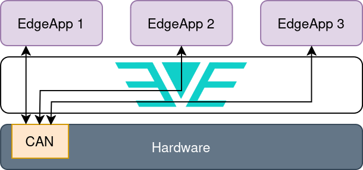

# CAN Bus support

## Introduction

The Controller Area Network (CAN) is a vehicle standard initially designed by
Bosch to allow the communication between microcontrollers from different ECUs
(Electrical Control Units) inside a vehicle. The architecture is structured in a
OSI model implementing the first two layers: Physical and Data link layers. The
CAN bus evolved into two ISO standards: [ISO11898-1](https://www.iso.org/standard/63648.html), which covers the Data link
layer, and the [ISO11898-2](https://www.iso.org/standard/67244.html), which covers the Physical layer (electric properties,
etc). There are basically two types for the Physical layer of CAN bus:

* __Low speed CAN bus__ (also referred to as fault tolerant CAN): It enables low
 bit rate transfers, from 40 kbit/s to 125 kbit/s, but it can continue to
 work even if one of the two wires of the bus fail.

* __High speed CAN bus__: Supporting bit rates from 40 kbit/s to 1 Mbit/s
 (Classical CAN) this is the most popular CAN bus standard and the base for
 upper layer protocols, such as OBDII, J1939, etc. The second generation of
 CAN is known as CAN with Flexible Data-rate, or __CAN FD__. This standard is
 also compatible with Classical CAN and enables bit rates up to 8 Mbit/s.

## CAN bus on Linux

The Linux kernel supports CAN network through the SocketCAN framework.
SocketCAN is built upon the Linux network layer, so CAN interfaces are
listed as network interfaces in the system, as shown below:

```text
$ ip addr show can0
7: can0: <NOARP,ECHO> mtu 16 qdisc noop state DOWN group default qlen 10
    link/can
```

Therefore, the communication is performed through sockets. The regular
network system tools, like _ifconfig_ or _ip_ can be used to setup CAN
interfaces, and other userspace utilities can be used to send and receive
CAN data. These are the settings for a CAN interface:

```text
$ ip link set can0 type can help
Usage: ip link set DEVICE type can
    [ bitrate BITRATE [ sample-point SAMPLE-POINT] ] |
    [ tq TQ prop-seg PROP_SEG phase-seg1 PHASE-SEG1
      phase-seg2 PHASE-SEG2 [ sjw SJW ] ]

    [ dbitrate BITRATE [ dsample-point SAMPLE-POINT] ] |
    [ dtq TQ dprop-seg PROP_SEG dphase-seg1 PHASE-SEG1
      dphase-seg2 PHASE-SEG2 [ dsjw SJW ] ]
    [ tdcv TDCV tdco TDCO tdcf TDCF ]

    [ loopback { on | off } ]
    [ listen-only { on | off } ]
    [ triple-sampling { on | off } ]
    [ one-shot { on | off } ]
    [ berr-reporting { on | off } ]
    [ fd { on | off } ]
    [ fd-non-iso { on | off } ]
    [ presume-ack { on | off } ]
    [ cc-len8-dlc { on | off } ]
    [ tdc-mode { auto | manual | off } ]

    [ restart-ms TIME-MS ]
    [ restart ]

    [ termination { 0..65535 } ]

    Where: BITRATE  := { NUMBER in bps }
          SAMPLE-POINT  := { 0.000..0.999 }
          TQ        := { NUMBER in ns }
          PROP-SEG  := { NUMBER in tq }
          PHASE-SEG1    := { NUMBER in tq }
          PHASE-SEG2    := { NUMBER in tq }
          SJW       := { NUMBER in tq }
          TDCV      := { NUMBER in tc }
          TDCO      := { NUMBER in tc }
          TDCF      := { NUMBER in tc }
          RESTART-MS    := { 0 | NUMBER in ms }
```

## Common use cases

This section describes the main use cases with different configurations
and/or uses of CAN bus by Edge Applications and EVE-OS. In all examples it
will be considered a hypothetical device running EVE-OS with three Edge
Applications deployed (no matter their type, i.e., if they are Containers
and/or VMs). However, all these examples can be expanded to different
combinations and setups.

In the use case of Fig. 1 the hardware is equipped with one physical CAN
interface which is [passed-through](#edge-application-guest-requirements) to
the Edge Application EdgeApp 1. Thus, this Guest will have the physical CAN
interface exposed through an emulated device, so it should see a regular can
interface (_can0_, for instance) through where the communication can be
established.


*Fig. 1: Only one Edge Application has access to the physical CAN interface from the host.*

In the use case of Fig. 2 the hardware is equipped with one physical CAN
interface which is passed-through to all Edge Applications deployed on the
system (EdgeApp 1 to 3). In this case, all Guests should have the physical CAN
exposed through an emulated device. Due to the broadcast nature of the CAN bus,
all frames sent to this interface shall be seen by all Guests.



*Fig. 2: All Edge Applications have access to the physical CAN interface from the host.*

The use case of Fig. 3 illustrates a more complex scenario, where the
hardware is equipped with one physical CAN interface and one Virtual CAN
interface that is configured by EVE-OS. Both physical and virtual CAN
interfaces are passed-through to EdgeApp1 while the Virtual interface is
also passed-through to EdgeApp 2 and Edge App 3. In this setup the EdgeApp
1 could act as a proxy/firewall for the CAN bus traffic of EdgeApp 2 and
EdgeApp3, forwarding only the desired frames to the physical CAN interface
(on both directions, for instance).


*Fig. 3: One Edge Application has access to the physical CAN interface from the host and one virtual CAN interface, which is also accessed by the other two Edge Applications. In this case, EdgeApp 1 could act as a proxy between VCAN->CAN.*

## Device model

CAN interfaces (physical or virtual) are specified in the Device Model
file as members of the list of I/O devices (_ioMemberList_), for instance, a
physical CAN interface (_can0_) can be configured by the following code:

```json
"ioMemberList": [
    {
        "ztype": "IO_TYPE_CAN",
        "phylabel": "can0",
        "logicallabel" : "can0",
        "assigngrp" : "",
        "phyaddrs" : {
            "ifname" : "can0"
        },
        "cbattr" : {
            "bitrate": "125000",
            "sample-point": "0.875",
            "tq": "29",
            "prop_seg": "118",
            "phase_seg1": "119",
            "phase_seg2": "34",
            "sjw": "1",
            "dbitrate": "250000",
            "dsample-point": "0.875",
            "dtq": "29",
            "dprop_seg": "118",
            "dphase_seg1": "119",
            "dphase_seg2": "34",
            "dsjw": "1",
            "loopback": "on",
            "listen-only": "off",
            "triple-sampling": "off",
            "one-shot": "off",
            "berr-reporting": "on",
            "fd": "on",
            "fd-non-iso": "off",
            "presume-ack": "on",
            "cc-len8-dlc": "off",
            "tdc-mode": "auto"
        }
    }
]
```

The parameter _ztype_ shall be:

* __IO_TYPE_CAN__: For physical CAN interfaces

* __IO_TYPE_VCAN__: For virtual CAN interfaces

* __IO_TYPE_LCAN__: For a logical CAN device, i.e., this type of device doesn’t
  define any configuration for a CAN controller, but it just points to
  another (physical or virtual) CAN interface. It should be particularly
  used to duplicate a CAN interface in the device model so it can be
  passed-through to more than one Edge Application

Only the following parameters are mandatory:

* ztype

* phylabel

* logicallabel

* cbattr (at least bitrate should be present for IO_TYPE_CAN type)

Parameters not supported by the CAN interface shall be omitted from the device model file.

### Giving access to host's CAN controllers to Edge Applications

It’s important to point out that in case of CAN interfaces, the same CAN
interface can be assigned to one or more Edge Applications. This
requirement breaks the logic for device passthrough on EVE + Cloud
Controller. So the alternative approach is to use the logical CAN
definition, which points to a physical/virtual CAN interface in the device
model. For instance, the use case from Fig. 2 would have the following
configuration in the device model:

```json
"ioMemberList": [
    {
        "ztype": "IO_TYPE_CAN",
        "phylabel": "can0",
        "logicallabel": "can0",
        "assigngrp" : "",
        "phyaddrs" : {
            "ifname" : "can0"
        },
        "cbattr" : {
            "bitrate": "125000",
        }
    },
    {
        "ztype": "IO_TYPE_LCAN",
        "phylabel": "can0.1",
        "logicallabel": "can0.1",
        "assigngrp" : "can0.1",
        "phyaddrs" : {
            "ifname" : "can0"
        },
    },
    {
        "ztype": "IO_TYPE_LCAN",
        "phylabel": "can0.2",
        "logicallabel": "can0.2",
        "assigngrp" : "can0.2",
        "phyaddrs" : {
            "ifname" : "can0"
        },
    },
    {
        "ztype": "IO_TYPE_LCAN",
        "phylabel": "can0.3",
        "logicallabel": "can0.3",
        "assigngrp" : "can0.3",
        "phyaddrs" : {
            "ifname" : "can0"
        },
    }
]
```

Notice that each _LCAN_ device should have an unique _assigngrp_ value in
order to be exclusively accessed by an Edge Application. Fore more
information, see the documentation for [I/O Adapters](./HARDWARE-MODEL.md#io-adapters).

The correspondence between the I/O devices declared in the device model and
all CAN interfaces + Edge Applications are illustrated in the Fig. 4.


*Fig. 4: Use case 2 with I/O CAN devices from device model illustrated.*

So logically the device is presented with 4 CAN interfaces, the physical
(real) controller plus 3 logical interfaces, where each one can be
passed-through to each Edge Application. However, all of them point to the
same physical _can0_. In the device model, the interface _can0_ is the one that
describes the physical CAN interface and contains the proper parameters to
set up the controller. The logical interfaces _can0.1_, _can0.2_ and _can0.3_
point to _can0_ and can be passed-through to the applications.

The use case from Fig. 3 would have the following configuration in the device
model (illustrated by Fig. 5):

```json
"ioMemberList": [
    {
        "ztype": "IO_TYPE_VCAN",
        "phylabel": "vcan0",
        "logicallabel": "vcan0",
        "assigngrp" : "",
        "phyaddrs" : {
            "ifname" : "vcan0"
        },
        "cbattr" : {
            "bitrate": "125000",
        }
    },
    {
        "ztype": "IO_TYPE_LCAN",
        "phylabel": "vcan0.1",
        "logicallabel": "vcan0.1",
        "assigngrp" : "vcan0.1",
        "phyaddrs" : {
            "ifname" : "vcan0"
        },
    },
    {
        "ztype": "IO_TYPE_LCAN",
        "phylabel": "vcan0.2",
        "logicallabel": "vcan0.2",
        "assigngrp" : "vcan0.2",
        "phyaddrs" : {
            "ifname" : "vcan0"
        },
    },
    {
        "ztype": "IO_TYPE_LCAN",
        "phylabel": "vcan0.3",
        "logicallabel": "vcan0.3",
        "assigngrp" : "vcan0.3",
        "phyaddrs" : {
            "ifname" : "vcan0"
        },
    },
    {
        "ztype": "IO_TYPE_CAN",
        "phylabel": "can0",
        "logicallabel": "can0",
        "assigngrp" : "",
        "phyaddrs" : {
            "ifname" : "can0"
        },
        "cbattr" : {
            "bitrate": "125000",
        }
    },
    {
        "ztype": "IO_TYPE_LCAN",
        "phylabel": "can0.1",
        "logicallabel": "can0.1",
        "assigngrp" : "can0.1",
        "phyaddrs" : {
            "ifname" : "can0"
        },
    }
]
```


*Fig. 5: Use case 3 with I/O CAN devices from device model illustrated.*

Notice that only one interface should have the type IO_TYPE_VCAN, which is the
one that creates the virtual interface on the system. The other interfaces that
point to _vcan0_ should be created as logical CAN interfaces.  A single logical
CAN interface should also be created for _can0_, even though it’s going to be
accessed by only one application. Thus, a total of six CAN interfaces will be
presented to the user: _can0_ (physical) and _can0.1_ (which can be
passed-through to EdgeApp 1); _vcan0_, which defines the virtual CAN interface;
_vcan0.1_, _vcan0.2_ and _vcan0.3_, which can be passed-through to EdgeApp 1,
EdgeApp 2 and EdgeApp 3, respectively.

Finally, the use case 1 follows the same logic, two I/O devices are
declared for the _can0_ interface: one that defines the CAN controller and
one logical CAN (_can0.1_) to be passed-through to Edge App1. Fig. 6
illustrates this use case.


*Fig. 6: Use case 1 with I/O CAN devices from device model illustrated.*

## Edge Application (Guest) requirements

Although the term passthrough is used in this document with respect to CAN
interfaces being accessed by Edge Applications, it does not correspond to
the default passthrough mechanism used for PCI devices. Actually, the CAN
interfaces presented to Guests are emulated and connected to the respective
physical/virtual CAN interface from the host. The device emulated to the
Guests is the [Kvaser CAN PCI](https://www.kvaser.com/). This is a well
known device, supported by Linux and other standard Operating Systems.
Thus, in order to use the CAN Bus, Guests are required to at least support
CAN Bus and this particular Kvaser device.

### USB CAN dongles

USB CAN dongles can be managed from the host (EVE-OS) if they are supported by
EVE's kernel and declared in the device model through the regular corresponding
CAN interfaces (e.g., _can0_, _can1_, etc). However, they can also be
passed-through as regular USB devices to Edge Applications. In this case, the
host will not be aware anymore about the device and the whole device management
should be done by the Edge Application. Notice, however, that no emulation or
exposure to other Guests will be possible in this case.

## CAN Bus resources on the web

1. [https://www.ti.com/lit/an/sloa101b/sloa101b.pdf?ts=1699421104828](https://www.ti.com/lit/an/sloa101b/sloa101b.pdf?ts=1699421104828)
1. [https://www.csselectronics.com/pages/can-bus-simple-intro-tutorial](https://www.csselectronics.com/pages/can-bus-simple-intro-tutorial)
1. [https://www.can-cia.org/can-knowledge/can/can-fd/](https://www.can-cia.org/can-knowledge/can/can-fd/)
1. [https://www.kernel.org/doc/html/latest/networking/can.html](https://www.kernel.org/doc/html/latest/networking/can.html)
1. [https://gitlab.com/hjoertel/can4linux](https://gitlab.com/hjoertel/can4linux)
1. [https://www.kampis-elektroecke.de/can-hausbus/can-bus-bit-timing/](https://www.kampis-elektroecke.de/can-hausbus/can-bus-bit-timing/)
1. [https://www.ti.com/lit/an/sprac35/sprac35.pdf?ts=1702295040569](https://www.ti.com/lit/an/sprac35/sprac35.pdf?ts=1702295040569)
1. [http://www.oertel-halle.de/files/cia99paper.pdf](http://www.oertel-halle.de/files/cia99paper.pdf)
1. [https://www.can-cia.org/fileadmin/resources/documents/proceedings/2013_hartwich_v2.pdf](https://www.can-cia.org/fileadmin/resources/documents/proceedings/2013_hartwich_v2.pdf)
1. [https://www.ni.com/docs/de-DE/bundle/ni-xnet/page/can-fd-iso-versus-non-iso.html](https://www.ni.com/docs/de-DE/bundle/ni-xnet/page/can-fd-iso-versus-non-iso.html)
1. [https://www.nxp.com/docs/en/application-note/AN12728.pdf](https://www.nxp.com/docs/en/application-note/AN12728.pdf)
1. [https://docs.espressif.com/projects/esp-idf/en/v4.1.1/api-reference/peripherals/can.html](https://docs.espressif.com/projects/esp-idf/en/v4.1.1/api-reference/peripherals/can.html)
1. [https://python-can.readthedocs.io/en/2.2.1/interfaces/socketcan.html](https://python-can.readthedocs.io/en/2.2.1/interfaces/socketcan.html)
1. [https://www.qemu.org/docs/master/system/devices/can.html](https://www.qemu.org/docs/master/system/devices/can.html)
