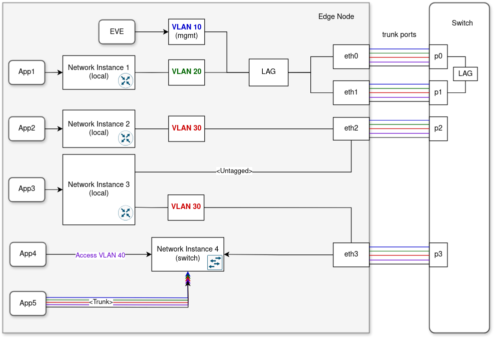

# Device Connectivity

EVE needs to always be able to connect to the controller, yet the configuration
of the network ports might be both complex and changing over time.

In addition, some network ports might be designated to application usage, or the underlying
I/O bus controllers (e.g., PCI controllers) be designated for assignment to applications.
That part of the configuration can also change in run-time.

Any network port configuration changes which might affect the connectivity to the controller
requires care to avoid permanently losing connectivity to the controller and become unmanageable
as a result. Thus, it is required to perform testing as part of a configuration change
and have a way to fall back to a working port configuration. This is accomplished by logic
to test connectivity to the controller, and persistently maintaining a list of network
configurations, including the latest and possibly one or more fallback configurations.

## Network adapters

Network adapter denotes network configuration (MTU, MAC, IP, VLAN, etc.) and logical attributes
(logical & interface names, cost, usage) attached to a physical network port.
As shown in the diagram below, there is a hierarchy of different types of network adapters
and higher-level objects attached to them, starting with the physical ports on one side and
ending with the EVE management plane and applications on the other side:


Network adapters use logical labels for identification and for reference within the hierarchical
layers. Unlike higher-level objects like apps or network instances that use UUIDs, these labels
are user-defined, simpler human-readable strings, which are only required to be unique within
the edge-node, not globally.

### Physical network ports

EVE supports ethernet NICs, WiFi modules and cellular modems.

Physical network IO devices are listed as part of the device model. This should include
all devices that will be used by EVE (for management) or by applications (directly or shared).
IO device is referenced either using a physical address that it was given on the bus through
which it is connected (PCI or USB), or via the name assigned by the Linux kernel to the
network interface representing the device on the data-plane. The latter approach is potentially
not stable and therefore not recommended. Interface name can change after a reboot if multiple
devices of the same type are initialized in a different order. This is quite common with cellular
modems or with ethernet NICs operated by different drivers loaded at random order.

The prerequisite for using a given network IO device inside the EVE domain (i.e. not directly
assigned to an application), is that the Linux kernel used by EVE is already shipped with
a suitable (open-source) driver. It may be necessary to adjust the [kernel](https://github.com/lf-edge/eve-kernel)
options to enable building of the driver.
For cellular modems this is not required, however. Cellular modems are fairly complex
self-contained units controlled through AT commands and/or API calls, for which drivers
and libraries are already shipped with EVE and automatically loaded on boot.
The only requirement is that the cellular modem is connected over the USB bus and not via PCI,
which is not supported by EVE.
For more detailed information on cellular connectivity, please refer to [WIRELESS.md](WIRELESS.md)

### HW-virtualized IO

EVE supports Single Root I/O Virtualization (SR-IOV) of a network interface card.
SR-IOV is a virtualization technology that allows one physical device, in this case NIC,
to be used by multiple virtual machines simultaneously without the mediation from the hypervisor.
The actual physical device is known as a Physical Function (PF) while the others are known
as Virtual Functions (VF). With this feature, the hypervisor can attach one or more VFs
to a Virtual Machine so that the guest can then use the device as if it was directly
assigned.

To use this feature with EVE, first you need to check that (PF) driver for your SR-IOV-enabled
NIC is already shipped with EVE OS. With proprietary drivers this is going to be a problem.
Until we add a feature to deploy proprietary drivers for the host inside a VM just like
applications (feature proposal known as "driver domain"), EVE users are limited to open-source
drivers already available with the Linux kernel. Please beware that so far only Intel I350 NIC
with `igb`/`igbvf` drivers was tested and verified to work with EVE.

As a next step, you need to decide on the number of VFs to be created for a given SR-IOV NIC.
This is a part of the device model and cannot be changed in runtime.

Finally, to use a VF with an application, use the option of the direct assignment.
VF configuration allows you to either specify a custom MAC address or let the NIC generate
one for you. Additionally, you may configure VF to be used as an access port for a given VLAN.

### L2 network adapters

L2 layer includes VLAN and LAG (bond) network adapters. Even though these are virtual
adapters attached to physical network ports and EVE is able to apply run-time configuration
changes for them (incl. adding/removing L2 adapters), it is still recommended and expected
to include this layer in the fixed device model.

VLANs enable the segmentation of a physical network into multiple logical networks,
allowing for better traffic control, security, and resource optimization.
On EVE, the use of VLANs helps isolate the management traffic from application traffic
or even to split applications and their traffic into different logical networks.
This allows the external networks to give preferential treatment and apply different
policies as per their requirements.

On the other hand, Link Aggregation Groups, commonly known as bonds or LAGs, aggregate
multiple physical links between network devices into a single logical link.
This not only increases the available bandwidth but also provides redundancy
and load balancing. LAGs ensure a more resilient and reliable network infrastructure
by distributing traffic across multiple links, thereby avoiding bottlenecks and improving
overall network performance. Moreover, LAGs enhance fault tolerance as they continue
to operate even if some individual links fail.

EVE supports:

- VLAN sub-interfaces with a physical network port as the parent
- LAG (bond) interface aggregating multiple physical interfaces
- VLAN sub-interfaces with a LAG as the parent
- VLAN filtering for switch network instances. This is actually a feature of the Switch NI,
  VLAN network adapter is not used in this case.

Both VLAN and LAG adapters can be used as uplinks for Local network instance and for EVE
management traffic.

Diagram below depicts almost all of these cases (except for LAG being used by EVE and NIs
directly, which is also supported):



### SystemAdapter

SystemAdapter (term used in EVE API) assigns network config (DHCP, IP, DNS and NTP config)
together with some logical attributes such as "usage" or [cost](#load-spreading-and-failover)
to a physical network port or to a logical lower-layer network adapter (VLAN, LAG).

SystemAdapter can be used to elevate physical/L2-only adapter to an IP-ready network endpoint.
SystemAdapter may either instruct EVE to run DHCP client for the network interface or to assign
IP config statically. However, even L2-only interface (to be used with switch NI), still needs
SystemAdapter attached for it to be referenceable by higher-level objects like network instances.

SystemAdapter determines the usage of the network port, which is one of:

- for management and application traffic
- for application traffic only
- unused

Network port directly assigned to an application is without SystemAdapter.

### Network Adapter MTU

The user can adjust the Maximum Transmission Unit (MTU) size of a network adapter.
MTU determines the largest IP packet that the underlying link can and is allowed to carry.
A smaller MTU value is often used to avoid packet fragmentation when some form of packet
encapsulation is being applied, while a larger MTU reduces the overhead associated with
packet headers, improves network efficiency, and increases throughput by allowing more
data to be transmitted in each packet (known as a jumbo frame).

EVE uses the L3 MTU, meaning the value does not include the L2 header size (e.g., Ethernet
header or VLAN tag size). The value is a 16-bit unsigned integer, representing the MTU size
in bytes. The minimum accepted value for the MTU is 1280, which is the minimum link MTU
needed to carry an IPv6 packet (see RFC 8200, "IPv6 minimum link MTU"). If the MTU for
a network adapter is not defined (zero value), EVE will set the default MTU size,
which depends on the network adapter type. Ethernet and WiFi adapters default to 1500 bytes,
while cellular modems typically receive their MTU value from the network provider,
which EVE will use unless the user overrides the MTU value.

## Load spreading and failover

Load spreading means that there are two or more similar uplink networks, for instance
two Ethernet ports for redundancy, the EVE will send different requests over different
connections in a round-robin fashion.

Failover means that a device can have different types of uplink networks, for example
Ethernet, LTE, and/or satellite connectivity, and switch from one to another to maintain
controller connectivity. In such case, a cost (field ```cost``` of the
[SystemAdapter message](https://github.com/lf-edge/eve-api/tree/main/proto/config/devmodel.proto))
can be assigned to each uplink port so that e.g., LTE (the wwan0 port) is only used if EVE
can not connect via any lower cost (e.g., one or more Ethernet) ports.

The cost is a number between 0 and 255, with zero (the default) implying free,
and less preferred ports being assigned a higher cost. Multiple ports can be assigned
the same cost, in which case once failover has happened to cost N, then all uplink ports
with cost N will be used for load spreading of the management traffic.

Furthermore, one can set [network.download.max.cost](CONFIG-PROPERTIES.md) to a number N
if it is acceptable for EVE to perform (potentially large) downloads of content and images
when having failed over to uplink ports with cost N (or less).

## Network Proxies

Organizations frequently utilize network proxies to regulate and supervise internet access,
apply content filtering, and enforce security policies.
Depending on the proxy type, adjustments to the edge-node network configuration may be necessary
to ensure connectivity with the cloud.

First of all, before configuring a device, the user must find out if there is a network proxy
in the network and understand how it is configured. Configuration will then depend on the type
of the proxy, see below.

### Transparent network proxy

A network proxy may operate *transparently*, meaning that clients (EVE devices, user apps)
making HTTP/HTTPS/… requests are not aware of its presence. When a client makes an HTTP(S)
request, it addresses it directly to the destination (e.g. EVE controller), but a transparent
proxy will capture it (without the client knowing about it) and apply a proxying action.
The action may depend on the destination URL. For example, the proxy may be configured to drop
requests heading to some specific domains, but allow others.

Additionally, the proxy may break the TLS tunnel into two (client-proxy, proxy-destination)
and act as a Man-in-the-Middle (MITM), reading the otherwise encrypted traffic. This is done
by proxy generating server certificate for the destination on the fly and presenting it to
the client during the TLS handshake. Normally, the client would detect this because it would not
trust such a certificate, after all it is signed by proxy CA which is not in the default set
of trusted certificates installed in EVE/app. However, if MITM proxying is desired (e.g. when
company policy requires that all traffic, including encrypted, is inspected), then the device
has to be told to trust the proxy CA certificate. This is why EVE allows the user to insert
a proxy CA certificate as part of the transparent proxy config. Since everything else is
transparent, there are no additional config options.

Please note that EVE logs info about the certificate presented by "the other side",
which in case of MITM proxy would be the proxy and not the controller:

```go
// In client.go:
log.Noticef("Peer certificate:(%d) Issuer: %s, Subject: %s, NotAfter: %v",
    i, cert.Issuer, cert.Subject, cert.NotAfter)
```

Information about TLS tunnels opened and peer certificates presented is also part
of the [network tracing](#netdump-and-nettrace).

### Explicit network proxy

Presence of *explicit* proxy is known to the client making HTTP/HTTPS/… requests.
The client will explicitly ask the proxy using the standard HTTP CONNECT method to make
an HTTP(S) request on its behalf to a specified URL. In this case, the client is configured
with a proxy address for every protocol that should be proxied. For EVE management traffic,
there should be a proxy address at least for HTTPS proxying.

The proxy address is entered either manually in the form `[<proto>://]<host>:[<port>]`
(default proto is HTTP, default port is 80), or a [proxy auto-discovery](#network-proxy-auto-discovery)
protocol is enabled to determine the proxy address automatically.

Beware not to confuse "protocol that is being proxied" with "protocol on which proxy listens".
The latter is typically HTTP (even for HTTPS proxying).

Explicit network proxy may be configured to proxy only certain destinations, while others
should be accessed directly (otherwise the request would fail). EVE allows to configure the list
of domains to be accessed without proxying.

Additionally to proxy addresses, it may be necessary to insert a proxy CA certificate.
Just like the transparent proxy, an explicit proxy may also break the TLS tunnel and
act as MITM.

#### Network proxy Auto-discovery

Auto-discovered proxy is effectively an explicit proxy, but instead of user configuring
the proxy address for every client in the network, DHCP or DNS in combination with WPAD
and PAC protocols are used by the client to discover the proxy address (for a given request URL).

Depending on how explicit vs. automatic this process is, EVE offer 3 subtypes:

1. Auto-proxy discovery is fully automatic: DHCP/DNS is used to find address of WPAD server,
   which returns PAC file, which contains JavaScript function that returns proxy address
   for the given request URL
2. URL: the WPAD server address is configured by the user, the rest works as in the first case
3. PAC: user writes a PAC file by himself. Device will use the JavaScript function from there
   to get the proxy address, meaning there is no communication on the network to get the proxy
   address.

More info on how this auto-discovery works can be found on wiki:

- [WPAD](https://en.wikipedia.org/wiki/Web_Proxy_Auto-Discovery_Protocol)
- [PAC](https://en.wikipedia.org/wiki/Proxy_auto-config)

### Steps to configure network proxy

To summarize, EVE user should follow these steps:

1. Get information about their network proxy type/configuration (e.g. from network admin)
2. Determine if proxy operates explicitly or transparently
3. Determine if proxy auto-discovery is being used and in what scope
4. For explicit proxy, determine if there are directly accessible destinations
   that should not be proxied
5. Determine if proxy is expected to inspect encrypted traffic inside TLS tunnels
6. Configure the proxy accordingly for the EVE management traffic (inside the network config
   attached to a given network port)

Note that proxying of application traffic has to be configured on the application side.

## Network Time Protocol (NTP)

EVE always tries to keep its clock synchronized by embedding a NTP Client that synchronizes
the system's clock since the boot time.
This is especially important on the very first boot to ensure that all device certificates
are generated with valid timestamps. EVE will first try to use NTP servers either received
from DHCP servers or statically configured in the network override configuration used for
bootstrapping (see the next section for more info on the network bootstrapping process).
If no NTP server is provided by DHCP or config, EVE will try to use `pool.ntp.org` by default.

For more info on clock synchronization, refer to [CLOCK-SYNCHRONIZATION.md](CLOCK-SYNCHRONIZATION.md).

## Sources of configuration

There are several sources from which nim gets the potential port configurations.
Those all use the ```DevicePortConfig``` type (Go struct marshalled with JSON).
There are examples of such configurations in [legacy EVE configuration](CONFIG.md)

### Fresh install

When EVE is installed using a generic EVE installer without device bootstrap configuration
included (see [CONFIG.md](./CONFIG.md), section "Bootstrap configuration"), it only has
the last-resort configuration available (see "Last resort" section below). This is sufficient
to connect to the controller if

- DHCP is enabled on one of the uplink Ethernet ports
- WiFi is not assumed (since WiFi needs credentials)
- Cellular connectivity is not assumed
  (without cellular config every discovered modem will have RF function disabled)
- No enterprise proxy configuration is required to be able to connect to the controller.

If any of those assumptions is not satisfied, then it is necessary to either install EVE
using a single-use EVE installer, shipped with the initial "bootstrap" configuration
prepared for the target device (the preferred method) or to use one of the legacy
mechanisms for off-line configuration management.

### Bootstrap configuration

The idea behind bootstrap config is to generalize the issue of configuration bootstrapping
beyond just network configuration and also to reuse the existing proto models which
are already being used between the device and the controller in the on-line mode.
This means that instead of users directly editing an internal structure `DevicePortConfig`
with network configuration, it is much safer and robust to simply have the controller
exporting the prepared device configuration (possibly not only for networking) into
a file and baking it into the EVE installation medium, avoiding any error-prone manual
edits from the user in the process.

In terms of configuration handling, much of the code-path is reused between the bootstrap
and a config coming (on-line) from a controller. Just like in the latter case,
the networking portion of the device configuration is parsed and published to nim by
[zedagent](../pkg/pillar/cmd/zedagent) using `DevicePortConfig` type.

This feature is described in much more detail in [CONFIG.md](./CONFIG.md). Even though
it has some limitations in the present state, it is already the preferred method to use.
Below we describe a legacy "override" method for the completeness sake, which is still
supported by EVE for backward-compatibility reasons.

### (Legacy) Override the configuration using a USB stick

If the deployment site requires use of HTTP enterprise proxies and/or static IP
configuration, then a file containing JSON-formatted content of `DevicePortConfig`,
aka "override network config", can be placed on either the EVE-installer or onto
a separate USB stick. The latter case allows to inject network config even in run-time.
However, for an already onboarded device it is required that the USB controller
is enabled using `debug.enable.usb` as specified in [configuration properties](CONFIG-PROPERTIES.md)

There are examples of such configurations in [legacy EVE configuration](CONFIG.md)

Such a file will be used by [nim](../pkg/pillar/docs/nim.md) until it can connect
to the controller and receive the configuration (either the same, or subsequent updates).
Thus, for a new device using enterprise proxies and/or static IP it is imperative that
the configuration first be set in the controller, then a USB stick be created with that
configuration, and the device booted with that USB stick in place.
That ensures that the configuration doesn't revert back once the device has connected
to the controller.

### From the controller

The [SystemAdapter in the API](https://github.com/lf-edge/eve-api/tree/main/proto/config/devmodel.proto)
specifies the intended port configuration. This is fed into the logic in [nim](../pkg/pillar/docs/nim.md)
by [zedagent](../pkg/pillar/cmd/zedagent) publishing a `DevicePortConfig` item.

At least one port must be set to be a management port, and that port needs to refer
to a network with IP configuration for the device to even try to use the `SystemAdapter`
configuration.

### Last resort

If `network.fallback.any.eth` [configuration property](CONFIG-PROPERTIES.md) is set to `enabled`
(by default it is disabled), then there is an additional lowest priority item in the list
of DevicePortConfigs, called "Last resort" DPC (pubsub key `lastresort`), based on finding
all Ethernet interfaces (i.e. excluding wireless connectivity options) which are not used
exclusively by applications. The last resort configuration assumes DHCP and no enterprise
proxies.

However, independent of the above property setting, if the device has no source of network
configuration available (no bootstrap, override or persisted config), then EVE will use
the Last resort *forcefully*. This, for example, happens when device boots for the very
first time, without [bootstrap config](#bootstrap-configuration) or the (legacy) network
config override being provided. In that case, device may remain stuck with no connectivity
indefinitely (unless the user plugs in a USB stick with a network config later), therefore
EVE will try to use Last resort to see if it can provide connectivity with the controller.
Once device obtains a proper network config (from the controller or a USB stick), EVE will
stop using Last resort forcefully and will keep this network config inside `DevicePortConfigList`
only if and as long as it is enabled explicitly by the config (`network.fallback.any.eth` is `enabled`).

## Prioritizing the list of network configurations

The nim retains the currently working configuration, plus the following in priority order
in ```/persist/status/nim/DevicePortConfigList```:

1. The most recently received configuration from the controller
2. The last known working configuration from the controller
3. Bootstrap config or an override file from a USB stick (if any)
4. The last resort if enabled, or (used forcefully) if there is no network config available
   (e.g. first boot without bootstrap config or config override file)

This is based on comparing the `TimePriority` field in the `DevicePortConfig`
Depending on the configuration source, `TimePriority` is determined differently:

- *For configuration from the controller*: newer EVE versions allow the controller to specify
  the time when the configuration was created/updated in `EdgeDevConfig.config_timestamp`
  (which is then used for `TimePriority`); in older EVE versions `zedagent` microservice
  will simply set `TimePriority` to the time when the configuration was received from the controller.
- *For bootstrap config*: the controller is expected to put the time of config creation into
  `EdgeDevConfig.config_timestamp` and `zedagent` will use it for `TimePriority`
- *For legacy override file*: it should contain explicit `TimePriority` field entered manually
  by the user (this is rather error-prone)
- *For the last resort*: `nim` microservice assumes the lowest priority with a `TimePriority`
  of Jan 1, 1970.

Once the most recent configuration received from the controller has been tested and found
to be usable, then all but the (optional) last resort configuration are pruned from the above
list. If Last resort is disabled (which is the default), it will be pruned from the list as well.
When a new configuration is received from the controller, it will keep the old configuration
from the controller as a fallback until the new config was proven to work.

## Testing device connectivity

The Network Interface Manager (specifically its component [DPCManager](../pkg/pillar/dpcmanager))
performs two types of testing:

- Validate that a new configuration is working before replacing the current configuration
- Periodically check that the existing configuration is working
- If an older "fallback" config is being used, periodically retest the latest network config
  to see if the issue that triggered fallback was fixed and device can therefore apply
  the latest config

### Testing a new configuration from the controller

The testing is triggered by receiving a new configuration from the controller (or from
a different source) and completes when at least one of the management ports can be used
to reach the controller. If there are multiple management ports in the configuration,
there might be an error reported for ports which are not working (depending on the order
in which the ports are tried).

[TBD Should we verify that the new configuration is usable for some minimum time,
 e.g. 10 minutes, before discarding the previous/fallback configuration?]

If no management port can be used to reach the controller, then nim switches to using
the next configuration in the `DevicePortConfigList`, which is normally the previously
used configuration. In that case a failure is reported in the
[SystemAdapterInfo](https://github.com/lf-edge/eve-api/tree/main/proto/info/info.proto)
by setting `lastError` in `DevicePortConfig` and the `currentIndex` is set to the currently
used `DevicePortConfig` in the list (> 0 when fallback is triggered). Note that `lastFailed`
and `lastSucceeded` can be used to see if a configuration has succeeded in the past or always
failed.

### Periodic testing

The default timer for this is 5 minutes and can be set with [timer.port.testinterval](CONFIG-PROPERTIES.md).
At those intervals the device verifies that it can still reach the controller using
one of the management ports.

Each attempt it starts with a different management port, which ensures that all management
ports are eventually tested for connectivity. Any management port which sees a failure gets
an error in the [SystemAdapterInfo](https://github.com/lf-edge/eve-api/tree/main/proto/info/info.proto)
inside the field `ErrorInfo` for the particular `DevicePort`.

Note that if a port was tested and succeeded, the `ErrorInfo.timestamp` is updated and
the `ErrorInfo.description` is set empty. This indicates the most recent successful test.

If after two attempts (spaced 5 minutes apart, see above) the device can not connect
to the controller on any of the management ports in the current configuration, then it
will try the fallback configuration (and if that succeeds the fact that it is using a fallback
is reported with a non-zero `currentIndex` as above).

### Trying a better configuration

If for some reason the most recent (aka the highest priority) configuration is not used
(and `currentIndex` is reported as non-zero per above), the device will re-try the highest
priority configuration.
The default timer for this is 10 minutes and can be set with [timer.port.testbetterinterval](CONFIG-PROPERTIES.md).
That timer can be set to zero to disable this re-try.

If the re-try succeeds then `SystemAdapterInfo` is updated with the previously reported error
cleared. The fact that it has failed in the past can be seen from the reported `lastFailed`
timestamp in `SystemAdapterInfo` being non-zero.

### Handling remote (temporary) failures

There is a set of failures which can be attributed to the controller having issues which
does not warrant any churn or fallback on the device. The current cases are:

- the server certificate having expired (or not yet being valid)
- the server responding with a TCP Reset/Connection refused (and proxy is not in the path)

In those cases nim proceeds with the current configuration and assumes that the server
will at some point in time be corrected.

### Failure reporting

The device reports the status of all of the device connectivity using
[SystemAdapterInfo](https://github.com/lf-edge/eve-api/tree/main/proto/info/info.proto).
There are two levels of errors:

- A new `SystemAdapter` configuration was tested, but none of the management ports
  could be used to connect to the controller. In that case a failure is reported by setting
  `lastError` in `DevicePortStatus` and the `currentIndex` is set to the currently used
  `DevicePortStatus` in the list. Note that `lastFailed` and `lastSucceeded` can be used
  to see if a configuration has succeeded in the past or always failed.
- A particular management port could not be used to reach the controller. In that case
  the `ErrorInfo` for the particular `DevicePort` is set to indicate the error and timestamp.

## Troubleshooting

There are multiple sources of information that provide a picture of the current or a past
state of device connectivity and when combined and investigated together can help to determine
or narrow down the root cause of any connectivity issue.

### LED Indication

Being physically present next to a device, the current state of the device wrt. controller
connectivity and onboarding procedure can be determined based on the blinking pattern of an LED.
To indicate a given state, LED blinks one or more times quickly in a row, then pauses for 1200ms
and repeats continuously. By counting the number of successive blinks one may determine the current
state of the edge device.

For example, if a device does not have any usable IP addresses it will blink once per iteration,
twice if it has IP address(es) but still no cloud connectivity, three times if device has connected
to the controller but it is not yet onboarded.

Which LED is used to indicate state progression depends on the device model.
For a full list of blinking (and color) patterns and to learn which LED is used for indication
in a particular device model, please refer to [LED-INDICATION.md](./LED-INDICATION.md).

For a remotely accessed device (via iLO, ssh, edgeview, etc.), the blinking pattern can be extracted
from the shell using:

```bash
cat /run/global/LedBlinkCounter/ledconfig.json

# Returns for example:
{"BlinkCounter":4}
```

### Diag microservice

[Diag microservice](../pkg/pillar/cmd/diag) is responsible for managing diagnostic services
on the device, and reporting to console for debugging if there are any issues.
It informs about which network configuration (aka `DevicePortConfig`) is currently being used,
what is the status of connectivity between the device and the controller and whether the device
has already onboarded. Diag also prints the list of physical network adapters visible to EVE
(i.e. not assigned to applications) with their assigned IP addresses, associated DNS servers
and proxy config (if any). Finally, it also outputs results of some connectivity checks that
it performs, including `/ping` request to the controller and `GET google.com` request, both
performed via each management interface.
It does not send this information to the Controller or to the log, however. One must access
the device console to have this information printed on the stdout. With ssh access, you can
view this output in `/run/diag.out`. Should this diag output interfere with other work
performed via the console, disable the printing of diagnostics with `eve verbose off`.

### Connectivity-Related Logs

The progression and outcome of [network configuration testing](#testing-device-connectivity)
is logged with messages prefixed with `DPC verify:` (note that DPC is abbreviation for
`DevicePortConfig`, which is a Go structure holding configuration for all management and app-shared
interfaces). These messages can explain why a particular device is not using the latest
configuration but instead has fallen back to a previous one. These logs are quite concise yet pack
enough information to tell when a device performed testing, what was the reason to trigger it
(was it periodic or config/state changed?), how the testing progressed (e.g. how long did
the device waited for IP addresses?) and what was the outcome (did the latest network configuration
passed the test and if not what error did the connectivity check returned).
It is not necessary to enable debug logs - the most important messages related to DPC testing
are logged with log levels `info`, `warning` or `error`.

For concrete examples of `DPC verify` logs, please refer to [nim.md](../pkg/pillar/docs/nim.md),
section "Logs". That document also explains the topic of DPC reconciliation, i.e. synchronization
between the intended and the current network config and how it is presented in the logs
(spoiler alert: search for `DPC Reconciler` in the logs). This can be useful to look into
if there is a suspicion that the root cause of a connectivity issue is device not being able
to apply some configuration items (e.g. failed to start DHCP client).

The onboarding procedure is from the device side executed by the [client microservice](../pkg/pillar/cmd/client).
Hence, to learn the state and the progression of the device onboarding, search for logs with
a source field set to `client`.

### Connectivity-Related Files

EVE uses [pubsub](./IPC.md) for communication between its microservices. Currently published
messages are stored in files either persistently under the `/persist` partition or non-persistently
under the `/run` directory.
When connected to a device via console, ssh or edgeview, one may read these files to learn
the current config/state/metrics as published by EVE microservices.

For device connectivity, the particularly interesting topics are those published by Network
Interface Manager (NIM for short):

- `/persist/status/nim/DevicePortConfigList/global.json`: contains the set of DevicePortConfig-s
 (configurations for mgmt and app-shared ports) which are currently known to the device
 (the latest highest-priority DPC plus some persisted previous configs). These configs are sorted
 in priority-decreasing order, i.e. the latest config is at the index 0. Additionally, there is
 a field `CurrentIndex`, pointing to the currently applied DPC. Each DPC entry summarizes
 the outcome of [testing](#testing-device-connectivity) with fields: `LastFailed` (time of the last
 failed test), `LastSucceeded` (time of the last successful test) and `State` (connectivity state
 determined by the last test). `State` is an enum value but in this file presented with its integer
 representation.
 To learn what a given `State` number means, look for the `DPCState` enum in
 [zedroutertypes.go](../pkg/pillar/types/zedroutertypes.go).

- `/run/nim/DeviceNetworkStatus/global.json`: contains state information for the currently applied
 DPC. For every port it shows the currently assigned IP addresses, DNS servers, IP-based geolocation
 info, MAC address, administrative status (up/down), WiFi/cellular-specific details for wireless
 interfaces and more.

Additionally, NIM outputs the current and the intended state of the configuration into
`/run/nim-current-state.dot` and `/run/nim-intended-state.dot`, respectively.
This is updated on every change.
The content of the files is a [DOT](https://graphviz.org/doc/info/lang.html) description
of the dependency graph modeling the respective state (config items have dependencies between
them which decide the order at which they can be applied).
Copy the content of one of the files and use an online service
`https://dreampuf.github.io/GraphvizOnline` to plot the graph. Alternatively, generate
an SVG image locally with:
`dot -Tsvg ./nim-current-state.dot -o nim-current-state.svg`
(similarly for the intended state)

Some more pubsub topics from other microservices worth looking at during device connectivity
troubleshooting:

- `/run/zedagent/DevicePortConfig/zedagent.json`: currently published DPC from zedagent (either
 coming from the controller or from a bootstrap config, see [CONFIG.md](./CONFIG.md)).

- `/run/zedagent/PhysicalIOAdapterList/zedagent.json`: list of physical IO adapters, published
 from zedagent but ultimately coming from the device model. This includes network adapters
 with their specification (PCI addresses, kernel interface names, etc.).

- `/run/domainmgr/AssignableAdapters/global.json`: the spec and state of physical IO adapters
 after being processed by [domainmgr microservice](../pkg/pillar/cmd/domainmgr). This means after
 each was assigned to the corresponding domain and available to be used either by NIM (for mgmt or
 as app-shared) or by an app (as app-direct). NIM waits for `AssignableAdapters` before applying
 DPC config. Change in `AssignableAdapters` can also trigger DPC re-testing or unblock NIM
 to apply a given DPC (e.g. a particular port is finally available in dom0).

- `/persist/status/zedclient/OnboardingStatus/global.json`: the status of the onboarding procedure.
 Once device is onboarded, `DeviceUUID` field will be non-empty and contain the assigned
 device UUID (also printed to `/persist/status/uuid`).

For WWAN connectivity info, refer to these pubsub topics:

- `/run/nim/WwanConfig/global.json` is published by NIM and contains configuration for cellular modems.
- `/run/wwan/WwanStatus/global.json` is published by wwan microservice to inform zedagent, NIM
  and some other microservices about the current cellular connectivity status.
- `/run/wwan/WwanMetrics/global.json` is published by wwan microservice and contains packet/byte
  counters reported by cellular modems (i.e. not from the Linux network stack)

Separately to pubsub topics, file `/run/wwan/resolv.conf/<interface-name>.dhcp` is updated
by the wwan microservice and contain the list of nameservers that should be used with the given
wwan interface. This is similar to how dhcpcd reports DNS servers for ethernet interfaces
(for both DHCP and static IP config). In NIM, where this info is processed and further published
via `DeviceNetworkStatus` pubsub topic, we can therefore process nameservers for ethernet
and wwan interfaces in a very similar way and reuse some code.

### Netdump and Nettrace

EVE performs all communication with the controller over the HTTP protocol using the [http.Client](https://pkg.go.dev/net/http#Client)
for Go. Additionally, the same protocol and the client are typically also used to download EVE/app
images from data stores. Given all that, it is useful to be able to obtain diagnostics from HTTP
requests processing as done by `http.Client` and use it for connectivity troubleshooting.
For exactly this purpose we implemented [nettrace package](https://github.com/lf-edge/eve-libs/blob/main/nettrace/README.md),
which internally wraps and injects hooks into `http.Client` to monitor and record a summary of
all important network operations that happen behind the scenes during request processing at different
layers of the network stacks, denoted as "network traces" (or just collectively denoted as "network trace"
to avoid overusing the plural form). This would include all successful and also failed TCP and TLS
handshakes, DNS queries, reused connections, HTTP redirects, socked read/write operations, etc.
All of this is typically hidden behind the `http.Client` implementation and only a single error
value with limited information is available when a request fails.
Moreover, `nettrace` allows to capture conntrack entries as well as all packets of traced TCP
connections and UDP "exchanges" for more in-depth analysis. For example, with a conntrack entry attached,
it is possible to tell for a given TCP/UDP traffic which ACL rule (configured by EVE as iptables rule)
was applied.

Network tracing comes with an additional overhead and the output can be quite large. Therefore,
we must be careful about how often are network traces obtained and how do we publish them.
For example, logging network trace as a single message is not an option. Instead, EVE publishes
network traces inside Tar/GZip archives, labeled as "netdumps" and stored persistently under
`/persist/netdump` directory.
This is done by the [netdump package](../pkg/pillar/netdump), which additionally adds some more files
into each archive to capture the config/state of the device connectivity at the moment of the publication.
All this information combined allows to troubleshoot a connectivity issue (between device
and the controller or a data-store) even after it is no longer reproducible.

Every netdump package contains:

- `eve` directory with snapshots of pubsub publications related to device connectivity (such as
 `DevicePortConfigList`, `DeviceNetworkStatus`, `AssignableAdapters`), DOT files projecting the
 intended and the current network config as dependency graphs, wwan config/status/metrics and also
 files with basic info like the EVE and Golang versions. For more info on these files, please see
 [the section above](#connectivity-related-files),
- `linux` directory with the output from networking-related commands like `ip`, `arp`, `iptables`,
 `netstat`, etc.
- `requests` directory with attached network traces and packet captures (if enabled) collected for
 HTTP requests run by EVE. This can be for example request to get device config or just to ping
 the controller, or to download an image. Note that EVE can make multiple attempts for every request,
 trying every port and local IP address. Every attempt will have separate trace under its own subdirectory
 named `<request-name>-<interface>-<attempt-index>`

Every netdump is published into a topic, represented by its name and by default limited in size to 10
netdumps at most ([configurable](./CONFIG-PROPERTIES.md) by `netdump.topic.maxcount`). The oldest
netdump of a topic is unpublished (removed from `/persist/netdump`) should a new netdump exceed the limit.
Topics are used to separate different microservices and even to split successful and failed requests
from each other. Topic name is therefore typically `<microservice>-<ok|fail>`. For troubleshooting
purposes, netdumps of failed requests are obviously more useful, but having a trace of a "good run"
can be useful to compare and find differences. Published netdump filename is a concatenation of the
topic name with a publication timestamp plus the `.tgz` extension, for example:
`downloader-fail-2023-01-03T14-25-04.tgz`, `nim-ok-2023-01-03T13-30-36`, etc.

Not all microservices that communicate over the network are traced and contribute with netdumps.
Currently, traced HTTP requests are:

- `/ping` request done by NIM to verify connectivity for the *latest* DPC (testing of older DPCs
 is never traced). Packet capture is also enabled and the obtained pcap files are included in
 the published netdumps. To limit the overhead associated with tracing and packet capture,
 NIM is only allowed to enable them and produce netdump at most once per hour *before onboarding*
 and once per day *after onboarding* ([configurable](./CONFIG-PROPERTIES.md)
 by `netdump.topic.preonboard.interval` and `netdump.topic.postonboard.interval`, respectively).
 The pre-onboard interval is intentionally lower (by default) to get more frequent diagnostics
 for initial connectivity troubleshooting.
- `/config` and `/info` requests done by zedagent to obtain device configuration and publish info
 messages, respectively. Packet capture is not enabled in this case. Netdump is produced at the interval
 as given by `netdump.topic.postonboard.interval` (`/config` and `/info` requests are not run before
 onboarding). For `/info` requests, tracing only covers publication of the `ZInfoDevice` message.
 Moreover, tracing is enabled only if the highest priority DPC is currently being applied
 and is reported by NIM as working. Otherwise, we will eventually get `nim-fail*` netdump
 which should be sufficient for connectivity troubleshooting. The purpose of zedagent netdumps
 is to debug issues specific to `/config` an `/info` requests (which are essential to keep the device
 remotely manageable).
 Netdumps are published separately into topics `zedagent-config-<ok|fail>`
 and `zedagent-info-<ok|fail>`.
- *every* download request performed by [downloader](../pkg/pillar/cmd/downloader) using the HTTP
 protocol is traced and netdump is published into the topic `downloader-ok` or `downloader-fail`,
 depending on the outcome of the download process. By default, this does not include any packet
 captures. However, a limited PCAP can be enabled with config option `netdump.downloader.with.pcap`.
 Limited in the sense that it will not include TCP segments carrying non-empty payload (i.e. packets
 with the downloaded data). On the other hand, included will be all UDP traffic (DNS requests),
 TCP SYN, RST and FIN packets as well as ACK packets without data piggybacking (sufficient to tell
 where a download process got "broken"). The total PCAP size is limited to 64MB (packets past this
 limit will not be included).

In order to troubleshoot a present or a past connectivity issue, it is necessary to locate and obtain
the appropriate netdump from the affected device (locate by microservice aka topic name and look for
the closest timestamp). Without a remote connectivity to the device, it is possible to dump all
diagnostics to a USB stick. See [CONFIG.md](./CONFIG.md), section "Creating USB sticks".
With this method, the entire `/persist/netdump` directory will be copied over.
If device is remotely accessible, published netdumps can be listed and copied over ssh (if enabled
by config), edgeview (`ls` + `cp` commands; to download all netdumps at once use: `tar//persist/netdump`)
or using a remote console if available.
