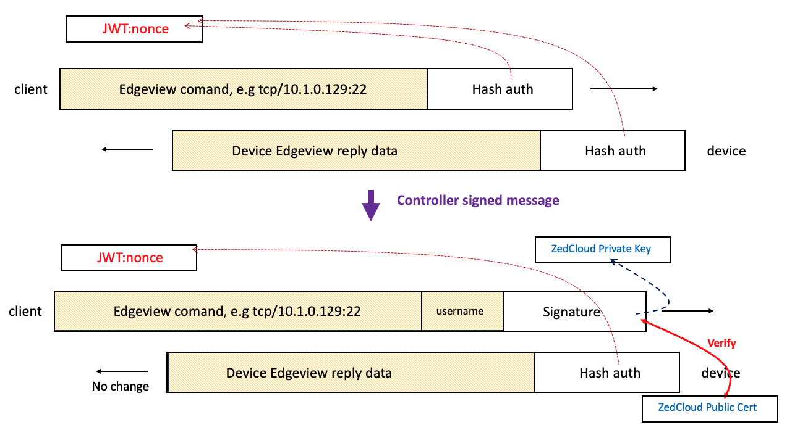

# Edge-View Container and APIs

EVE provides the Edge-View mainly for device and application troubleshooting tasks. It is a system-level container similar to `newlogd`, `wlan`, etc.

Edge-View as a service on EVE, it needs to receive/update user configurations from the controller; and it needs to send/update Edge-View running status to the controller.

The software integration level of Edge-View is somewhere between the services like `newlogd` and `wlan`. `newlogd` is an integral part of the EVE, while `wlan` is a generic Linux service without any specific EVE related changes. The Edge-View container runs on the EVE device and has many tasks designed specifically for EVE device and application usage, but it can also run as a normal Linux docker container on any host; the same container is used for Edge-View client runs on the user's laptop. Thus design of Edge-View container tries to minimize the interaction with the rest of the EVE system while still being configured from the controller and sending status to the controller.

This Wiki page describes the provisioning, security and status update for Edge-View in [Edge-View Doc](https://wiki.lfedge.org/display/EVE/Edge-View).

## Edge-View Configuration

Edge-View configuration is part of the EVE device configuration. It contains mainly a JWT token string and policies. When `zedagent` receives the configuration update, it will write/modify the configuration file: `/run/edgeview/edge-view-config`. The configuration prefix strings are defined in `github.com/lf-edge/eve/pkg/pillar/type/edgeviewtypes.go`.

Edge-View container has a script running, constantly monitors the configuration file content. The script will run and pass the configuration items into the edge-view programs or shut down the edge-view programs.

## Edge-View Info Status

The status of Edge-View is defined as `EdgeviewStatus` type in `github.com/lf-edge/eve/pkg/pillar/type/edgeviewtypes.go`. When there is a status change, it will update and send the Edge-View status through the info message to the controller.

For security reasons, the Edge-View container has all the volumes mounted in 'read-only' mode. But for the status update, it needs to have write access on the device. Since the EVE pub/sub infrastructure mostly read/write into the '/run/{module}' directories, the Edge-View container volume mounts the `/run/edgeview` as 'read-write' mode as an exception for publishing the Edge-View status. It publishes status in `/run/edgeview` (this is similar to the `newlogd` container publishing status into `/run/newlogd` directory).

## Logging to Event

Edge-View logging is similar to other containers. For any user command received by Edge-View, it will log the client endpoint(IP address/port), the command and its parameters. The log entry will also be tagged with object-type of `log-to-event`, and the controller can optionally process those log entries and generate them as device events or alerts.

## Edge-View Client Authentication

To address limitations in controlling and audit logging user access to Edge-View commands, the authentication mechanism to Edge-View aim to strengthen user authentication, enforce stricter access controls, and improve user audit logging.

### Client Authentication Features

1. **Scope**
   Stricter authentication methods are implemented to ensure that commands originate from authorized sources. These sources include the Controller webpage session or authenticated remote users. JWT token is extended to support types of client authentication.

2. **Edgeview Policy Addition**
   A new optional "Controller Auth Only" item will be added to the controller Edge-View policy. This policy, definable at the project level, enforces that Edgeview commands must originate from the Controller.

3. **Client Authentication (Controller Cert Signed Type)**
   Commands issued from the Edge-View UI will be signed by the Zedcloud/Controller's private signing key, if the policy requires it. The device will verify these commands using the corresponding public certificate from the controller.

4. **Remote User Authentication (SSH Key Pairs Type)**
   Remote users can authenticate using SSH keys, providing an additional secure access method for Edge-View. These public keys will be installed via the Edge-node ConfigItem "edgeview.authen.publickey". If there are changes to the "edgeview.authen.publickey" ConfigItem, any active Edge-View sessions on the Edge-node will be terminated. Users will need to re-enable the Edge-View session to apply the updated authentication settings. This ensures that only authorized keys are used for remote access.

5. **UserInfo Logging**
   A new "UserInfo" field will be added to the Edge-View command payload. This field logs the username of the user issuing the command, improving accountability and audit logging. For the remote users using SSH key for authentication, the user public key comment field will be logged for the user audit logging.

6. **Struct Definition Changes**
   Updates to the Zedcloud protocol buffers definition include:
   - Adding an `EvAuthType` enum in the `EvjwtInfo` struct to support different authentication methods (e.g., Controller Cert, SSH Keys).
   - Introducing a new `EvjwtInfo` struct to encapsulate JWT-related information with enhanced authentication support. The struct is defined as follows:

     ```go
     type EvjwtInfo struct {
         Dep string     `json:"dep"` // dispatcher end-point string e.g. ip:port
         Sub string     `json:"sub"` // jwt subject, the device UUID string
         Exp uint64     `json:"exp"` // expiration time for the token
         Key string     `json:"key"` // key or nonce for payload hmac authentication
         Num uint8      `json:"num"` // number of instances, default is 1
         Enc bool       `json:"enc"` // payload with encryption, default is authentication
         Aut EvAuthType `json:"aut"` // authentication type
     }
     ```

   - The `EvAuthType` enum defines the supported authentication types for Edge-View:

     ```go
     // EvAuthType - enum for authentication type of edge-view
     type EvAuthType int32

     const (
         EvAuthTypeUnspecified    EvAuthType = iota
         EvAuthTypeControllerCert
         EvAuthTypeSshRsaKeys
     )
     ```

   These additions enhance the flexibility and security of the Edge-View authentication mechanism by supporting multiple authentication methods and encapsulating JWT-related details in a structured format.

7. **Command Payload Signing and Verifying**
   When Edgeview authentication is enabled, the Edgeview command payload will include a new `username` field to carry the user name from the controller side. Additionally, the original `Hash auth` field will be used as the `Signature`, which is signed using either the controller's private signing key or the SSH private key, depending on the authentication type.

   On the Edge-node side, the authentication will be verified using either the controller's public signing key or the SSH public key. This ensures secure and authenticated communication between the controller and the Edge-node.

   Below is the diagram for the authentication type of `Controller Cert`.

   

   And the diagram for the `SSH Keys` type of authentication:

   
