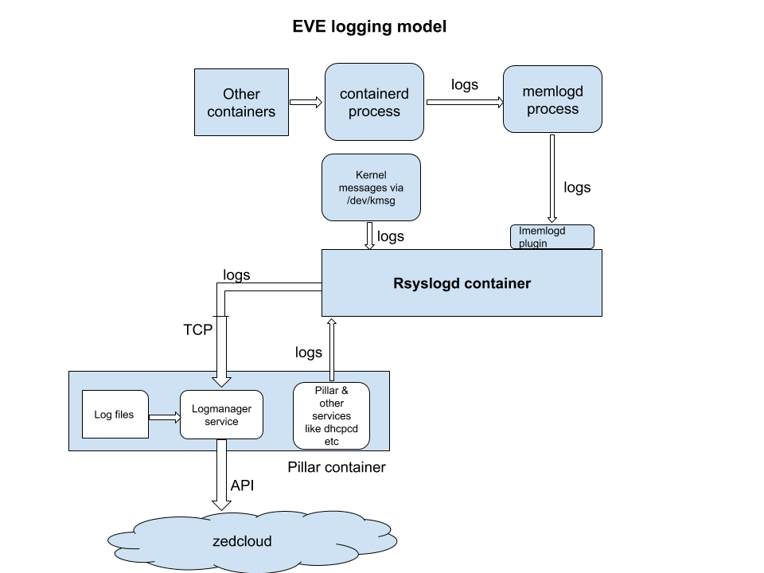

# EVE LOGGING PIPELINE

This document describes the different stages logs on a EVE edge node go through before being delivered to cloud. It also describes the various congestion points in the current log pipeline along with the places where logs could leak (dropped on the floor) with the current state of EVE code.

## Log Pipeline

The current log pipeline can be vertically split into the following three stages.

1. Log generation
2. Log aggregation and persistence
3. Log export to cloud


## Log Generation

All containers will now log directly to stdout, which are then picked up by containerd. Containerd then forwards the logs received to memlogd service that maintains a circular buffer of fixed size for storing log messages. Memlogd provides a way (via unix domain sockets) to read the logs present in it’s buffer and also stream the incoming logs. EVE currently uses imemlogd plugin for rsyslogd (developed internally) to stream logs from memlogd service.

The imemlogd plugin looks for json messages in the log and then skips the preceeding bytes of log if found. This is done to make it possible for rsyslogd to parse the json message and extract fields from message and also add more fields to the existing message. Imemlogd plugin also puts a default tag name of the incoming container name into each of the log messages. For example logs sent to stdout from pillar container are tagged with "pillar.out" and those logs sent to stderr are tagged with "pillar.err" by default. Log messages that are successfully parsed by rsyslogd in json format will be modfied to have some of the existing values changed and some new key-value pairs added. For example rsyslogd adds the current boot image partition to json formatted logs.

Logs coming from pillar container that cannot be json parsed or truncated will have their source field set to pillar.out/pillar.err in EVE log API. It is at times useful to look for pillar.out/pillar.err as source match criteria in EVE log API. The same applies to other containers like lisp, xen-tools etc.

If there are too many logs coming from various containers and the log reader is not able to keep up, oldest logs from the current circular buffer will be overwritten. All logs read by memlgod by rsyslogd will be written to disk queues. When there is heavy disk usage and rsyslogd does not get sufficient time to write incoming logs to disk, it can result in log loss from memlogd.

The following diagram shows the flow of logs from containers to rsyslog and to cloud.



## Log Aggregation

All logs collected from various containers/services in the system will reach rsyslogd demon. Rsyslogd queues the incoming logs on disk. Rsyslogd is configured to use disk queues in order to minimize log loss during power/network failures.

Useful information about the current state of logs/queues can be seen in the following directories:

1. /persist/rsyslog/ - This directory has the current log queue files. It also has syslog.txt to which rsyslog writes the last 10MB worth of logs forwarded to logmanager.
2. /persist/rsyslog-backup - In the event of rsyslogd crash, monitor-rsyslog.sh script moves the current queue files into this directory and re-starts rsyslogd with clean state.

When a direct ssh connection to a device is possible, /persist/rsyslog/syslog.txt file can be looked into for recent logs. Rsyslogd is configured to queue upto 1 million logs or 2GB worth of logs (which ever condition hits first). Beyond this any incoming logs will be tail dropped.

## Log export to cloud

Rsyslogd is configured to send logs via TCP socket to logmanager. Logmanager bundles the logs into protobuf messages and exports them to cloud using API. Today when a device loses network connectivity to cloud, there is a back-off mechanism built into the logmanager that prompts rsyslogd to stop sending logs. When there is network drop, logmanager stops reading log messages from rsyslogd (TCP socket). Rsyslogd stops sending logs when it's output socket buffer is full. As a result following logs will be queued on disk. After the device's network connectivity is restored, rsyslogd starts sending logs from it's disk queues.

Logmanager instead of now logging directly to file would now send it's logs to memlogd which will then be picked up by rsyslogd that writes to /persist/log/logmanager.log (this file is size regualted to a configured value - 100MB).

## Log files still present in device

Reboot reason and reboot stack files present in /persist and /persist/log directories. reboot-reaon, reboot-stack files present in /persist/log directory get appended with updates. The sames files in /persist directory keep getting overwritten with new content every time there is USR1 signal sent to a process or in the event of Fatal crash. These stack traces are also exported to cloud using logging mechanism.

# Helpful debug commands

1. If you are debugging a device and for some reason do not see logs coming to /persist/rsyslog/syslog.txt (possible issue with rsyslogd) and would like to read/tail logs directly from memlogd buffers, use the following command.

```/hostfs/usr/bin/logread -F -socket /run/memlogdq.sock```.
This command starts by dumping all logs present in the current circular buffers and acts like tail command after that (dump to screen as and when a new log comes into memlogd).
