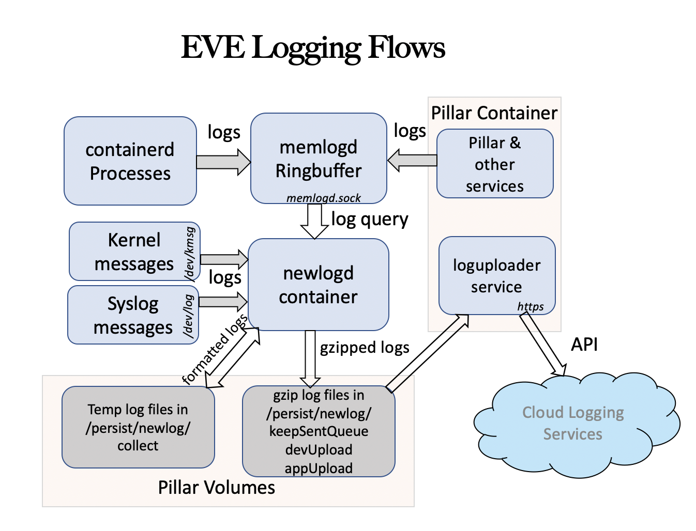

# EVE LOGGING PIPELINE

This document describes the different stages logs on a EVE edge node go through before being delivered to cloud. It also describes when and where log entries can be lost.

## Log Pipeline

The current log pipeline can be vertically split into the following three stages.

1. Log generation
2. Log aggregation and persistence
3. Log export to cloud


## Log Generation

All containers will now log directly to stdout, which are then picked up by containerd. Containerd then forwards the logs received to memlogd service that maintains a circular buffer of fixed size (5000 messages limit and 8192 bytes limit per message size) for storing log messages. Memlogd provides a way (via unix domain sockets) to read the logs present in it’s buffer and also stream the incoming logs.

The imemlogd plugin looks for json messages in the log and then skips the preceding bytes of log if found. This is done to make it possible for newlogd to parse the json message and extract fields from message and also add more fields to the existing message. Imemlogd plugin also puts a default tag name of the incoming container name into each of the log messages. For example logs sent to stdout from pillar container are tagged with "pillar.out" and those logs sent to stderr are tagged with "pillar.err" by default. Log messages that are successfully parsed by newlogd in json format will be modified to have some of the existing values changed and some new key-value pairs added.

Logs coming from pillar container that cannot be json parsed or truncated will have their source field set to pillar.out/pillar.err in EVE log API. It is at times useful to look for pillar.out/pillar.err as source match criteria in EVE log API. The same applies to other containers like wwan, xen-tools etc. Newlogd sorts out the application log messages and finds assigned application UUID and appName when writing into log files for applications.

Logs coming from xen-tools container are of three kinds:

* container itself logs under the name of ```xen-tools```
* xen hypervisor logs under the name ```hypervisor```
* each domain launched by xen-tools container also logs under the following names
  * ```guest_vm-[VM_NAME]``` logs the console output for VM_NAME domain
  * ```guest_vm_err-[VM_NAME]``` logs the console error output for VM_NAME domain
  * ```qemu-dm-[VM_NAME]``` logs the qemu device model output
  * ```qdisk-[VM ID]``` logs the qdisk output

All logs from memlogd and from /dev/kmsg read by newlogd will be written to disk log file and then to be compressed into gzip log files. If the device crashes before 'newlogd' starts, the initial log messages is lost; When there is heavy disk usage or CPU load and newlogd does not get sufficient time to write incoming logs to disk, it can result in log loss from memlogd. Further investigation is needed to see if there is a way to inject a sequence number into the each log message inside the memlogd, such a sequence numbers would help detecting lost log messages.

The following diagram shows the flow of logs from containers to newlogd and to cloud.



## Log Aggregation, Reformatting and Compression for Persistent Log Files

All logs collected from various containers/services/kernel in the system will reach newlogd daemon. Newlogd formats the log entries and writes into temporary log files(with temporary file name suffix, e.g. 12345678) on disk in /persist/newlog/collect directory. The logs from device host side will be saved to file with name prefix with 'dev.log.' (filename dev.log.12345678) and logs from application/guest side will be saved to files with name prefix with 'app.APP-UUID.log.' (file app.APP-UUID.log.12345678) where APP-UUID is the application UUID assigned to guest application. The temporary file is kept on the disk until either the file size has exceeded 400 KBytes or the elapsed time on the file has been opened for longer than 5 minutes.

There is a symbolic link '/persist/newlog/collect/current.device.log' points to the currently opened device logfile in the /persist/newlog/collect directory. One can use 'tail -F' on this symbolic link file to monitor the output of all the device side (not application side) logs.

When the above log file is closed either due to size or time limit has reached, it will be moved and compressed with gzip protocol into either 'devUpload' or 'appUpload' directory. The size of the gzip file is limited to 50 KBytes due to the northbound queueing configuration. If the compressed file is larger than the limit, it will be split and compressed into two separate gzip files. The gzip filename is encoded with current timestamp in Unix milliseconds, such as 'dev.log.1600831551491.gz' for device log, and with timestamp and application UUID such as 'app.62195aa9-7db4-4ac0-86d3-d8abe0ff0ea9.log.1599186248917.gz' for application logs. The metadata such as device-UUID, the image partition, and image version or app Name for application are encoded as part of the gzip metadata header along with the gzip file.

Upon the device restart, any unfinished temporary log files of previous life left in /persist/newlog/collect directory will be first moved and compressed by newlogd daemon into their upload gzip directories before any current log events are written onto the disk.

Once the gzip log files are uploaded to the cloud, the gzip files still available on the device in /persist/newlog/keepSentQueue directory. For any log files are still waiting to be uploaded, they are in the '/persist/newlog/devUpload' and '/persist/newlog/appUpload' directories. In the case the network connection to the cloud is good, but the logfile has repeatedly failed to upload, it will be moved out of the 'Upload' directory to '/persist/newlog/failedUpload' directory. EVE developers who have enabled ssh to the device for debugging purposes can look at the log entries in those directories by using "zcat" utility.

User can use config-properties to set a log file maximum quota in Mbytes on the device, using the 'newlog.gzipfiles.ondisk.maxmegabytes' config-item, the default is 2048 Mbytes, the configurable range is within (10, 4294967295) Mbytes and the quota is capped at 10% of '/persist' disk size. Since the device retains logs in the 'collect', 'appUpload', 'devUpload', 'keepSentQueue' and 'failedUpload' directories which together form a circular buffer, when the quota is exceeded on the device, the log files are removed starting from the oldest in the 'keepSentQueue' directory until the total log file size is below the quota.

## Log export to cloud

"loguploader" is a pillar service which is responsible for uploading the gzip log files to the controller. The binary data of a gzip file is the payload portion of the authentication protobuf envolope structure. This is similar to all the other EVE POST messages, except that in those messages the payload usually is data of another protobuf structure.

The upload is one gzip file at a time. The "loguploader" finds the earliest timestamp from the gzip file's filename and sends the data to the controller. If the upload is successful, then the uploaded gzip file is moved from the directory to the /persist/newlog/keepSentQueue directory. If the upload encounters an error, it will come back to retry again. There can be several different failure cases:

1) the upload has no reply from the server and is TCP timed out
2) the upload gets http status code of 503 indicating that the controller is undergoing an update
3) the upload gets http status code of 4xx
4) the upload gets other types of error

For the case 1 and 2, "loguploader" will just come back to retry the same gzip file again (the earliest in timestamp). After it repeats this 3 times, the "uploader" will mark the controller as "unreachable". This "unreachable" status affects the disk space management by "newlogd" as mentioned above. For case 3, if it repeats continuously for 10 times for the same gzip file, this gzip file will be moved into "/persist/newlog/failedUpload" directory, this is to prevent one bad file stops the other log files to be uploaded forever. There is no special action for case 4, the "loguploader" will come back to retry again later.

The uploading is controlled on a scheduled timer. When the timer fires, the "loguploader" checks both "devUpload" and "appUpload" directories, and picks file the earliest in timestamp of the gzip filename in the directory for uploading. The duration of the timer delay stays the same for 20 minutes, then it is recalculated. The current EVE implementation calculates the timer delay based on these conditions:

* if the controller is in "unreachable" status, then the delay is set to a random in the range of 3 minutes to 15 minutes. This is mainly due to if the controller is out of reach for a while, many devices has many accumulated logs to be sent to the cloud, to space out the load in a longer duration will help the server side dealing with huge load in the initial startup stage.
* the device boots up, the timer value is set to 90 seconds (the first 20 minutes)
* the total number of gzip log files currently remains in the directories (the below timer value with 15% randomness):
  * 90 seconds if total file number is less than 5
  * 45 seconds if total file number is less than 25
  * 30 seconds if total file number is less than 50
  * 15 seconds if total file number is less than 200
  * 8 seconds if total file number is less than 1000
  * 3 seconds if total file number is more than 1000
* when the timer is recalculated with above criterion, one exception is that the new time delay will be allowed to go smaller or it will be kept the same as before if there exists more than 5 files in the directory. This is to prevent the total files in the directory oscillating around a high number which would cause a longer delay in uploading of gzip files.

The "loguploader" collects stats of round-trip delay, controller CPU load percentage and log batch processing time. The current EVE implementation does not use those stats in calculating the uploading timer values.

The already uploaded gzip files are moved to /persist/newlog/keepSentQueue directory. This directory and together with 'collect', 'appUpload', 'devUpload' directories form a circular buffer and will be kept up to the quota limit (default is 2 Gbytes and can be changed by user config-item).

To prevent the log messages grow without bounds over time, the 'failedUpload' directory will only keep up to 1000 gzip files, each with maximum of 50K, to be under 50M in the directory. The '/persist' partition space is monitored, and if the available space is under 100M, the 'newlogd' will kick in the gzip file recycle operation just as the controller uplink is unreachable.

## Policy for Application Logging Export to cloud or Stay on device

The API of AppInstanceConfig has a VmConfig.disableLogs boolean value to control a particular application's log to be exported to the cloud or to stay on the device. If this boolean is set, the application's log after being compressed into gzip file is directly moved to /persist/newlog/keepSentQueue directory and bypassing the uploading process. The gzip files bypassing the upload will have the 'skipTX.' string in the file name, e.g. 'app.skipTx.521645ca-3d2e-4818-a14e-6a586b03d1a7.log.1633582285249.gz'.

## Upload log files faster

There are cases, for example during EVE code testing, the default timers for logfile and uploading to controller are too slow. The runtime configuration-property "newlog.allow.fastupload" boolean can be set to speed it up. By setting this item to 'true', the maximum logfile duration is 10 seconds and the upload to controller is in 3 seconds interval. This newlog fastupload schedule is similar to the original logging operation.

## Log files still present in device

Reboot reason and reboot stack files present in /persist and /persist/log directories. reboot-reaon, reboot-stack files present in /persist/log directory get appended with updates. The sames files in /persist directory keep getting overwritten with new content every time there is USR1 signal sent to a process or in the event of Fatal crash. These stack traces are also exported to cloud using logging mechanism.

## Panic Stack Files saved on device

Pillar process crash stack from the log is also saved into directory /persist/newlog/panicStacks. Although the pillar crash stacks will show up in controller side after uploaded, for development purpose, it is easier to go into this directory to directly display the crash stacks. The panic stack files will be kept up to the maximum of 100.

## Object life cycle events and relations

Objects in EVE software can transition through many different states. These state transitions can be easily logged/tracked using object logging infrastructure that we have.
Look at ```pkg/pillar/base/logobjecttypes.go``` for reference.

Life cycle events can be logged automatically for objects that implement ```base.LoggableObject``` interface.
There are hooks added into pubsub that call logging functions for objects that implement the following methods.

* ```LogKey()```    -> Key using which the object can be identified uniquely
* ```LogCreate()``` -> Called when a new instance of the object is created in the view of pubsub.
* ```LogModify()``` -> Called when the object gets modified and published to pubsub.
* ```LogDelete()``` -> Called when the object is unpublished from pubsub.

Every time a object gets added to pubsub or gets modified log events are automatically generated. This helps in tracing through the state
transitions that the object goes through while traversing between different EVE services.

Reference implementation can be seen for AppInstanceConfig, AppInstanceStatus objects present in ```pkg/pillar/types/zedmanagertypes.go```.

Similarly relations between objects can be represented/logged using relation type objects with this infrastructure.
Same relation implementation between AppInstanceConfig and VolumeConfig can be found in functions AddOrRefcountVolumeConfig, MaybeRemoveVolumeConfig.

### Precautions with naming new keys in Log objects

1) Try and use exiting key values used in other object types before creating new keys.
2) If it becomes mandatory to create a new key field, suffix the key name with the type of value. We currently only support ```-int64``` & ```-bool```
suffixes for keys. Anything else shall be treated as text/string type by cloud software.

## Helpful debug commands

1. If you are debugging a device and would like to read/tail logs directly from memlogd buffers, use the following command.

```/hostfs/usr/bin/logread -F -socket /run/memlogdq.sock```.
This command starts by dumping all logs present in the current circular buffers and acts like tail command after that (dump to screen as and when a new log comes into memlogd).
