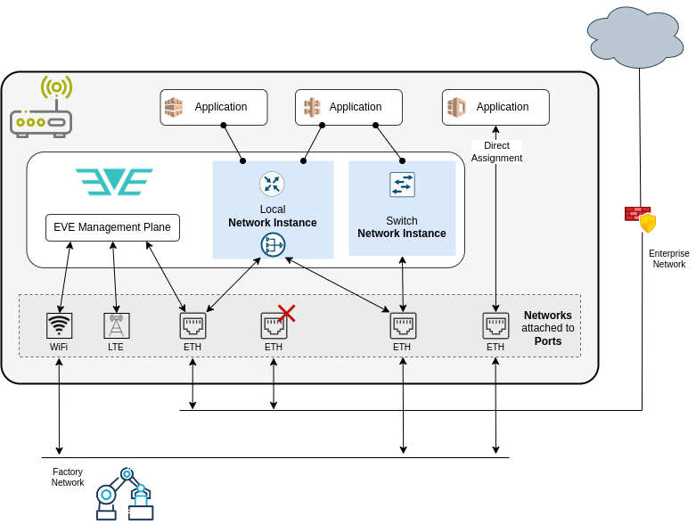

# EVE Networking (Overview)

Edge-nodes powered by EVE are remotely managed, which means that networking and reliable
connectivity play crucial role. Losing connectivity with the controller permanently effectively
means that edge-node becomes unmanageable (exceptions are intentional off-line deployments).

EVE OS must manage both device and application connectivity.
In case of device connectivity, the main challenges and requirements are:

- Support network IO devices from various manufactures (provide proper drivers)
- Support different kinds of network connectivity (ethernet, cellular, WiFi)
- Try to maintain connectivity with the controller
  - fail-over between ports when one stops providing functional connectivity
  - prevent from user accidentally submitting wrong network config
    - test connectivity before committing, fallback to the previous config when test fails
- Spread the load across multiple uplink ports while avoiding costly connections
  (e.g. prefer ethernet over cellular)
- Allow to use network adapters for both EVE management traffic and application traffic
  (resource sharing)

In case of application connectivity, the main challenges and requirements are:

- Create virtualized networking for apps, providing basic services like DHCP, DNS, NAT, etc.
- Allow to secure/limit applications with user-configured firewall rules
- Seamlessly integrate virtual networks with external physical networks
  - Application should not need to be aware of any virtualization layer present between them
    and the external physical networks
- Minimize overhead of the virtualized data-plane

## Architecture & Terminology

Picture below is a high-level depiction of a single edge device running EVE. Multiple
physical network IO ports are portrayed, some used for EVE only, other shared or exclusively
used by applications. Virtual networks are deployed to allow applications communicating
with each other. External connectivity is provided to an application either through a directly
assigned network IO port, or via an uplink selected for the given virtual network.

Let's clarify the terminology for the main components of the EVE network model.

### Network port

Network port denotes a physical network IO device (ethernet NIC, WiFi module, cellular modem).
See [DEVICE-CONNECTIVITY.md](./DEVICE-CONNECTIVITY.md), section "Physical network ports".

### Network adapter

Network adapter denotes network configuration (MTU, MAC, IP, VLAN, etc.) and logical attributes
(logical & interface names, cost, usage) attached to a physical network port.
In EVE API, it is denoted more generically as `System Adapter` (to include all kinds of IO devices,
not just for networking).
More information can be find in [DEVICE-CONNECTIVITY.md](./DEVICE-CONNECTIVITY.md),
section "SystemAdapter".

Inside the application configuration, network adapter is also (confusingly) used to configure
connectivity between the application and a [network instance](#network-instance).

### Network

Network (not to be confused with "Network Instance", see below) is a configuration object
referenced by UUID and containing network configuration (DHCP/static IP config, DNS, NTP config)
that can be assigned to a network port to form a network adapter (the adapter then additionally
defines logical attributes like "usage" and "cost").

The same network configuration can be used for multiple ports.

### Network instance

Network instance (NI for short) is a virtual switch deployed inside an edge-device,
allowing applications (virtual machines or containers) to communicate with one another over
a virtual network.

EVE provides 2 types of network instances:

- **Local**:
  - uses private IP subnet, separated from external networks over NAT
  - traffic between apps and external endpoints is routed and NATed
  - from outside, applications can be accessed only through port forwarding rules
  - provides basic services like: DHCP (with its own IPAM), DNS, access-control,
    HTTP metadata server (e.g. for cloud-init)
- **Switch**:
  - simple L2-only switch between connected applications and a network adapter
  - traffic is only forwarded
  - does not run DHCP server (but can be used in combination with external DHCP server)
  - allows applications to directly connect to external network segments

For a comprehensive description of Network Instances, their properties, behavior
and some implementation details, please consult [APP-CONNECTIVITY.md](APP-CONNECTIVITY.md).

In EVE API, network instance is a configuration object identified by UUID.
Application then references UUIDs of network instances to which it should be connected.

### Uplink

Uplink denotes network adapter that a network instance is connected to for external connectivity.
Network instance can be air-gapped, i.e. without uplink, thus not providing external connectivity.

## Implementation

EVE networking is built on top of the Linux network stack, further integrated with some
open-source tools. EVE combines standard Linux network features for the data-plane,
such as IP routes, IP rules, Linux bridge, iptables, etc. However, the way these tools
are assembled to implement the EVE network model and to address unique challenges of the edge,
is in some instances somewhat unconventional, separating EVE from the more traditional Linux
distributions, and could be confusing even for experienced Linux users, for example:

- Main IP routing table (`ip route show table main`) is not used, instead every (IP-enabled)
  network adapter and every local network instance has its own routing table, which is selected
  using IP rules by the source IP address of a given packet (see `ip rule list`).
- Network adapter for ethernet port is implemented as a bridge which enslaves the port and takes
  its interface name and MAC address - this way we can then put application interfaces under this
  bridge to implement switch network instance
- ACLs are implemented by iptables `mangle` table for the most part (not `filter`). Traffic flow
  that should not be allowed is marked with a "DROP mark" and routed into a dummy `blackhole`
  interface
- By default, DHCP servers of local network instances grant leases to applications with /32
  IP addresses, even if the actual subnet is larger and with more than just one IP. This is
  accompanied by a link-local route for the actual subnet and is used to force routing even in
  situations where traffic could be just forwarded. EVE does this for the ACL and flow logging
  purposes, see [APP-CONNECTIVITY.md](APP-CONNECTIVITY.md), section "Local Network Instance".
- [dhcpcd](https://wiki.archlinux.org/title/dhcpcd) is not only used to get IP address for
  a network adapter via DHCP, but also to assign user-configured static IP
- [dnsmasq](https://thekelleys.org.uk/dnsmasq/doc.html) is used not only as a DNS server for local
  network instances, but also as a DHCP server

The process of configuring the data-plane and all its components is split between
4 EVE microservices:

- [NIM](../pkg/pillar/docs/nim.md) takes care of everything related to device connectivity
  (network adapters, `dhcpcd`, network config testing & fallback procedure)
- [zedrouter](../pkg/pillar/docs/zedrouter.md) deploys network instances
- [wwan](../pkg/wwan/README.md) runs `ModemManager` and EVE's `mmagent` wrapper to establish
  and manage cellular connectivity
- wlan runs `wpa_supplicant` to perform the WPA authentication for WiFi connectivity

Diagram below depicts all the components of the data-plane and how they all fit together.
Also shown is the separation of the management plane between EVE microservices.

To dive deeper into the EVE networking, including the implementation details, see the next section
for further directions.

## Where to go next

- [More information about device connectivity](DEVICE-CONNECTIVITY.md)
- [More information about application connectivity](APP-CONNECTIVITY.md)
- [Access-control for applications](NETWORK-ACLS.md)
- [Wireless connectivity](WIRELESS.md)
- [Metadata (incl. network info) exposed to applications](ECO-METADATA.md)
- Developer's deep-dive into EVE networking-related microservices:
  - [NIM](../pkg/pillar/docs/nim.md)
  - [zedrouter](../pkg/pillar/docs/zedrouter.md)
  - [wwan](../pkg/wwan/README.md)
