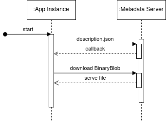
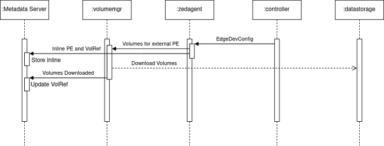

# Patch Envelopes

## What is Patch Envelope?

Patch Envelope is a functionality in EVE that helps you change data in your App Instance in
runtime without the need to reboot instance, or recreate image. Imagine that in order to change
configuration in one of your program, you have to create new OS image and flush it to your computer.
With Patch Envelope you don’t have to do that. Patch Envelope constitutes of Binary Artefacts (blobs)
which are base64-encoded objects. This can be anything, from binary file to a configuration yaml file.
Those Patch Envelopes are exposed to App Instance via Metadata [server](./ECO-METADATA.md).

## Why should I use it?

When recreating image doesn’t make sense (i.e. you just want to change one configuration parameter and
you don’t want to recreate VM image) or when downtime is not an option for you

## How can I use it?

In EVE every App Instance connected to local network instances is exposed to Metadata server at
`169.254.169.254`. It has bunch of useful endpoints, amongst them are patch envelope endpoints. So within
App Instance one can access Patch Envelopes available to specific App Instance by getting description.json.
This would return list of Patch Envelopes available to this App Instance. (For more information on the metadata service consult [ECO-METADATA.md](ECO-METADATA.md).)

```bash
curl -X GET -v http://169.254.169.254/eve/v1/patch/description.json
[

    {
        "PatchId":"699fbdb2-e455-448f-84f5-68e547ec1305",
        "Version":"1",
        "BinaryBlobs":[
            {
                "file-name":"textfile1.txt",
                "file-sha":"%FILE_SHA",
                "file-meta-data":"YXJ0aWZhY3QgbWV0YWRhdGE=",
                "url":"http://169.254.169.254/eve/v1/patch/download/699fbdb2-e455-448f-84f5-68e547ec1305/textfile1.txt"
            },
            {
                "file-name":"textfile2.txt",
                "file-sha":"%FILE_SHA%",
                "file-meta-data":"YXJ0aWZhY3QgbWV0YWRhdGE=",
                "url":"http://169.254.169.254/eve/v1/patch/download/699fbdb2-e455-448f-84f5-68e547ec1305/textfile2.txt"
            }
        ],
        "VolumeRefs":null
    }

]
```

Every Patch Envelope contains of one or more Binary Artefacts (Blobs) which are base64-encoded objects.
Each object can be downloaded by calling URL, i.e.

```bash
curl -X GET http://169.254.169.254/eve/v1/patch/download/699fbdb2-e455-448f-84f5-68e547ec1305/textfile1.txt
```

will get you base64-encoded file.Note that you can download zip archive of all binary artifacts for a
given patch envelope by calling

```bash
curl -X GET http://169.254.169.254/eve/v1/patch/download/699fbdb2-e455-448f-84f5-68e547ec1305 > a.zip
```

Flow diagram of the process is below



Full OpenAPI (Swagger) [specification for patch envelope endpoint can be found here](./api/patch-envelopes.yml).
You can generate client from this specification and use it to develop your application.

## What types of Binary Artifacts are there?

There’re two types of Binary Artifacts (Blobs): inline and external.
There is no distinction in the API between internal and external artifacts from the application perspective.
However, there’s a difference on how this artifacts are treated in EVE. Inline binary
artifacts are small size artifacts (max 10KBytes) which are part of EdgeDevConfig,
whereas external patch envelopes are represented as Volumes which are handled
by [volumemgr](../pkg/pillar/docs/volumemgr.md).

## Where Binary Artifacts are stored?

Inline Artifacts are stored as part of EdgeDevConfig. External artifacts are
stored in datastorage specified. EVE downloads artifacts directly from datastorage.
Keep this in mind configuring ACLs and access.

## How does it work?



Internally, Metadata Server stores envelopes which come from EdgeDevConfig parsed
by zedagent. Binary Artifacts can be of two different types: inline and external.
Metadata server stores VolRef – volume references, which are changed to BinaryBlobs
once volumes are downloaded. Note that this process is async and it might take time.
All communication in this process is done via PubSub. When AppInstance downloads inline
object it’s served from Metadata server (zedrouter microservice). In case of external
patch envelopes – Metadata serves file from volume. For more information [on how envelopes works
in code refer here](https://github.com/lf-edge/eve/blob/0a8b21ec5de3bf6a2613c2c6f2e2af7e353b1e98/pkg/pillar/cmd/zedrouter/patchenvelopes.go#L18C1-L47C88)

## Encryption/Description of patch envelopes data

### Overview

The cipher-based patch envelope enhancement introduces encryption options for specific parts of the patch envelope. Instead of encrypting the entire envelope or binary artifact blob, the new scheme allows encryption of the `artifactMetaData` field and/or one of the two `binaryBlob` items: `inline` or `volumeRef`. These encrypted items are represented as `encrypted_inline` or `encrypted_volumeref` types in the binary artifact structure.

### How It Works

#### **Parsing the Cipher Block**

When the EVE device receives a patch envelope configuration, and the `binaryBlob` type is either `encrypted_inline` or `encrypted_volumeref`, the `zedagent` performs the following steps:

* It parses the cipher block based on the type (`inline` or `volumeref`).
* The `zedagent` does not decrypt the blob content. Instead, it uses the first 16 bytes of the `cipherData` as the key.
* The `cipherData` is encoded using `gob` and saved in the cache directory for later retrieval.

#### **Creating a New Structure**

A new structure, `BinaryCipherBlob`, is introduced in the `pillar` module to handle encrypted binary blobs:

```go
type BinaryCipherBlob struct {
  // EncType is type of encryption
  EncType BlobEncrytedType `json:"encType"`
  // ArtifactMetadata is generic info i.e. user info, desc etc.
  ArtifactMetaData string `json:"artifactMetaData"`
  // Encrypted ArtifactMetadata for blob
  EncArtifactMeta CipherBlockStatus `json:"encArtifactMeta"`
  // EncURL is URL to download encrypted binary blob in CipherBlockStatus format
  // which contains either ONEOF inline or volume encrypted data
  EncURL string `json:"encURL"`
  // EncFileName is file name of the encrypted binary blob
  EncFileName string `json:"encFileName"`
  // Inline - used for post decrypt inline binary blob
  Inline *BinaryBlobCompleted `json:"inline"`
  // Volume - used for post decrypt volume binary blob
  Volume *BinaryBlobVolumeRef `json:"volume"`
}
```

* The EncType field indicates whether the encryption type is BlobEncryptedTypeInline or BlobEncryptedTypeVolume.
* The ArtifactMetaData and EncArtifactMeta fields are similar to the existing BinaryBlobCompleted and BinaryBlobVolumeRef structures.
* The EncURL field points to the cached directory containing the saved cipherData.
* The EncFileName field specifies the key or filename for the saved cipherData.

#### **Publishing the Patch Envelope**

When the zedagent publishes the PatchEnvelopeInfo, the Inline and Volume fields are set to nil. The EncURL contains the cached URL for the encrypted inline data.

#### **Decryption on the MSRV Side**

* When the Metadata Server (MSRV) receives the PatchEnvelopeInfo, it iterates through all binary blobs to check for EncArtifactMeta fields that require decryption. If decryption is required, the decrypted data is populated into the ArtifactMetaData field.
* For BinaryCipherBlob data, the MSRV fetches the saved cipherData from the cache directory. Based on the type (inline or volumeref), it decrypts the data and populates the Inline or Volume structure.

#### **Serving the Data**

* For inline blobs, the MSRV dynamically formats the url string when a metadata client queries the description.json. This is handled by the zedagent parser for unencrypted cases.
* When a client requests to download an inline file, the MSRV dynamically decrypts the data from the cache directory, retrieves the content, and forwards it to the client in the download response.

#### **Serving Zip File Download**

When a client requests a zip file containing the patch envelope, the GetZipArchive() utility function:

* Decrypts the CipherBlobs.
* Appends the decrypted data to the zip entries.
* Includes the decrypted data in the final zip file for download.

### Example of patch envelope from zedagent 'PatchEnvelopeInfoList' and client description.json

Below is an example of a patch envelope containing one unencrypted BinaryBlob, one unencrypted VolumeRef, and three encrypted CipherBlobs with inline blobs. This example demonstrates how encrypted and unencrypted blobs coexist within a patch envelope.

```json
b6806473-ab5f-4807-828d-725dcddc45ec:/persist/status/zedagent/PatchEnvelopeInfoList# jq < global.json
{
  "Envelopes": [
    {
      "Name": "retry-runtime-VM-70c87459-d1e8-411a-b81f-4ec2255db882",
      "Version": "1",
      "AllowedApps": [
        "bc29c80d-e237-429c-a143-f65e7613f635"
      ],
      "PatchID": "8986a760-5a6f-4b74-950a-0ca8c3e46838",
      "Errors": null,
      "State": 5,
      "BinaryBlobs": [
        {
          "artifactMetaData": "",
          "encArtifactMeta": {},
          "fileMetaData": "",
          "fileName": "NestedAppInstanceConfigManifest.json",
          "fileSha": "d8fc32cb3de33a0ec79e6cc627f80faac62dd5d7c4c627281fd3d2f88524118a",
          "size": 156,
          "url": "/persist/patchEnvelopesCache/NestedAppInstanceConfigManifest.json"
        }
      ],
      "VolumeRefs": [
        {
          "artifactMetaData": "",
          "encArtifactMeta": {},
          "fileMetaData": "",
          "fileName": "envdump-compose-tar4e6c75c9-9601-492b-9454-c824b603ca9c",
          "imageId": "0349dbb1-2e82-4eb6-a736-a4d1a0bd7db0",
          "imageName": "envdump-compose-tar"
        },
        {
          "artifactMetaData": "",
          "encArtifactMeta": {},
          "fileMetaData": "",
          "fileName": "hello-eve-compose-tar5766797a-7180-4e06-94f1-47c816964637",
          "imageId": "deb85d21-d7ff-4806-abb5-3c4a3c44696e",
          "imageName": "hello-eve-compose-tar"
        }
      ],
      "CipherBlobs": [
        {
          "artifactMetaData": "",
          "encArtifactMeta": {},
          "encFileName": "encInline-7bb22e113642633a2249260d4d4d0823",
          "encType": 1,
          "encURL": "/persist/patchEnvelopesCache/encInline-7bb22e113642633a2249260d4d4d0823",
          "inline": null,
          "volume": null
        },
        {
          "artifactMetaData": "",
          "encArtifactMeta": {},
          "encFileName": "encInline-7bea2d113642243a1c56340d63521523",
          "encType": 1,
          "encURL": "/persist/patchEnvelopesCache/encInline-7bea2d113642243a1c56340d63521523",
          "inline": null,
          "volume": null
        },
        {
          "artifactMetaData": "",
          "encArtifactMeta": {},
          "encFileName": "encInline-7bd62e113642622e0c4a7e0d4d705135",
          "encType": 1,
          "encURL": "/persist/patchEnvelopesCache/encInline-7bd62e113642622e0c4a7e0d4d705135",
          "inline": null,
          "volume": null
        }
      ]
    }
  ]
}
```

```sh
curl http://169.254.169.254/eve/v1/patch/description.json
```

```json
[
  {
    "PatchID": "8986a760-5a6f-4b74-950a-0ca8c3e46838",
    "Version": "1",
    "BinaryBlobs": [
      {
        "artifactMetaData": "",
        "encArtifactMeta": {},
        "fileMetaData": "",
        "fileName": "NestedAppInstanceConfigManifest.json",
        "fileSha": "d8fc32cb3de33a0ec79e6cc627f80faac62dd5d7c4c627281fd3d2f88524118a",
        "size": 156,
        "url": "http://169.254.169.254/eve/v1/patch/download/8986a760-5a6f-4b74-950a-0ca8c3e46838/NestedAppInstanceConfigManifest.json"
      },
      {
        "artifactMetaData": "",
        "encArtifactMeta": {},
        "fileMetaData": "",
        "fileName": "envdump-compose-tar4e6c75c9-9601-492b-9454-c824b603ca9c",
        "fileSha": "d2371d63df77fcc5cc6f7753e5f07e1b742bb3a0088e1be68f4c55f9f06024f9",
        "size": 672,
        "url": "http://169.254.169.254/eve/v1/patch/download/8986a760-5a6f-4b74-950a-0ca8c3e46838/envdump-compose-tar4e6c75c9-9601-492b-9454-c824b603ca9c"
      },
      {
        "artifactMetaData": "",
        "encArtifactMeta": {},
        "fileMetaData": "",
        "fileName": "hello-eve-compose-tar5766797a-7180-4e06-94f1-47c816964637",
        "fileSha": "38a47238a57c3ecf0e012eca61fc5f539347e00d63bec1fd5d904a6e830e97a8",
        "size": 416,
        "url": "http://169.254.169.254/eve/v1/patch/download/8986a760-5a6f-4b74-950a-0ca8c3e46838/hello-eve-compose-tar5766797a-7180-4e06-94f1-47c816964637"
      },
      {
        "artifactMetaData": "",
        "encArtifactMeta": {},
        "fileMetaData": "",
        "fileName": "4e6c75c9-9601-492b-9454-c824b603ca9c",
        "fileSha": "299dac7b02cda04ca904fba028549919be17869d67b0cc68f033e784bda3d69b",
        "size": 156,
        "url": "http://169.254.169.254/eve/v1/patch/download/8986a760-5a6f-4b74-950a-0ca8c3e46838/4e6c75c9-9601-492b-9454-c824b603ca9c"
      },
      {
        "artifactMetaData": "",
        "encArtifactMeta": {},
        "fileMetaData": "",
        "fileName": "0f115208-6780-453f-9827-39d8d9fa200f",
        "fileSha": "043811693f3ca1ba1f22c60ba2e7ab2d4daadb1c388828f37e86a7b566ecb5c6",
        "size": 324,
        "url": "http://169.254.169.254/eve/v1/patch/download/8986a760-5a6f-4b74-950a-0ca8c3e46838/0f115208-6780-453f-9827-39d8d9fa200f"
      },
      {
        "artifactMetaData": "",
        "encArtifactMeta": {},
        "fileMetaData": "",
        "fileName": "5766797a-7180-4e06-94f1-47c816964637",
        "fileSha": "215960d4a3a6f3edcf12cfdad0cdb9c72d30121700049b05da159afb127714f2",
        "size": 248,
        "url": "http://169.254.169.254/eve/v1/patch/download/8986a760-5a6f-4b74-950a-0ca8c3e46838/5766797a-7180-4e06-94f1-47c816964637"
      }
    ],
    "VolumeRefs": [
      {
        "artifactMetaData": "",
        "encArtifactMeta": {},
        "fileMetaData": "",
        "fileName": "envdump-compose-tar4e6c75c9-9601-492b-9454-c824b603ca9c",
        "imageId": "0349dbb1-2e82-4eb6-a736-a4d1a0bd7db0",
        "imageName": "envdump-compose-tar"
      },
      {
        "artifactMetaData": "",
        "encArtifactMeta": {},
        "fileMetaData": "",
        "fileName": "hello-eve-compose-tar5766797a-7180-4e06-94f1-47c816964637",
        "imageId": "deb85d21-d7ff-4806-abb5-3c4a3c44696e",
        "imageName": "hello-eve-compose-tar"
      }
    ]
  }
]
```
