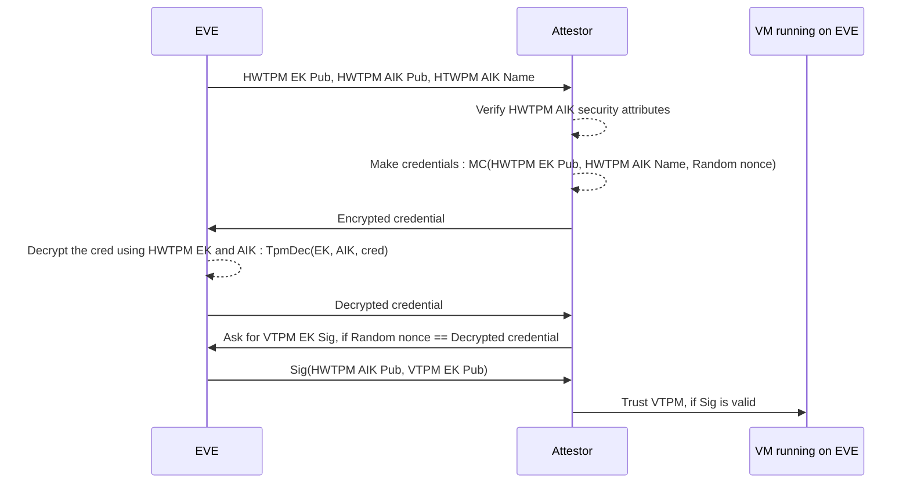

# VTPM

*(if you're looking for old VTPM documents, please refer to [PTPM](PTPM.md))*

Virtual TPM container integrates SWTPM with QEMU, in order to emulate a full Virtual TPM 2.0 (1.2 not supported) for running VMs and bare-metal container. It creates a SWTPM instance per VM. The SWTPM instance is configured to use a Unix Domain Socket as a communication line, by passing the socket path to the QEMU virtual TPM configuration, QEMU automatically creates a virtual TPM device for the VM which is accessible like a normal TPM under `/dev/tpm*`.

VTPM configures SWTPM to saves and loads TPM state on/from the `/persist/swtpm/tpm-state-[VM-UUID]`, so at the next VM boot all the TPM keys, TPM NVRAM data, etc. are present in the virtual TPM.

## VTPM Security Guarantees

VTPM offers security guarantee against the following scenarios:

1. Virtual TPM data confidentiality
2. Virtual TPM uniqueness (cloning detection)

The first scenario is guaranteed by state encryption. SWTPM is configured to encrypt each VM/Container's virtual TPM state data using a 256-bit AES key, this key is stored in the HWTPM with a PCR policy and is only accessible to EVE. The access to this key is protected using the same PCR policy as the vault key (measured boot using PCR values), as result any tampering with EVE such as cloning or a persistent backdoor will result in unavailability of the VTPM encryption key. In case of tampering with the system, VTPM will not be made available to VM/Container, and VM/Container should consider such case as evidence of tampering with EVE.

The second guarantee is secured by signing the VTPM's Endorsement Key (EK) using a signing key (HWTPM AIK) that is stored in HWTPM. EVE utilizes TPM to lay out a process that is true to our zero-trust promises and allows a remote party to establish trust in AIK and prove its security attributes (for example AIK resides inside HWTPM and is not import/exportable). This is how the chain of trust if established:

1- HWTPM's Endorsement Key is a special purpose TPM-resident RSA key that is never visible outside the TPM. EK can be used for **decryption only** (EK cannot be used to produce a digital signature). EK is generated base on a **unique per TPM** seed, so it is deterministic and it's creation results in same key every single time (even after TPM is cleared). Trust in EK is established using a certificate issue by the OEM, either through a EK certificate or a Platform
certificates [ADD REF, TPM 2.0 SPEC]. EVE is TPM-OEM agnostic and it can only provide the VM/Containers with the HWTPM EK, verifying and trusting it is outside of scope of EVE and should be done by the attestor (VM/Container running on EVE or ideally a remote trusted server that wants to verify the SWTPM security guarantees).

2- EVE generates a Attestation Identity Key (AIK) inside the HWTPM. AIK is a signing key and it is used to sign the VTPM's EK. This signature and subsequent attestation process (described below) proofs that the VTPM is running on a TPM with a specific HWTPM EK and running a cloned VTPM on a another TPM detectable. AIK comes with security attributes like FixedTPM, FixedParent and SensitiveDataOrigin (meaning the key is generated on the TPM and duplication/exporting/importing it is not possible). Attestor can make sure these values hold before trusting the AIK and verifying the VTPM's EK signature. This is done by first making sure that calculated AIK public blob's digest matches the provided digest and second the attributes hold by decoding and examining the AIK public blob.

3- The attestor uses the AIK's public blob digest (AKA name which contains the security attributes as mentioned above) and HTWPM EK to encrypt a credential (AKA nonce). Creating the credential links the AIK to HWTPM EK. This is done by generating a seed, encrypting it using HWTPM EK and running the AIK's digest and the seed through a KDF to create an asymmetric key. The final asymmetric key is used to encrypt the credential. Please note that this operation doesn't require a TPM, so it can happen on a trusted remote server with no TPM.

4- At the final stage, the credential is passed to EVE. EVE uses HWTPM to decrypt the credentials. Per TCG TPM 2.0 specifications, this operation only succeeds if HWTPM has the private part of the matching EK and contains an AIK with matching attributes inside. After successfully decrypting the credentials, the plain text is passed to the attestor as a proof. If this operation fails, the attestor should not trust the VTPM and should halt any operation that relies on a TPM.



For a working example of this operation, please check `/pkg/vtpm/vtpm-attest/`. Please note that if a hardware TPM is not available to EVE, these security guarantees are nulled and the virtual TPM state is stored unencrypted.

## Example Usecase : Azure IoT Edge

Using the VTPM, we can use the TPM based Device Provisioning service from Azure Portal. This guide walks you through a "Individual Enrollment" setup based on Ubuntu 22.04 and Azure IoT Edge 1.5.x .

### Setup

1- We start by creating the necessary keys in the TPM. The two required keys are the Endorsement Key (EK) and the Storage Root Key (SRK). The default configuration expects to find them in TPM indexes `0x81010001` and `0x81000001`, respectively. If a different index is used, it must be set by changing `auth_key_index` in the IoT Edge configuration file.

```bash
sudo apt-get update
sudo apt-get install -y tpm2-tools

# Create the EK and SRK
tpm2_createek -c 0x81010001 -G rsa -u ek.pub
tpm2_createprimary -Q -C o -c srk.ctx > /dev/null
tpm2_evictcontrol -c srk.ctx 0x81000001 > /dev/null
tpm2_flushcontext -t > /dev/null
```

2- To provision a device using TPM, we must set up the necessary configuration in the Azure Portal. Specifically, we need to create an individual enrollment using the TPM EK and EK ID:

```bash
# This outputs the EK
base64 -w0 ek.pub

# This outputs the ID
sha256sum -b ek.pub | cut -d' ' -f1 | sed -e 's/[^[:alnum:]]//g'
```

3- Copy the EK and ID, head to the "Azure IoT Hub Device Provisioning Service (DPS) -> Manage enrollments -> Individual enrollments", click on "Add individual enrollment". Under the "Registration + provisioning", set the "Attestation mechanism" to "Trusted Platform Module (TPM)". Paste the EK value you copied to the "Endorsement key" field and ID to the "Registration ID" field. Make sure "Enable this enrollment" is checked and click on "Review + create".

4- Back on the VM, we are going to install Azure Iot Edge service:

```bash
# install microsoft repository
wget https://packages.microsoft.com/config/ubuntu/22.04/packages-microsoft-prod.deb -O packages-microsoft-prod.deb
sudo dpkg -i packages-microsoft-prod.deb
rm packages-microsoft-prod.deb

# install pre-requisites
sudo apt-get update
sudo apt-get install -y moby-engine
sudo apt-get install -y aziot-edge
```

5- After a successful installation, we will configure the Azure IoT Edge service. For this, we need a "Registration ID," which is the same as the ID obtained in stage 2, and the "ID Scope." The "ID Scope" can be obtained from the Azure Portal by navigating to the "Azure IoT Hub Device Provisioning Service (DPS)." Under the "Overview" section, you will find the "ID Scope," which is in the format "0ab1234C5D6." After creating the config, we apply it and wait for it to take effect :

```bash
>config.toml cat <<-EOF
## DPS provisioning with TPM
[provisioning]
source = "dps"
global_endpoint = "https://global.azure-devices-provisioning.net"
id_scope = "!!!ID SCOPE GOES HERE!!!"

[provisioning.attestation]
method = "tpm"
registration_id = "!!!ID GOES HERE!!!"
EOF

sudo cp config.toml /etc/aziot/config.toml
sudo iotedge config apply
```

6- After a few seconds, executing `sudo iotedge system status`
 should output all services are running.
