# CPU Affinity, Pinning & Real-Time Support in EVE — Design

> **Status:** Draft — full text and diagrams, plus an implementation plan (§18).
>
> **Reference API implementation.** The API changes described here (§18.2) exist as a
> reviewable proof-of-concept branch (a fork of `lf-edge/eve-api`), so the concrete `.proto`
> definitions can be read alongside this document:
> [branch `rucoder/cpu-placement-api`](https://github.com/rucoder/eve-api/tree/rucoder/cpu-placement-api)
> · [full diff vs master](https://github.com/lf-edge/eve-api/compare/master...rucoder:eve-api:rucoder/cpu-placement-api)
> · protos:
> [config/vm.proto](https://github.com/rucoder/eve-api/blob/rucoder/cpu-placement-api/proto/config/vm.proto)
> (placement intent),
> [info/hardware.proto](https://github.com/rucoder/eve-api/blob/rucoder/cpu-placement-api/proto/info/hardware.proto)
> (topology + hardware capability),
> [info/info.proto](https://github.com/rucoder/eve-api/blob/rucoder/cpu-placement-api/proto/info/info.proto)
> (EVE-software capability),
> [info/common.proto](https://github.com/rucoder/eve-api/blob/rucoder/cpu-placement-api/proto/info/common.proto)
> (structured error codes). The proto comments are normative for field-level detail.
>
> **Scope note:** This document designs the feature end-to-end as a single coherent
> system. It is written as a from-scratch design, not as a changelog — it does not
> distinguish "already built" from "planned." The primary target is the **eve-kvm**
> deployment (Quvia *Grid* VPP/DPDK software router); **eve-k** (Kubernetes/KubeVirt)
> is addressed as a forward-compatibility bridge, not a fully-designed target.

---

## Table of Contents

1. [Overview & Scope](#1-overview--scope)
2. [Design Principles](#2-design-principles)
3. [Requirements](#3-requirements)
4. [Concepts & Model](#4-concepts--model)
5. [Architecture](#5-architecture)
6. [Topology Discovery](#6-topology-discovery)
7. [Placement & Allocation](#7-placement--allocation)
8. [Enforcement (eve-kvm)](#8-enforcement-eve-kvm)
9. [EVE ↔ Controller Interface](#9-eve--controller-interface)
10. [From the User's Perspective](#10-from-the-users-perspective)
11. [Disruption, Consent & Lifecycle](#11-disruption-consent--lifecycle)
12. [EVE-K Bridge (forward-looking)](#12-eve-k-bridge-forward-looking)
13. [Margo Alignment](#13-margo-alignment)
14. [Failure Handling & Edge Cases](#14-failure-handling--edge-cases)
15. [Testing & Validation](#15-testing--validation)
16. [Rollout & Compatibility](#16-rollout--compatibility)
17. [Open Questions & Future](#17-open-questions--future)
18. [Implementation Plan](#18-implementation-plan)
- [Appendix A: Glossary](#appendix-a-glossary)
- [Appendix B: Example Platform Topologies](#appendix-b-example-platform-topologies)
- [Appendix C: Mapping Tables](#appendix-c-mapping-tables)
- [Appendix D: Code Map](#appendix-d-code-map)

---

## 1. Overview & Scope

Edge workloads such as software routers, packet processors, and industrial control
loops are sensitive to *where* their virtual CPUs run on the physical machine. Two
vCPUs sharing the two SMT threads of one physical core contend for a single execution
engine and the core-private caches; vCPUs and memory split across NUMA nodes pay
cross-socket latency; and background system work landing on a hot core injects jitter.
A CPU placement that is blind to this topology produces inconsistent throughput and
latency that varies from one boot to the next.

This document designs **topology-aware CPU placement** for EVE. The device discovers
the machine's socket / NUMA / cache / core / SMT-thread structure, places each
workload's vCPUs onto concrete host CPUs according to an explicit per-workload policy,
exposes a truthful CPU topology to the guest, and keeps other workloads and EVE's own
housekeeping off the cores a workload has been given.

**Motivating workload.** The immediate target is Quvia *Grid*, a VPP (fd.io) software
router (IPsec, traffic steering, dynamic tunnels) delivered as a KVM VM. It is
poll-mode and throughput-sensitive, and it is *optimized to use both SMT threads* of a
physical core — VPP deliberately runs a worker on each sibling. What it needs from the
platform is therefore whole physical cores it owns **exclusively** (no other workload
or host housekeeping intruding on them), a **truthful SMT topology exposed to the
guest** so VPP can see which vCPUs are siblings and place its workers accordingly, a
strict **1:1 vCPU→host-thread mapping** so the guest's sibling pairs correspond to real
host sibling pairs, and NUMA-local placement — the same cores on every boot. This is
the whole-core-SMT mode (§4.3); the problem to solve is not sibling *use* but sibling
*blindness* and cross-workload intrusion.

**Two variants, one controller API.** EVE ships in two relevant flavors: **eve-kvm**
(the classic single-node hypervisor path, the primary target here) and **eve-k** (the
Kubernetes/KubeVirt clustered variant). The controller expresses the *same* placement
intent to both; only the device-side translation differs. eve-k is addressed as a
forward-compatibility bridge (§12), not a fully-specified target.

**Target class.** The first class of workloads served is **throughput /
core-exclusivity**: give the workload whole, uncontended cores and keep them
NUMA-local. A second class, **latency-determinism** (bounded worst-case jitter for
control loops), needs a real-time (PREEMPT_RT) kernel layered on top of core isolation —
an orthogonal axis, not just a stronger tier (§4.2) — rather than a separate feature.

**Non-goals.** Networking-datapath tuning (SR-IOV VF passthrough, virtio
multiqueue/vhost, NIC IRQ affinity, hugepages) is a separate concern and is not solved
here — SMT-aware pinning is necessary but not sufficient for line rate. RDT cache /
memory-bandwidth allocation, a P/E-core *preference* policy, and full Margo wire
integration are out of scope for the first cut and tracked in §17.

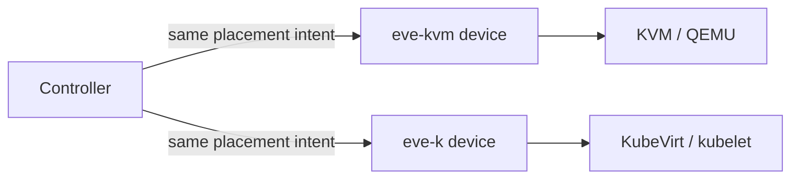

---

## 2. Design Principles

- **Report / execute / veto.** The device reports capability + topology + current
  allocation + an optimality signal; executes the placement it is given; and may
  veto or require acknowledgement before a disruptive management action touches a
  running critical workload. The device never initiates disruption on its own.
- **Separation of authority.** The device *places* (picks concrete cores); the
  controller *expresses intent*; the orchestrator *owns disruption* (restart/reboot).
- **One model across variants and tiers.** The design deliberately aligns **eve-kvm**,
  **eve-k**, **Margo**, and **soft/hard isolation** under a single vocabulary and a
  single capability gradient, so the same controller intent behaves consistently
  everywhere and the variants differ only in device-side translation. (The distinct
  *capabilities* — affinity, isolation, RDT, real-time — are themselves orthogonal; §4.4.)
- **Forward stability.** The published contracts (topology report, placement intent)
  are shaped to be extended additively; enabling a future capability must not change
  the meaning of an existing request.

---

## 3. Requirements

These are the properties the design must satisfy, stated informally.

- **Whole-core exclusivity is opt-in, per workload — not a blanket rule.** A workload
  that requests whole cores (`full-pcpus-only`, i.e. the whole-core-SMT / one-per-core
  modes) is guaranteed that no *other* workload runs on its cores' SMT threads — that is
  the isolation it asked for. Workloads that do *not* request it are allocated at
  SMT-thread granularity and may share a physical core, so a small container needing a
  single thread does not waste a whole core. This mirrors Kubernetes `full-pcpus-only`.
- **Sibling use within a whole-core workload is the workload's choice.** In one-per-core
  each vCPU gets its own physical core and the sibling thread is parked idle (max
  per-vCPU isolation, at the cost of that thread); in whole-core-SMT both sibling threads
  become vCPUs and the guest is shown a truthful `threads=2` topology so it places its
  own hot work sensibly.
- **NUMA-local placement preferred by default** (the default NUMA policy is best-effort —
  prefer one node, span only if it does not fit); guest topology truthfully reflects the
  host layout.
- **Per-workload policy** — each workload chooses its own behavior; there is no single
  global rule.
- **Soft isolation by default,** with a defined path to hard isolation for
  latency-sensitive workloads.
- **Deterministic, order-independent placement** — the same set of workloads yields the
  same assignment regardless of boot or activation order.
- **Fail cleanly, never mis-place** — an unsatisfiable request produces a clear,
  actionable status; a workload never boots onto a wrong or overlapping pin.
- **The same controller intent works for eve-kvm and eve-k.**

---

## 4. Concepts & Model

### 4.1 CPU Topology Model

The design reasons over a strict hierarchy, from the whole machine down to individual
hardware threads:

**Socket (package) → NUMA node → L3 domain → L2 domain → physical core → SMT thread (PU).**

Each logical CPU (what the OS schedules on, and what `sched_setaffinity` targets) is one
SMT thread of one physical core. The two properties that drive placement are:

- **SMT siblings** — the logical CPUs that share one physical core's execution engine
  and private caches. They are identified by a shared **`(socket, core_id)`** key, which
  is authoritative on every architecture we target.
- **Cache/NUMA locality** — which L3 domain and NUMA node a core belongs to, so a
  workload's cores can be kept together.

> **L2-sharing is *not* core-sharing.** On Intel hybrid parts, an efficiency-core (E-core)
> *module* exposes one shared L2 across **four distinct physical cores with no SMT**.
> Grouping siblings by an L2 id would model those four cores as a single four-thread core.
> `(socket, core_id)` is the only correct discriminator.

Core **class** (Performance / Efficiency / Low-Power) is represented in the model so the
placement engine and the capability report can reason about heterogeneity, but the first
cut applies no P/E *preference* policy — class becomes an emergent constraint (a
whole-core-SMT request inherently needs a 2-thread P-core), not a user knob (§7, §17).

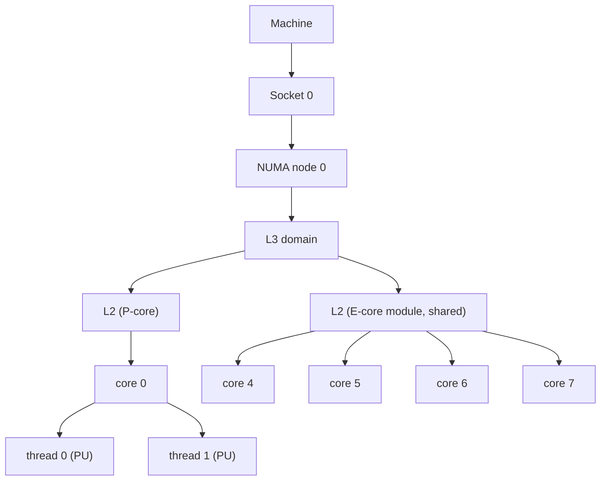

### 4.2 Isolation Tiers

Isolation is not a boolean; it is a gradient of guarantees with increasing cost. The
same intent vocabulary spans all three tiers, and the device reports which it can
currently satisfy.

| Tier | Mechanism | Guarantee | Cost |
|---|---|---|---|
| **none** | shared pool | best-effort | none |
| **soft** | cpuset pin + SMT/NUMA-aware placement (emulator offload optional, §4.3 `io_placement`) | no other workload on your cores; reduced interference | **no node reboot**; placing a new workload is disruption-free, but repacking a *running* one to a better slot needs an **app restart** — live re-pin is unsafe (§11) |
| **hard** | `isolcpus` / `nohz_full` / `rcu_nocbs` — **stock kernel** | kernel housekeeping (load-balancing, ticks, RCU) steered off the cores — large jitter/interference reduction | static, **reboot-gated** (kernel cmdline) |

**PREEMPT_RT is an orthogonal axis, not a tier.** All three tiers are achievable on the
**stock kernel** — `isolcpus` and friends do not require PREEMPT_RT. PREEMPT_RT changes
kernel *preemptibility* (sleeping locks, threaded IRQs, priority inheritance) to bound
worst-case scheduling latency; it is a build-time **kernel-image** choice (immutable, not a
cmdline toggle) layered *on top of* hard isolation, and is needed only for
**bounded-latency** workloads.

Throughput / poll-mode workloads (Quvia *Grid*) are satisfied by the **soft** tier — a
busy-polling worker just needs a whole core to itself — and can gain further from **hard**
isolation *without any RT kernel*. Only bounded-latency control loops need PREEMPT_RT on
top of hard isolation. Because the tiers share one vocabulary, moving between them is a
policy change (and, for PREEMPT_RT, a kernel-image choice), not a redesign.

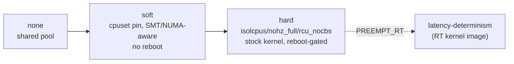

### 4.3 Placement Modes & Policy Vocabulary

A workload's policy is expressed in a vocabulary deliberately borrowed from Kubernetes
CPUManager / Topology Manager, so the same words carry to eve-k and map onto Margo.

**Modes** (derived from the policy fields, not named directly by the user):

- **whole-core-SMT** — the workload gets whole physical cores and *both* sibling threads
  become vCPUs. Guest sees `threads=2`. Uses the threads the customer wants.
- **one-per-core** — the workload gets N physical cores, one thread used per core, the
  sibling parked idle. Guest sees `threads=1`. Maximum per-vCPU isolation.
- **shared** — best-effort placement in the shared pool (today's default for
  unpinned workloads).

**Vocabulary:**

| Field | Meaning | Values |
|---|---|---|
| `cpu_policy` | pin or not | `shared` \| `dedicated` |
| `full-pcpus-only` | require whole physical cores | bool |
| `threads_per_core` | siblings used per core | `1` (one-per-core) \| `2` (whole-core-SMT) |
| NUMA topology policy | locality requirement | `single-numa-node` \| `restricted` \| `best-effort` \| `none` |
| `io_placement` | where emulator/IO threads run | `dedicated` \| `housekeeping` |

> **Two spellings of the same field.** `shared`/`dedicated` is the wire vocabulary — it is
> what the controller sends (`CpuPolicy` in `vm.proto`, §9.2) and what the device's internal
> types use. The Kubernetes-flavoured `none`/`static` spelling survives only in the
> device-local `/persist` override file (§9.2, "Device-local resolution"), which was written
> to read like a kubelet CPUManager config. They mean the same thing; only the wire
> vocabulary is contractual.

Defaults: `cpu_policy` unset ⇒ shared (unpinned); when a workload is pinned,
`threads_per_core = 2` (whole-core-SMT), NUMA policy `best-effort`, and
`io_placement = dedicated`.

The mapping from these fields to a mode: topology-aware placement requires
`cpu_policy = dedicated` **and** `full-pcpus-only`; then `threads_per_core` selects
whole-core-SMT vs one-per-core. Anything else is thread-granular / best-effort.

**How `full_pcpus_only` and `threads_per_core` interact.** These two are often mistaken for
overlapping knobs; they answer different questions, and the second only has meaning when the
first is set:

- `full_pcpus_only` answers **"who owns the physical core?"** — with it, the workload owns
  whole cores and no *other* workload may run on any sibling of them. It says nothing about
  how many of those threads the workload itself uses.
- `threads_per_core` answers **"how many threads of each owned core do I use as vCPUs?"** —
  `2` = both siblings become vCPUs; `1` = one sibling is a vCPU and the sibling is **parked
  idle** (nothing else may use it, since the core is exclusively this workload's).

So the combinations are:

| `full_pcpus_only` | `threads_per_core` | Result |
|---|---|---|
| true | `2` | **whole-core-SMT** — N vCPUs occupy N/2 cores, guest sees `threads=2` |
| true | `1` | **one-per-core** — N vCPUs occupy N cores, sibling of each parked idle, guest sees `threads=1`. Max per-thread performance; cost is the idle siblings |
| false | *ignored* | thread-granular: the workload gets individual logical CPUs and may share a physical core with another workload |

`full_pcpus_only=true` with `threads_per_core=1` is therefore a legal and useful request, not
a contradiction — it is the strongest per-thread isolation this design offers short of the
hard tier.

### 4.4 Orthogonal Capabilities

Four distinct capabilities underlie this design. They are **independent** — each can be
present or absent on its own, and a workload requests whatever subset it needs — and each is
a **capability the node reports** (§9.1) so the controller can match requirements to what
the hardware and kernel actually provide.

| Capability | What it does | Requires | Applied by | Reboot? |
|---|---|---|---|---|
| **CPU affinity / pinning** | places a workload's vCPU/threads on chosen host cores (SMT/NUMA-aware) | nothing special | cpuset + `sched_setaffinity` (runtime) | no |
| **Core isolation** | keeps the *kernel's own* background work (load-balancing, ticks, RCU, IRQs) off those cores | stock kernel | `isolcpus`/`nohz_full`/`rcu_nocbs` (kernel cmdline) | yes |
| **Intel RDT** (CAT / MBA) | allocates L3 cache and memory bandwidth per class-of-service | RDT-capable CPU + `resctrl` | CLOS programming (runtime) | no |
| **Real-time** (PREEMPT_RT) | bounds worst-case scheduling latency (preemptible kernel) | PREEMPT_RT kernel *image* | build-time kernel choice | image swap |

**Independence.** None of these implies another. You can pin without isolating (the soft
tier); isolate cores without RDT; program RDT cache allocation without pinning; or run a
PREEMPT_RT kernel with none of the above. The `soft`/`hard` gradient of §4.2 is simply the
**affinity** and **isolation** axes combined at two useful points — soft = affinity only,
hard = affinity + isolation — while RDT and PREEMPT_RT are two further axes that layer on
independently.

**Composition and matching.** A workload's intent (§9.2) selects a subset; the node reports
which capabilities it can currently satisfy (§9.1); the controller places the workload only
where the requested subset is available. The one cross-capability *dependency* is
RDT-for-I/O (DDIO), which additionally needs PCI→NUMA/L3 topology (§9.1); the four otherwise
do not depend on one another.

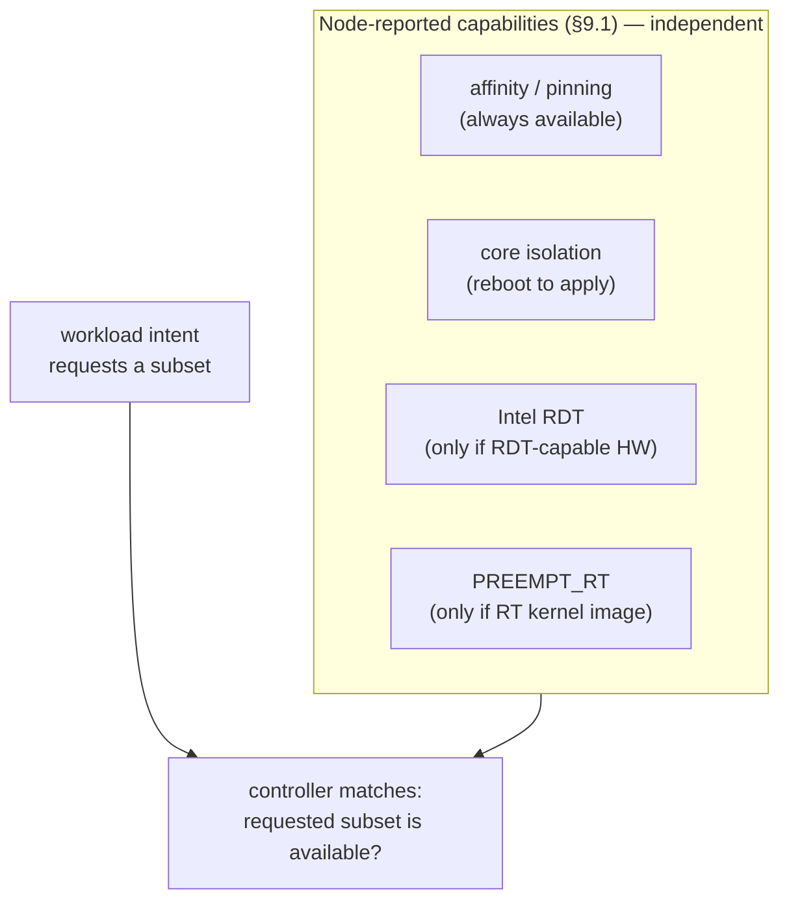

---

## 5. Architecture

The system is best read as a few small views rather than one dense diagram: a
component map (who owns what) and a flow (how an intent becomes a running, pinned VM).

### 5.1 Component Map

Placement lives entirely on the device, inside `domainmgr`. The controller supplies
*intent* and receives *reports*; it never computes concrete core numbers. `domainmgr`
owns three cooperating pieces — topology discovery, the allocator, and per-workload
policy — and drives the hypervisor backend appropriate to the variant.

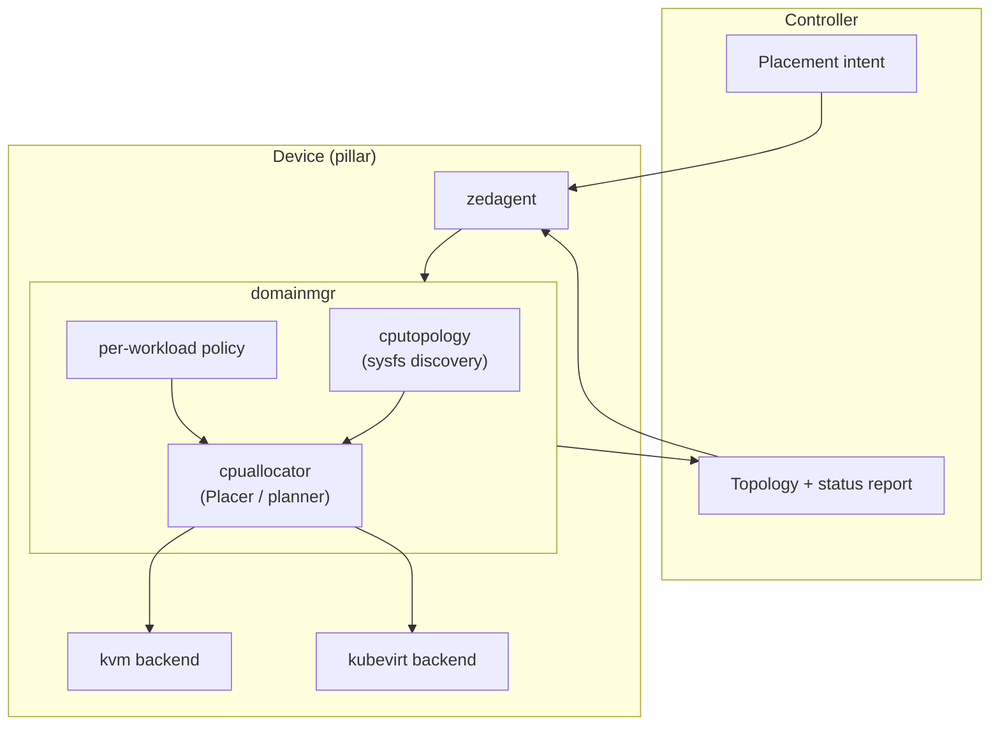

### 5.2 Intent → Placement → Enforcement

The controller's intent flows to `domainmgr`, which asks the allocator for a concrete
assignment (ordered host CPUs for the vCPUs, the guest topology to advertise, and the
set for emulator/IO threads), then hands that to the hypervisor backend to realize.

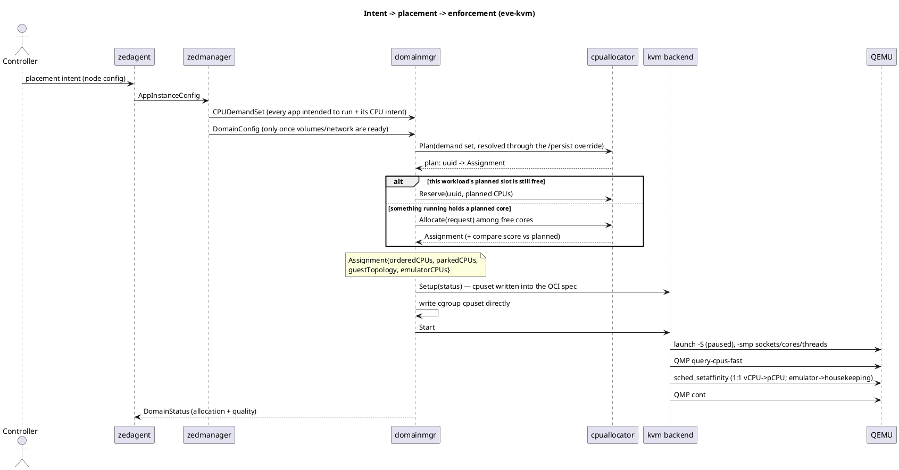

---

## 6. Topology Discovery

The device builds the topology model itself, in pure Go, from the Linux sysfs
interface — with no external tool and no CGO dependency. This keeps discovery portable
across the device classes EVE supports (many of which do not ship a topology library)
and avoids a native dependency that has proven fragile on client/non-server SKUs.

**Sources read** (under `/sys/devices/system`):

- `cpu/online` — the set of online logical CPUs.
- `cpu/cpuN/topology/physical_package_id` — socket.
- `cpu/cpuN/topology/core_id` — physical core within the socket.
- `node/nodeN/cpulist` — NUMA node membership.
- `cpu/cpuN/cache/indexN/{level,id}` — cache-domain identity (L3 for the placement model;
  the reporting path reads every level, §9.1).

**Grouping.** Logical CPUs sharing `(socket, core_id)` are the SMT siblings of one
physical core (§4.1). The discovery groups logical CPUs into physical cores on this key,
then indexes cores by NUMA node and L3 domain for the allocator. `(socket, core_id)` is
taken as authoritative and is **not** cross-checked against `thread_siblings_list` — the
kernel derives both from the same topology data, so on the hardware this design targets the
check is redundant. It would still be cheap defence-in-depth against a malformed `core_id`
(see the degradation hazard below), and is tracked as a future item (§17). A
`physical_package_id` of `-1` — reported by some hypervisors — is treated as socket 0 so
grouping still succeeds.

**Degradation is all-or-nothing, and it disables the primary mode.** If topology cannot be
read (unexpected sysfs layout, constrained platform), discovery falls back to a flat model —
one thread per core, one node, one domain — so the allocator always has a usable topology and
placement never crashes. Three consequences of that fallback are load-bearing and easy to
misread:

- **It is not graceful partial degradation.** A single logical CPU with a missing, negative,
  or unparsable `core_id` makes the whole sysfs read fail, and the *entire* real topology is
  discarded in favour of the flat model — not just that CPU.
- **Whole-core-SMT becomes unsatisfiable, not merely sub-optimal.** In the flat model every
  core has exactly one sibling, and the whole-core-SMT mode skips any core that does not have
  two, so every whole-core-SMT request returns `Insufficient`. The flat model does not "lose
  locality guarantees" — it removes the Quvia mode entirely. That is the intended trade-off:
  synthesising a plausible-looking SMT topology would produce confidently wrong 1:1 pins,
  which §3 forbids.
- **The fallback is not always signalled.** When sysfs yields no CPU entries at all, the flat
  model is returned with no error, and the caller logs a warning at most; the flat model is
  then used unconditionally. Its size also comes from the Go runtime's CPU count, which
  honours the process affinity mask and cgroup limits, so it can be *smaller* than the true
  host CPU count. A consumer therefore cannot reliably tell a degraded model from a real one.
  Making the degraded model self-identifying is a gap worth closing.

**Two models, not one.** It is worth keeping the *placement* model and the *reporting* model
apart, because they have different extents:

- The **placement** model (`cputopology`) carries sockets, NUMA nodes, L3 domains, physical
  cores and SMT threads. That is everything the allocator needs; it deliberately has no L2,
  no core class and no frequency.
- The **reporting** model (`hardware`, §9.1) is richer. It reads cache domains at every
  level from the cache indices and base/max frequency from `cpu/cpuN/cpufreq/*`, and reports
  both.

**The one model extent still to complete** is **core class (P/E/LP)** — read where the
kernel exposes it (hybrid-CPU PMU directories / `cpu_capacity` / CPUID-derived class),
degrading to "uniform/unknown" otherwise. It is in the API schema but nothing populates it.
**Not yet implemented.** It extends the model additively; neither the sibling/locality logic
nor any Phase-1 behaviour depends on it (§7 obtains P-core scarcity handling as an emergent
constraint instead).

---

## 7. Placement & Allocation

The allocator turns a set of per-workload requests plus the topology into a concrete,
deterministic assignment. It owns all allocation state (which physical cores/threads
are dedicated to which workload) so there is a single source of truth and no
double-allocation across the pinned and shared paths.

**Allocation unit.** For a whole-core workload the unit is a whole physical core: a
core is never split across two *whole-core* workloads. Thread-granular workloads draw
individual logical CPUs (§3).

**Objective (lexicographic, minimize in order):**

1. NUMA nodes spanned — must be 1 under `restricted` / `single-numa-node`.
2. L3 domains spanned.

That is the whole score, and it is computed over the workload's **vCPU** cores only: a
parked sibling (one-per-core, §4.3) is excluded, on the modelling assumption that an idle
thread generates no memory traffic and so contributes nothing to locality cost. That is a
deliberate choice rather than an oversight, and it is worth knowing before extending the
objective.

Two things that look like objectives are deliberately *not* part of it:

- **Core identity is not an objective.** The allocator walks cores in a fixed
  `(socket, core_id)` order and takes the first *n* that satisfy the request, so a given
  input always yields the same output. That is a **deterministic iteration order**, not a
  "lowest index" term in the score — scoring on core identity would make an equally-good
  placement on different cores look worse than it is, and would force exactly the needless
  restarts that the "optimality is judged by the objective value" rule below exists to
  prevent.
- **Fragmentation is not modelled.** The score never inspects the free set, so "prefer
  leaving the largest contiguous free region" is not something the current allocator
  optimises for. On the target hardware (one L3 per socket, uniform 2-thread cores) every
  whole core is interchangeable and there is nothing to fragment; on multi-L3 or hybrid
  parts it would be a real term. Whether to define and add it is an open question (§17),
  and it is coupled to the `degraded` quality value (§9.3), which is unreachable without it.

**Deterministic batch planning.** Placement is computed for the *whole set* of pinned
workloads at once, not greedily per workload as each activates. Requests are ordered by a
total order with three keys:

1. **Constraint tightness** — whole-core-SMT (must have a full 2-thread core) first, then
   one-per-core (any physical core), then shared.
2. **vCPU count, descending** — largest first within a tightness class, which is the
   standard bin-packing heuristic and strictly improves packing.
3. **UUID** — a stable tie-break so the order is total.

Because the input is sorted, the output is independent of activation order. This removes
the boot-order race in which a flexible workload greedily takes the one scarce P-core that
the only-P-capable workload needed. Note that tightness today is derived from the *mode*
alone: a `single-numa-node` request does not sort ahead of an `allow-cross` request of the
same size and mode, even though it is strictly harder to satisfy. Folding the NUMA policy
into the tightness rank is a known refinement. **Not yet implemented.**

**Pre-recorded placement.** The plan is a **pure function** of (topology, EVE reservation,
the set of configured pinned workloads). It is recomputed from scratch on every pinned-app
activation rather than cached: recomputation is cheap, and because the function is
deterministic it yields the identical plan every time, which removes any cache-invalidation
or plan-migration problem. Each workload then *applies* its recorded slot when it happens to
start — including late or staggered starts (EVE's `--start-delay`). Decision (global,
deterministic) is decoupled from execution, so **allocation is order-independent**: planned
slots are disjoint, and there is no allocation race regardless of who starts first.
Independent starts need no sequencing; where a deterministic *sequence* is required — a group
repack — EVE restarts the set in a fixed, delay-honoring order (§11.2), but that is for
reproducibility and delayed-start handling, not to avoid an allocation race. The plan is
derived state: it is recomputed identically each boot from persisted inputs (the app configs
and the pinning policy) and is never persisted or sent to the controller.

The plan is also mirrored to `/run/domainmgr/cpuplan.json`. That file is **diagnostics
only** — nothing reads it back, and deleting it changes no behaviour. It exists so an
operator can see what the device decided and why a workload is where it is.

Two limits of the plan are worth stating precisely, because both narrow the
order-independence claim:

- **A planned slot is fenced against other *dedicated* allocations, not against shared
  work.** A workload that is configured but not yet started has its cores held in the plan,
  so no other pinned workload can take them — but those cores are still in the free set, so
  they appear in every non-pinned workload's cpuset and in the emulator pool. A
  delayed-start workload's cores can be carrying best-effort load right up to the moment it
  starts.
- **Workloads whose intent does not resolve are silently dropped from the plan.** A workload
  with a malformed policy or an invalid vCPU count is excluded from the planning input, and
  its failure surfaces only when that workload itself activates. This is the right global
  behaviour — one bad config must not fail planning for everyone — but it means the plan can
  be computed against a smaller set than "every configured pinned workload", which weakens
  order-independence in exactly the window where a config is being fixed.

**Invariants.**

- The EVE-reserved low cores (`eve_max_vcpus`) are never handed to a pinned workload;
  they back EVE's own housekeeping.
- The housekeeping set (all cores minus the dedicated set) is never empty. Today this holds
  only *by construction of the normal boot path* — the reserved-core count defaults to 1 on
  every error path, and the free set always includes the reserved range — rather than by an
  enforced check. Nothing validates that the reserved count is at least 1, and nothing
  asserts a non-empty free set after an allocation, so a misconfigured `eve_max_vcpus=0` or a
  hand-edited persisted status could still strand EVE. **Not yet implemented.**
- Cores reseeded from persisted status at startup are trusted as-is: the reseed path does
  not reject CPUs in the EVE-reserved range, CPUs already held by another workload, or CPUs
  absent from the topology. A stale or corrupted persisted status can therefore hand EVE's
  housekeeping cores to a workload with no error. Validating the reseed is part of enforcing
  the invariant above. **Not yet implemented.**

**Optimality is judged by the objective *value*, not by core identity.** The objective is
a score, not a specific set of cores — many assignments share the best score (any whole
core in the target L3/NUMA domain is interchangeable). So when a new workload arrives and
the first-computed candidate indices are already occupied, the allocator does **not** flag
a problem as long as some *free* cores yield the **same objective value**: that placement
is optimal, just on different indices. The fixed iteration order only picks a canonical
winner among equal-scoring solutions for reproducibility; it is not a placement
requirement. Consequently `needs-repack` is raised **only** when the best placement
achievable from currently-free cores is **strictly worse** (by objective) than what a
repack of running workloads would achieve; if a free-core placement ties the repacked
optimum, the workload is placed non-disruptively and reported `optimal`. This keeps
incremental deployment from forcing needless app restarts.

**Typed failure, never silent mis-placement.** An unsatisfiable request yields a typed
status — `NeedsRebalance` vs. `Insufficient` — which propagates to status; the workload
does not boot mis-placed. The two are narrower in practice than their names suggest:

- **`NeedsRebalance`** is raised in exactly one situation: a NUMA-local request (`restricted`
  / `single-numa-node`) that cannot be satisfied from the free cores of any single node. It
  is the allocator saying "the NUMA constraint cannot be met from what is free", which
  *implies* a repack might help but is not a general "a repack would help" verdict.
- **`Insufficient`** means no arrangement of free resources fits at all — too few cores, or
  too few cores of the required shape (e.g. no 2-thread cores for whole-core-SMT).

Both currently abort activation. The design intends `NeedsRebalance` on a fail-open workload
to be advisory — start it on a worse placement and report the compromise — rather than
fatal; see §18.3. **Not yet implemented.**

---

## 8. Enforcement (eve-kvm)

### 8.1 Soft Isolation — Guest Topology + Pinning

Realizing a placement on QEMU/KVM has four parts:

1. **Truthful guest topology.** The guest is launched with `-smp
   <N>,sockets=<S>,cores=<C>,threads=<T>` computed from the assignment, so in-guest
   software (e.g. VPP) sees the real SMT structure and can place its own workers on
   non-sibling cores. This is truthful **within one socket**, which is the whole of the
   Quvia case: the allocator always reports `sockets=1`, and no `-numa` is emitted. Under
   the default `best-effort` NUMA policy the allocator *will* span nodes when one node
   cannot fit the request, and the guest is then told it has a single socket while its vCPUs
   straddle two host NUMA nodes — which would mislead VPP's worker placement in precisely
   the way §1 exists to prevent. Either the guest `-numa` topology must be emitted for a
   spanning assignment, or a topology-aware request must refuse to span. **Not yet
   implemented.** The mitigation available today is `numa_policy = single-numa-node`, which
   fails closed instead of spanning.
2. **Strict 1:1 pinning.** QEMU is launched paused (`-S`); the vCPU threads exist but
   the guest has not executed, so there is no pre-pin race. `query-cpus-fast` over QMP
   maps each vCPU to its host thread id, and each vCPU is pinned 1:1 to its assigned host
   CPU via `sched_setaffinity` with a single-CPU mask. A vCPU-count mismatch between QMP and
   the assignment is fatal — the VM is not released. The guest is then released with `cont`.
3. **Emulator / IO thread placement.** Under `io_placement = housekeeping`, all non-vCPU
   QEMU threads (emulator, IO) are pinned off the hot cores onto the housekeeping set, so
   disk and device emulation cannot steal cycles from poll-mode vCPUs. Under `dedicated`
   (the default), they remain within the workload's cpuset and no per-thread emulator
   pinning happens at all. This per-thread pinning is a one-shot sweep at launch and is
   best-effort; threads QEMU spawns later are not individually re-pinned, but the cgroup
   cpuset (part 4) still confines them.
4. **cgroup cpuset.** The workload's cpuset (cgroup v1 today) confines it to its cores;
   non-pinned workloads and EVE housekeeping are confined to the housekeeping set.

**Two mechanisms, and what each actually guarantees.** The cpuset and the per-thread
affinity are independent, and it matters which one carries the guarantee in each mode:

- Under `io_placement = dedicated`, the cpuset *is* the workload's dedicated core set, so
  both mechanisms confine the vCPUs to the same cores and either alone would suffice.
- Under `io_placement = housekeeping`, the cpuset is deliberately **widened** to
  `dedicated ∪ housekeeping`, because the emulator threads have to be able to reach the
  housekeeping pool and a cgroup cpuset applies to every thread in the cgroup. In that mode
  confinement of the *vCPU* threads to their dedicated cores rests **entirely** on
  `sched_setaffinity`. If per-thread pinning were ever skipped or reset, the vCPUs would be
  free to roam the housekeeping pool. This is a real property of the design, not an
  implementation detail: `housekeeping` trades a belt-and-braces guarantee for emulator
  offload.

**Ordering, and why the cpuset is written twice.** The cpuset is applied **before** any
thread is pinned, and both before the guest is released. It is applied by two independent
mechanisms: it is written into the OCI runtime spec (`Linux.Resources.CPU.Cpus`) when the
container is created, and it is written directly into the cgroup immediately before the task
is started. The direct write is what guarantees the ordering on the normal path; the
spec-level write is what covers the retry path, which re-renders the spec but does not repeat
the direct write. Removing either one would leave a hole, so both are deliberate.

**The `virtio-blk` iothread is unconditional.** A single `iothread0` object is created for
every KVM VM, pinned or not, and attached to every `virtio-blk-pci` device (not to
`ide-hd`/AHCI or `vhost-scsi-pci`). It keeps disk IO off the QEMU main loop, but it predates
and exceeds this feature — under the default `io_placement = dedicated` it runs *inside* the
VM's dedicated cores, and only `housekeeping` moves it out.

**The legacy pinning path is a different mechanism.** A workload pinned the old way
(`pin_cpu` with no placement policy, §18.2b) is handled by QEMU's `-object thread-context`
rather than by QMP plus `sched_setaffinity`. The two paths are mutually exclusive — the
topology path takes over as soon as the allocator has produced an ordered CPU list — so the
back-compat behaviour is genuinely unchanged rather than re-implemented.

**Guest memory locality.** With vCPUs pinned to one NUMA node, Linux's default first-touch
policy already places most guest RAM on that node, and (where enabled) kernel NUMA
balancing migrates stragglers — so for the single-node case memory locality is largely
automatic and needs no explicit binding. It is not a hard guarantee, though: memory
pre-allocation and emulator-thread touches can land pages off-node, and balancing is
reactive and non-deterministic. When a guarantee is needed — a VM that spans nodes, or one
that pre-allocates or runs with balancing disabled — the memory-backend should be bound to
the chosen host node(s) (`policy=bind`) alongside the guest `-numa` topology. **Not yet
implemented** (the guest memory backend is a bare size today); it is scoped with the `-numa`
work of part 1 and is not part of Phase 1 (§18.1).

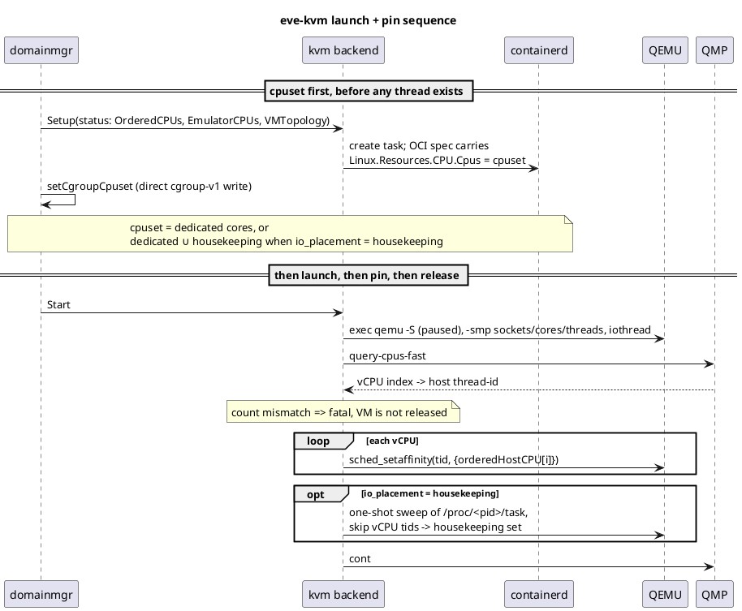

### 8.2 Hard Isolation — Kernel Command Line

Soft isolation keeps *other workloads* off a core, but the kernel still runs local timer
ticks, RCU callbacks, and steered device IRQs on it — residual noise that costs both
throughput and jitter. Shedding it requires `isolcpus` / `nohz_full` / `rcu_nocbs`, which
are **kernel command-line parameters** and therefore reboot-only. These work on the
**stock kernel** — PREEMPT_RT is *not* required here; it is a separate kernel-image concern
for bounded-latency workloads (§4.2), orthogonal to this cmdline-driven isolation.

The isolated set is *derived from the placement plan* — exactly the dedicated cores —
while the EVE-reserved housekeeping range is kept runnable. The mechanism reuses existing
boot plumbing: the reconciler writes the derived cmdline into the EFI variable
`eve-kernel-extra-cmdline`; on the next boot grub reads it and appends it to the kernel
command line. The same reboot that applies the pin plan atomically applies the matching
isolation cmdline, so pin state and kernel isolation never disagree.

The whole hard tier is out of Phase 1 and fails closed today: a request for
`isolation_tier = hard` is rejected with `cpu.isolation.tier_unavailable` and the workload
does not start. The grub half of the plumbing exists; the pillar half does not.
**Not yet implemented.**

> **Implementation hazard — importing the EFI-variable helper will brick a BIOS device.**
> The pillar-side helper for this path already exists (`pkg/pillar/utils/efi/efivar.go`,
> with `Get`/`Set`/`Append`/`Reset`/`DeleteKernelCmdline`) and currently has **zero
> callers**. Its package `init()` opens `/hostfs/sys/firmware/efi/efivars/` and **panics**
> if that fails. Because Go runs `init()` on import, *merely importing that package from
> anywhere reachable in `zedbox`* would make the entire pillar monolith fail to start on any
> BIOS/legacy-boot or otherwise non-EFI device — every agent, not just the CPU-placement
> code. Whoever wires up the hard tier must first change that `init()` to record the error
> and fail at call time (returning a typed "no efivarfs on this node" error that the tier can
> report as `cpu.isolation.tier_unavailable`), rather than panicking at import.

**A potential throughput lever for Quvia, not only a latency feature.** Quvia has not
asked for hard isolation, but it may still help their *throughput*. Their headline
comparison is against ESXi, and we do not know what ESXi does under the hood — it may
already shield the datapath cores from host/kernel noise in a way soft isolation does
not. Hard isolation is therefore worth evaluating as a throughput contributor for the
Grid router, independent of the latency-determinism use case (§17).

**Two isolation sources — derived or static.** The isolated pool can be established in
either of two ways, selected per node:

- **eve-managed (derive + reboot).** EVE derives the isolated set from the placement plan,
  writes it to the EFI variable, and reboots to apply. Best when the isolated capacity
  should track the actual pinned workloads.
- **static (operator-provisioned pool).** The operator predefines the isolated pool once
  via a static kernel command line. EVE then *detects* the effective isolated set (from
  `/sys/devices/system/cpu/isolated` and `/proc/cmdline`) and schedules RT workloads into
  it, with **no further reboot** for placement. If demand exceeds the static pool, EVE
  fails closed (reports insufficient) rather than silently rebooting. This is the
  provision-once, schedule-many model and it avoids reboot churn.
  **Not yet implemented** — and it is closer than it looks. The *detection* half is already
  done: the effective isolated / `nohz_full` / `rcu_nocbs` sets are read from the running
  kernel and reported as `NodeCapabilities` (§9.1). What is missing is the *consumption*
  half: the allocator does not read those sets, and the admission check rejects
  `isolation_tier = hard` unconditionally instead of asking whether the running kernel
  already isolates the cores this workload would get. This is the cheap, reboot-free half of
  the hard tier and it needs no EFI-variable machinery at all.

The static source also lets the operator pass **extra kernel parameters EVE does not
model** (e.g. `idle=poll`, `intel_pstate=disable`, bespoke `nohz_full`/`rcu_nocbs`
tuning); EVE's EFI-variable mechanism only ever appends the parameters it manages and
leaves the rest intact.

**Precedence / merge (open).** grub appends the EFI-variable extra *after* the static base
command line, so for last-wins parameters (`isolcpus`, `nohz_full`, `rcu_nocbs`) an
EVE-derived value would silently override an operator's static one. The strategy when both
exist is not yet settled:

- **Mode-gated (leaning).** Treat the two sources as mutually exclusive: in eve-managed
  mode EVE owns these parameters and the operator must not set them statically; in static
  mode EVE never writes them. Predictable, no merging — auto-detect static mode when a
  static `isolcpus` is present.
- **Merge / union.** EVE reads the static `isolcpus`, unions it with the derived set, and
  writes the union — flexible but can over-isolate and is surprising.
- **Static-wins.** EVE detects a static `isolcpus` and declines to override it.

In every mode the invariant holds: the EVE-reserved housekeeping range is never isolated,
so the device stays manageable.

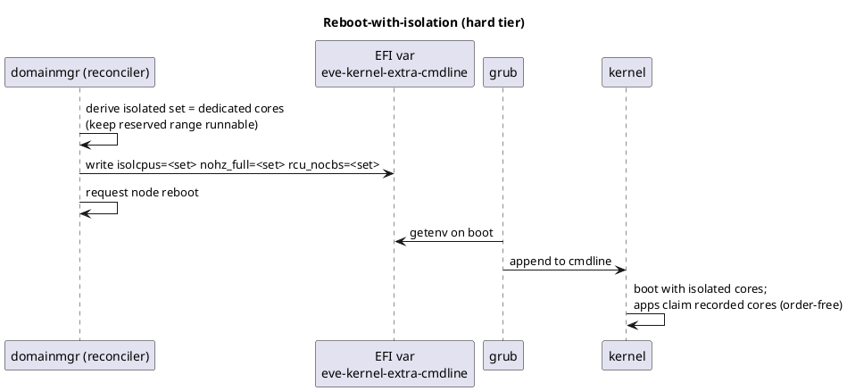

---

## 9. EVE ↔ Controller Interface

### 9.1 Capability & Topology Reporting

A node advertises what it can do through **three** reports, and a consumer needs all three
— they answer different questions, change on different schedules, and fail differently:

| Report | Question it answers | Message | Cadence |
|---|---|---|---|
| **Hardware / kernel facts** | what the silicon and running kernel provide (topology, RDT, current isolation) | `ZInfoHardware` → `HardwareInventory` | static, cached at startup |
| **EVE-software ability** | does *this EVE build* understand and implement the feature | `ZInfoDevice.api_capability`, `ZInfoDevice.optional_capabilities` | per EVE version |
| **Current node state** | what is allocated vs. free right now | `ZInfoDevice` (pool utilization, §9.3) | change-driven + periodic |

The rest of this section covers the hardware report; the software-ability channel is
detailed in "Two capability channels" below, and node state in §9.3. The decision procedure
that combines them is §10.2.

The hardware report extends the existing inventory message (`ZInfoHardware` →
`HardwareInventory` → `CPUInfo`), which today carries only a flat list of logical CPUs
(`{Model, Vendor, Id, Freq}`).

**Reporting model — why topology belongs here.** All EVE reporting is
**device-initiated**: the controller never opens a connection to the device — the device
pulls config from it and **pushes** info and metrics messages up to it on its own
schedule. The hardware inventory is computed **once at startup, before any config is
applied**, cached for the life of the process, and re-emitted (never recomputed) on
device-side resync events — re-registration / device-UUID change, config bootstrap, and
LOC push (the LOC destination being timer-driven by nature) — with a deferred-retry queue
when the controller is unreachable. It has no periodic cadence to the controller and no
"hardware changed" event. (See `pkg/pillar/docs/zedagent.md` —
the `hardwareInfoTask` entry and the startup-ordering note that inventory is collected
before config is applied.) CPU topology is exactly this kind of data: static hardware
truth that does not change under the device's feet, so it fits the inventory model
cheaply. Topology is treated as static — EVE does not do CPU hotplug or offlining
(§17) — so the cache-once model is not a limitation.

**What we add.** The structured topology — sockets, NUMA nodes, cache domains (L2/L3),
physical cores + SMT siblings, core class (P/E/LP), real base/max frequency — plus two
capability blocks kept deliberately separate:

- **CPU-silicon facts** (`CPUCapabilities` on `CPUInfo`): RDT cache / memory-bandwidth
  allocation support (`rdt_l3_cat`, `rdt_mba`, `num_clos`). These are properties of the
  processor itself.
- **Running-kernel facts** (`NodeCapabilities` on `HardwareInventory`): the currently
  effective isolated sets (`isolcpus`, `nohz_full`, `rcu_nocbs`). These are node — not CPU —
  properties, and they describe only what the kernel *is doing*, not what EVE can do about
  it (that is the software channel below).

**Granular facts, derived tiers.** The node reports low-level ingredients, never a
precomputed "isolation tier": a tier is a *combination* of lower-level properties, the
recipe can evolve (future ingredients: hugepages, IRQ steering, preemption model), and
the achievable tier legitimately differs per workload *type* on the same node (e.g.
containers soft-only while VMs can do soft+hard). The controller (UI gating) and the
device (admission backstop) each derive tier availability from the ingredients.
`IsolationTier` therefore exists only as *workload intent* vocabulary in the config API
(§9.2), not in the capability report.

Realizing this meant a **producer** change and not only a schema change: the inventory path
originally emitted one entry per *physical core* and left frequency unset, and now enumerates
*logical* CPUs with their coordinates and their base/max frequency, plus the cache domains.
Three parts of the report are still unpopulated and should not be read as live data:
**core class** is never set (nothing discovers it, §6); **L1D/L1I cache domains** are read
but not emitted, so `caches` carries L2 and L3 only; and the legacy scalar `CPU.freq` is left
unset in favour of the explicit base/max pair. **Not yet implemented.**

Two smaller shape notes. `CPU.l2_id` is in the schema but deliberately left unset — the
`CacheDomain.cpu_ids` linkage already expresses which cores share which L2, and duplicating
it in a scalar invites the two to disagree. And `CPU.numa_node` is an unsigned scalar while
`PCIDevice.numa_node` is optional-signed, so a *CPU* cannot express "no NUMA affinity
reported" the way a PCI device can; on a node with no NUMA information every CPU reads as
node 0.

**Two independent topology discoveries.** The reporting path runs its own sysfs discovery,
separate from the one `domainmgr` runs for placement (§6). They can in principle disagree,
and the reporting path's own fallback is *worse* than the placement path's: where placement
degrades to a flat model of real logical CPUs, the inventory fallback enumerates physical
cores with all coordinates zero and an `Id` that is a core id rather than a schedulable CPU
id. Vendor and model strings are also taken from the first processor only, which is wrong on
a mixed-socket box. Consolidating on a single discovery is the obvious fix.

**What deliberately does NOT go here.** Dynamic state — current per-workload allocation
and the "degraded / needs-reboot" optimality signal — must not ride on the inventory
message: its content is cached and it is only re-sent on resync. That state belongs on
change-driven messages — node-level state on device info (`ZInfoDevice`, published
on-change and periodically) and per-workload state on per-app info (`ZiApp`,
event-driven). See §9.3 and §11.

**PCI / device topology (forward-looking).** The inventory already reports PCI devices
with their bus address, parent-bridge address, IOMMU group, and vendor/device/class
(`PCIDevice`, populated by `getPCIDevices` via ghw), which models the PCI bus tree and
passthrough groups. It does **not** report each device's **NUMA/cache affinity** — its
`numa_node` and local CPU set. That affinity is what two later capabilities need:
NUMA-local placement of a VM relative to its passthrough NIC / SR-IOV VF, and
**RDT-for-I/O (DDIO)** — bounding the L3 / memory bandwidth a device's DMA consumes,
i.e. cache allocation for a *non-CPU* resource. The extension is small and reuses the
coordinate system above: add `numa_node` (and optionally `local_cpu_ids`) to
`PCIDevice`, so a device cross-references the same NUMA nodes and `CacheDomain`s as the
CPU report (source: sysfs `/sys/bus/pci/devices/<addr>/{numa_node,local_cpulist}`). This
is not an immediate requirement — it is called out so the report is shaped to accept it
additively later, and it mirrors how hwloc/Margo attach I/O to the NUMA/cache hierarchy.

**Decision:** the schema follows **Option A** — extend `CPU` with per-logical-CPU
coordinates and add structured `caches` (with `cpu_ids` linkage) and a CPU-silicon
`capabilities` block to `CPUInfo`; kernel/boot isolation facts go to a separate
`NodeCapabilities` on `HardwareInventory`; PCI affinity extends `PCIDevice` in the same
coordinate system when needed. (Alternatives considered and rejected: `Misc`-map blob, a
duplicated nested tree, reusing the `BusParent` hierarchy, and reporting precomputed
isolation tiers / scheduling policies as capabilities.)

#### Two capability channels: hardware facts vs. EVE-software ability

"Capability" means two different things here. They change on different schedules and they
**fail differently**, so they travel in separate channels and a consumer must consult
**both**:

| Channel | Answers | Where | If absent |
|---|---|---|---|
| **Hardware / kernel facts** | what the silicon and the *running kernel* provide: topology, RDT presence, which CPUs are already isolated (`isolcpus` / `nohz_full` / `rcu_nocbs`) | HwInventory — `CPUInfo.cpus` coordinates, `CPUInfo.caches`, `CPUInfo.capabilities`, `HardwareInventory.node_capabilities` | **not fixable on this node** — the hardware/kernel cannot do it |
| **EVE-software ability** | what *this EVE build* understands and implements: does it parse the placement fields at all; can it manage the isolation kernel cmdline itself | `ZInfoDevice.api_capability` (monotonic, version-like) and `ZInfoDevice.optional_capabilities` (flavor/build booleans) | **fixable by updating EVE** |

The hardware inventory reports **facts only** — it never claims what EVE can do with them.
That keeps a hardware fact from changing meaning when EVE gains or loses a feature, and it
follows a convention eve-api already uses elsewhere: a controller checks `api_capability`
before sending a field an older EVE would silently ignore. Consumers derive the
higher-level question — "is the hard isolation tier achievable for this workload on this
node?" — from these ingredients rather than the node precomputing a verdict, so new
ingredients stay additive.

**For the UI this is two gates, not one** (§18.4): offer a control only when the node is
hardware-capable **and** software-capable, and distinguish the two in what the user is told
("this hardware cannot do it" vs. "update EVE to enable it").

> **The software channel is not live yet.** `api_capability` is a single monotonic scalar
> and the device still reports the previous value, so `CPU_PLACEMENT_POLICY` is never
> advertised on any device, and `optional_capabilities.managed_cpu_isolation` is never
> assigned (it reaches the controller as proto3's default `false`, which happens to be the
> correct Phase-1 value). Until the capability value is bumped, a controller correctly
> implementing Gate 1 of §10.2 will never offer any of these controls, on any device —
> everything in §10 is downstream of this one constant. Because the field is monotonic and
> the new value is the immediate successor of the current one, advertising it also implies
> everything below it, which is the intended semantics. **Not yet implemented.**

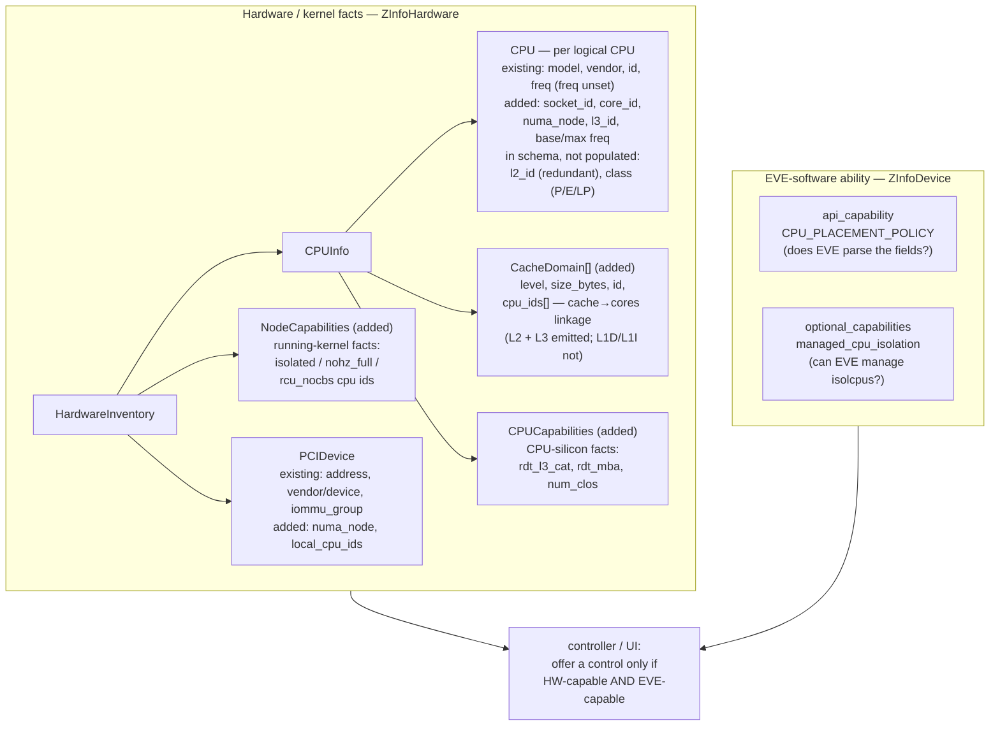

### 9.2 Placement Intent (eve-api node config)

The controller expresses *what a workload needs*, never *which cores* it gets. Intent
lives at two levels.

**Intent is a policy, not just a CPU count.** This is the crux of the contract, so it is
worth stating plainly: the controller does **not** merely send "give this workload N CPUs".
A vCPU count alone cannot express any of the guarantees this design exists to provide —
whether the workload may share a physical core with another workload, whether it wants both
SMT threads or one per core, how strictly it must stay NUMA-local, where emulator/IO threads
go, or how strongly its cores must be shielded. Those are **workload properties only the
application owner knows**, so they must travel with the workload's configuration. The device
then chooses concrete cores to satisfy that policy (§7).

**Per-workload intent** attaches to the workload's configuration (`VmConfig`, reached per-app
via `AppInstanceConfig.fixedresources`) and uses the Kubernetes-aligned vocabulary of §4.3:

| Intent field | Expresses | Values |
|---|---|---|
| `cpu_policy` | pin or share | `shared` \| `dedicated` |
| `full_pcpus_only` | whole physical cores (no other workload on my SMT siblings) | bool |
| `threads_per_core` | use both siblings as vCPUs, or one per core | `2` \| `1` |
| `numa_policy` | how strictly to stay NUMA-local | `none` \| `best-effort` \| `restricted` \| `single-numa-node` |
| `io_placement` | where emulator/IO threads run | `dedicated` \| `housekeeping` |
| `isolation_tier` | how strongly to shield the cores | `none` \| `soft` \| `hard` |
| `disruption_policy` | protect from collateral node disruption | `allow` \| `protect` |

(`vcpus` remains the existing count field; the policy above is what makes the count
meaningful — e.g. with `threads_per_core=2`, N vCPUs consume N/2 physical cores.)

From these the device derives the mode (whole-core-SMT / one-per-core / shared) and the
placement request; concrete core selection is the device's job (§7). Some constraints are
validated controller-side at deploy time — e.g. rejecting an odd vCPU count for
whole-core-SMT — with the device keeping a defensive backstop (§14). Before offering or
sending these fields the controller applies the two capability gates of §9.1.

**`numa_policy` has four names but three behaviours.** `restricted` and `single-numa-node`
both resolve to the same allocator policy today — fit the request inside one NUMA node or
fail. Kubernetes distinguishes them (`restricted` minimises the nodes spanned across *all*
resource types and admits only an aligned pod; `single-numa-node` demands exactly one), but
for a CPU-only request with no device or memory alignment to reconcile the distinction has
no content, so the device collapses them deliberately. The doc states the collapse rather
than implying four strictness levels; whether they should ever diverge is an open question
(§17). Two fields are accepted and then dropped: `isolation_tier = hard` is rejected
outright (§8.2), and `disruption_policy` is parsed and stored but has no consumer (§11.3).

**Node-level intent** governs the isolated pool for the hard tier: the isolation
**source** (eve-managed vs static — §8.2) and, in static mode, the predefined pool. This
is where capacity for latency-sensitive workloads is provisioned.

**Posture lives in the intent, not the platform.** Whether an unmet requirement fails
closed (refuse to start) or fails open (start degraded and report it) is carried by the
request — a hard requirement (`isolated` + real-time) is fail-closed; a soft preference
is fail-open. This is the single most important alignment lever between eve-kvm and
eve-k: because posture travels in the intent, both variants admit and reject identically
(§11), and the platform never invents a default. The device honours the fail-closed half
strictly: an intent it cannot satisfy is rejected rather than silently downgraded, and no
workload ever boots onto a placement weaker than the one it asked for. The fail-open half is
where the implementation is still short — today *every* placement failure is fatal, so a
workload that could legitimately run on a worse placement is refused instead (§18.3).

**Unknown enum values are treated as unspecified.** The device's config parser maps any
enum value it does not recognise — a `numa_policy`, `io_placement`, or `isolation_tier`
introduced by a newer controller — to "unspecified", and then applies the defaults of §4.3.
This is conventional forward-compatible enum handling, but note the direction: it is the
*device* ignoring what the *controller* sent, which for a stricter-than-known value is
exactly the silent downgrade the paragraph above forbids. The thing that is supposed to make
this safe is the `api_capability` gate (§9.1): a controller must not send placement fields
to a device that has not advertised the matching capability, so a device should never see a
value from a vocabulary it predates. That gate is not populated yet, so the protection is
currently notional — see §16 and the open question in §17.

**Device-local resolution is an implementation detail — with one caveat.** How the device
stores and applies the resolved policy is not part of the controller contract; only the
intent vocabulary and its semantics are. The device does keep an operator-editable override
at `/persist/pinning/config.json`, in the Kubernetes-flavoured `none`/`static` spelling of
§4.3, so a device with no policy-aware controller can still be driven by hand for bring-up
and testing. Three properties of it are worth knowing, because it is a real operational
surface rather than pure internals:

- **It is auto-seeded.** An entry is created for every pinned VM on activation, with
  `cpu_policy: static` and deliberately no `full-pcpus-only`. Existing entries are never
  overwritten, and nothing garbage-collects entries for apps that have been deleted.
- **It only applies when the controller sent no `cpu_policy` at all.** The controller's
  intent is authoritative whenever it expressed one.
- **The "sent nothing" test is `cpu_policy` alone.** A controller that sets `numa_policy`,
  `io_placement`, or `threads_per_core` but leaves `cpu_policy` unset has all of those
  fields discarded in favour of the local file. That is a partial-intent hole in the
  "controller is authoritative" rule: the test should consider the whole placement message,
  not one field of it. **Not yet implemented.**

### 9.3 Allocation Status & Optimality Signal

The device reports two kinds of state back, on the change-driven messages identified in
§9.1 — never on the static hardware inventory.

**Current allocation (advisory).** Per workload, the device reports *that* it is placed
and the *quality* of that placement — not the concrete host-CPU numbers, which stay
device-side (the controller expresses intent, not core ids; §2). This rides on per-app
info (`ZiApp`), already published on app-status change.

**Two axes, not one.** Placement *quality* describes a workload that is running; a placement
*failure* is an error code and belongs on the error channel (§18.3). Keeping them apart
matters, because `insufficient` is a failure — the workload never ran — and modelling it as
a quality value would suggest there is something running whose quality is bad.

**Optimality / placement-quality signal.** The quality enum captures the states a *running*
workload can be in:

- `optimal` — placed at the best achievable objective, on whatever equivalent cores;
  core-index identity does not matter (§7). Occupied "ideal" indices are not a problem if a
  free-core placement ties the objective.
- `needs-repack` — the best *non-disruptive* placement is strictly worse (by objective)
  than what moving other workloads would achieve; a repack (app restart) would improve it —
  see §11.
- `unspecified` — quality was not evaluated, which is the case for any workload that is not
  whole-core pinned.

Two further values are specified but not reachable today:

- `degraded` — placed and running, but sub-optimal in a way that does not warrant a repack
  (e.g. fragmented, or not the best packing). It is unreachable **by construction**: the
  objective has only NUMA and L3 terms, so any placement that is not `needs-repack` ties the
  optimum exactly and is reported `optimal`. `degraded` and the fragmentation objective
  stand or fall together (§7, §17). **Not yet implemented.**
- `needs-reboot` — the requested isolation tier needs a kernel-cmdline change, thus a
  reboot; see §11. It belongs to the hard tier, which is out of Phase 1 (§8.2, §18.1).
  **Not yet implemented.**

These map from the allocator's internal typed statuses (§7): `NeedsRebalance` →
`needs-repack`; `Insufficient` → the `cpu.placement.insufficient` error code rather than a
quality value.

**The device names the affected workloads; the controller never has to work them out.**
Because the device owns the plan, it knows exactly which workloads' recorded placement would
change in a repack. Each such workload is flagged individually with `needs-repack` on its own
per-app info, so "the affected set" is simply the set of apps carrying that flag — the
controller reads it, it does not compute it (§11.2).

> **The quality signal has no exit path yet.** The device computes placement quality
> correctly and records it on the domain's status, where an operator can see it in the
> device's own pubsub state and in `/run/domainmgr/cpuplan.json` — but nothing forwards it to
> the app-instance status, so it never becomes an `ErrorInfo` and never reaches `ZiApp`. The
> controller therefore cannot distinguish "running optimally" from "running, but a repack
> would help", which is the input every downstream decision depends on: the §10.4 messages,
> the §10.5 day-two question, and the §11.2 repack trigger all have no data without it. It is
> a controller-visibility gap, not a device-blindness gap. A related detail to fix at the
> same time: releasing a workload's CPUs clears its assignment but not its recorded quality,
> so a stale value would be published the moment the signal is wired up. **Not yet
> implemented.**

**Which message carries which signal.** The signals are split by scope, following the
cadence rules of §9.1:

| Signal | Scope | Message |
|---|---|---|
| `optimal` / `degraded` / `needs-repack` / `insufficient`, and the structured error code | per workload | per-app info (`ZiApp`) — `State` + `AppErr[].error_code`, event-driven on app-status change |
| `needs-reboot` (isolation tier needs a kernel-cmdline change) | node | device info (`ZInfoDevice`) — a node-level condition, since one reboot serves all affected workloads. Also reflected per-app so the user sees which workloads are waiting on it |
| CPU pool state — dedicated / housekeeping / isolated split, **and per pool: total, allocated, free** | node | device info (`ZInfoDevice`), on-change and periodic |
| hardware topology + capability | node, static | HwInventory (`ZInfoHardware`) — §9.1 |

**Pool utilization must be explicit.** "Which CPUs are allocated versus still free" is a
question the user asks constantly — before deploying a workload ("will it fit?"), when a
deploy fails `insufficient` ("why not?"), and when sizing an isolated pool. Reporting only
the partition boundaries would leave the UI to infer utilization by summing per-app
allocations, which is fragile. So the node-level report carries, **per pool**
(housekeeping / dedicated / isolated): its CPU set, the total core count, how much is
currently allocated, and how much is free — with whole-core-vs-thread granularity noted,
since a partially used physical core is not available to a `full_pcpus_only` workload. The
UI renders this as the node's CPU map; the controller uses it for pre-flight feasibility.
Concrete core *identities* remain device-owned in the intent direction (§2) — reporting them
for observability is not the same as the controller choosing them.

> **The pool report has no producer yet.** `ZInfoDevice.cpu_pools` and its
> `CPUPoolUtilization` message exist in the API — including `free_whole_cores`, which is
> exactly the punchline of the worked example below — but nothing on the device populates
> them. Without it there is no pre-flight "will it fit?", no node CPU map, and no way to turn
> an `insufficient` failure into an actionable message. The data is largely computed already
> for the diagnostic `/run/domainmgr/cpuplan.json` (§7), so what is missing is a projection
> onto the proto plus a pubsub hop to `zedagent`. **Not yet implemented.**

**Worked example.** Take an 8-logical-CPU node (4 physical cores, SMT on), with CPU 0
reserved for EVE housekeeping, and two workloads already running: app **A** holding one whole
core (`full_pcpus_only`, `threads_per_core=2` → CPUs 2,3) and app **B** holding a single
thread (thread-granular, no `full_pcpus_only` → CPU 4).

```text
core0 [cpu0 cpu1]   cpu0 = EVE reserved      cpu1 = free (thread)
core1 [cpu2 cpu3]   app A  (whole core, both threads)
core2 [cpu4 cpu5]   app B  (cpu4)            cpu5 = free (thread)
core3 [cpu6 cpu7]   free (whole core)

reported for the "dedicated-capable" pool:
  total:      4 physical cores / 8 threads
  allocated:  app A = 1 whole core; app B = 1 thread
  free:       3 threads (cpu1, cpu5, cpu7... ) BUT only 1 whole core (core3)
```

That last line is the whole point of reporting granularity. A naive "3 threads free" would
suggest a 2-vCPU whole-core-SMT workload fits — it does not: `cpu1` and `cpu5` sit on cores
already partly owned (by EVE and by app B), so the only core that can be handed out whole is
**core3**. Same node, two different correct answers depending on the request:

- a 2-vCPU **whole-core-SMT** request → fits exactly once (core3), then the pool is full;
- a 2-vCPU **thread-granular** request → fits using `cpu5` and `cpu7`, and leaves core3
  half-consumed, which *removes* the last whole-core slot.

So the report must let the controller answer "will it fit?" **per request shape**, which is
why it carries the per-pool CPU set (so whole-core availability is computable) and not just a
free count. It is also why the second request above is worth a UI warning: a thread-granular
workload can quietly consume the node's last whole core.

---

## 10. From the User's Perspective

Everything so far describes the mechanism. This chapter states the same design as the
person using it experiences it: what they see, what they choose, what they are told when
something cannot be done, and what they must decide on day two. It is the contract the
cloud UI implements.

### 10.1 The user's mental model

The user never thinks about host CPU numbers. They answer three questions about *their
workload*:

1. **Does this workload need CPUs of its own?** (shared → dedicated)
2. **If dedicated, how should the cores be shaped?** (whole cores using both SMT threads,
   or one thread per core; how strictly NUMA-local; where IO threads go)
3. **How strongly must it be shielded from everything else?** (isolation tier; later:
   real-time scheduling, cache/bandwidth share)

The platform answers a fourth question for them — *which* physical cores — because that is
a placement problem the device is better positioned to solve (§7). The user's contract is:
**describe the workload, not the machine.**

### 10.2 Deciding what to offer: the gating algorithm

A control is offered only when the node can actually honor it. The controller computes
this per node (or per node-set, for a deployment that could land on several) from the three
reports of §9.1. Presented as pseudo-code because this is the precise logic the cloud must
implement:

```text
# Inputs, all from what the node reported (§9.1):
#   hw   = ZInfoHardware.inventory        -> topology + hardware/kernel facts
#   sw   = ZInfoDevice                    -> api_capability, optional_capabilities
#   pool = ZInfoDevice pool utilization   -> per-pool total/allocated/free (§9.3)

def control_state(control, hw, sw, pool):

    # ---- Gate 1: does this EVE understand the feature at all? -------------
    # Fixable by the user -> say so, do not hide it.
    if not software_supports(control, sw):
        return DISABLED, "Update EVE on this node to enable <control>"

    # ---- Gate 2: can the hardware / kernel do it? ------------------------
    # Not fixable on this node -> explain why, offer node choice instead.
    if not hardware_supports(control, hw):
        return HIDDEN_OR_DISABLED, reason_hw(control, hw)

    # ---- Gate 3: is there room right now? -------------------------------
    # Offerable, but warn before the user commits.
    if not fits_now(control, request, pool):
        return ENABLED_WITH_WARNING, "Not enough free capacity on this node now"

    return ENABLED, None


def software_supports(control, sw):
    if control in CPU_PLACEMENT_CONTROLS:          # policy, cores, NUMA, IO, soft tier
        return sw.api_capability >= CPU_PLACEMENT_POLICY
    if control == HARD_ISOLATION:
        # EVE-managed cmdline OR a statically provisioned pool it can schedule into
        return (sw.optional_capabilities.managed_cpu_isolation
                or hw.node_capabilities.isolated_cpu_ids)
    if control in (REALTIME, RDT_CACHE, RDT_MBA):
        return sw.api_capability >= <future capability value>
    return False


def hardware_supports(control, hw):
    if control == SHARED:              return True
    if control == DEDICATED:           return usable_cores(hw) > 0
    if control == WHOLE_CORE_SMT:      return any(core has 2 SMT siblings)   # (socket, core_id)
    if control == ONE_PER_CORE:        return usable_cores(hw) > 0
    if control == NUMA_SINGLE_NODE:    return numa_node_count(hw) >= 1
    if control == IO_HOUSEKEEPING:     return housekeeping_set(hw) is not empty
    if control == SOFT_ISOLATION:      return True                            # cpuset always
    if control == HARD_ISOLATION:      return hw.node_capabilities.isolated_cpu_ids or kernel_cmdline_settable
    if control == REALTIME:            return preemption_model(hw) is RT      # future ingredient
    if control == RDT_CACHE:           return hw.cpu_info.capabilities.rdt_l3_cat
    if control == RDT_MBA:             return hw.cpu_info.capabilities.rdt_mba
```

Three properties of this algorithm matter for the UX:

- **Never precompute tiers on the device.** The node reports ingredients; the controller
  derives verdicts (§9.1). That is why `hardware_supports` is a function in the cloud, not
  a boolean in the report — the recipe can change without an API change.
- **The two gates produce different messages.** Software-gated means *"update EVE"* (an
  action the user can take); hardware-gated means *"this node cannot"* (a node-selection
  problem). Collapsing both into a greyed-out checkbox is the main UX failure to avoid.
- **Capacity is a warning, not a gate.** A request that does not fit *now* is still a legal
  request; the user may be about to free something, or may accept `insufficient` and fix it.
  Blocking it hides information they need.

Two of the three gates have no data yet. Gate 1 never opens, because the device does not
advertise `api_capability = CPU_PLACEMENT_POLICY` (§9.1) — a controller implementing this
algorithm faithfully will show the controls as "update EVE" on every device in the fleet.
Gate 3 has no input, because pool utilization has no producer (§9.3). Gate 2 works: the
hardware report is populated. **Not yet implemented** for gates 1 and 3.

### 10.3 What the user sets: presets, then knobs

Most users should never open the advanced controls. A small set of **presets** answers the
three questions of §10.1 in one click, and each preset simply pre-fills the individual
knobs, which stay editable:

| Preset | Means | Sets |
|---|---|---|
| **Best-effort** (default) | "I don't care where it runs" | `cpu_policy=shared` |
| **Throughput / dedicated** | "give it uncontended cores" | `dedicated`, `full_pcpus_only`, `threads_per_core=2`, `numa=best-effort`, `io_placement=housekeeping`, `isolation=soft` |
| **Real-time** | "bounded latency" | as above + `isolation=hard` + real-time scheduling (only on a capable node) |

The one knob a user genuinely must understand is **`threads_per_core`** — whether their
workload wants both SMT threads of a core (higher aggregate throughput, the two threads
share one core's engine) or one thread per core with the sibling left idle (maximum
per-thread performance). This is workload knowledge only the application owner has, which
is why it stays exposed rather than being inferred. It also changes what "N cores" means, so
the UI should state the consequence inline: *with both threads, N vCPUs occupy N/2 physical
cores.*

The grouping is fixed now even though later groups are inert, so enabling real-time or RDT
later un-greys a group instead of redesigning the panel (§18.4).

### 10.4 What the user is told when it does not work

Placement failures are reported with a structured code plus human text (§18.3), so the UI
can say something specific and actionable rather than "failed to start":

| What happened | What the user should see | Their next step |
|---|---|---|
| not enough cores of the right kind | "Needs 4 whole cores; 2 free on this node" | free capacity, resize, or pick another node — then start the workload again, since the device does not re-attempt placement (§14, §18.3) |
| a better placement needs moving others | "Can run now, but N apps must restart for the best placement" | choose whether to accept the restart |
| placed, slightly sub-optimal | "Running; placement is not optimal" | usually nothing |
| isolation tier unavailable | "This node cannot provide hard isolation" (hw) / "Update EVE" (sw) | pick a node, or update |
| odd vCPU count with whole-core SMT | rejected at edit time, before deploy | fix the count |

Two rules keep this honest: a **hard requirement never degrades silently** (if the user
asked for isolation and it is not available, the workload does not start — §9.2), and a
**soft preference never blocks** (it starts and reports the compromise). The user, not the
platform, decides which of those they are asking for.

**Partly implemented.** The first row's numbers do reach the user: a refused whole-core
placement publishes "needs N whole physical cores, M free now" in the error's
`retry_condition`, alongside the action needed and the fact that the device will not retry
by itself (§14, §18.3). For a *refused* workload the second row's affected set is also named
— the retry condition lists the workloads holding the CPUs the plan set aside for it. What is
still missing is the same statement for a workload that is *running* sub-optimally: the
quality signal never reaches the controller, and the "running, not optimal" state is
unreachable anyway (§9.3). Of the two rules, the fail-closed half is honoured strictly today
and the fail-open half is not: a placement that could run sub-optimally is refused (§18.3).
The `cpu.isolation.tier_unavailable` and `cpu.policy.odd_vcpu` rows work end-to-end.

### 10.5 Day-two: what the user must decide

The device never disrupts a running workload on its own (§2). So the user (or the
controller acting for them) owns exactly two decisions, and the UI should present them as
such:

- **"A better placement exists — restart these N apps?"** The device names the affected
  apps; the user approves the restart of that set (§11.2). Cost: those apps only.
- **"This change needs a node reboot — proceed?"** Applying or resizing hard isolation
  changes the kernel command line (§8.2). Cost: the whole node. Workloads marked
  *protected* make this an explicit acknowledgement rather than a silent reboot (§11.3).

Everything else — a new workload landing on free cores, an equally-good alternative
placement — happens with no user involvement at all (§7).

Neither decision can be presented today: the device computes the "a better placement exists"
verdict but does not forward it (§9.3), and the reboot path belongs to the hard tier, which
is out of Phase 1 (§8.2). **Not yet implemented.**

---

## 11. Disruption, Consent & Lifecycle

Placement can become sub-optimal after the fact — a new workload arrives, a policy
changes, or the requested isolation tier needs a kernel change. This chapter defines what
happens then. The governing rule (§2) is that **the device never disrupts anything on its
own**: it reports, and the controller decides.

### 11.1 Two triggers, mapped to the tiers

- **Repack = restart (soft tier).** A better placement means moving already-running
  workloads. Because a live re-pin is unsafe (cpuset + 1:1 affinity + guest `-smp` are
  fixed at launch), moving a workload means restarting it. No kernel reboot.
- **Host reconfig = reboot (hard tier).** Changing the isolated pool means changing the
  kernel command line (§8.2), which is reboot-only.

Pre-recorded placement (§7) makes both order-free: after a restart or reboot each workload
simply claims its recorded cores, so there is never a "restart in the right order"
problem.

### 11.2 Controller-decided, device-executed

The device reports `degraded` / `needs-repack` / `needs-reboot` (§9.3) and stops there.
The controller (or an operator via the UI) decides whether the disruption is worth it and
issues an explicit action. Two actions, matching the two triggers.

**Identifying what to restart is the device's job.** The device owns the plan, so it flags
each workload whose recorded placement would change with `needs-repack` on that workload's
own status. The controller restarts exactly the flagged set — it never has to derive
"affected" from topology or placement data it does not hold (§9.3).

- **soft repack (restart the affected set as one atomic group, no node reboot).** A repack
  *permutes* cores among a set of running apps, so it **cannot** be done one app at a time:
  an app being restarted may need cores still held by another affected app, and a cyclic swap
  (A needs B's cores, B needs A's) would deadlock — waiting does not break the cycle. The
  whole affected set therefore restarts with a **release-all-then-start barrier**: *all* of
  them stop (releasing their cores) **before** any starts and claims its new recorded slot
  (§7); unaffected apps keep running. The barrier removes the cyclic-swap problem, so there is
  no dependency order to solve — but EVE still **(re)starts the set in a fixed, deterministic
  order that honors each app's start delay (`--start-delay`)**, so the repack is reproducible
  and delayed-start apps are handled correctly (their reserved cores are held until they
  start). Allocation itself is order-independent (disjoint recorded slots); the start
  *sequence* is fixed. The controller triggers the repack by bumping the existing per-app
  `restart` counter on the whole affected set at once (§11.5); **domainmgr, which owns the
  allocator, enforces the barrier and the ordered restart**. **Not yet implemented** — there
  is no barrier, no group restart and no repack ordering on the device today. It is also
  strictly downstream of the quality signal (§9.3): until `needs-repack` reaches the
  controller, nothing can ever trigger a repack, so that gap must close first.
- **node reboot (reconcile + isolation).** The only path that can also apply kernel
  isolation; the same reboot atomically applies the pin plan and the derived (or static)
  isolation cmdline. Disrupts all workloads; higher latency. Belongs to the hard tier and is
  out of Phase 1 (§8.2, §18.1). **Not yet implemented.**

Device-side autonomous reconcile is out of scope for now (a possible future opt-in); the
device is strictly report-and-execute.

### 11.3 Consent / veto — deferral until acknowledged

Consent is **asynchronous and config-driven**. The device *does* report status upstream —
it pushes info and metrics messages on its own initiative (§9.1) — but the controller
cannot issue a synchronous command; it decides by updating the config the device pulls.
So protection is realized as a **deferral with a report**: each workload carries a
`disruption_policy` (`protect` | `allow`). When a **node-level** disruptive action (a
`reboot`/`shutdown`) would take down a `protect` workload, the device **defers** it and
reports "deferred — awaiting acknowledgement" upstream; to proceed, the controller must
re-issue the action with an explicit **acknowledge/force** flag in config. (A targeted
per-app `restart` needs no deferral — bumping that app's counter is itself the explicit,
scoped decision; `protect` guards against *collateral* node-level disruption.) This reuses the deferral *pattern* that
eve-k's node-drain protocol already establishes — that protocol is eve-k-specific
(standard eve-kvm reboots immediately today), so what carries over is the pattern, not an
existing eve-kvm mechanism. It gives a running real-time workload the guarantee that a
management action will not silently blow it away — the protection the Margo draft's
provision to *"request permission … [so] real-time workloads are not interrupted … without
explicit confirmation"* calls for.

**Not yet implemented.** `disruption_policy` is parsed off the wire and stored on the
workload's policy, and then goes no further: it is not carried into the resolved placement,
there is no deferral logic, and no acknowledge/force flag is checked. Accepting the field and
silently ignoring it is the worst of the three options, because the controller has no way to
learn that the protection is not in force — so until the deferral exists, the device should
either implement it or reject `protect` with `cpu.policy.invalid`.

### 11.4 Admission alignment across variants

The posture carried in the intent (§9.2) makes eve-kvm and eve-k admit and reject
identically:

- **Hard requirement unmet → fail-closed** in both: eve-kvm puts the domain in an error
  state and does not start it; eve-k leaves the pod `Pending` with a condition.
- **Soft preference unmet → fail-open + `degraded`** in both: the workload starts and the
  quality signal reports the compromise. On eve-kvm the fail-open half is the piece that is
  still missing: every placement failure is currently fatal (§18.3), and `degraded` is
  unreachable (§9.3). **Not yet implemented.**

The idioms differ but the semantics do not: on eve-k "suboptimal" surfaces as a
declarative `Pending` + condition rather than a push; repack is never automatic (a
descheduler / the operator acts, respecting PodDisruptionBudgets); reboot is a drain +
upgrade-controller flow; and `disruption_policy: protect` maps to a restrictive PDB. Same
model, native mechanisms (§12).

### 11.5 eve-api surface

Both disruption triggers reuse mechanisms eve-api **already has** — no new node-reset /
reconcile action is required:

- **Soft repack → the existing per-app `restart`** (`AppInstanceConfig.restart`, an
  `InstanceOpsCmd` counter), bumped by the controller on the **whole affected set at once**
  (§9.3 flags which apps). Because a repack permutes cores among that set, **domainmgr
  executes it as a barrier** — stop all flagged apps (release their cores), then (re)start
  them in a fixed, delay-honoring order, each claiming its new recorded slot (§7, §11.2). It
  is not a per-app sequence, and domainmgr — not the controller — coordinates the barrier.
- **Hard reconfig → the existing device `reboot`** (`EdgeDevConfig.reboot`, a `DeviceOpsCmd`),
  which also carries the derived isolation cmdline (§8.2).

The only genuinely *new* additive field on the disruption path is the per-workload
**`disruption_policy`** (`protect`) plus an **acknowledge/force** flag on the node
`reboot`/`shutdown`, so those defer on a protected running workload (§11.3). Per-app
`restart` needs no ack — bumping that app's counter is itself the explicit decision.

Both mechanisms exist in eve-api and both work today for their ordinary purposes; what is
missing is the CPU-placement behaviour layered on them — the barrier semantics on a grouped
restart (§11.2) and the deferral on a protected workload (§11.3). The `disruption_policy`
field exists in the API and is parsed; the acknowledge/force flag is not defined yet.
**Not yet implemented.**

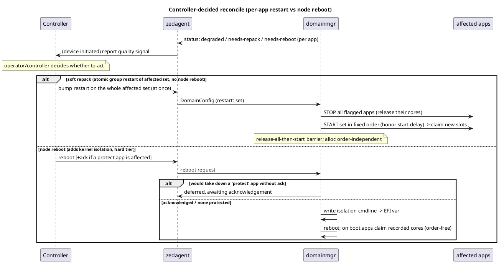

---

## 12. EVE-K Bridge (forward-looking)

This chapter shows how the design extends to eve-k without committing to a full eve-k
implementation. The goal is that the *same controller intent* (§9.2) drives both variants;
only the device-side translation differs.

### 12.1 Principle: one API, on-device translation

In eve-k, `domainmgr` and `zedmanager` are unchanged and hypervisor-agnostic — KubeVirt is
just another `Hypervisor` implementation behind the same interface, consuming the same
`DomainConfig` / `DomainStatus`. So the placement intent arrives at the device the same way
in both variants; the KubeVirt backend translates it into Kubernetes/KubeVirt objects on
the node. EVE never exposes the Kubernetes control plane to the user — the translation is
internal.

### 12.2 KubeVirt seams available for translation

A KubeVirt `VirtualMachineInstance` already exposes the fields our intent needs:
`spec.domain.cpu.dedicatedCpuPlacement`, `spec.domain.cpu.numa` (guest-mapping
passthrough), `spec.domain.cpu.isolateEmulatorThread`, and `spec.domain.cpu.realtime` —
with Guaranteed QoS (requests == limits) as the admission gate. These are the natural
targets for `full-pcpus-only`, the NUMA policy, `io_placement`, and the hard tier
respectively, so feeding the K8s-aligned vocabulary (§4.3) into them is largely mechanical.

### 12.3 The core-selection tension (explicit deferred decision)

One real architectural fork must be resolved when eve-k is built, and it is deferred here
on purpose. On eve-kvm the device picks the *exact* host cores and pins 1:1 — that is where
the SMT/NUMA-aware value lives (§7, §8). Under KubeVirt, concrete core selection belongs to
the **kubelet CPUManager**, not to EVE's allocator. Two ways to reconcile:

- **Cede selection, shape the policy.** EVE stops choosing exact cores on eve-k and instead
  configures the kubelet CPUManager policy options (`full-pcpus-only`,
  `distribute-cpus-across-cores`, …) + the reserved-CPU set, and sets the VMI fields,
  letting the kubelet honor the *intent*. Simpler; loses exact-core determinism.
- **Dictate cores.** EVE keeps its allocator authoritative and forces the kubelet to accept
  its choice (reserved-CPU carving / static assignment). Preserves determinism; fights the
  platform.

The topology report and intent vocabulary are shaped so either path is expressible.

### 12.4 Node capability & scheduling

Routing a real-time workload to a *capable* node needs node-level capability advertised to
the scheduler — the isolation tiers a node can satisfy and its reserved/isolated pool — via
node labels (NFD-style) derived from the same topology (§6) and capability (§9.1) the device
already computes. Additive; not present in eve-k today.

### 12.5 Natural landing — the RT PoC

An existing eve-k RT proof-of-concept already demonstrates the shape the hard tier takes on
Kubernetes: a **DaemonSet** that applies `isolcpus` per node and a **node agent** that
applies a performance profile. That is exactly where the node-level pieces of this design —
the hard-isolation pool (§8.2) and the node capability (§12.4) — land in an eve-k
implementation, orchestrated (drain / reboot) by an upgrade-controller flow (§11). It
confirms the model transfers; it is simply not yet wired to the controller intent. The PoC
lives in the `eve` repo: the eve-k DaemonSet + operator shape is in the first commits of
branch `rucoder/rt-k8s` (later commits rewrite the shell logic into a node daemon needed
for node operation but not for the DaemonSet/operator concept), with the eve-kvm RT work on
`feature/real-time`.

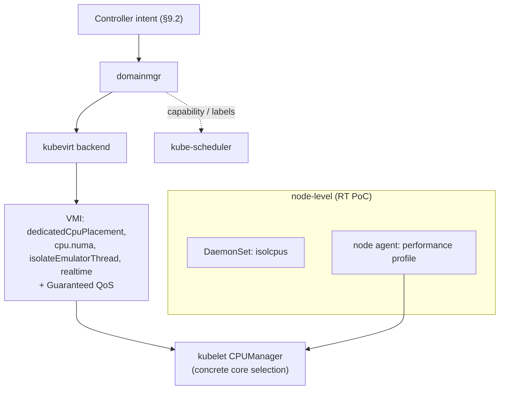

---

## 13. Margo Alignment

Margo is an emerging LF-Edge specification for edge workload orchestration, driven by a
broad set of member companies — Zededa (us) among them. The real-time extension referenced
here is a draft where Intel is fitting its RT/RDT technology into the spec, but the spec as
a whole is not any single vendor's. Because we co-drive Margo, aligning to it and shaping it
are the same activity: this design is shaped to fit Margo and to feed our positions back
into it, not to bind to a fixed external contract.

**Where the vocabularies meet.** Margo's application `requiredResources` (cpu
`class`/`cores`/`type`/`name`, `caches`, memory `bandwidthAllocation`, `scheduling`) is a
superset of our intent (§9.2), and Margo's Device Capabilities is the peer of our topology +
capability report (§9.1). The shapes correspond directly:

| This design | Margo |
|---|---|
| topology report: sockets / NUMA / cache / cores / SMT / class (§9.1, Option A) | Device Capabilities topology (hwloc-derived) |
| `CacheDomain.cpu_ids` linkage | (proposed) cache→cores linkage in Device Capabilities |
| isolation tier none / soft / hard (§4.2) | `type: isolated` / `shared` (+ explicit tier — *proposed*) |
| `threads_per_core` / `full-pcpus-only` (§4.3) | cpu `type` / SMT expectations |
| fail-closed vs fail-open (§9.2, §11.4) | admission semantics (proposed) |
| workload-model-agnostic intent (VM + container) | (proposed) decouple request from pod/helm |

**What we contribute back.** Several rows above are gaps we have raised with the Margo
authors: making topology a structured schema (not `lstopo` text), the cache→cores linkage,
explicit isolation *tiers* rather than a boolean, admission semantics, and a
workload-model-agnostic vocabulary that covers VMs and not only containers. Aligning our
report and intent to these shapes keeps EVE forward-compatible with a future Margo-fronted
fleet manager at essentially no extra cost.

---

## 14. Failure Handling & Edge Cases

Every failure resolves to a **typed status** and a defined behavior; the design never
silently mis-places a workload.

| Situation | Behavior |
|---|---|
| Request cannot fit one NUMA node under `restricted` / `single-numa-node` | `cpu.placement.needs_repack` — the constraint cannot be met from free cores; the workload does not boot |
| No arrangement fits at all (too few cores, or none of the required shape) | `cpu.placement.insufficient`; the workload does not boot |
| Odd vCPU count with whole-core-SMT | rejected — whole-core-SMT requires an even count (each core contributes two vCPUs). The check applies only to a whole-core-SMT request (`full_pcpus_only` + `threads_per_core=2`); thread-granular and one-per-core requests have no parity constraint. Validated controller-side at deploy time, with the device as a defensive backstop in two places |
| Allocation would empty the housekeeping set | should be refused — the housekeeping set (and the EVE-reserved range) must stay non-empty so the device remains manageable. **Not yet implemented** as an enforced check; see the invariants in §7 |
| Scarce P-core contested by multiple workloads | resolved deterministically by the batch planner (tightest-constrained first), independent of boot order (§7). No core-class awareness is involved: only 2-thread cores can satisfy whole-core-SMT, and those requests sort first, which is the same outcome |
| Malformed / unsupported policy | **fails closed.** A `threads_per_core` outside `{1,2}` yields `cpu.policy.invalid`; an unsupported `isolation_tier` yields `cpu.isolation.tier_unavailable`. Either aborts activation — the device rejects an intent it cannot satisfy rather than silently downgrading it, per §3 and §9.2. There is deliberately **no** fallback to legacy topology-blind pinning: that would be exactly the mis-placement this design exists to prevent. (`full_pcpus_only=false` is *not* a malformed request — it is a well-formed request for thread-granular placement, §4.3, and is served as such) |
| `domainmgr` process restart mid-life | the allocator reseeds its dedicated state from the applied per-workload status, so running pins are preserved. The reseed is currently unvalidated (§7) |
| Topology discovery fails | flat fallback model (one thread per core). Thread-granular placement still works; **whole-core-SMT becomes unsatisfiable**, because no core in the flat model has two siblings (§6) |
| vCPU hotplug | out of scope; pinning is computed at launch, and a change means a restart (§11) |

The distinction between `needs-repack` (the NUMA constraint could be met by moving a
running workload) and `insufficient` (no arrangement fits) is what lets the controller
choose between restarting the flexible app to repack and simply reporting the request as
unsatisfiable (§9.3, §11).

**Every one of these failures is terminal until someone acts.** "Does not boot" above means
the workload stays in `ERROR` and is not re-attempted, even once the condition that caused it
has gone away — recovery is a deactivate/activate, i.e. the same explicit action EVE already
requires of a workload that could not get its assigned PCI device (§18.3). What the device owes
in exchange is a report that says so: each error carries a `retry_condition` naming the action
and the state that has to be reached (how many cores are needed and free; which workloads hold
the planned CPUs), and stating that placement is not re-attempted on its own.

One rough edge in the mapping: allocator statuses other than those two — including the
internal "invalid request" signal, which indicates a bug in the caller rather than a bad
user config — currently all surface as `cpu.policy.invalid`. An allocator bug is therefore
reported to the controller as a user configuration error, which sends the operator chasing
the wrong thing. Internal faults deserve their own code. **Not yet implemented.**

---

## 15. Testing & Validation

**Unit — topology.** Synthetic sysfs fixtures covering: SMT on and off; an Intel E-core
module (one shared L2 across four distinct `core_id`s, no SMT); multiple L3 domains; and
multiple sockets. Assert that sibling grouping is exactly `(socket, core_id)` and never an
L2 id.

**Unit — placement.** Table / property tests over (topology × request-set). Assert:
NUMA-locality honored; whole-core exclusivity for `full-pcpus-only` workloads (no physical
core split across two whole-core workloads); truthful guest `sockets/cores/threads`;
deterministic, order-independent output; housekeeping set never empty; correct typed
failures; and the ordered 1:1 sibling mapping (guest sibling pairs → host sibling pairs).

**Unit — policy.** Vocabulary parsing, default derivation, and best-effort fallback for
malformed input.

**Device / manual.** Read back per-thread affinity to confirm 1:1 vCPU pinning and
emulator/IO threads on the housekeeping set; confirm the guest `lscpu` / `lstopo` shows the
expected topology; a two-workload test confirms no shared physical core; a regression pass
confirms workloads with no CPU policy behave exactly as before.

**Hard tier.** Confirm the derived (or static) `isolcpus` / `nohz_full` cmdline is applied
after reboot, that the EVE-reserved range stays runnable, and that residual noise (timer
ticks, steered IRQs) is measurably reduced on the isolated cores.

**Coverage status.** Most of the above exists: the E-core/L2 hazard, SMT-on/off, multi-socket
and multi-L3 topology fixtures; order-independence and disjointness of the batch plan; hybrid
coexistence; policy defaults and mode derivation; and a genuine end-to-end check that reads
back `/proc/<tid>/status` in the running kernel to confirm 1:1 vCPU pinning, plus a two-app
whole-core-exclusivity check. The notable gaps, which are where a regression would go
unnoticed: `io_placement` and emulator-thread placement, `isolation_tier`,
`disruption_policy`, every NUMA policy other than best-effort, thread-granular dedicated
placement, legacy `pin_cpu` back-compat, guest-side topology (only the guest's CPU *count* is
checked, never `lscpu`/sysfs inside the guest), and every new reporting field (`cpu_pools`,
`node_capabilities`, `error_code`).

---

## 16. Rollout & Compatibility

**Opt-in by default.** A workload with no CPU policy behaves exactly as it does today —
best-effort shared placement. Topology-aware placement, isolation tiers, and the reporting
extensions activate only when a workload (or node) is explicitly configured. There is no
change to an unconfigured fleet.

**Additive API.** The topology report (§9.1) extends existing messages without changing
existing fields; the intent (§9.2) and the reconcile/consent surface (§11.5) are new,
additive controller-facing config. Old controllers ignore what they do not understand; new
controllers light up the capability. This is the forward-stability rule of §2: enabling a
future capability never changes the meaning of an existing request.

**Unknown values travel in both directions, and the rules differ.** "Ignore what you do not
understand" is safe when an *old controller* meets a new device's report — it just sees less.
It is **not** automatically safe in the other direction: a device that quietly maps an
unfamiliar `isolation_tier` or `numa_policy` onto "unspecified" downgrades a requirement its
operator asked for, which contradicts the fail-closed posture of §9.2. The rule this design
adopts is therefore asymmetric:

- **Device → controller (reports):** unknown fields and enum values are ignored. Always safe.
- **Controller → device (intent):** a controller must not send placement fields to a device
  that has not advertised `api_capability ≥ CPU_PLACEMENT_POLICY`, and must not send values
  from a vocabulary newer than the capability the device advertised. The capability gate,
  not device-side leniency, is what keeps an old device from meeting a value it cannot
  honour.

The device's current behaviour (map unknown → unspecified, fail open) is only defensible
because of that gate — and the gate is not populated yet (§9.1). Whether the device should
additionally reject unknown values in stricter-than-known positions is an open question
(§17).

**Blast radius.** Placement lives in `domainmgr`, a workload-management microservice —
failures are remotely recoverable by pushing new config, not a device-management regression
that could cost remote manageability. The hard tier is the one exception (it touches the
kernel cmdline and reboots), which is why it is gated behind explicit controller action and
the consent/deferral protocol (§11).

---

## 17. Open Questions & Future

### Decisions the design still owes an answer to

All three are recorded here with their reasoning, because none of the answers is self-evident
from the code. Two are resolved; the remaining one is not a fork between two designs but a
question of scope that a later capability has to answer first.

- **Fragmentation (objective #3) and the `degraded` quality value: what should
  "fragmentation" mean?** The open question is no longer *whether* to have the term but what
  it measures. Fragmentation is not a property of cores alone: a workload may be assigned a
  passthrough PCI device, and memory, and cores, and what matters is whether one NUMA node
  can still satisfy the *combination*. A node whose cores are free on one side and whose NIC
  sits on the other is fragmented in the way that actually costs performance, even though
  every individual resource is available somewhere. So the term belongs at the level of the
  node's resources as a whole, not at the level of half-used physical cores.

  That reframing also settles what `degraded` is for. With a CPU-only objective there was no
  way to be sub-optimal without being `needs-repack`, which left `degraded` unreachable and
  hard to justify keeping. Cross-resource alignment gives it an obvious meaning: a workload
  whose cores are on a different NUMA node from its assigned device is *running, measurably
  worse than the device could have done, and not necessarily worth a restart*. That is
  exactly the state `degraded` was introduced to describe.

  **Both are therefore kept and deliberately not defined yet.** Defining fragmentation
  narrowly over cores now would commit the API to a metric that the wider notion would have
  to replace -- and the wider notion cannot be implemented until placement can see a
  workload's other resources, which needs the per-device NUMA affinity the inventory can
  carry but does not populate (§9.1). Until then the objective keeps the two terms it can
  compute honestly (NUMA nodes and L3 domains spanned) and `degraded` is not emitted. Note
  that `needs-repack` does *not* depend on any of this: it is derived from comparing the
  planned placement with what the live allocation could achieve, so it works on a uniform
  node with no fragmentation term at all.

- **~~Should `restricted` and `single-numa-node` differ, and how?~~ RESOLVED for now: they
  map to the same strategy, as placeholders.** Both mean "one NUMA node or do not start".
  They differ in Kubernetes only by how many *other* aligned resources are weighed, and CPU
  placement weighs none yet, so there is nothing for `restricted` to trade off. Neither value
  is exposed in the UI for the first target deployment, so the collapse costs nothing today.

  They are kept in the vocabulary because the distinction becomes real with proper NUMA
  resource tracking -- a workload with an assigned PCI adapter wants its cores on that
  device's node, and at that point the planner has something to minimise and `restricted`
  becomes a genuinely weaker constraint than `single-numa-node`. This is the same gap that
  the fragmentation question above waits on. The Go doc comments in `types/cpuplacement.go`
  and the mapping in `domainmgr` now state the collapse and the reason, so it reads as a
  deliberate placeholder rather than an oversight.

- **~~Should the device reject unknown controller enum values instead of mapping them to
  "unspecified"?~~ RESOLVED: mapping to "unspecified" is correct.** The controller must never
  send a workload a device cannot handle, and capability reporting is how it knows what the
  device can handle: `api_capability` says whether this EVE understands the placement fields
  at all, and the hardware/kernel facts in `HardwareInventory` say what the node can satisfy
  (§9.1). Responsibility for not sending an unsupported request sits with the controller,
  gated on those reports — so a device that maps an unrecognised value to "no preference" is
  the standard forward-compatible enum idiom applied where the situation should not arise in
  the first place, not a silent downgrade of a safety requirement.

  This resolution depends on the capability gate actually working, which it now does:
  `api_capability` reports `API_CAPABILITY_CPU_PLACEMENT_POLICY` (§18.2d). Before that landed
  the argument was circular -- the device relied on a gate nothing populated. Note the gate is
  monotonic and version-like, so a controller that checks it before sending fields from a
  later API generation is also protected against enum *values* added in that generation.

  Two consequences worth stating rather than leaving implicit. The device's fail-closed
  posture (§9.2) still applies in full to requests it *does* understand and cannot satisfy --
  a recognised-but-unsupportable request is refused, never weakened. And a controller that
  ignores the capability reports can still get a workload placed more weakly than it asked
  for; that is a controller defect, and the device cannot detect it, which is the price of
  putting the gate in the report rather than in the request.

### Future work

- RDT cache/mem-bw allocation (CLOS as the shared limiting resource).
- RDT-for-I/O (DDIO): bound the L3 / memory bandwidth a device's DMA consumes; requires
  PCI→NUMA/L3 affinity in the topology report (§9.1).
- P/E-core preference policy.
- Latency-determinism via a PREEMPT_RT kernel image — orthogonal to the isolation tiers,
  layered on top of hard isolation (§4.2).
- Evaluate hard isolation as a *throughput* lever for Quvia — the ESXi baseline behavior
  is unknown and may already shield datapath cores (§8.2).
- Hard-isolation cmdline precedence: how EVE-derived `isolcpus`/`nohz_full`/`rcu_nocbs`
  interact with an operator's static kernel cmdline — mode-gated vs. merge vs. static-wins
  (§8.2).
- Parked-sibling handling in one-per-core: whether to let best-effort work reclaim the
  idle sibling (accepting the contention trade-off) or leave it idle (default). CPU
  offlining and hotplug are out of scope — not pursued.
- Dynamic cgroup-v2 `cpuset.cpus.partition=isolated` as a no-reboot middle tier between
  soft and hard (EVE uses cgroup v1 today, so this is future).
- A/B rollback vs the persistent `eve-kernel-extra-cmdline` EFI var. The var is **derived
  from app configs + pinning policy** (shared `/persist`) and fixed topology — none of which
  roll back with the EVE image. On an image rollback the **apps stay**, so the isolation
  they require stays too; the var must therefore track the (shared) apps, **not** the image
  slot. A per-slot var that "rolled back" the cmdline would be wrong — it would strip
  isolation from apps that are still present and still pinned. So: keep a **single shared
  var**, treat it as a **cache of derived state** that each booted image re-derives from
  `/persist` and self-corrects (reconciler principle, §7), and always encode it in a
  **portable explicit format** (`isolcpus=<list>`, never the RT-only `inverse` trick) so any
  slot's kernel honors it and the reserved/housekeeping cores stay runnable even during the
  one boot before re-derivation. Residual hazard: a rolled-back *older* image may lack the
  feature to honor or correctly interpret the current isolation — its domainmgr must
  re-derive and reconcile (rewrite + reboot if the set changed), degrading to soft where it
  cannot.
- Runtime pin-integrity observability: pins are computed at launch and not monitored;
  consider a drift check that reports if a vCPU thread's affinity is disturbed. This matters
  most under `io_placement = housekeeping`, where the widened cpuset means per-thread
  affinity is the *only* thing confining vCPUs to their cores (§8.1).
- Cross-check the `(socket, core_id)` sibling grouping against `thread_siblings_list` (§6).
  Redundant on correct hardware, but cheap defence-in-depth: today one malformed `core_id`
  discards the entire topology and silently disables whole-core-SMT for the whole node.
- Make the degraded (flat) topology model self-identifying, so a consumer can tell it apart
  from a real single-threaded machine (§6), and consolidate the placement-path and
  reporting-path topology discoveries onto one implementation (§9.1).
- Fence a planned-but-unstarted workload's cores from *shared* work, not only from other
  dedicated allocations (§7) — today a delayed-start workload's cores can carry best-effort
  load until it starts.
- Full Margo wire integration.

---

## 18. Implementation Plan

Chapters 1–17 are the full design. Delivery is phased. The **published API is frozen in
one shot** — the HwInventory extension, the per-app CPU-policy config, and the structured
error field are all defined *now*, sized for every future phase; each phase only *populates
and honors* a growing subset. This is the forward-stability rule of §2 made concrete: the
cloud team integrates against a stable schema once, and later phases flip fields on without
another API round.

### 18.1 Phase 1 — Scope

**Target: eve-kvm soft isolation + capability/topology reporting.** (Quvia *Grid*.)

- **EVE (device):** soft isolation — pinning + SMT/NUMA placement + `io_placement`
  (largely built, §6–§8); **populate** the HwInventory topology + hardware capabilities
  (RDT reported unsupported; `NodeCapabilities` isolation facts read from the running
  kernel); **advertise software ability** — `api_capability =
  CPU_PLACEMENT_POLICY` and `optional_capabilities.managed_cpu_isolation = false` in
  Phase 1, so consumers derive that only soft is available; **consume** the new per-app
  CPU-policy config fields; **report** per-app placement status, node pool utilization,
  and structured errors.
- **Cloud (controller + UI):** ingest the HwInventory topology/hardware capabilities *and*
  the software-capability channel, and **apply both gates in the UI** (§9.1, §18.4); send
  the new `VmConfig` CPU-policy fields from the presets/knobs; surface app-deploy state,
  pool utilization, and the structured placement error codes.
- **Defined in the API but NOT implemented in Phase 1:** hard isolation (including the
  static-pool / detect-and-schedule variant, §8.2, and the `needs-reboot` quality value),
  RDT (CAT/MBA), real-time (PREEMPT_RT), PCI-device NUMA-affinity population, `core_class`
  discovery and reporting, guest `-numa` topology and memory-backend node binding (§8.1),
  the repack barrier and grouped restart (§11.2), `disruption_policy: protect` deferral plus
  its acknowledge/force flag (§11.3), and the eve-k path. Their fields exist
  (unset/ignored); their UI groups render disabled until a node reports the capability.
  Where the device *accepts* such a field and then ignores it — `disruption_policy` is the
  live example — that is a defect, not a scope decision: an ignored requirement must be
  rejected so the controller learns it is not in force.
- **In Phase 1 scope but not yet done.** The enforcement path (§6–§8) is built and verified
  end-to-end; the **reporting** path is where Phase 1 is still short, and the items block one
  another in this order: (1) advertise `api_capability = CPU_PLACEMENT_POLICY` — a single
  constant, and until it is bumped no controller can offer any of these controls at all
  (§9.1); (2) forward the per-app placement-quality signal to `ZiApp` (§9.3), which every
  day-two flow in §10 and §11 depends on; (3) populate `ZInfoDevice.cpu_pools` (§9.3), which
  unlocks pre-flight feasibility and actionable `insufficient` messages.

### 18.2 API changes (one-shot, all phases; additive)

Fields are appended additively with whatever numbers are free at implementation time —
exact numbers are an implementation detail, never a design contract; what matters is
that nothing existing is renumbered or reused.

**(a) HwInventory — `proto/info/hardware.proto`** (Option A, §9.1):

- `CPU`: add `socket_id`, `core_id`, `numa_node`, `l2_id`, `l3_id`, `CoreClass
  core_class`, `base_freq_khz`, `max_freq_khz`.
- `CPUInfo`: add `repeated CacheDomain caches`, `CPUCapabilities capabilities`.
- new `CacheDomain` { `CacheLevel level`, `uint64 size_bytes`, `repeated uint32
  cpu_ids` (the cache→cores linkage), `uint32 id` }.
- new `CPUCapabilities` — CPU-silicon facts only: { `bool rdt_l3_cat`, `bool rdt_mba`,
  `uint32 num_clos` }.
- new `NodeCapabilities` on `HardwareInventory` — granular **running-kernel** facts only
  (§9.1; consumers derive tier availability per workload type): { `repeated uint32
  isolated_cpu_ids`, `repeated uint32 nohz_full_cpu_ids`, `repeated uint32
  rcu_nocbs_cpu_ids` }. Future ingredients (preemption model, hugepage sizes, IRQ
  steering) extend it additively. It deliberately carries **no** statement about what the
  EVE software can do — that is (d) below.
- `PCIDevice`: add `optional int32 numa_node`, `repeated uint32 local_cpu_ids`.
- new info enums: `CoreClass` {UNSPECIFIED, PERFORMANCE, EFFICIENCY, LOW_POWER},
  `CacheLevel` {UNSPECIFIED, L1D, L1I, L2, L3}.
- **Phase 1 populates:** per-logical-CPU coordinates and base/max frequency; `caches` (L2 and
  L3; L1D/L1I are read but not emitted); `capabilities.rdt_* = false`; `node_capabilities`
  with the effective isolated sets read from the running kernel (empty on a standard node).
  The producer change this required in `hardware/inventory.go` — enumerate logical CPUs
  rather than physical cores, and report frequency — **has been made**. Two schema fields are
  deliberately *not* populated: `l2_id`, which is redundant with `CacheDomain.cpu_ids`, and
  `core_class`, which has no discovery source yet (§6) and is decorative on a homogeneous
  Xeon. Software ability is advertised separately per (d).

**(b) Per-app CPU policy — `proto/config/vm.proto` (`VmConfig`)** (keep `pin_cpu` as-is
for back-compat):

- add `CpuPolicy cpu_policy` {UNSPECIFIED, SHARED, DEDICATED}, `bool full_pcpus_only`,
  `uint32 threads_per_core`, `NumaPolicy numa_policy` {UNSPECIFIED, NONE, BEST_EFFORT,
  RESTRICTED, SINGLE_NUMA_NODE}, `IoPlacement io_placement` {UNSPECIFIED, DEDICATED,
  HOUSEKEEPING}, `IsolationTier isolation_tier` {UNSPECIFIED, NONE, SOFT, HARD},
  `DisruptionPolicy disruption_policy` {UNSPECIFIED, ALLOW, PROTECT}.
- Later phases (RDT `caches` / `memory_bandwidth`, real-time `scheduling`
  priority/deadline) simply append further fields — no field range is reserved up front.
- `IsolationTier` is defined in the config package: it is *workload intent* vocabulary
  only — the node never reports tiers (it reports granular `NodeCapabilities`
  ingredients from which tier availability is derived per workload type, §9.1).
- **Back-compat:** `cpu_policy` unset + `pin_cpu=true` ⇒ treated as `DEDICATED` with default
  allocation. Mapping points: `cmd/zedagent/parseconfig.go` maps `PinCpu → CPUsPinned`;
  `cmd/zedagent/parsecpuplacement.go` maps the new placement enums. A legacy-pinned workload
  with no policy takes the thread-granular shared-pool path and QEMU's `-object
  thread-context` mechanism rather than the topology path (§8.1).

**Alignment with the existing CPU fields in `VmConfig`.** Three CPU-related fields predate
this work, and it matters that the new policy composes with them rather than duplicating
them:

| Existing field | State today | How this design relates |
|---|---|---|
| `pin_cpu` (bool) | implemented — turns on pinning, all-or-nothing | superseded by `cpu_policy`, which expresses *how* to pin instead of just *whether*. `pin_cpu=true` maps to `DEDICATED` with defaults, so existing deployments keep working unchanged; when `cpu_policy` is set it takes precedence. |
| `cpus` (string CPU mask, e.g. `"0-2,5,6"`) | **documented in the API as "Currently is not handled by EVE" — and indeed never parsed** (nothing reads it in `parseconfig.go`); the UI never populated it either | deliberately **not revived**. It is the one field that would let a controller name concrete host CPUs, which this design explicitly rejects: the controller sends policy, the device selects cores (§2, §9.2). Marked in the POC as unhandled and superseded so the cloud team does not build on it. Because no core IDs were ever sent, there is **no existing data or workflow to migrate**. |
| `vcpus` / `maxcpus` | implemented | unchanged. The policy is what makes the count meaningful — with `threads_per_core=2`, N vCPUs consume N/2 physical cores. |

Two notes worth making explicit, because they show the design is a *generalization* of the
documented legacy intent rather than a departure from it:

- The legacy `pin_cpu` description already promised "any vCPU thread runs on a dedicated
  physical CPU" plus "all the other QEMU threads limited to the CPUs defined by the CPU
  mask". That is precisely the split this design formalizes as strict 1:1 vCPU pinning
  (§8.1) plus `io_placement` for the non-vCPU threads — except the "other threads" set is now
  derived by the device (the housekeeping set) instead of hand-written by the operator.
- The legacy fallback — "if the CPU mask is not set, Pillar picks the physical CPUs
  automatically" — is exactly the allocator's job (§7). This design keeps that automatic
  selection and makes it topology-aware, rather than pushing core identity back to the
  controller.

The internal `types.VmConfig.CPUs` in pillar is *not* the API `cpus` field: it is the
device-computed allocation **result**, filled in by `assignCPUs`. Same name, opposite
direction — worth keeping straight when reading the code. That result is applied through
three paths, which is why the design does not need a new enforcement mechanism per workload
type:

- **VM (QEMU/KVM):** cgroup cpuset for confinement plus strict 1:1 vCPU→pCPU affinity and
  emulator/IO placement over QMP (§8.1).
- **Container (containerd):** written into the OCI runtime spec as
  `Linux.Resources.CPU.Cpus` (`containerd/oci.go`), so a container's cpuset is set from the
  same allocator output.
- **Non-pinned workloads:** the same field carries the housekeeping set, keeping them off
  dedicated cores (§7).

The practical consequence: the allocator output already reaches both VMs and containers, so
extending the policy to container workloads is a matter of *deciding* placement for them, not
of building a new way to enforce it. (What containers cannot get from this path is the
truthful guest SMT topology a VM gets via `-smp` — an in-container workload sees the host
topology, filtered only by its cpuset.)
- **Phase 1 honors:** `cpu_policy`, `full_pcpus_only`, `threads_per_core`, `numa_policy`
  (with `restricted` and `single-numa-node` resolving identically, §9.2), `io_placement`,
  `isolation_tier ∈ {none, soft}`. `hard` is parsed and rejected with
  `cpu.isolation.tier_unavailable`; RDT/RT fields do not exist yet. `disruption_policy` is
  parsed but has no effect, which §11.3 flags as a defect rather than a scope decision.

**(c) Structured errors — `proto/info/common.proto` (`ErrorInfo`)**: add
`string error_code` — a namespaced, machine-parseable token (e.g.
`cpu.placement.insufficient`) alongside the existing free-text `description`, `severity`,
and `retry_condition`. A string registry (not a monolithic central enum) keeps it
extensible across domains. Edit points: `types/errortime.go` `ToProto()` and the
`ErrorDescription` construction in `domainmgr`.

**(d) EVE-software capability — `proto/info/info.proto`** (the second gate of §9.1; these
are *not* hardware facts and deliberately live outside HwInventory):

- `APICapability`: add `API_CAPABILITY_CPU_PLACEMENT_POLICY` — tells a controller that this
  EVE parses and honors the `VmConfig` placement fields at all. Without it an older EVE
  silently ignores them, exactly the failure the existing
  `API_CAPABILITY_ENFORCED_NET_INTERFACE_ORDER` precedent guards against. Populated in
  `cmd/zedagent/reportinfo.go`, which reports a single monotonic value. The enum value
  exists; the reporter still emits the previous one. **Not yet implemented**, and it is the
  highest-priority item in Phase 1 (§9.1, §18.1).
- `OptionalCapabilities`: add `bool managed_cpu_isolation` — EVE can derive the isolation
  kernel cmdline from its own plan and apply it (reboot-gated, §8.2). Non-monotonic and
  flavor/build dependent, hence a boolean here rather than an `APICapability` step. The
  device never assigns it, so it reaches the controller as proto3's default `false` — which
  is the correct Phase-1 value, making this cosmetic rather than broken; setting it
  explicitly is still worth doing to document intent.

**(e) Node CPU pool utilization — `ZInfoDevice`** (§9.3): report, per pool
(housekeeping / dedicated / isolated), the CPU set plus total / allocated / free counts, so
the UI can render the node's CPU map and the controller can answer "will this fit?" before a
deploy. Change-driven and periodic, never on the cached hardware inventory. The
`CPUPoolUtilization` message in the API is in fact richer than this list — alongside
`total_threads` / `allocated_threads` / `free_threads` it carries `total_cores` and
`free_whole_cores`, which is precisely what the §9.3 worked example needs. The schema is
done; the device-side producer is missing. **Not yet implemented.**

### 18.3 Placement status & structured error codes

**Report-back contract.** There is no dedicated deploy-ack; the result rides `ZInfoApp`
(`ZiApp`), rebuilt on every `AppInstanceStatus` change: `State` (`RUNNING`=success,
`ERROR`=fail) + `AppErr []ErrorInfo`. The §9.3 optimality signal uses the *same* channel —
non-fatal advisories are `ErrorInfo` with `Severity = NOTICE/WARNING` while `State` stays
`RUNNING`; fail-closed placement is `Severity = ERROR` with `State = ERROR`.

| `error_code` | Severity | State | Meaning | Recovery (never automatic — see below) |
|---|---|---|---|---|
| `cpu.placement.insufficient` | ERROR | ERROR | not enough cores of the required kind on this node | free the cores, then restart the workload; `retry_condition` carries how many it needs and how many are free |
| `cpu.placement.needs_repack` | WARNING | RUNNING (fail-open) / ERROR (fail-closed) | optimum needs moving running workloads (§11) | restart the pinned workloads together; `retry_condition` names the ones holding the planned CPUs |
| `cpu.placement.degraded` | NOTICE | RUNNING | placed sub-optimally; no action forced | — |
| `cpu.policy.odd_vcpu` | ERROR | ERROR | whole-core-SMT needs an even vCPU count (also controller-validated, §9.2) | fix the count (or `threads_per_core`), then redeploy |
| `cpu.isolation.tier_unavailable` | ERROR | ERROR | requested isolation tier not supported by this node | lower the tier, or deploy on a capable node |
| `cpu.policy.invalid` | ERROR | ERROR | malformed/unsupported policy | fix the policy, then redeploy |
| `cpu.topology.unsupported` | ERROR | ERROR | whole-core placement asked of a hypervisor that cannot pin individual vCPUs | turn off `full_pcpus_only`, or deploy on a kvm node |

All seven codes exist in the device's registry and six of them are emitted;
`cpu.placement.degraded` has no producer, because the quality value it reports is unreachable
(§9.3, §17).

**A placement failure is not re-attempted by the device.** A workload refused on the CPU path
holds no CPUs, sets neither `BootFailed` nor `ConfigFailed`, and stays in `ERROR` until an
explicit action — deactivate (which clears the error) then activate. Freeing capacity does
*not* bring it up by itself, and that is deliberate: it is how EVE already treats a workload
whose assigned resource is unavailable. An app that cannot get its assigned PCI device is not
started minutes later because the device reappeared, and dedicated CPUs are an assigned
resource like any other, so they behave the same way. Starting a workload on CPUs the operator
never saw it take, long after the deploy was reported failed, would be the surprising
behaviour — not this one.

That makes `retry_condition` the whole of the recovery contract, so **every** code above is
published with one filled in (`placementErrorDescription` in `cmd/domainmgr/placementpolicy.go`;
it reaches the wire as `ErrorInfo.retry_condition` through `ErrorDescription.ToProto`). Each
condition states what has to become true, names the action, and says explicitly that the
device does not re-attempt placement — a controller told only "when cores free" would wait for
a recovery that never arrives. The message says what happened; the condition says what to do,
and deliberately does not repeat it.

**Severity is not yet differentiated, and that fuses two distinct signals.** Every placement
code is currently emitted at Severity `ERROR` and blocks the domain, because the severity
field is left unset and defaults to `ERROR`. The consequence lands hardest on
`needs_repack`, which the table above splits into an *advisory* meaning (running, a repack
would be better) and a *fatal* one (the NUMA constraint cannot be met at all). Only the fatal
path exists on the device today, so a fail-open workload that could run on a worse placement
is refused instead. These must become two different signals: the advisory one rides the
quality channel of §9.3 at `WARNING`/`RUNNING`, the fatal one stays an `ERROR`.
**Not yet implemented.**

One further gap on this path: `error_code` propagates correctly when a placement failure
occurs while *activating* an app, but is dropped on the deactivate path, where only the
free-text message survives. Errors observed during teardown therefore reach the controller
unstructured. **Not yet implemented.**

### 18.4 UI — Phase 1 delivery of the user-facing model

The user-facing model — mental model, the gating algorithm, presets, error messages, and the
day-two decisions — is specified in **§10**. This section covers only what the *first phase*
delivers against it.

Today's UI exposes exactly one CPU-placement control — a "CPU pinning" checkbox — and
critically it **never lets the user supply core IDs** (the API's `cpus` mask has always gone
unpopulated, §18.2b). So that checkbox is a knob we **reuse rather than replace**: it becomes
the on-switch for the policy group (`cpu_policy = DEDICATED`), and the new controls hang off
it. Nothing users have configured is invalidated, and there is no core-ID data to migrate —
existing pinned apps simply gain defaults.

The checkbox therefore grows into the **grouped panel** of §10.3, gated by the algorithm of
§10.2. Phase 1 wires the CPU-allocation and soft-isolation groups live; the hard-isolation,
real-time, and RDT groups render per their gates (disabled, since no Phase-1 node reports
those capabilities).

**Presets** (starting points, then editable):
- **Best-effort** (default) → `cpu_policy=SHARED`.
- **Throughput / dedicated** → `DEDICATED`, `full_pcpus_only`, `threads_per_core=2`
  (whole-core-SMT), `numa=best-effort`, `io_placement=housekeeping`, `isolation=soft`.
- **Real-time** → `DEDICATED` + `isolation=hard` + `scheduling=real-time` (selectable only
  on a capable node).

**Groups and their capability gates.** Every group passes through **both** gates of §9.1 —
the software gate first (does this EVE understand the fields at all?), then the
hardware/kernel gate (can this node actually do it?):

| Group / knob | Config field(s) | Software gate (`ZInfoDevice`) | Hardware / kernel gate | Phase 1 |
|---|---|---|---|---|
| CPU allocation (policy, core allocation, [adv] NUMA, IO) | `cpu_policy`, `full_pcpus_only`, `threads_per_core`, `numa_policy`, `io_placement` | `api_capability ≥ CPU_PLACEMENT_POLICY` | always (affinity needs no special hardware; SMT knob needs an SMT part) | **live** |
| Isolation: Soft | `isolation_tier=soft` | `api_capability ≥ CPU_PLACEMENT_POLICY` | always | **live** (default) |
| Isolation: Hard | `isolation_tier=hard` | `optional_capabilities.managed_cpu_isolation` | or a non-empty static isolated pool in `NodeCapabilities.isolated_cpu_ids` | visible, **disabled** |
| Real-time | `scheduling` | future capability value | future `NodeCapabilities` ingredient (preemption model / RT kernel) | hidden/disabled |
| Cache / mem-bw (RDT) | `caches`, `memory_bandwidth` | future capability value | `CPUCapabilities.rdt_l3_cat` / `rdt_mba` (+ `num_clos`) | hidden/disabled |

For the Hard-isolation row the two gates are genuinely complementary: EVE-managed isolation
needs the *software* ability, while a statically provisioned pool needs only the *kernel*
fact — so the control is offerable if **either** path is available (§8.2).

Principles Daniel's UX must preserve: **capability-gated visibility** (never offer what the
node can't do), **distinguish the two failure kinds** ("this hardware cannot" vs. "update EVE
to enable" — one is a dead end, the other is an action the user can take), **fixed grouping**
(later phases un-gate a group, no redesign), **progressive disclosure** (NUMA/IO under
"Advanced"; RT/RDT groups appear only when supported), and **back-compat** (a legacy
`pin_cpu=true` app renders as the Throughput/dedicated preset). The SMT choice stays a knob
(single enum, good default) — it is workload knowledge only the customer has, and "core
count" means different things per mode. Where the node reports pool utilization (§9.3), the
panel should also show **how much of each pool is free**, so a user sizing a workload sees
whether it will fit before deploying.

### 18.5 Data-flow sequences

**Node start — capability & topology reporting:**

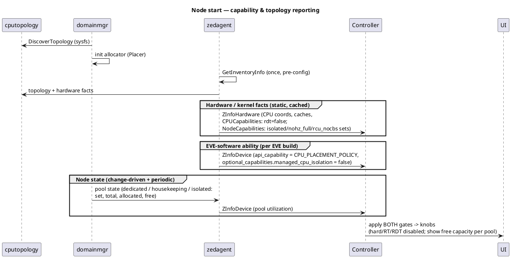

**App deployment — CPU policy → placement → status:**

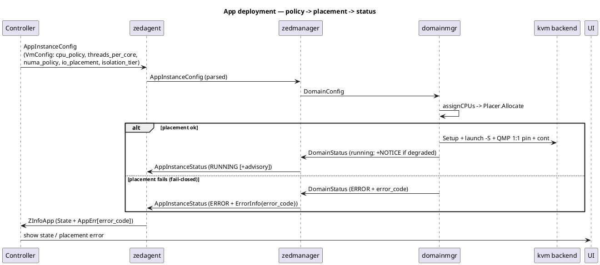

### 18.6 EVE ↔ Cloud responsibility split (Phase 1)

| Area | EVE (device) | Cloud (controller + UI) |
|---|---|---|
| Hardware topology & capability | discover; populate HwInventory (coords, caches, `rdt=false`, `NodeCapabilities` kernel facts) | ingest; derive tier availability per workload type |
| Software capability | advertise `api_capability = CPU_PLACEMENT_POLICY`, `optional_capabilities.managed_cpu_isolation` | check before offering/sending the fields; apply **both** gates in the UI (§18.4) |
| Config intake | parse new `VmConfig` fields → `DomainConfig` | emit `VmConfig` fields from presets/knobs |
| Placement & enforcement | allocator + soft-isolation pin/QMP/cgroup; **name the affected set** on a repack | restart exactly the flagged apps (existing per-app `restart`) |
| Status & errors | `ZInfoApp` `State` + `AppErr{error_code}`; node pool utilization on `ZInfoDevice` | render state and the node CPU map; react to `error_code`; pre-flight "will it fit?" |
| Not in Phase 1 | hard/RDT/RT backends; PCI-affinity populate | hard/RT/RDT groups disabled until capability reported |

---

## Appendix A: Glossary

- **SMT / hyperthread** — simultaneous multithreading; two logical CPUs sharing one
  physical core's execution engine and private caches.
- **PU (processing unit)** — one SMT thread; the entity the OS schedules and
  `sched_setaffinity` targets.
- **Physical core** — identified by `(socket, core_id)`; its PUs are SMT siblings.
- **L2 / L3 domain** — the set of cores sharing an L2 or L3 cache. On hybrid Intel, an
  E-core module shares one L2 across four non-sibling cores.
- **NUMA node** — a memory-locality domain; cross-node access is slower.
- **Core class** — Performance / Efficiency / Low-Power (Intel P/E/LP, ARM big.LITTLE).
- **Reserved set** — the low cores (`eve_max_vcpus`) kept for EVE/dom0 and the kernel;
  never handed to a pinned workload.
- **Housekeeping set** — all online cores minus the dedicated set (a superset of the
  reserved set); where pinned workloads' emulator/IO threads land under
  `io_placement=housekeeping`.
- **Dedicated set** — the union of cores assigned to pinned workloads (incl. parked
  siblings).
- **CLOS** — RDT class of service; the scarce unit CAT and MBA allocations attach to.
- **CAT / MBA** — RDT cache allocation / memory-bandwidth allocation.
- **DDIO** — Intel Data Direct I/O; device DMA landing in L3, the target of RDT-for-I/O.
- **isolcpus / nohz_full / rcu_nocbs** — kernel cmdline params that shed scheduler, tick,
  and RCU work from isolated cores. Work on any (stock) kernel.
- **PREEMPT_RT** — the real-time kernel preemption model (sleeping locks, threaded IRQs,
  priority inheritance) that bounds worst-case scheduling latency. A build-time kernel-image
  choice, orthogonal to isolcpus-style isolation; needed only for bounded-latency workloads.
- **CPUManager / TopologyManager** — kubelet components that pin CPUs and align resources
  to NUMA.
- **VMI** — KubeVirt VirtualMachineInstance.
- **NFD** — Node Feature Discovery (node labeling).
- **PDB** — PodDisruptionBudget.
- **SUC** — (Rancher) System Upgrade Controller.

## Appendix B: Example Platform Topologies

**Homogeneous P-core server (e.g. Xeon).** One or two sockets, all cores 2-thread, one L3
per socket, one NUMA node per socket. whole-core-SMT and one-per-core both draw from a
uniform pool; the only placement axis that matters is NUMA/L3 locality. The likely Quvia
fleet target.

**Hybrid client part (e.g. i7-1270P).** A mix of 2-thread P-cores and E-core modules where
four E-cores share one L2 with no SMT. whole-core-SMT can only be satisfied by a P-core (an
E-core presents one thread); one-per-core can use either. This is the part on which the
`(socket, core_id)` sibling rule and the L2≠core hazard were validated.

**Multi-socket server.** Multiple NUMA nodes and L3 domains; NUMA-local placement and
device-NUMA affinity (for a passthrough NIC, §9.1) become first-order.

Illustrative `lstopo`-style trees (simplified):

**Homogeneous P-core server** — one L3 and one NUMA node per socket; every core 2-thread.

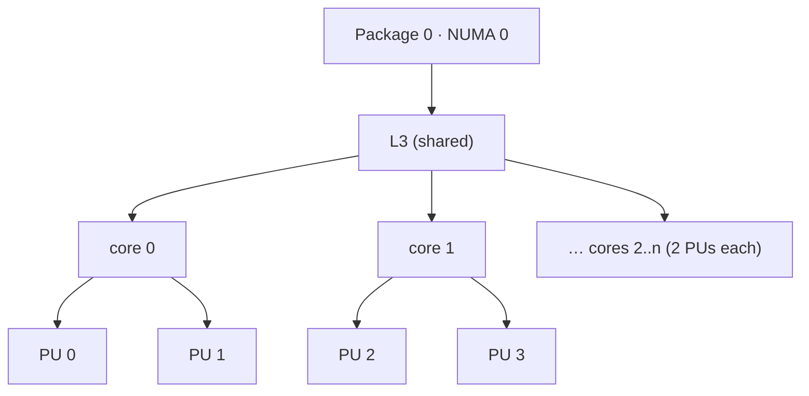

**Hybrid client part (e.g. i7-1270P)** — P-cores each with a private L2 and 2 PUs; an
E-core module where four distinct cores share one L2 with no SMT (the L2≠core hazard).

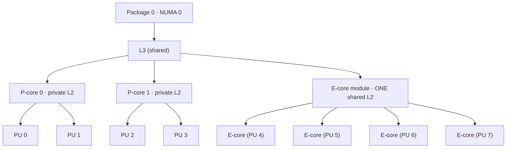

**Multi-socket server** — multiple NUMA nodes / L3 domains; PCI devices carry NUMA
affinity (§9.1), so a NIC is local to one node.

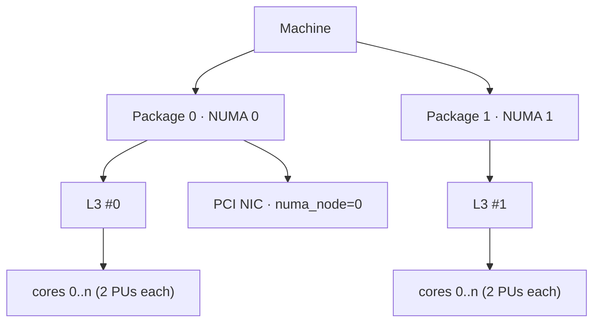

## Appendix C: Mapping Tables

**Policy vocabulary across ecosystems.**

| This design | K8s CPUManager / TopologyManager | KubeVirt VMI | Margo requiredResources |
|---|---|---|---|
| `cpu_policy: dedicated` (`static` in the `/persist` spelling, §4.3) | static CPU manager policy | `dedicatedCpuPlacement: true` + Guaranteed QoS | `type: isolated` |
| `full-pcpus-only` | `full-pcpus-only` policy option | whole-core via QoS + policy | cpu `type` / SMT expectation |
| `threads_per_core: 2` (whole-core-SMT) | SMT — both siblings | guest `threads=2` | — |
| `threads_per_core: 1` (one-per-core) | `distribute-cpus-across-cores` | guest `threads=1` | — |
| NUMA `single-numa-node` (and `restricted`, which resolves identically today — §9.2) | TopologyManager `single-numa-node` / `restricted` | `cpu.numa` guest passthrough | NUMA awareness |
| `io_placement: housekeeping` | emulator/IO off hot cores | `isolateEmulatorThread: true` | — |
| isolation tier `hard` | `isolcpus`/`nohz_full` (OpenShift PerformanceProfile) | `cpu.realtime` | isolation level (*proposed*) |
| `disruption_policy: protect` | PodDisruptionBudget | PDB | request-permission-to-interrupt |

**Placement-quality signal → variant surface.**

| Signal (§9.3) | eve-kvm | eve-k |
|---|---|---|
| `optimal` | status field on app info | pod running + condition |
| `degraded` | status field on app info — *unreachable today* (§9.3, §17) | pod running + condition |
| `needs-repack` | per-app `restart` (existing) | descheduler / operator (respects PDB) |
| `needs-reboot` | node reboot + EFI cmdline — *hard tier, not Phase 1* | drain + upgrade-controller |
| `insufficient` | domain error, not started — an error code, not a quality value | pod `Pending` + condition |

Note that no quality value reaches the controller on eve-kvm yet: the signal is computed
device-side but not forwarded to app info (§9.3).

## Appendix D: Code Map

*Implementer reference — where each concept is realized in `pkg/pillar`. This appendix
points at the codebase; the design chapters above stand on their own.*

| Concept | Location |
|---|---|
| Topology discovery (sysfs), placement model | `cputopology/sysfs.go` (`DiscoverTopology`, flat fallback), `cputopology/topology.go` (`(socket, core_id)` grouping) |
| Allocator | `cpuallocator/placement.go` (`Placer`: `Allocate`, `AllocateShared`, `Free`, `FreeCPUs`, `Reserve`, `DedicatedSet`; `PinMode`, `NUMAPolicy`, `Status`) |
| Batch planner + objective | `cpuallocator/plan.go` (`Plan`, `constraintRank`, `Score`, `Score.WorseThan`) |
| Placement-intent types & error-code registry | `types/cpuplacement.go` (`CPUPlacementPolicy`, `IsTopologyAware`, `EffectiveThreadsPerCore`, `CPUPlacementQuality`), `types/errorcodes.go` |
| Config intake (wire enums → types) | `cmd/zedagent/parsecpuplacement.go` |
| Per-workload policy resolution | `cmd/domainmgr/placementpolicy.go` (`placementFor`, `resolvePlacement`, `numaPolicyFor`, `validateVCPUCount`, `placementErrorCode`) |
| `/persist` operator override (fallback only) | `cmd/domainmgr/pinningconfig.go` (`/persist/pinning/config.json`, `none`/`static` spelling) |
| Demand set (what the plan covers) | `types/cpuplacement.go` (`CPUDemandSet`, `AppCPUDemand`), published by `cmd/zedmanager/cpudemand.go` (`publishCPUDemandSet`) — every app *intended to run*, so planning does not depend on which app's volumes resolved first |
| Plan computation, claim, and `/run` mirror | `cmd/domainmgr/cpuplan.go` (`plannedIntents`, `planPinnedPlacement`, `claimPlannedPlacement`, `publishCPUPlan` → `/run/domainmgr/cpuplan.json`, diagnostics only) |
| Types (guest topology, ordered/emulator CPUs, quality) | `types/domainmgrtypes.go` (`CPUTopology`, `VMTopology`, `OrderedCPUs`, `EmulatorCPUs`, `PlacementQuality`) |
| Allocation wiring | `cmd/domainmgr/domainmgr.go` (`assignCPUs`, `releaseCPUs`, `housekeepingCPUs`, `seedPlacerFromStatus`, `setCgroupCpuset`) |
| KVM enforcement | `hypervisor/kvm.go` (guest `-smp`, iothread, legacy `-object thread-context`), `hypervisor/pinning.go` (QMP + `sched_setaffinity`, ordering rationale), `hypervisor/qmp.go` (`query-cpus-fast`) |
| Container cpuset (same allocator output) | `containerd/oci.go` (`Linux.Resources.CPU.Cpus`) |
| KubeVirt backend | `hypervisor/kubevirt.go` (`CreateReplicaVMIConfig`) |
| dom0 / housekeeping reservation | `pkg/dom0-ztools/rootfs/etc/init.d/010-eve-cgroup`; `eve_max_vcpus` |
| HwInventory reporting | `hardware/inventory.go` (logical-CPU enumeration, `CPUCapabilities`, `NodeCapabilities`), `hardware/cpudetails.go` (`readCacheDomains`, `cpuFrequencies`, `isolatedCPUSets`), `cmd/zedagent/hardwareinfo.go` |
| Software-capability reporting | `cmd/zedagent/reportinfo.go` (`api_capability`, `getOptionalCapabilities`) |
| Kernel-cmdline isolation | EFI var `eve-kernel-extra-cmdline`; grub `set_append_extra_efi_cmdline` (`pkg/grub/rootfs.cfg`). Pillar-side helper `utils/efi/efivar.go` exists but has no callers — **read the import hazard in §8.2 before wiring it up**. (`set_isolcpus` is a separate manual PREEMPT_RT menuentry, not this path.) |
| Tests | `cputopology/{topology,sysfs}_test.go`, `cpuallocator/{placement,plan}_test.go`, `cmd/domainmgr/placementpolicy_test.go`, e2e `evetest/tests/apps/cpuplacement_test.go` |
