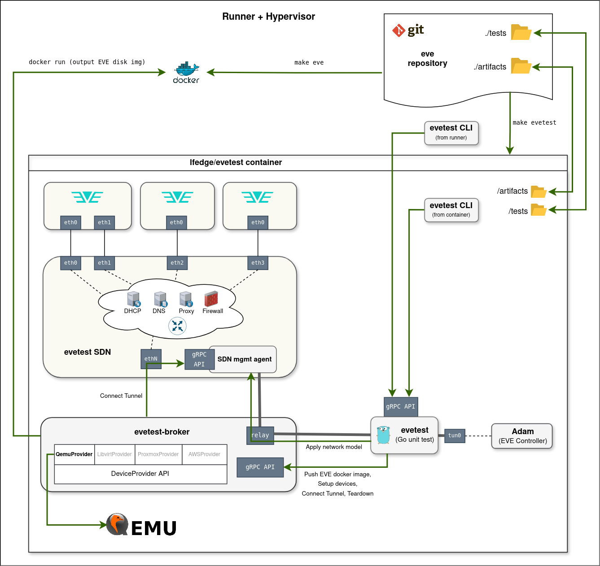
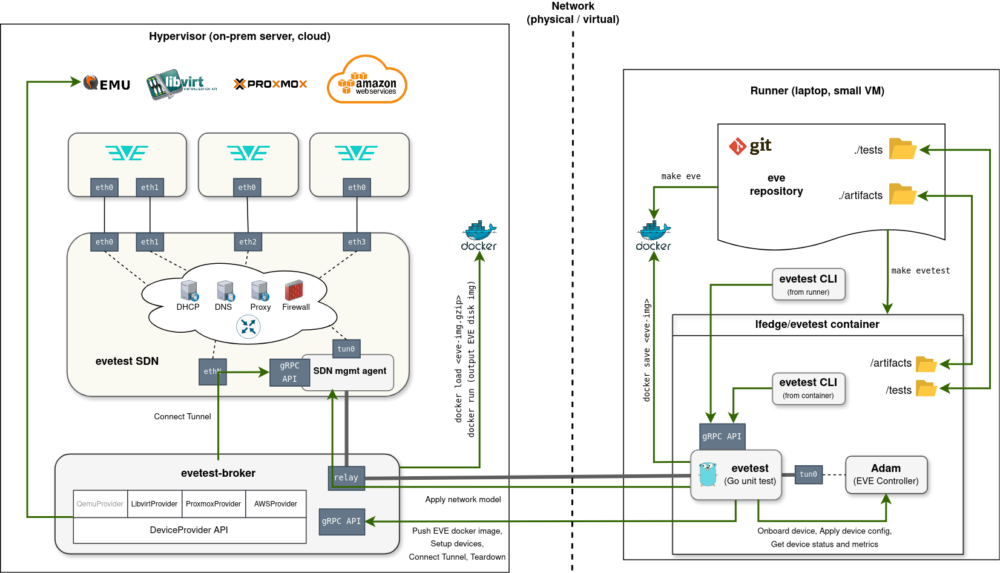
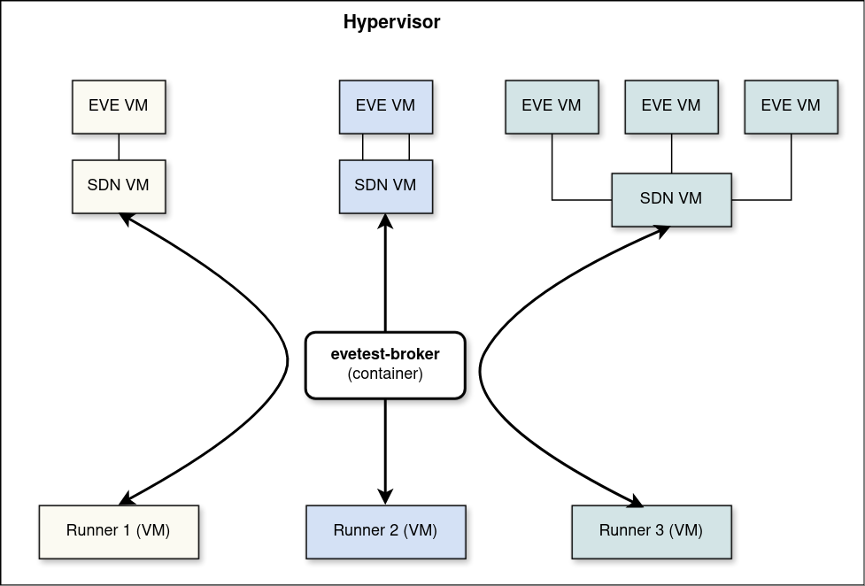

# EVETest Framework

EVETest (or simply "evetest") is a next-generation integration testing framework
for [EVE-OS](https://github.com/lf-edge/eve), designed to replace
[Eden](https://github.com/lf-edge/eden). It enables comprehensive integration testing
using virtualization, supports complex network scenarios via a programmable SDN,
and provides a simplified developer experience.

Tests are standard Go tests that live in the EVE repository alongside the code they
test. Running a test requires a single command:

```bash
make evetest NAME=<test-name>
```

## Prerequisites

- **GNU Make**
- **Docker (or compatible container runtime)**
- **EVE container image** already built (`make eve` from the EVE repo root), or a
  published `lfedge/eve` image matching the version you want to test
- **Go 1.25+** (only needed if installing the evetest CLI locally)
- **Nested virtualization** support in your CPU/hypervisor (for all-in-one mode)

**macOS note:** the test container is a Linux container and runs normally under Docker
Desktop. However, Docker Desktop's Linux VM does not support nested virtualization, so
`/dev/kvm` is never available inside containers on macOS. QEMU falls back to TCG
software emulation, which is significantly slower than KVM -- tests may take much longer
to complete or time out. On Apple Silicon, EVE must be built for `arm64` (`make eve`
produces the correct architecture automatically).

## Quick Start

```bash
# From the EVE repository root

# 1. Build the EVE image (if testing local changes)
make eve                                 # from repo root

# 2. List available tests and test suites (with their configurable parameters)
make list-tests                          # from evetest/
make evetest-list-tests                  # from repo root

# 3. Run the test
#    Execution can be customized using EVETEST_* environment variables.
#    The NAME variable (or EVETEST_NAME) is mandatory and must reference
#    the name of a test or test suite in the ./tests directory.
EVETEST_LOG_LEVEL=debug make evetest NAME=TestBootstrapWithLastResort  # from repo root or inside evetest/

# 3. (Optional) Pipe through gotestfmt for pretty output
go install github.com/gotesttools/gotestfmt/v2/cmd/gotestfmt@latest
EVETEST_LOG_LEVEL=debug EVETEST_OUTPUT_FORMAT=json make evetest NAME=TestBootstrapWithLastResort | gotestfmt
```

## Writing Tests

### Test Structure

Every test follows the same pattern:

```go
func TestMyFeature(test *testing.T) {
    // 1. Initialize the framework and obtain a wrapped test handle for assertions.
    //    Use this handle instead of the original test object.
    //    Ensure resources are released at the end.
    evetestT := evetest.Init(test)
    defer evetest.Close()

    // 2. (Optional) Define configurable parameters.
    //    You can use existing parameters (e.g., HypervisorParameter) or define
    //    new test-specific parameters via TestParameterDefinition.
    //    Parameters can be set through environment variables
    //    (`EVETEST_<param-key>`) or assigned directly within a test suite.
    evetest.DefineTestParameters(
        evetest.HypervisorParameter(),
        evetest.TestParameterDefinition{
            Key:          "MY_BOOL_PARAM",
            DefaultValue: false,
            Description: evetest.TestParameterDescription{
                Summary: "Enable some feature",
                Default: "false",
            },
        },
        evetest.TestParameterDefinition{
            Key:          "MY_ENUM_PARAM",
            DefaultValue: MyEnumValueA,
            Description: evetest.TestParameterDescription{
                Summary:       "Select operating mode",
                Default:       "mode-a",
                AllowedValues: "mode-a|mode-b|mode-c",
            },
        },
    )

    // 3. (Optional) Get parameter values set for this test execution.
    hypervisor := evetest.GetHypervisorParameterValue()
    myParamValue := evetest.GetTestParameter[string]("MY_PARAM")

    // 4. Specify required devices and network model, then call Setup.
    //    Test is skipped if requirements cannot be satisfied.
    evetest.Setup(
        evetest.RequireEdgeDevice{
            Name:           "dev1",
            MinCPUs:        4,
            WithHypervisor: evetest.GetHypervisorParameterValue(),
        },
        evetest.RequireNetworkModel{
            NetworkModel: netmodels.SingleEthWithDHCP,
        },
        evetest.RequireInternetConnectivity{}
    )

    // 5. Obtain a handle to the device and interact with it.
    //    Multiple devices can also be requested and used (e.g., for clustering tests).
    device := evetest.GetEdgeDevice("dev1")
    devUpdates, stopDevWatch := device.WatchDeviceInfo()
    defer stopDevWatch()

    // 6. Build and apply the device configuration.
    devConfig := evetest.NewEdgeDeviceConfig("dev1")
    dhcpNet := devConfig.AddNetwork(evetest.DHCPNetworkConfig{
        NetworkType: evecommon.NetworkType_V4,
    })
    devConfig.AddNetworkAdapter(evetest.NetworkAdapterConfig{
        LogicalLabel:  "eth0",
        PhysicalLabel: "eth0",
        InterfaceName: "eth0",
        NetworkUUID:   dhcpNet,
        Usage:         evecommon.PhyIoMemberUsage_PhyIoUsageMgmtAndApps,
    })
    device.ApplyConfig(devConfig, true, true)

    // 7. (Optional) Insert checkpoints at key points in the test to aid debugging
    //    and inspection. You can stop the test at a checkpoint to examine the
    //    EVE device state and other runtime information through evetest CLI.
    evetest.Checkpoint("config-applied")

    // 8. Perform assertions against EVE API messages published to the controller.
    // Any assertion framework can be used; Gomega is shown as an example.
    t := NewGomegaWithT(evetestT)
    timeout := 3 * time.Minute
    t.Eventually(devUpdates, timeout).Should(Receive(matchers.SatisfyPredicate(
        "Device has applied and reported expected network configuration",
        func(dinfo *eveinfo.ZInfoDevice) bool {
            // Check that the controller-pushed DPC ("zedagent") is active.
            sa := dinfo.GetSystemAdapter()
            return sa != nil && sa.GetCurrentIndex() == 0 &&
                len(sa.GetStatus()) == 1 && sa.GetStatus()[0].GetKey() == "zedagent"
        })))

    // Continue repeating steps 6–8 as needed to test the desired scenario.
}
```

### Init and Close

`evetest.Init(t)` initializes the framework: it starts the Adam controller, connects
to the broker, and launches the gRPC server. It returns a **wrapped test handle** that
should be used for assertions instead of the original `testing.T`.
It must be called first in every test.

`evetest.Close()` tears down all resources. Always defer it immediately after `Init`.
When running inside a test suite, `Close` is a no-op for intermediate tests -- resources
are reused across the suite and torn down only after the last test.

### Test Parameters

Parameters make tests configurable without code changes. They are resolved in order:

1. Value set by the test suite (if running in a suite)
2. Environment variable `EVETEST_<KEY>` (e.g., `EVETEST_HYPERVISOR=kvm`)
3. Default value from the parameter definition

```go
evetest.DefineTestParameters(
    evetest.HypervisorParameter(),           // pre-defined: key "HYPERVISOR"
    evetest.FilesystemParameter(),           // pre-defined: key "FILESYSTEM"
    evetest.TPMParameter(),                  // pre-defined: key "TPM"
    evetest.TestParameterDefinition{         // custom parameter
        Key:          "MY_PARAM",
        DefaultValue: true,
        Description: evetest.TestParameterDescription{
            Summary: "Enable some feature",
            Default: "true",
        },
    },
)

hypervisor := evetest.GetHypervisorParameterValue()
myParam := evetest.GetTestParameter[bool]("MY_PARAM")
```

Custom enum-like types can implement the `FromStringer` interface
(`FromString(string) error`) to be used as parameter types.
See `HypervisorParameter` for an example.

### Test Requirements and Setup

`evetest.Setup(requirements...)` declares what the test needs. The framework handles
all the behind-the-scenes work: building EVE images (live or installer), creating VMs,
running the two-step installer boot when requested, configuring networks, waiting for
devices to boot and onboard, and establishing tunnels for seamless connectivity between
EVE devices, starting and initializing the Adam controller and the test framework itself.

**RequireEdgeDevice** -- deploy an EVE device VM:

```go
evetest.RequireEdgeDevice{
    Name:              "dev1",          // logical name to reference the device
    MinCPUs:           4,               // default: 4
    MinRAMInMiB:       8192,            // default: 8 GiB
    MinDiskSizeInMiB:  36864,           // default: 36 GiB
    WithHypervisor:    evetest.HypervisorKVM,
    WithFilesystem:    evetest.FilesystemZFS,
    WithTPM:           true,
    DeviceReusePolicy: evetest.CreateFromScratchWithLiveImage,
}
```

The `DeviceReusePolicy` controls how existing devices from a previous test (in a suite)
are handled. Devices are only reused if they also satisfy the requirements of the next
test; those that do not match the next test’s requirements are torn down and not reused.

| Policy | Behavior |
|--------|----------|
| `UseAsIs` | Keep existing state |
| `RebootEdgeDevice` | Reboot the device |
| `ResetDeviceConfig` | Clear app settings, preserve network config |
| `ResetDeviceConfigAndReboot` | Clear settings and reboot |
| `ReonboardEdgeDevice` | Force re-onboarding |
| `CreateFromScratchWithLiveImage` | Recreate VM with live image |
| `CreateFromScratchWithInstaller` | Recreate VM using installer image |

**RequireNetworkModel** -- configure the SDN network environment:

```go
evetest.RequireNetworkModel{
    NetworkModel: netmodels.SingleEthWithDHCP,
}
```

Network models are declarative descriptions of the network topology: ports, bridges,
VLANs, DHCP/DNS servers, firewalls, proxies, and more. See the `evetest/tests/netmodels/`
directory for examples, and [sdn/README.md](sdn/README.md) for the full network model
reference.

**RequireInternetConnectivity** -- verify and require Internet access:

```go
evetest.RequireInternetConnectivity{
    RequireIPv6: true,  // optional: also require IPv6
}
```

**RequireIPv6OnlyRegistryMirrors** -- for IPv6-only devices, only use configured
registry mirror addresses that are themselves IPv6 (an IPv4-only mirror is unreachable
to such a device). A registry with no IPv6 mirror configured is simply not mirrored for
that app (falls back to the real, un-mirrored registry) rather than failing or skipping
the test:

```go
evetest.RequireIPv6OnlyRegistryMirrors{}
```

If any requirement cannot be satisfied, the test is marked as skipped.

### Building and Applying Configuration

After `Setup` returns, all required devices are powered on and onboarded.
Next, build the device configuration programmatically:

```go
// Add networks
dhcpNet := devConfig.AddNetwork(evetest.DHCPNetworkConfig{...})
staticNet := devConfig.AddNetwork(evetest.StaticNetworkConfig{...})

// Add network adapters
devConfig.AddNetworkAdapter(evetest.NetworkAdapterConfig{...})

// Set device-wide config properties
devConfig.SetConfigProperties(cfgProps)

// Apply and wait for the device to fetch and confirm the config.
// waitUntilFetched=true: wait for EVE to request the config from the controller.
// waitUntilConfirmed=true: also wait for EVE to report LastProcessedConfig >= configTimestamp.
device := evetest.GetEdgeDevice("dev1")
device.ApplyConfig(devConfig, true, true)
```

You can modify and re-apply the configuration multiple times during a test to verify
how EVE reacts to configuration changes.

### Interacting with Devices

The `EdgeDevice` object provides methods for interacting with the running EVE device:

```go
device := evetest.GetEdgeDevice("dev1")

// Run commands via SSH
stdout, stderr, err := device.RunShellScript("uptime", timeout, stdoutWatchdogTimeout)

// Read EVE's internal published state (pubsub)
var dpcl pillartypes.DevicePortConfigList
evetest.ReadPublication(device, "nim", true, "global", &dpcl)

// Read all publications of a type
items := evetest.ReadAllPublications[pillartypes.AppInstanceStatus](
    device, "zedmanager", false)

// Get the latest device info/metrics (or nil if not yet received)
info := device.GetDeviceInfo()
metrics := device.GetDeviceMetrics()

// Watch for info/metrics updates in real-time
updates, stop := device.WatchDeviceInfo()
defer stop()
for msg := range updates { ... }

// Apply configuration changes
device.ApplyConfig(newConfig, true, true)

// Reboot (pass true to wait until the device comes back up)
device.SoftReboot(true)
device.HardReboot(true)
```

### Checkpoints

Insert named checkpoints to create pause points for interactive debugging:

```go
evetest.Checkpoint("setup-done")
// ... more test logic ...
evetest.Checkpoint("config-applied")
// ... more test logic ...
evetest.Checkpoint("another-import-point-of-tested-scenario")
```

When `EVETEST_PAUSE_ON_CHECKPOINT` matches a checkpoint name, the test pauses there.
Use the CLI to inspect state, then run `evetest continue` to resume.

### Guidelines

- **Document the test** in its function comment: state the objective, the network model
  used and why, the device configuration, the test phases (numbered), and any parameters.
  Look at existing fully-implemented tests for the expected structure.

- **Focus on important use cases**, not on maximizing code-line coverage. A test that
  exercises a realistic end-to-end scenario is more valuable than one that reaches a high
  line count by poking at internal helpers.

- **Assert against the EVE API** (device info, metrics, publications) rather than
  implementation details that may change between EVE versions. Avoid SSH-ing into EVE to
  read internal state files. The exception is Linux-standard files that do not change
  between EVE versions (e.g., `/etc/resolv.conf`).

- **Shorten timers** by setting config properties (e.g., `timer.*`) to smaller values
  wherever EVE allows it, to reduce overall test duration. Be aware that some timers have
  a hard minimum floor that cannot be overridden.

- **Use `Eventually` for all device-state assertions.** Everything in EVE is processed
  asynchronously. For example, an acknowledgment from Adam that config was received does
  not mean it has been fully applied — it still has to trickle through multiple
  microservices. Similarly, an app reaching the ONLINE state does not mean it has fully
  booted, received an IP address, or is reachable over SSH.

- **Prefer channel-based watches** (`WatchDeviceInfo`, `WatchAppInfo`,
  `WatchNetworkInstanceInfo`, etc.) over periodic polling with short intervals. Each
  polling call reloads all previously published messages of that type from Adam, which is
  both slow and redundant; channel-based watches deliver only new messages as they arrive.

- **For set/list comparisons** use `pkg/pillar/utils/generics` (e.g.,
  `generics.EqualSets`); for network address comparisons use
  `pkg/pillar/utils/netutils/ip.go`.

- **Reuse existing network models** from `evetest/netmodels/`. When adding a new model,
  keep it general-purpose — describe it in terms of topology, not the specific test that
  first needed it, so it can be reused across scenarios.

- **Order tests in a suite** to maximize device reuse: group tests that share device and
  network requirements so the framework can reuse existing VMs instead of recreating them
  between tests.

- **Place a checkpoint** after every significant configuration or state change. This
  creates a named pause point targetable with `EVETEST_PAUSE_ON_CHECKPOINT` for
  interactive inspection.

- **Use parameters instead of copy-pasting tests.** When two variants differ only in a
  few values/steps, define a `TestParameterDefinition` and register suite variants with
  different `TestParameterValue` entries instead of duplicating the entire test body.

- **Use `evetest.Logger()`** for all log output inside tests; its formatting is
  consistent with the rest of the framework.

- **Register the new test in the suite.** After writing a test function, add it to the
  appropriate `RunTestSuite` call in `testsuite_test.go` in the same package.

- **Reuse existing package-level helpers** before writing new ones. Each test package
  has shared helpers for common patterns — for example the networking package has
  `getDevicePort`, `getCurrentDPC`, `appHasError`, `niHasError`. Check the other
  `_test.go` files in the package before duplicating logic.

- **Do not mutate shared global state.** If a test needs to modify a package-level
  variable (e.g. a network model defined in `evetest/netmodels/`), operate on a deep
  copy, or make sure to revert the change before the test returns. Unreverted mutations
  will silently affect subsequent tests in the same suite.

- **Use Gomega for assertions.** The framework does not impose an assertion library, but
  Gomega is recommended — all existing tests use it and the `evetest/matchers/` package
  provides evetest-specific Gomega matchers. In particular, use
  `matchers.SatisfyPredicate` when passing a predicate to `Eventually`: it attaches a
  human-readable description to the predicate and supports `.StopIf(fn)` to fail fast on
  unrecoverable errors instead of waiting out the full timeout.

## Test Suites

Test suites group multiple tests for sequential execution with resource reuse.
When tests in a suite share similar requirements, the framework reuses existing VMs
instead of recreating them for each test.

```go
func TestBootstrapSuite(test *testing.T) {
    evetest.Init(test)
    defer evetest.Close()

    // Suite-wide parameters (override individual test defaults)
    evetest.DefineTestParameters(
        evetest.HypervisorParameter(),
    )

    evetest.RunTestSuite(
        evetest.TestCase{
            Test: TestBootstrapWithLastResort,
            Variants: []evetest.TestVariant{
                {
                    Name: "LastResortDisabled",
                    Parameters: []evetest.TestParameterValue{
                        {Key: "LAST_RESORT_ENABLED", Value: false},
                    },
                },
                {
                    Name: "LastResortEnabled",
                    Parameters: []evetest.TestParameterValue{
                        {Key: "LAST_RESORT_ENABLED", Value: true},
                    },
                },
            },
        },
        evetest.TestCase{
            Test: TestDHCPIPv4Only,  // no variants: runs once with defaults
        },
    )
}
```

Each variant runs as a Go subtest (`t.Run`). The `EVETEST_SUITE_MAX_FAILURES` variable
controls early termination: `1` (default) aborts after the first failure, `-1` runs
all tests regardless of failures.

Run a suite like any other test:

```bash
make evetest NAME=TestBootstrapSuite
```

## Running Tests

### Basic Usage

```bash
# Run a single test
make evetest NAME=TestBootstrapWithLastResort

# Run a test suite
make evetest NAME=TestBootstrapSuite

# With debug logging and formatted output
EVETEST_LOG_LEVEL=debug make evetest NAME=TestBootstrapSuite | gotestfmt

# With a specific EVE version
EVETEST_EVE_VERSION=0.0.0-my-branch-abc123 \
    make evetest NAME=TestDHCPIPv4Only

# Collect artifacts (logs, Adam DB snapshot, collect-info from each device on failure, etc.)
EVETEST_COLLECT_ARTIFACTS=/tmp/evetest-artifacts \
    make evetest NAME=TestDHCPIPv4Only
```

### Code Coverage

When EVE is built with `COVER=y`, the `zedbox` binary is instrumented for
Go coverage.  Setting `EVETEST_COLLECT_COVERAGE=true` (together with
`EVETEST_COLLECT_ARTIFACTS`) tells the framework to collect coverage data:

- **Before every device reboot** (`HardReboot`, `SoftReboot`, `RequestReboot`,
  and the CLI `evetest eve hard-reboot` / `evetest eve soft-reboot`).
- **At test completion** (inside `Close()`).

For each collection the framework:

1. Sends `SIGUSR2` to `zedbox`, which flushes in-memory counters to
   `/persist/coverage` without terminating the process.
2. Polls for new `.covcounters` files (up to 30 s).
3. SCP-copies the files to `${EVETEST_COLLECT_ARTIFACTS}/<test-name>/coverage/<device-name>/`.

Because Go names counter files as `covcounters.<hash>.<pid>.<nanotime>`, all
collections for a device accumulate in the same directory without conflicts.

#### Building EVE with coverage

```bash
# Build coverage-instrumented pillar first (required):
make COVER=y pkg/pillar

# Then build the eve image.
make COVER=y eve
```

#### Running with coverage collection

```bash
EVETEST_COLLECT_ARTIFACTS=/tmp/evetest-artifacts \
EVETEST_COLLECT_COVERAGE=true \
    make evetest NAME=TestDHCPIPv4Only
```

Coverage files land in
`${EVETEST_COLLECT_ARTIFACTS}/TestDHCPIPv4Only-<timestamp>/coverage/edge-dev/`.

#### Merging and viewing results

After the test, merge all counter files with the Go toolchain and convert to a
human-readable HTML report:

```bash
COVDIR=${EVETEST_COLLECT_ARTIFACTS}/<testname>-<timestamp>/coverage/<device-name>

# Merge all counter files into a single dataset
mkdir -p /tmp/merged-coverage
go tool covdata merge -i "$COVDIR" -o /tmp/merged-coverage

# Show per-package coverage percentages
go tool covdata percent -i /tmp/merged-coverage

# Convert to the legacy text profile format
go tool covdata textfmt -i /tmp/merged-coverage -o /tmp/coverage.txt

# Show overall total coverage
go tool cover -func=/tmp/coverage.txt | tail -1

# Open an HTML report in the browser
go tool cover -html=/tmp/coverage.txt
```

To merge across all sub-tests and all devices, use `find` to collect every per-device
directory that lives under any `coverage/` tree:

```bash
mkdir -p /tmp/merged-coverage
go tool covdata merge \
    -i "$(find ${EVETEST_COLLECT_ARTIFACTS} -path '*/coverage/*' -type d | paste -sd,)" \
    -o /tmp/merged-coverage
```

The `-path '*/coverage/*'` pattern matches directories one level below any `coverage/`
directory, which are the per-device subdirectories.

### Debugging with Pause

**Pause on failure** -- when a test fails, the environment stays up for inspection:

```bash
EVETEST_PAUSE_ON_FAILURE=true make evetest NAME=TestDHCPIPv4Only

# In another terminal:
evetest status            # see what happened
evetest eve ssh           # SSH into the EVE device
evetest eve logs -f       # tail logs
evetest continue          # let the test tear down
# or
evetest exit              # tear down and exit immediately
```

**Pause on checkpoint** -- stop at a specific point in the test:

```bash
EVETEST_PAUSE_ON_CHECKPOINT=config-applied \
    make evetest NAME=TestBootstrapWithLastResort

# In another terminal:
evetest eve config        # inspect the submitted config
evetest eve info          # check device status
evetest continue          # resume the test
# or
evetest continue --until setup-done  # resume until a different checkpoint
```

## Command Line Interface

The CLI provides runtime interaction with a running evetest instance. It communicates
via gRPC with the evetest container.

Install it on your host:

```bash
make install-cli
```

Or use it from inside the container (`docker exec -it evetest-<API-port> bash`).

The CLI can also be used from a **remote machine** (e.g. a developer's laptop while
the test runs inside a self-hosted CI runner). Set `EVETEST_API_ADDRESS` to the IP
or hostname of the machine running the evetest container, and `EVETEST_API_PORT` if
a non-default port is used:

```bash
export EVETEST_API_ADDRESS=192.168.1.50   # IP of the machine running evetest
export EVETEST_API_PORT=50021             # omit if using the default

evetest status
evetest eve ssh
evetest eve console
```

All CLI commands work in remote mode, including interactive ones (`ssh`, `scp`,
`console`, `portfwd`), which are tunneled over the gRPC connection, thus no additional
ports need to be reachable.

### Shell Auto-Completion

```bash
# bash
evetest completion bash > evetest-completion.bash
sudo mv evetest-completion.bash /etc/bash_completion.d/evetest

# zsh
evetest completion zsh > ~/.zsh/completions/_evetest

# fish
evetest completion fish > ~/.config/fish/completions/evetest.fish
```

### Test Control

```bash
evetest status                          # current test status
evetest continue                        # resume a paused test
evetest continue --until <checkpoint>   # resume until a specific checkpoint
evetest exit                            # tear down and exit
```

### EVE Device Commands

All EVE commands accept `--devicename <name>` (defaults to the first device).

```bash
evetest eve info [-f]                   # device info (follow with -f)
evetest eve metrics [-f]                # device metrics
evetest eve logs [-f]                   # device logs
evetest eve config                      # get current device config
evetest eve console-output              # full console/boot log

evetest eve app-info <app> [-f]         # application info
evetest eve app-metrics <app> [-f]      # application metrics
evetest eve app-logs <app> [-f]         # application logs
evetest eve flow-logs <app> [-f]        # application flow logs
evetest eve ni-info <ni> [-f]           # network instance info
evetest eve ni-metrics <ni> [-f]        # network instance metrics

evetest eve ssh [command...]            # SSH into EVE device
evetest eve scp --from-device src dst   # copy files from EVE
evetest eve scp --to-device src dst     # copy files to EVE
evetest eve console                     # enter interactive console (telnet)
evetest eve collect-info                # collect diagnostic tarball
evetest eve kubectl [kubectl-args...]   # interact with K3s running on EVE-k

evetest eve hard-reboot                 # hard reboot
evetest eve soft-reboot                 # soft reboot
```

### SDN Commands

```bash
evetest sdn status                      # SDN status and config errors
evetest sdn net-model                   # current network model
evetest sdn graph                       # config graph (Graphviz dot)
evetest sdn logs                        # stream SDN logs
evetest sdn ssh [command...]            # SSH into SDN VM
```

### Cluster Commands

```bash
evetest cluster info [-f]               # Kubernetes cluster info
evetest cluster metrics [-f]            # Kubernetes cluster metrics
```

## Configuration

All configuration is done through environment variables; there are no configuration files.
The framework provides sensible defaults; you only need to set variables when you want
non-default behavior.

### Essential Variables

| Variable | Description | Default |
|----------|-------------|---------|
| `EVETEST_NAME` | Test or suite name to run (**required**) | -- |
| `EVETEST_OUTPUT_FORMAT` | `go test` output format: `json` (machine-readable, for `gotestfmt`) or `quiet` (compact, no `-v`); default is verbose (`-v`). **Do not combine `quiet` with `EVETEST_PAUSE_ON_FAILURE` or `EVETEST_PAUSE_ON_CHECKPOINT`** — without `-v`, `go test` buffers all output until the test completes, so a pause appears frozen with no visible output. | -- |
| `EVETEST_EVE_VERSION` | EVE version to test | current repo HEAD |
| `EVETEST_PREFERRED_ARCH` | Preferred CPU architecture (`amd64`, `arm64`) | `amd64` |
| `EVETEST_LOG_LEVEL` | Framework log level (`debug`, `info`, `warn`) | `info` |
| `EVETEST_COLLECT_ARTIFACTS` | Host path for artifacts (logs, collect-info) | -- |
| `EVETEST_COLLECT_COVERAGE` | Collect Go coverage profiles (requires `EVETEST_COLLECT_ARTIFACTS` and EVE built with `COVER=y`) | `false` |
| `EVETEST_REGISTRY_MIRROR_DOCKER` | Pull-through cache URL(s) for docker.io — one or more comma-separated `[scheme://]host:port[/path]` (IPv6 hosts bracketed, e.g. `http://[fd11::5]:5000`); see `RequireIPv6OnlyRegistryMirrors` | -- |
| `EVETEST_REGISTRY_MIRROR_GHCR` | Pull-through cache URL(s) for ghcr.io | -- |
| `EVETEST_REGISTRY_MIRROR_QUAY` | Pull-through cache URL(s) for quay.io | -- |
| `EVETEST_REGISTRY_MIRROR_K8S` | Pull-through cache URL(s) for registry.k8s.io | -- |
| `EVETEST_REGISTRY_MIRROR_GCR` | Pull-through cache URL(s) for gcr.io | -- |
| `EVETEST_REGISTRY_MIRROR_MCR` | Pull-through cache URL(s) for mcr.microsoft.com | -- |

### Debugging Variables

| Variable | Description | Default |
|----------|-------------|---------|
| `EVETEST_PAUSE_ON_FAILURE` | Pause when a test fails | `false` |
| `EVETEST_PAUSE_ON_CHECKPOINT` | Pause at the named checkpoint | -- |
| `EVETEST_SUITE_MAX_FAILURES` | Max failures before aborting suite (`-1` = unlimited) | `1` |

### Deployment Variables

| Variable | Description | Default |
|----------|-------------|---------|
| `EVETEST_BROKER_ADDRESS` | Broker IP (unset = embedded broker) | -- |
| `EVETEST_BROKER_PORT` | Broker gRPC port | `50221` |
| `EVETEST_BROKER_DEVICE_PROVIDER` | `qemu`, `libvirt`, or `proxmox` | `libvirt` |
| `EVETEST_API_PORT` | gRPC API port exposed by evetest container | `50021` |
| `EVETEST_API_ADDRESS` | IP/hostname of the machine running the evetest container, used by the CLI to connect remotely (unset = `localhost`) | -- |

When running multiple evetests in parallel on the same host, each test must use
a different `EVETEST_API_PORT` to avoid port conflicts.
When running the `evetest` CLI against an instance using a non-default API port or
on a remote machine, set `EVETEST_API_PORT` and/or `EVETEST_API_ADDRESS` in the
same terminal session beforehand.

### Version Overrides

| Variable | Description | Default |
|----------|-------------|---------|
| `EVETEST_ORG` | Docker Hub organization for evetest and evetest-broker images | `lfedge` |
| `EVETEST_EVE_REPO` | EVE image repository | `lfedge/eve` |
| `EVETEST_ADAM_VERSION` | Adam controller version | `0.0.75` |
| `EVETEST_SDN_VERSION` | SDN emulator version | `v0.0.1` |

### Broker Variables (for distributed mode)

These are read by `evetest-broker` itself, not the evetest container -- set them in the
broker's own environment (`make libvirt-run-broker-container`, or the Proxmox broker
VM's `/etc/evetest/broker.env`, written by the [Proxmox broker
installer](deploy/proxmox/README.md)). Which ones apply depends on
`EVETEST_BROKER_DEVICE_PROVIDER`.

Common to every provider:

| Variable | Description | Default |
|----------|-------------|---------|
| `EVETEST_BROKER_IMAGE_DIR` | VM image storage directory | `$HOME/.evetest` (all-in-one / qemu provider), `/home/eve-broker/images` (libvirt provider; created and configured by `make libvirt-setup-broker-user`), `/root/.evetest/images` (proxmox provider; set by the Proxmox broker installer) |
| `EVETEST_SDN_UPLINK_IPV4_SUBNET` | IPv4 subnet for SDN uplink | `192.168.170.0/24` |
| `EVETEST_SDN_UPLINK_IPV6_SUBNET` | IPv6 subnet for SDN uplink | `fd11:778b:03dd:2222::/64` |
| `EVETEST_BROKER_PROXY_CA_CHAIN` | Proxy CA certificate chain file | -- |
| `EVETEST_BROKER_MAX_CLIENTS` | Max concurrent evetest clients the broker will accept; new connections are rejected with an error once this many are already connected (reconnects of existing clients are never blocked) | `-1` (unlimited) |
| `EVETEST_BROKER_DOCKER_IMAGE_RETENTION` | How long, in minutes, an unused, evetest-managed Docker image (one the broker itself pulled or built) is kept before the broker's periodic cleanup removes it | `10080` (7 days) |
| `EVETEST_BROKER_DOCKER_DISK_USAGE_THRESHOLD` | Disk usage percent (on the filesystem backing Docker's storage) at or above which the broker aggressively evicts the oldest unused, evetest-managed Docker images, regardless of the retention setting above | `80` |
| `EVETEST_BROKER_PPROF_PORT` | Port for the broker's `net/http/pprof` debug endpoint (listens on all interfaces); `0` disables it | `0` (disabled) |

**`libvirt` provider only:**

| Variable | Description | Default |
|----------|-------------|---------|
| `EVETEST_BROKER_LIBVIRT_URI` | Libvirt connection URI (not yet configurable -- the provider always uses this value) | `qemu:///system` |

**`proxmox` provider only** (see [deploy/proxmox/README.md](deploy/proxmox/README.md)
for the full setup guide; in normal use these are generated for you by the Proxmox
broker installer, not set by hand):

| Variable | Description | Default |
|----------|-------------|---------|
| `EVETEST_BROKER_PROXMOX_API_URL` | Proxmox VE REST API base URL, e.g. `https://192.168.1.50:8006/api2/json` | -- (required) |
| `EVETEST_BROKER_PROXMOX_PASSWORD` | Password for the `root@pam` Proxmox user. Must be the literal `root@pam` account, not an API token -- Proxmox hardcodes some VM options (`hookscript`, `args`) as settable only by a real `root@pam` session regardless of a token's ACLs | -- (required) |
| `EVETEST_BROKER_PROXMOX_NODE` | Proxmox node name to create VMs on | auto-detected on a single-node install; required for multi-node clusters |
| `EVETEST_BROKER_PROXMOX_STORAGE` | Proxmox storage ID used for VM disks, e.g. `local-lvm` | -- (required) |
| `EVETEST_BROKER_PROXMOX_IMPORT_STORAGE` | Proxmox storage ID (with the `import` content type enabled) that VM disk images are uploaded to before being imported into VM disk storage | `local` |
| `EVETEST_BROKER_PROXMOX_TLS_SKIP_VERIFY` | Disable TLS certificate verification for the Proxmox API connection (useful with the default self-signed PVE certificate) | `false` |

## Deployment Modes

### All-in-One Mode

In all-in-one mode, everything runs within a single Docker container: the test runner,
Adam controller, an embedded broker, and all VMs (EVE + SDN) are created using QEMU
inside the container.

This is the default mode when `EVETEST_BROKER_ADDRESS` is not set.



```bash
make evetest NAME=TestDHCPIPv4Only
```

The container is started with `NET_ADMIN` capability and access to the Docker socket.
`/dev/kvm` is passed through when available (on Linux with KVM support; not available
on macOS, where Docker Desktop's Linux VM does not support nested virtualization).
Without KVM, QEMU falls back to TCG software emulation.
The embedded broker uses QEMU directly to start and manage EVE and SDN VMs.

Best for:

- Local development on laptops
- Learning the framework and experimenting with tests
- Quick iteration during test development
- Scenarios where you don't have access to a remote hypervisor

Requires nested virtualization support.

### Distributed Mode

In distributed mode, the evetest container runs on one machine (a CI runner or your
laptop) while the broker runs on a separate, (typically more powerful) hypervisor server.
EVE VMs run directly on the host hypervisor, avoiding nested virtualization
(which would occur in All-in-One Mode when executed inside a virtualized CI runner).

The broker uses a device provider (`libvirt` or `proxmox`; see [Broker
(`evetest-broker`)](#broker-evetest-broker) below) to create VMs and acts as a tunnel
proxy, forwarding IP packets between the evetest container and the SDN VM. From the
test's perspective, this is transparent -- the same test code works in both modes.



With the **libvirt** provider, the broker runs as a container on the hypervisor host
itself:

```bash
# One-time setup on the hypervisor server:
sudo make libvirt-setup-broker-user
make libvirt-run-broker-container

# On the runner/laptop (192.168.1.100 is example of the server IP address):
EVETEST_BROKER_ADDRESS=192.168.1.100 make evetest NAME=TestDHCPIPv4Only
```

With the **proxmox** provider, the broker instead runs inside a VM on the Proxmox
host, talking to the Proxmox API to create/manage EVE and SDN VMs -- see
[deploy/proxmox/README.md](deploy/proxmox/README.md) for the installer that sets this
up end to end (no manual broker setup step; it prints the `EVETEST_BROKER_ADDRESS` to
use once ready).

Best for:

- CI/CD pipelines (small runners, powerful hypervisors)
- Multiple developers/CI jobs sharing the same hypervisor infrastructure
- Resource-intensive tests (multi-device, cluster testing)

Multiple evetest instances can connect to the same broker concurrently. The broker
tracks resources per client and ensures isolation between concurrent tests.

Example: Running Evetest on a CI Server



## Architecture

EVETest consists of several components that communicate over gRPC:

### EVETest Container

The container is the execution environment where tests run. Inside it you'll find:

- The **Go test binary** executing your test code
- The **[Adam controller](https://github.com/lf-edge/adam)** -- EVE's open-source
  controller implementation
- The **evetest CLI** for interactive debugging (if you prefer not to install it directly
  on your host)
- Optionally, an **embedded broker** (in all-in-one mode)

The container has the evetest framework and its dependencies baked in. Only
`evetest/tests/` and `evetest/netmodels` are mounted at runtime (allowing live test
edits without rebuilding the image). Optionally, `/artifacts` is mounted for collecting
outputs. It runs with `NET_ADMIN` capability for network configuration and tunnel
management.

Running tests inside a container ensures a consistent, isolated, and reproducible
environment. All dependencies (including QEMU) are encapsulated within the container,
eliminating version mismatch problems and preventing interference with the host system.

### Broker (`evetest-broker`)

The broker is the resource management and hypervisor abstraction layer. It translates
test requirements ("I need an EVE device with 4GB RAM and 2 network interfaces") into
actual VMs on a hypervisor.

Device management is implemented through a **provider interface**, allowing different
hypervisor backends to be plugged in and enabling future implementations for additional
platforms.

The broker currently supports the following **device providers**:

- **QEMU** — direct QEMU invocation, used in all-in-one mode
- **libvirt** — uses libvirt APIs, used in distributed mode; the broker runs as a
  container on the hypervisor host (see `make libvirt-setup-broker-user` /
  `make libvirt-run-broker-container` above). Requires CGO, which is only
  enabled for a **native** broker build (build host arch == target arch) --
  building `make build-broker-container` directly on an amd64 or arm64 host
  gets full libvirt support either way. The **published** arm64 broker image
  is *cross-compiled* from an amd64 CI runner, so it is built with
  `CGO_ENABLED=0` and falls back to a stub that returns an error if the
  libvirt provider is selected (see the note on `make build-broker-container`
  below)
- **proxmox** — uses the Proxmox VE REST API, used in distributed mode; the broker
  itself runs inside a VM on the Proxmox host, set up end to end by the installer in
  [deploy/proxmox/README.md](deploy/proxmox/README.md)

It manages the VM lifecycle (create, power on/off, reboot, destroy), caches EVE images
for reuse across tests, and acts as a tunnel proxy forwarding IP packets between the
evetest container and the SDN VM. This tunneling allows the evetest container to operate
without direct network connectivity to the VMs -- it only needs access to the broker.

### SDN (Software Defined Network)

The SDN is a lightweight LinuxKit-based VM that models physical network infrastructure
in software. It provides the network environment that EVE devices connect to.

Tests define a declarative **network model** specifying the topology: ports, bridges,
bonds, VLANs, DHCP servers, DNS servers, firewalls, HTTP proxies, SCEP servers, and
802.1X authentication. The SDN applies this model using standard Linux networking tools
(bridges, namespaces, iptables, dnsmasq, hostapd, etc.) and provides a realistic
environment for network testing.

The SDN is implemented as a VM (rather than a container) because it needs multiple
network namespaces for complex topologies and L2 connectivity with EVE VMs.

For a detailed description of the SDN architecture, network model reference, predefined
models, CLI commands, and build instructions, see [sdn/README.md](sdn/README.md).

### EVETest CLI

A Cobra-based command-line tool for interacting with running test instances. It
communicates with the evetest container via gRPC and provides commands for inspecting
device state, viewing logs, SSH access, console access, and test flow control.

The CLI can run inside the container or on the host. Remote access commands
(`ssh`, `scp`, `console`) work transparently regardless of deployment mode -- the
framework handles tunnel and proxy setup automatically.

### Adam Controller

Adam is EVE's open-source controller implementation. It runs inside the evetest
container and handles device onboarding, configuration distribution, and collection
of device info, metrics, and logs. Tests interact with EVE devices through Adam,
and the framework subscribes to Adam's data streams to keep device state up to date.

## Makefile Targets

| Target | Description |
|--------|-------------|
| `make list-tests` | List all available tests and test suites with their configurable parameters |
| `make evetest` | Run a test (requires `NAME=...`) |
| `make build-container` | Build the evetest container; set `DOCKER_PLATFORM=linux/<arch>` to cross-compile for a different architecture (Go build stage runs natively on the host, no QEMU emulation); use `DOCKER_TARGET=push` to publish to a registry instead of loading locally |
| `make build-broker-container` | Build broker Docker image only; set `DOCKER_PLATFORM=linux/<arch>` to cross-compile for a different architecture (Go build stage runs natively on the host, no QEMU emulation); CGO (and therefore the libvirt provider) is only enabled when `DOCKER_PLATFORM` matches the build host's own arch -- e.g. building on an arm64 host with the default `DOCKER_PLATFORM` gets full libvirt support, but cross-compiling to a *different* arch than the host (as CI does to publish the arm64 image from an amd64 runner) sets `CGO_ENABLED=0` and drops libvirt (qemu and proxmox providers are unaffected either way); use `DOCKER_TARGET=push` to publish to a registry instead of loading locally |
| `make build-sdn-container` | Build SDN VM container (requires linuxkit, with the `LINUXKIT` variable pointing to the binary); set `DOCKER_PLATFORM=linux/<arch>` to cross-compile for a different architecture (Go build stage runs natively on the host, no QEMU emulation); use `DOCKER_TARGET=push` to publish to a registry instead of loading locally |
| `make build-test-apps` | Build all test apps under `testapps/` by invoking each app's `build` target; supports the same `DOCKER_PLATFORM`, `DOCKER_TARGET`, and `EVETEST_ORG` variables |
| `make install-cli` | Install the `evetest` CLI binary |
| `make proto` | Regenerate protobuf Go code from `.proto` files (Docker-based) |
| `make libvirt-setup-broker-user` | One-time setup for the libvirt broker (requires sudo) |
| `make libvirt-run-broker-container` | Start the broker container for the libvirt provider (distributed mode) |
| `make proxmox-broker-installer` | Assemble the self-contained Proxmox broker installer script (see [deploy/proxmox/README.md](deploy/proxmox/README.md)) |

## Advanced Host Setup

### Pull-Through Cache (Registry Mirror)

By default, EVE pulls container images directly from the upstream registries
(docker.io, ghcr.io, quay.io, etc.). This can be slow or fail due to rate limits,
especially in CI environments or when running many tests. The `EVETEST_REGISTRY_MIRROR_*`
variables route image pulls for specific registries through a local pull-through cache.

Each variable accepts a full mirror URL including scheme and, if needed, a path
(e.g. a Harbor proxy-cache project): `[scheme://]host:port[/path]`.

> **proxmox provider:** none of the manual setup below is needed. Pass
> `--with-oci-registry-mirrors` to the [Proxmox broker
> installer](deploy/proxmox/README.md) and it runs its own pull-through cache
> containers on the broker VM and sends their addresses to every evetest client
> automatically -- no `EVETEST_REGISTRY_MIRROR_*` variables to set by hand. Set one of
> them yourself only to override a specific registry's mirror.

The mirror is applied in two places automatically:

- Application docker-datastore config: EVE is configured to pull app images from the
  per-registry mirror URL instead of the upstream registry. This applies to any registry
  that has a mirror configured.
- Containerd mirror config: for kubevirt devices, per-registry `hosts.toml` files are
  written under `/etc/containerd/certs.d/` inside the kube container before containerd
  starts, and `config_path` is added to `/etc/containerd/config-k3s.toml`. EVE's K3s
  setup uses an externally-managed containerd (not K3s-managed), so K3s's own
  `registries.yaml` is ineffective; configuring containerd directly is the correct
  approach. Only registries that have a mirror configured get a `hosts.toml` entry.
  This is a temporary solution until EVE is enhanced to allow configuring a registry
  mirror for K3s/containerd through device config.

#### Deploying Docker Registry as a Docker Hub Mirror

The official `registry:2` image can act as a pull-through cache for Docker Hub.
It is lightweight and requires no additional setup beyond a single `docker run`.

```bash
docker run -d --restart=always --name docker-hub-mirror \
  -p 5000:5000 \
  -e REGISTRY_PROXY_REMOTEURL=https://registry-1.docker.io \
  -e REGISTRY_PROXY_USERNAME=<your-dockerhub-username> \
  -e REGISTRY_PROXY_PASSWORD=<your-dockerhub-token> \
  registry:2
```

Replace `<your-dockerhub-username>` and `<your-dockerhub-token>` with a Docker Hub
personal access token (create one at hub.docker.com → Account Settings → Personal
Access Tokens). Credentials are required to avoid Docker Hub rate limits.

Run evetest with only the docker.io mirror set:

```bash
HOST_IP=$(ip route get 8.8.8.8 | awk '{for(i=1;i<=NF;i++) if($i=="src") print $(i+1); exit}')
EVETEST_REGISTRY_MIRROR_DOCKER=http://$HOST_IP:5000 make evetest NAME=MyTest
```

To check what images have been cached so far:

```bash
curl http://$HOST_IP:5000/v2/_catalog
```

> **Note:** `registry:2` only mirrors one upstream registry per instance. For other
> registries (ghcr.io, quay.io, etc.) use Harbor (see below) or separate instances
> on different ports.

#### Deploying Harbor as a Local Pull-Through Cache

[Harbor](https://goharbor.io) is an OCI-compliant registry that supports pull-through
proxy caching. The steps below deploy it locally using its Docker Compose installer.

1. Download and extract the installer

   ```bash
   wget https://github.com/goharbor/harbor/releases/latest/download/harbor-online-installer-v2.15.0.tgz
   tar xzvf harbor-online-installer-v2.15.0.tgz
   cd harbor
   ```

   Replace `v2.15.0` with the latest release from the
   [Harbor releases page](https://github.com/goharbor/harbor/releases).

2. Find your host IP

   Use the host's LAN IP so both the evetest container and EVE VMs can reach Harbor:

   ```bash
   # IP used for outbound traffic (reliable on most setups)
   HOST_IP=$(ip route get 8.8.8.8 | awk '{for(i=1;i<=NF;i++) if($i=="src") print $(i+1); exit}')
   echo $HOST_IP
   ```

3. Configure Harbor

   ```bash
   cp harbor.yml.tmpl harbor.yml
   ```

   Edit `harbor.yml`:

   - Set `hostname` to `$HOST_IP`
   - Comment out the `https:` block entirely (for a simple HTTP-only internal deployment)
   - Set a strong `harbor_admin_password`

   ```yaml
   hostname: 192.168.1.100        # replace with your $HOST_IP

   # https:                       # comment out for HTTP-only
   #   port: 443
   #   certificate: ...
   #   private_key: ...

   harbor_admin_password: MySecretPassword
   ```

4. Install and start Harbor

   ```bash
   sudo ./install.sh
   ```

   Harbor is now accessible at `http://$HOST_IP`.

5. Configure proxy cache projects in Harbor

   For each upstream registry you want to mirror, create a proxy cache project in Harbor's
   UI (`http://$HOST_IP` → Projects → New Project → check "Proxy Cache"):

   | Project name            | Registry endpoint |
   |-------------------------|---|
   | `docker-io-proxy`       | `https://hub.docker.com` |
   | `ghcr-io-proxy`         | `https://ghcr.io` |
   | `quay-io-proxy`         | `https://quay.io` |
   | `registry-k8s-io-proxy` | `https://registry.k8s.io` |
   | `gcr-io-proxy`          | `https://gcr.io` |
   |  `mcr-proxy`            | `https://mcr.microsoft.com` |

   For each one:

   - Go to **Administration → Registries → New Endpoint**, enter the endpoint URL, and save.
   - Go to **Projects → New Project**, check **Proxy Cache**, select the endpoint.
   - Set the project **Access Level** to **Public** so containerd can pull without authentication.

6. Run evetest with the mirror

   ```bash
   EVETEST_REGISTRY_MIRROR_DOCKER=http://$HOST_IP:80/docker-io-proxy \
   EVETEST_REGISTRY_MIRROR_GHCR=http://$HOST_IP:80/ghcr-io-proxy \
   EVETEST_REGISTRY_MIRROR_QUAY=http://$HOST_IP:80/quay-io-proxy \
   EVETEST_REGISTRY_MIRROR_K8S=http://$HOST_IP:80/registry-k8s-io-proxy \
   EVETEST_REGISTRY_MIRROR_GCR=http://$HOST_IP:80/gcr-io-proxy \
   EVETEST_REGISTRY_MIRROR_MCR=http://$HOST_IP:80/mcr-proxy \
   make evetest NAME=MyTest
   ```

   Each value includes the `http://` scheme and the Harbor project path.
   Only the registries you need to mirror must be set; the others pull directly
   from their origin.

> **Note:** For app image pulls (docker-datastore config), the scheme is stripped before
> being passed to EVE — EVE's `docker://` FQDN prefix is a registry-type marker, not a
> transport scheme. If the mirror requires authentication, add its credentials to your
> Docker credential store on the host so the evetest container can read and forward them
> to EVE.

### NetworkManager Interference (libvirt provider)

In the distributed deployment mode, you must prevent NetworkManager (if present) from
managing the xconnect bridges created by libvirt provider. This configuration must be
applied on the host running the broker; it is **not required** on the test-runner host
system or in the all-in-one deployment mode.

```bash
sudo vim /etc/NetworkManager/conf.d/99-evetest-unmanaged.conf
```

```ini
[device-evetest-xconnect-unmanaged]
match-device=interface-name:evetest-x-*
managed=0
```

These bridges are created to interconnect EVE VMs with the SDN VM and must not be managed
by the host.

```bash
sudo systemctl restart NetworkManager
```

### Docker Bridge MTU vs. a Lower-MTU Network Path

In distributed deployment mode, traffic between the evetest container and the broker
travels over whatever network path connects the two hosts. If that path has a lower
MTU than Docker's default bridge MTU (1500) -- e.g. a VPN tunnel between the
test-runner host and the broker's network -- large gRPC responses can silently stall:
TCP segments sized for the full 1500-byte MTU get dropped on the lower-MTU link, and if
the path also blocks the ICMP "Fragmentation Needed" messages that would normally let
TCP discover and adapt to the real path MTU (common behind corporate firewalls), the
same oversized segment gets retransmitted and dropped repeatedly until the connection
is eventually reset. Symptom: a test fails partway through a long-running RPC (e.g.
`BuildImage`) with `rpc error: code = Unavailable desc = error reading from server:
... connection reset by peer`, even though small messages (including gRPC keepalive
pings) keep flowing fine right up until the failure.

Check for a mismatch:

```bash
ip link show <vpn-interface>   # e.g. ppp0, tun0, wg0
ip link show docker0
```

If the VPN/tunnel interface's MTU is lower than `docker0`'s (1500), lower Docker's
bridge MTU to match (or a little under) it in `/etc/docker/daemon.json`:

```json
{
    "mtu": 1400
}
```

Then restart Docker (`sudo systemctl restart docker`) and recreate any evetest
containers/networks -- this only affects the default bridge and networks created
afterward, not ones already running.

### Enabling IPv6 Connectivity Tests

In all-in-one deployment mode, IPv6 connectivity between EVE devices and the controller
works out of the box and does not require any special host setup, even if the host system
itself does not have IPv6 connectivity.

However, tests that require IPv6 Internet access
(`RequireInternetConnectivity{RequireIPv6: true}`) will be skipped if the host
does not have IPv6 connectivity.

> **proxmox provider:** the steps below don't apply -- IPv6 for the SDN uplink is
> provided by Proxmox's own SDN zone (DHCPv6 + SNAT), not by Docker/host NAT66. The
> [Proxmox broker installer](deploy/proxmox/README.md) sets this up automatically as
> part of creating the `evu` uplink VNet; see that doc's Prerequisites section for the
> (different) host-level IPv6 requirements specific to Proxmox SDN.

For tests requiring IPv6 Internet access, you must also:

1. **Enable IPv6 in Docker** -- all-in-one mode only, skip for distributed modes:

   ```bash
   # Add to the docker daemon config (generate subnet using https://unique-local-ipv6.com/):
   cat /etc/docker/daemon.json
   {
       "ipv6": true,
       "fixed-cidr-v6": "fdbd:e2c4:bec9:8249::/64"
   }
   # Then restart docker daemon:
   sudo systemctl restart docker
   ```

2. **Enable IPv6 forwarding and NAT66 on the host** -- needed for all-in-one mode and
   for distributed mode with the libvirt provider (there, apply this on the host
   running libvirt, not the host running the evetest container):

   ```bash
   sudo sysctl -w net.ipv6.conf.all.forwarding=1
   sudo modprobe ip6table_nat
   sudo ip6tables -t nat -A POSTROUTING -o <egress-interface> -j MASQUERADE
   ```

   Replace `<egress-interface>` with the host interface used for external connectivity.

## Contributing

### Directory Structure

```text
evetest/
├── broker/             # Broker binary (VM lifecycle, tunnel proxy)
│   └── provider/       # Device provider implementations (QEMU, libvirt, Proxmox)
├── cli/                # evetest CLI binary
├── constants/          # Shared constants and Viper config
├── controller/         # Adam controller client (Go wrapper around Adam REST API)
├── grpcapi/
│   ├── proto/          # Protobuf service definitions (broker.proto, sdn.proto, ...)
│   ├── go/             # Generated Go code (do not edit manually)
│   └── eve-api/        # git submodule: lf-edge/eve-api (pinned; proto/ used for imports)
├── logger/             # Logging utilities
├── protobuilder/       # Helpers for building protobuf config messages
├── sdn/
│   ├── vm/             # SDN agent (separate Go module, built into LinuxKit VM)
│   │   └── pkg/configitems/  # Network config item implementations
│   └── VERSION         # SDN version
├── tests/              # Integration tests (mounted into container at runtime)
│   ├── networking/     # Network-related tests and test suites
│   ├── cluster/        # Kubernetes cluster tests
│   └── lps/            # Local Profile Server tests
├── netmodels/          # Reusable network model definitions for tests (mounted into container at runtime)
├── utils/              # Shared utilities (crypto, networking, etc.)
├── VERSION             # Evetest + broker version
├── Makefile
├── Dockerfile.evetest  # Evetest container image
└── Dockerfile.broker   # Broker container image
```

### Go Modules

The project consists of two Go modules:

| Module | Path | Description |
|--------|------|-------------|
| `github.com/lf-edge/eve/evetest` | `evetest/` | Main framework (harness, EdgeDevice API, gRPC server, broker, CLI) and integration tests |
| `github.com/lf-edge/eve/evetest/sdn/vm` | `evetest/sdn/vm/` | SDN agent built into the LinuxKit VM |

**Dependency graph:**

```text
evetest  ◀──depends on──  sdn/vm
(tests are packaged within the evetest module)
```

When you change dependencies, run `go mod tidy` in the affected module's directory.

### Version Files

Two `VERSION` files track component versions. Increment them when making changes
to the corresponding component:

| File | Covers | Used by |
|------|--------|---------|
| `evetest/VERSION` | Evetest framework, broker, CLI | `lfedge/evetest` and `lfedge/evetest-broker` Docker image tags |
| `evetest/sdn/VERSION` | SDN agent and VM image | `lfedge/evetest-sdn` Docker image tag |

Changes to tests (`evetest/tests/`) do **not** require bumping `evetest/VERSION` —
tests are compiled inside the container at runtime from the mounted source, so no
image rebuild is needed. The exception is when test changes also introduce new
dependencies (i.e., `go.mod` changes): in that case bump the version and rebuild
the container so the pre-downloaded module cache in the image stays current.

### What to Rebuild When

Different changes require different rebuild steps. The table below summarizes what
needs to happen after each type of change:

| What changed | What to do |
|--------------|------------|
| **Test code** (`tests/`) | Nothing -- tests are mounted into the container and compiled there. Just re-run `make evetest`. Exception: if `go.mod` changed (new dependencies added), rebuild the evetest container (`make build-container`) so the new deps are pre-downloaded in the image; otherwise they will be downloaded on every test run. |
| **Evetest framework** (root package: `harness.go`, `edgedevice.go`, `devconfig.go`, ...) | If the change also affects `sdn/vm` (e.g., a shared package it imports), run `go mod tidy` in `sdn/vm/`. Rebuild the evetest container (`make build-container`). Bump `VERSION`. |
| **gRPC API** (`grpcapi/proto/`) | Regenerate Go code (`make proto`). Then rebuild whichever containers consume the changed API -- typically the evetest container and potentially the broker container and SDN VM. Bump `VERSION` and/or `sdn/VERSION` as appropriate. |
| **eve-api submodule** (`grpcapi/eve-api/`) | Checkout the desired commit inside the submodule (`git -C grpcapi/eve-api checkout <commit>`), then `git add grpcapi/eve-api` from within `evetest/` and commit. Regenerate Go code afterwards (`make proto`). |
| **Broker** (`broker/`) | Rebuild the broker container (`make build-broker-container`) and the evetest container (`make build-container`, since all-in-one mode embeds the broker). Bump `VERSION`. |
| **CLI** (`cli/`) | Reinstall the CLI on the host (`make install-cli`). Rebuild the evetest container (`make build-container`) to update the CLI inside it. Bump `VERSION`. |
| **SDN agent** (`sdn/vm/`) | Rebuild the SDN container (`make build-sdn-container`, requires linuxkit). Bump `sdn/VERSION`. To use the new version, either set `EVETEST_SDN_VERSION` when running tests or update `DefaultSDNVersion` in `constants/` so the new version is used by default. |
| **Controller client** (`controller/`) | Rebuild the evetest container (`make build-container`). Bump `VERSION`. |
| **Constants** (`constants/`) | May affect all components. Rebuild the evetest container and, if the SDN imports the changed constant, rebuild the SDN container. Bump `VERSION` and/or `sdn/VERSION`. |
| **Shared utilities** (`utils/`) | Rebuild the evetest container. If `sdn/vm` imports the changed utility, also rebuild the SDN container. Bump `VERSION` and/or `sdn/VERSION`. |

As a rule of thumb: if you change anything under `evetest/` (other than `tests` and `sdn/vm/`),
bump `evetest/VERSION`. If you change anything under `evetest/sdn/vm/`, bump
`evetest/sdn/VERSION`.
