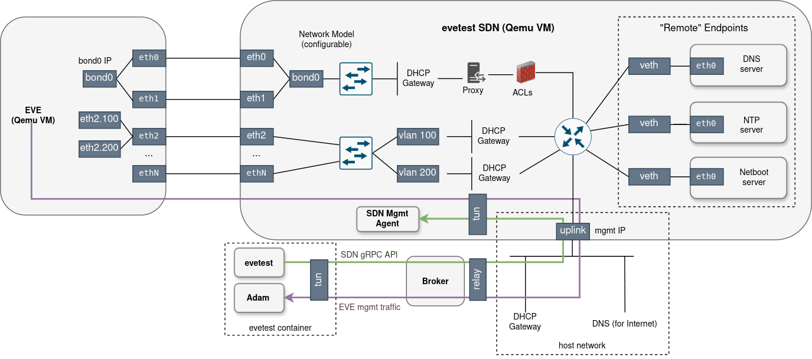

# Evetest-SDN

## Overview

**Evetest-SDN** is the network emulation component of the evetest framework. It models
physical network infrastructure in software, providing the network environment that EVE
devices connect to during testing.

The SDN is implemented as a lightweight
[LinuxKit](https://github.com/linuxkit/linuxkit)-based VM rather than a container,
because it requires multiple isolated network namespaces, L2 connectivity with EVE VMs,
and full control over the Linux network stack.

The desired state of the network is described declaratively as a **network model** --
a protobuf message (see `grpcapi/proto/sdn.proto`) specifying ports, bridges, bonds,
VLANs, DHCP servers, DNS servers, firewalls, proxies, and more. The SDN management
agent applies this model using standard Linux networking primitives (network namespaces,
VETHs, bridges, VLAN sub-interfaces, iptables/nftables, dnsmasq, radvd, hostapd, etc.)
and keeps the actual state reconciled against it using the
[State Reconciler](https://github.com/lf-edge/eve-libs/tree/main/reconciler) from
eve-libs.

## Components

### SDN VM

The SDN VM is a self-contained Linux image built with LinuxKit. It runs the management
agent and all the userspace services (dnsmasq, radvd, goproxy, etc.) that implement the
network model.

Network interfaces connecting the SDN VM to the outside world:

- **EVE ports** -- one virtual interface per EVE device port in the network model.
  Each is an interconnected pair: one end lives inside the EVE VM, the other inside the
  SDN VM. The broker creates these interfaces when provisioning the VMs.
- **Uplink port** -- a dedicated interface providing SDN's own connectivity to the host
  network. The broker assigns it a MAC address with a reserved prefix so the SDN agent
  can identify it. SDN acquires its management IP(s) on this port via DHCP.

### Management Agent (`sdnagent`)

The management agent (`sdn/vm/cmd/sdnagent`) is the central process inside the SDN VM.
It:

- Exposes a **gRPC server** implementing the `SDN` service (defined in
  `grpcapi/proto/sdn.proto`).
- Accepts network models via `SetNetworkModel` and reconciles the Linux network stack
  to match.
- Maintains a dependency graph of all network configuration items (namespaces, bridges,
  VETHs, DHCP servers, iptables rules, etc.) and applies changes incrementally.
- Reacts to kernel link events (interfaces appearing/disappearing) and triggers
  re-reconciliation as needed.
- Handles 802.1X port-authentication events from `hostapd` and updates VLAN assignments
  accordingly.
- Manages **IP tunnels** (`ConnectTunnel` RPC): each connected evetest client gets a
  TUN interface inside the SDN VM with custom IP routes, allowing evetest to route
  controller traffic through the SDN.
- Streams logs to connected clients via the `StreamLogs` RPC.

### Endpoint Processes

Endpoints are simulated services that run in isolated network namespaces inside the SDN
VM. Available endpoint types (implemented under `sdn/vm/pkg/configitems/`):

| Type | Implementation | Description |
|------|---------------|-------------|
| DNS server | dnsmasq | Resolves internal SDN endpoints and forwards upstream |
| DHCP server | dnsmasq | Hands out IPs, announces gateway, DNS, NTP, proxy, netboot, etc. |
| HTTP(S) server | Go `net/http` | Serves static content over HTTP or HTTPS |
| Explicit proxy | [goproxy](https://github.com/elazarl/goproxy) | MITM or forwarding HTTP/HTTPS proxy |
| Transparent proxy | [goproxy](https://github.com/elazarl/goproxy) + iptables | Intercepts traffic without client config |
| SCEP server | [micromdm/scep](https://github.com/micromdm/scep) | Certificate enrollment for 802.1X/PNAC |
| Netboot server | HTTP + TFTP | PXE/iPXE network boot artifacts |

## Integration with Evetest

### Deployment (Broker)

The SDN VM is provisioned by the broker as part of `SetupDevices` (see
`broker/broker.go`). When a test calls `evetest.Setup(...)`, the framework:

1. **Builds the SDN VM image** -- the broker pulls the SDN Docker image (which embeds a
   raw BIOS disk image), extracts it, and prepares a qcow2 disk.
2. **Constructs the SDN device spec** -- the broker creates one virtual interface per
   port listed in the network model (using MAC addresses from the model's `Port`
   definitions) plus the uplink interface.
3. **Powers on the SDN VM** and waits for it to acquire uplink IP addresses via DHCP.
   These IPs are returned to the evetest harness.

### Network Model Application (evetest.Setup)

After the broker returns the SDN uplink IPs, `evetest.Setup` finishes the integration:

1. **Opens an IP tunnel** (`openTunnelToSDN`) -- the harness calls the broker's
   `ConnectTunnelToSDN` RPC, which in turn calls `ConnectTunnel` on the SDN agent.
   A TUN interface (`sdn-tun`) is created on both ends. IP packets are forwarded
   bidirectionally over the gRPC stream. This is the channel through which the Adam
   controller (running inside the evetest container) communicates with EVE devices:
   EVE traffic first reaches the SDN VM (via the EVE ports), and the SDN routes it
   to the evetest container through the tunnel.
2. **Sets up routing** (`setupSDNTunnelRoutes`) -- the harness configures Linux policy
   routing inside the evetest container so that:
   - Traffic to/from EVE and SDN endpoints is routed via the TUN interface.
   - Traffic between the test process and the Internet uses the Docker network directly.
3. **Connects to the SDN gRPC service** (`connectToSDN`) -- the harness opens a gRPC
   connection to the SDN agent (reachable via the uplink IP obtained from the broker).
4. **Applies the network model** -- the harness calls `SetNetworkModel` on the SDN
   agent with the test's network model. The model has the `ControllerConfig` field
   pre-populated by the framework (controller hostname and IP), so the SDN agent can
   route controller traffic correctly.
5. **Powers on and onboards EVE devices**.

The diagram below illustrates the current evetest-SDN architecture.



### Live Network Model Updates

A test can update the network model at runtime without tearing down and re-creating the
EVE VMs:

```go
evetest.UpdateNetworkModel(myNewNetModel)
```

The function preserves MAC address assignments for ports that already exist, fills in
any missing controller config, and calls `SetNetworkModel` on the live SDN agent. The
set of ports (by logical label and device assignment) cannot change at runtime — only
their properties (e.g., `admin_up`, traffic control settings) can be modified along
with all other parts of the model (bridges, networks, endpoints, firewall, etc.).
This can be used, for example, to simulate a link going down, changing DHCP settings,
or rotating firewall rules mid-test.

## Network Model Reference

The network model is defined as a protobuf message in `grpcapi/proto/sdn.proto`.
The sections below describe each top-level component.

### Ports

A port is an interconnected interface pair: one end inside an EVE device, the other
inside the SDN VM. Port ordering matters: for a given EVE device, the relative order of
its ports in the model determines the interface names inside the device (`eth0`, `eth1`,
etc.).

Each port carries a logical label for cross-references, the name of the EVE device it
belongs to, MAC addresses for both ends, and an admin-up flag (set to `false` to
simulate a link-down on the EVE side). An optional **traffic control** block lets you
inject latency, jitter, packet loss, corruption, duplication, reorder, and rate/burst
limits using Linux `tc`, which is useful for emulating degraded or bandwidth-constrained
links.

If MAC addresses are omitted, the framework auto-generates them from the device name and
port label.

### Bonds

Bonds aggregate ports into a Link Aggregation Group (LAG). You specify the member ports
by logical label, the bonding mode (round-robin, active-backup, XOR, broadcast, 802.3ad
LACP, TLB, ALB), and link-monitoring parameters (MII or ARP). Bonds are then attached
to bridges.

### Bridges

Bridges provide L2 connectivity. Ports and/or bonds are attached to them. STP can be
optionally enabled. Each bridge can also have a **PNAC** (Port Network Access Control)
block to enable 802.1X authentication via `hostapd`:

- Configure a CA certificate, allowed EAP users and methods (TLS, PEAP, TTLS, MD5).
- Assign a *pre-auth VLAN* (devices land here before authentication — useful as an
  onboarding VLAN with limited access) and a *post-auth VLAN* (full network access after
  successful authentication).
- Increment a re-authentication generation counter to force all currently authenticated
  devices to re-authenticate.

### Networks

Networks provide L3 (IP) connectivity on top of a bridge. A network specifies its
parent bridge, an optional VLAN ID, and separate IPv4 and IPv6 IP configuration blocks.
Both can be set simultaneously for dual-stack networks.

Each IP config block includes the subnet, gateway IP, and an optional **DHCP** block
covering: IP range, static MAC-to-IP assignments, domain name, DNS server references
(private SDN endpoints or public IPs), NTP server (private or public), a WPAD/PAC file
URL, a netboot server reference, and a flag to suppress the default route advertisement.
For IPv6, omitting all options except DNS keeps SLAAC as the sole address-assignment
method; any additional option enables DHCPv6.

A network can also reference a **transparent proxy** endpoint (by logical label) to
intercept all HTTP/HTTPS traffic passing through it.

The optional **router** configuration controls reachability: you can restrict which
other networks, which SDN endpoints, and whether the Internet and the controller are
reachable from this network. Without a router block, everything is reachable.
Static routes can be added for traffic returning from SDN toward EVE-hosted apps acting
as gateways.

### Endpoints

Endpoints simulate remote services. Each runs in its own network namespace inside the
SDN VM and is identified by a logical label, an FQDN, and IPv4/IPv6 address
configuration. An optional direct-L2 connect block attaches the endpoint to a bridge
instead of (or in addition to) the default IP routing.

Available endpoint types:

- **DNS server** -- dnsmasq instance with static FQDN→IP entries (for internal SDN
  services) and upstream public DNS forwarding. Static entries support both literal
  values and references to other endpoints by logical label. DNS servers used by
  networks attached to EVE management ports must have a static entry mapping the
  controller's hostname to its IP.

- **HTTP(S) server** -- lightweight Go HTTP server that serves configurable static
  content at arbitrary URL paths. Supports both plain HTTP and TLS. Useful for testing
  application connectivity, serving PAC/WPAD files, or acting as a download target.

- **Explicit proxy** -- [goproxy](https://github.com/elazarl/goproxy)-based HTTP/HTTPS
  proxy requiring explicit client configuration. Supports per-rule actions (forward,
  reject, MITM), a CA certificate for TLS interception, and optional username/password
  authentication. Typically combined with firewall rules that block direct controller
  access, forcing EVE to use the proxy.

- **Transparent proxy** -- same goproxy engine, but intercepts traffic transparently via
  iptables REDIRECT rules without any client configuration. Referenced from
  `Network.transparent_proxy`.

- **SCEP server** -- [micromdm/scep](https://github.com/micromdm/scep) server for
  Simple Certificate Enrollment Protocol. Used together with PNAC bridges for
  certificate-based 802.1X device onboarding. Configurable CA certificate and optional
  challenge password.

- **Netboot server** -- HTTP + TFTP server providing all artifacts needed to boot EVE OS
  over a network (iPXE chainloading). When TFTP and HTTP artifact lists are left empty,
  evetest automatically provides the iPXE bootloader (TFTP) and the EVE OS boot
  artifacts (HTTP). Referenced from `DHCP.netboot_server`.

### Firewall

The firewall is applied between networks, endpoints, and external entities (controller,
Internet). Rules are evaluated in order; unmatched traffic is **allowed** by default.
Each rule matches on source subnet, destination subnet, IP protocol, and destination
ports, and takes one of three actions: allow, reject (ICMP unreachable sent to sender),
or drop (silent). Established and related traffic is automatically allowed once a
connection is permitted.

A common pattern: explicitly allow required destinations, then add a default-drop rule
at the end.

### Controller Config

The `ControllerConfig` field (controller IPs and port) is filled automatically by the
evetest framework before applying the model. Do not set it in tests.

## CLI Commands

The `evetest sdn` subcommands interact with the running SDN VM via the evetest gRPC API
(see `cli/sdncmd.go`):

```bash
# Show SDN management IPs and any config errors
evetest sdn status

# Print the current network model as JSON
evetest sdn net-model

# Print the reconciler config graph in Graphviz dot format
evetest sdn graph

# Stream logs from the SDN agent
evetest sdn logs

# Open an interactive SSH session inside the SDN VM
evetest sdn ssh [command...]
```

The `evetest sdn graph` output can be piped to any Graphviz renderer for visual
inspection of the reconciler's current and intended state, which is useful for
debugging configuration problems.

## Predefined Network Models

The `netmodels/` directory (relative to `evetest/`) contains a growing collection of
ready-to-use network model definitions. Import the `netmodels` package in your test and
pass one to `evetest.RequireNetworkModel{}`:

```go
import "github.com/lf-edge/eve/evetest/netmodels"

evetest.Setup(
    evetest.RequireNetworkModel{NetworkModel: netmodels.SingleEthWithDHCP},
    ...
)
```

The predefined models cover common scenarios: single or multiple Ethernet ports with
plain DHCP, dual-stack (IPv4+IPv6) networking, explicit and transparent HTTP proxies,
WPAD/PAC-based proxy auto-discovery, 802.1X port authentication with SCEP-based
certificate enrollment, VLAN-separated management and application networks, ports
aggregated into bonds (active-backup and LACP 802.3ad), and multi-device cluster
setups with dedicated inter-node networks.

To define a custom model, construct a `*api.NetworkModel` (see `grpcapi/proto/sdn.proto`)
in your test file or contribute it to `evetest/netmodels/`. Do not forget to use
`evetest.GetControllerHostname()`, `evetest.GetControllerIPv4()`, and
`evetest.GetControllerIPv6()` to populate the DNS server's static entries for the
controller.

## Building the SDN VM

The SDN VM image is built in two stages:

1. **Build the service container** -- the Go programs (`sdnagent`, `goproxy`,
   `httpsrv`, etc.) are compiled and packaged into a LinuxKit service container using
   `linuxkit pkg build`.
2. **Assemble the LinuxKit image** -- the service container is embedded into a LinuxKit
   VM configuration (`sdn-vm.yml.in`), and a raw BIOS disk image is produced.
3. **Wrap in a Docker image** -- the raw disk image is stored inside a Docker image
   (tagged `lfedge/evetest-sdn:<version>`) using `Dockerfile.vm`. This is the image the
   broker pulls and extracts when setting up the SDN VM.

Whenever you make changes to the SDN agent or any of its packages, bump
`evetest/sdn/VERSION` before building. The version is read during the build and used as
the Docker image tag, so it must be incremented to produce a distinctly versioned image
that the broker will recognise as new.

```bash
# Build (requires the linuxkit binary):
make build-sdn-container LINUXKIT=/path/to/linuxkit
```

After building, either set `EVETEST_SDN_VERSION` to the new version when running tests,
or update `DefaultSDNVersion` in `constants/` so it becomes the default.

See the top-level `evetest/README.md` for a full summary of what to rebuild when.
