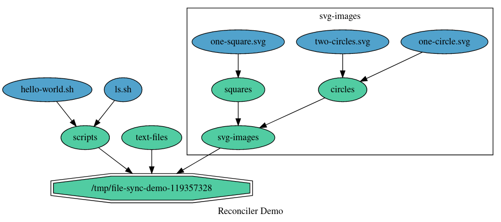
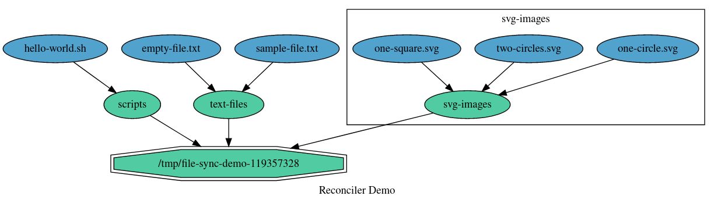
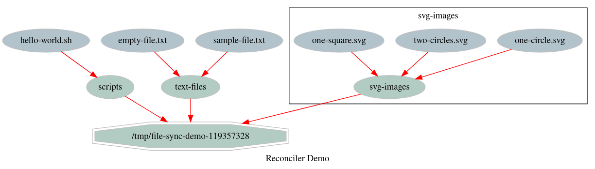

# Reconciler Demonstration: File-Sync

## Directory Synchronization Problem

This is a simple demonstration of the Reconciler usage. The interface and the semantics
of the state reconciliation as defined by reconciler (+ depgraph) package is generic
enough to be applied for any problem where the intended state of a system can be
represented by a set of objects that can be Created/Modified/Deleted and that may have
some dependencies between them.\
In this example we use Reconciler to handle the problem of (a local) file-system
directory content synchronization, something like what rsync does minus the networking.

The intended state in this case is a set of files and sub-directories, with their
contents, paths and access rights, that we want to have created inside a specific
file-system directory (let's denote it as "root" for our demo). If the root directory
starts empty, the files and directories should be created from outwards to inwards.
File/directory cannot be created if the parent directory doesn't exist yet. Removal,
on the other hand, should be performed in the opposite direction, starting with the
bottom level of the directory tree and continue up. Modifications, combining create,
delete but also file move operations, is where things really start to get complicated.
It is always possible to first clear the content of the synchronized directory and
re-create the new intended state from the scratch, but this is a very inefficient
solution.

A better solution is to leverage Reconciler with intended/current states modeled
using dependency graphs. Files and directories can be represented as graph nodes
(in depgraph called *items*) and dependencies on parent directories as edges.
State transitions can be handled by two configurators, one for files and the other
for directories. For example, the Create operation for a file is implemented as
`ioutil.WriteFile()`, Modify can change the access rights with `os.Chmod` and move
the file using `os.Rename` and Delete is based on `os.Remove` (see `file.go`).
Configurator for directories is completely based on the `os` package (see `directory.go`).\
The crux of the problem, which is to determine the right (and an efficient) sequence
of operations to execute to get the directory content in-sync with the intention,
is then left for the Reconciler to solve.

## Demonstrated Scenario

The root directory for this example is created as a temporary directory under `/tmp`,
to not pollute the user's filesystem content.

For the initial state, we ask Reconciler to create some directories with SVG images,
scripts and text files. Graph representation of this state is shown below:

Note that this visualization was obtained by exporting the graph to DOT using `DotExporter`
and then by rendering the PNG image from DOT with Graphviz.

The first state reconciliation consists of Create operations only.
Next, however, we make several changes to the intended state. To reach it, will require
to remove some file/directories, create new ones and even to move some of the existing
files. Reconciler is able to find the optimal sequence of operations in this case.
Graph representation of this new state is shown below:

Finally, we update the current state manually and remove the (external) item representing
the root directory. Since all the contained files and subdirectories depend on it, either
directly or transitively, Reconciler will run Delete for all objects from bottom-up.

