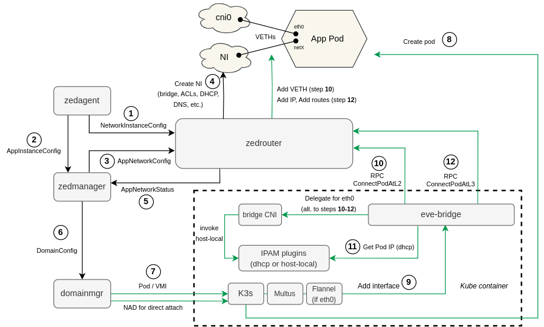

# CNI Plugin "eve-bridge"

eve-bridge is a [CNI](https://github.com/containernetworking/cni) plugin which allows
connecting Kubernetes pods with [EVE network instances](../../pillar/docs/). This is used
when EVE is running Kubevirt as the hypervisor (under [K3s](https://k3s.io/) - a lightweight
Kubernetes).

## Kubernetes vs. EVE network model

In a typical Kubernetes deployment, every pod has only one network interface, created by a popular
CNI plugin, such as [bridge](https://www.cni.dev/plugins/current/main/bridge/) or
[Flannel](https://github.com/flannel-io/flannel). It is very common to have all pods that
are running on the same node connected into the same network segment (single bridge).

However, with EVE network model, application may have multiple network interfaces connected
to different network instances (bridges). In Kubernetes, assigning multiple interfaces
to a single pod is possible with [Multus CNI](https://github.com/k8snetworkplumbingwg/multus-cni).
Every additional interface is described to Multus via pod annotations. When Kubernetes
asks Multus to connect a given newly created pod, Multus will not only setup the pod's primary
"eth0" interface, but also every additional as requested via annotations.

Multus is not a standalone CNI plugin, however. For every interface requested, it delegates
the CNI call to some underlying plugin (such as the aforementioned "bridge" or Flannel).

Even though EVE network instance is essentially a Linux bridge, it is not possible to simply
use the already available [bridge](https://www.cni.dev/plugins/current/main/bridge/) as the CNI
plugin under the Multus. Please remember that [zedrouter](../../pillar/docs/zedrouter.md) is
responsible for creating network instances, configuring ACLs, allocating IPs for applications,
preparing DNS config, etc. It is therefore essential that the interface name and the MAC address
selected for a given application VIF by zedrouter is used by the CNI plugin.
However, the default bridge plugin does not allow to specify and enforce these parameters
(certainly not for Kubevirt VMIs). Another problem with the bridge plugin is that it does
not allow to customize routing configuration. For EVE apps, it is not desirable to route traffic
by default via the Kubernetes network. In fact, this extra application interface (not present
with other hypervisors) should not have any effect on NI routing as defined by EVE API.

For all the reasons above we had to develop our own version of the bridge plugin,
called "eve-bridge". This CNI plugin establishes pod connectivity in cooperation with
the zedrouter microservice. A CNI call received from Multus to connect pod to a given
network instance is delegated by eve-bridge to zedrouter via RPC calls over an AF-UNIX
socket (more details below).

## Application Deployment Flow

One of the main goals while integrating EVE with Kubernetes and Kubevirt as the hypervisor,
was to keep the interaction between microservices (pubsub messages, dependencies, etc.)
as intact as possible. This is to avoid adding too much complexity into the code just for one
of the supported hypervisors.

When a new application is requested to be deployed, the first set of steps is the same as with
any hypervisor. Zedrouter receives and parses the app config for zedmanager, which orchestrates
the deployment of the application. It will publish AppNetworkConfig to zedrouter, describing how
app should be connected. Zedrouter then allocates IP(s), generates VIF names, prepares ACLs,
DNS and DHCP config. Then it publishes AppNetworkStatus, which is a trigger for zedmanager
to submit DomainConfig to domainmgr. No Kubevirt-specific changes up to this point (steps 1-6
in the diagram below, indicated by black arrows).

With Kubevirt hypervisor, domainmgr creates application domain by submitting Pod/VMI config
into the Kubernetes API server. (On the target node) Kubernetes first creates pod sandbox
container (a new network namespace), then asks selected CNI plugin (Multus) to provide network
connectivity. Multus will start by creating the pod's primary "eth0" interface. This is delegated
to Flannel CNI, which further delegates the interface creation to eve-bridge. In this case,
eve-bridge also just continues delegating further, calling the default bridge plugin, but with
the config updated to prevent the default route from being configured.

For any additional pod interface, connecting pod with a NI, Multus delegates the CNI call
directly to eve-bridge, which will talk to zedrouter using RPCs:

1. RPC call to zedrouter's method `ConnectPodAtL2` is used to setup veth between pod and the NI
   bridge. The veth will be UP but with no IP address assigned at this point.
2. eve-bridge will run DHCP client to get IP address for the interface. For Local NI this
   is answered by dnsmasq configured by zedrouter. For switch NI this may be answered by external
   DHCP server.
3. RPC call to zedrouter's method `ConnectPodAtL3` is made to publish the acquired IP address and
   let zedrouter to configure it on the pod-side of the veth, alongside appropriate routing
   configuration.

Note that for VMIs (apps running as VMs or as containers inside VMs), only `ConnectPodAtL2`
is called. DHCP client is run and IP assignment is made inside the VM.

Diagram below indicates all the steps specific to the Kubevirt variant of EVE by green arrows:

