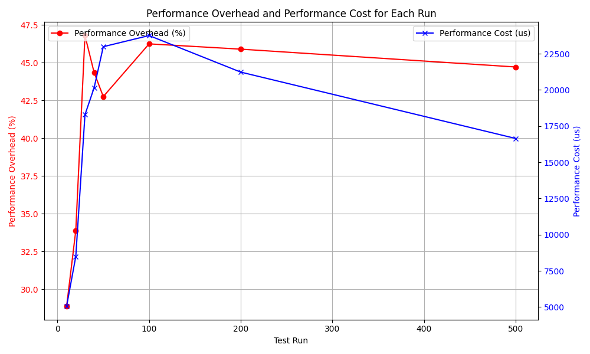
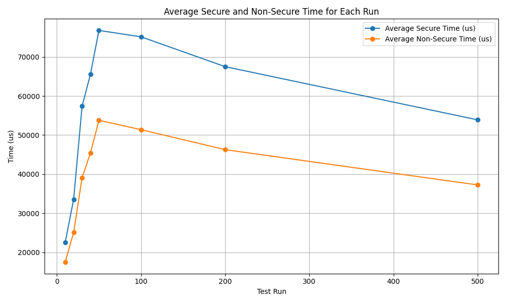
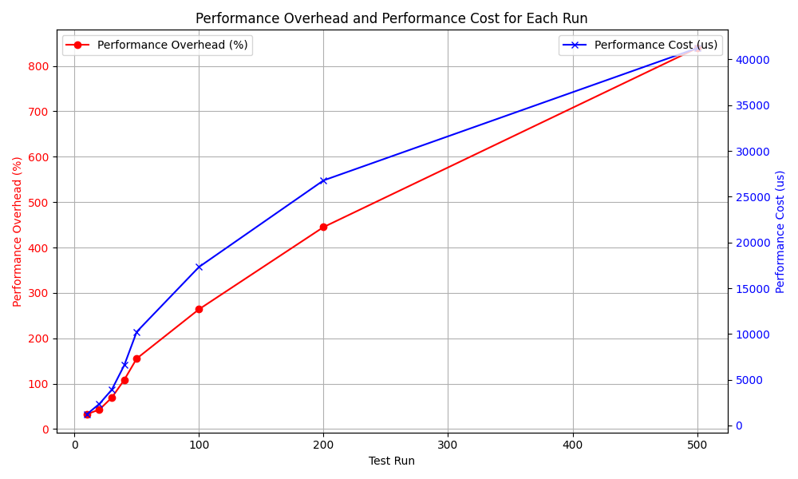
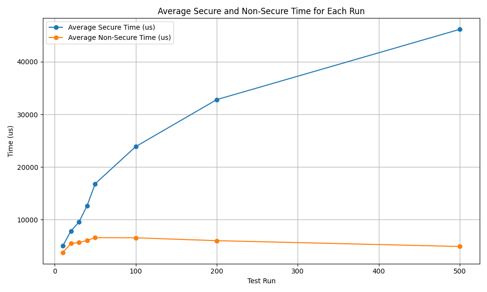
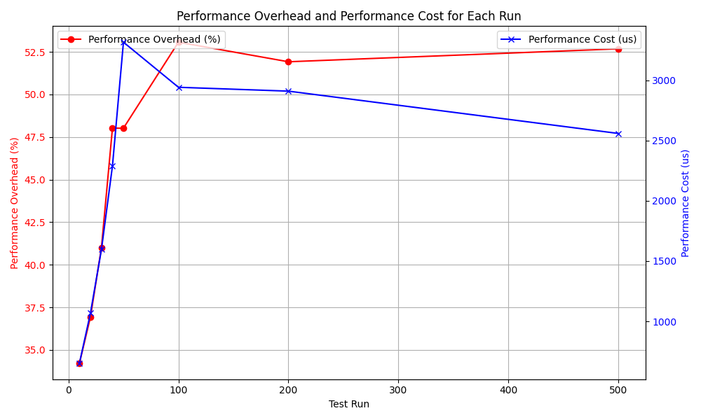
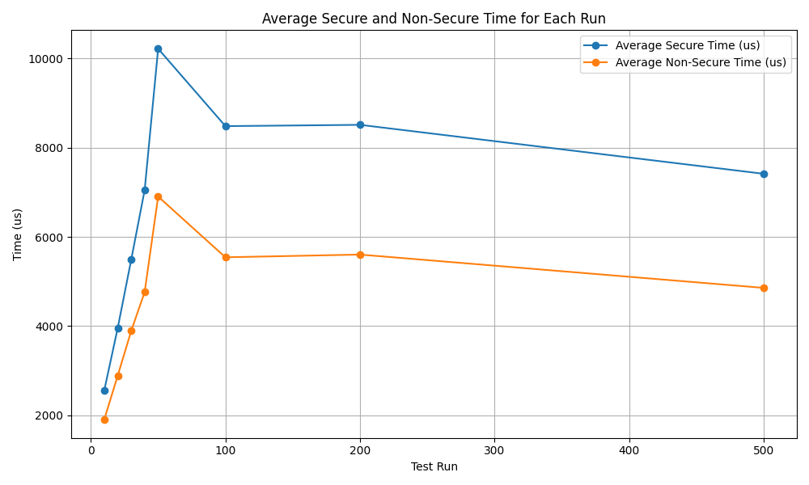

# Performance Data

This directory contains performance data for the secure logging mechanisms introduced to `newlogd`. The algorithm used is "Forward-Secure Sequential Aggregate Authentication."

Each test consists of 10, 20, 30, 40, 50, 100, 200, and 500 runs. A single run is the time required to process a batch of logs. Each batch of logs contains roughly 400 log entries, with each entry varying in size. The base log file is artificially grown by appending its content to itself, so consider a small +/- degree of error in benchmarks compared what you might see in the real world.

This is a microbenchmark, calculating the performance degradation only for the log processing function `doMoveCompressFile*`.

## FssAggSig

This is the cost of computing the aggregated signature for each batch of logs. The results show that adding the aggregated signature to each batch of logs incurs a performance cost of 28% to 46% per processed batch of logs, with the cost dropping on higher-count runs as system caches are utilized.

*FssAggSig Overhead and Cost*

*FssAggSig Timing*

## FssAggVer

This is the cost of computing the verification result of the aggregated signature for each batch of logs. This can lead to exponential growth as the number of key iterations increases.

*FssAggVer Overhead and Cost*

*FssAggVer Timing*

## FssAggVer with Cached Keys

This is the cost of computing the verification result of the aggregated signature for each batch of logs. In this run verification key is cached for every multiple of 10,000, allowing the verification algorithm to use shortcuts to verify the logs faster. The results show that verifying each batch of logs can add a performance cost of 35% to 53%.

*FssAggVer (with cached keys) Overhead and Cost*

*FssAggVer (with cached keys) Timing*