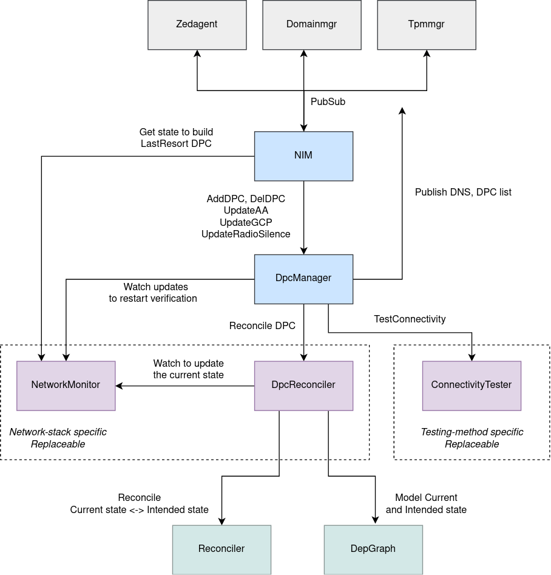
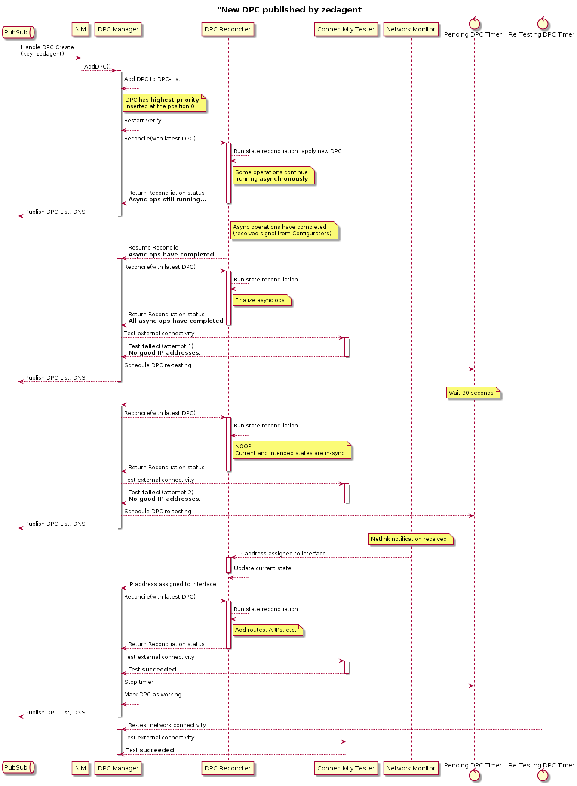

# Network Interface Manager (NIM)

## Overview

NIM manages (physical) network interfaces (Ethernet, WiFi, LTE) of a device based
on configuration coming from various sources (controller, bootstrap-config.pb,
override/usb.json, last-resort, persisted config).
Its main goal is to preserve connectivity between the device and the controller.
NIM verifies new configuration changes before fully committing to them.
Moreover, it maintains one or more old but working configurations with a lower-priority,
allowing to fallback in case the latest config breaks connectivity, but always tries
to move to the most recent, aka the highest-priority configuration.

## Key Input/Output

**NIM consumes**:

* configuration for device ports
  * an instance of the `DevicePortConfig` struct (abbreviated to DPC)
  * contains configuration for every physical interface, except those which are
    disabled or directly assigned to applications
  * DPC is received from different sources, such as zedagent (bootstrap config
    or config from the controller), the `/config` partition with `override.json`,
    specially formatted USB stick with `usb.json` and even from NIM itself,
    which builds and publishes the *last-resort* config if enabled. If `monitor` application is enabled the user can also change current network settings manually from the local TUI. In this case [monitor](./monitor.md) service sets a DPC with a key set to `manual`. Only one instance of the DPC with key `manual` may exists at a given time thus it is always overwritten when the user changes network settings
  * NIM also receives a DPC with key `lps` from zedagent. This carries port-level
    overrides submitted to the device by a Local Profile Server (LPS) and is
    merged on top of the controller DPC; see [LPS local port overrides](#lps-local-port-overrides) below.
* global configuration properties
  * an instance of `ConfigItemValueMap` struct received from zedagent
  * used to determine if last-resort should be enabled, to obtain time
    intervals/timeouts to apply for DPC verification, to discover the list of
    diagnostic remote endpoints used by `ControllerConnectivityTester`,
    to set the metric publish interval, and to get parameters for SSH access
* a list of assignable adapters
  * an instance of `AssignableAdapters` struct received from domainmgr
  * used to determine if a given interface is assigned to pciback or if it is available
    to the host (EVE) OS
* zedagent status
  * an instance of `ZedAgentStatus` received from zedagent
  * used to determine the intended state of the [Radio-Silence mode](./radio-silence.md)
    and the URL of the Local Operator Console (LOC), which the connectivity
    tester probes instead of the controller when air-gap mode is enabled
* status of cellular connectivity
  * an instance of the `WwanStatus` struct received from `mmagent` (wwan microservice)
  * used to update `NetworkPortStatus` of cellular ports
* onboarding status
  * an instance of `OnboardingStatus` from zedclient
  * DpcManager uses the device UUID only to tell whether the device is
    onboarded, which selects the pre- vs post-onboarding netdump publish interval
* network instance configuration
  * `NetworkInstanceConfig` from zedagent
  * NIM only inspects whether at least one network instance has flowlog enabled,
    and forwards that boolean to DpcReconciler so the iptables ACL subgraph
    enables conntrack logging accordingly
* edge-node cluster status
  * `EdgeNodeClusterStatus` from zedkube
  * carries the cluster interface and the cluster IP address that DpcReconciler
    must assign statically (in addition to whatever the DPC requests)
* Kubernetes user services
  * `KubeUserServices` from zedkube
  * lists user-facing Kubernetes services and ingresses that need firewall
    pin-holes; consumed by the ACL subgraph of DpcReconciler
* vault status
  * `VaultStatus` from vaultmgr
  * NIM tracks whether the default vault is unlocked. Until the vault is ready,
    private keys of SCEP-enrolled certificates are not readable, so 802.1x
    (PNAC) port authentication that depends on those keys must wait
* enrolled-certificate status
  * `EnrolledCertificateStatus` from scepclient (persistent)
  * lists certificates obtained via SCEP, indexed by enrollment-profile name;
    used to render the wpa_supplicant configuration for 802.1x ports
* controller and edge-node certificates
  * `ControllerCert` from zedagent and `EdgeNodeCert` from tpmmgr (the latter a
    persistent subscription)
  * passed through to DpcReconciler so it can decrypt encrypted fields in the
    DPC (e.g. WiFi PSK or 802.1x credentials) before applying them

**NIM publishes**:

* the current state of the device connectivity
  * an instance of the `DeviceNetworkStatus` struct (abbreviated to DNS)
  * published whenever the config or the state of connectivity/interfaces changes
* the currently maintained list of Device Port Configurations (DPCs)
  * ordered by priority, the highest priority is at index 0
  * contains index pointing to the currently used config
  * persisted publication - NIM is able to read it back and reapply after a reboot
* configuration for cellular modems
  * an instance of the `WwanConfig` struct
  * consumed by `mmagent` from the wwan microservice
* cipher block status and cipher metrics
  * `CipherBlockStatus` records the success or failure of decrypting any
    encrypted DPC fields; `CipherMetrics` aggregates decryption counters
* agent metrics for the controller-connectivity tester
  * `MetricsMap` keyed by `nim` summarizing HTTP test latencies and outcomes
* PNAC and bond metrics
  * `PNACMetricsList` (one entry per 802.1x-enabled port) and `BondMetricsList`
    (one entry per L2 bond port) are republished on a flexible ticker driven by
    the configured metric interval

## Components

Internally, NIM is split into several components following the principle of separation
of concerns. The interaction between these components is well-defined using Go interfaces.
This allows to (unit-)test each component individually and even to have them replaceable
(with alternative implementations or with mock objects). For example, the default method
of connectivity testing based on the `ping` API of the controller is wrapped by
`ControllerConnectivityTester`, implementing [ConnectivityTester](#connectivitytester) interface.
Should a different connectivity testing method be required for a specific use-case,
the default tester can be easily swapped with a different implementation without affecting
the rest of the NIM microservice.
Moreover, all interactions with the underlying network stack are limited to components
[DpcReconciler](#dpcreconciler) and [NetworkMonitor](#networkmonitor). Therefore,
in order to support an alternative to the Linux network stack (e.g. a 3rd party vswitch),
only these two components need to be replaced.

The following diagram depicts all NIM components and their interactions:



### DpcManager

[DpcManager](../dpcmanager/dpcmanager.go) manages a list of received device port
configurations. A single device port configuration (`DevicePortConfig` struct;
abbreviated to **DPC**) contains configuration for all (physical) network interfaces
selected for device management or to be shared by applications (i.e. excluding NIC
pass-through).

The main method exposed by the manager is `AddDPC(dpc)`, which is used by NIM to feed
the manager with newly received DPCs.
The goal of the manager is to run periodic verification of available DPCs, and select
and apply the highest-priority DPC with a working external connectivity, so that EVE
is able to access the controller. Priority of a DPC is determined by `TimePriority`
field - the newer a DPC is, the higher the priority it has.
DpcManager maintains a list of known DPCs ordered by priority. This list is occasionally
compressed, but the highest-priority DPC, the last working DPC and the last-resort are
always preserved (and persisted). At any given point of time one of these DPCs is selected
and being used as determined by the process of periodic DPC verification.
This list and the index of the currently used DPC is published (via pubsub) by the manager
as `DevicePortConfigList`.

The manager also receives GCP (global configuration properties) from NIM via method
`UpdateGCP()`, used to determine how often to run the DPC verification and what time
limits have been configured for connectivity testing. Also important is the list of assignable
adapters (the state of assignments of physical interfaces), received from domainmgr and passed
to DpcManager by NIM via `UpdateAA()`. For example, DpcManager will mark DPC verification
as failed if any of the device ports is currently directly assigned to an application.
Lastly, the manager receives the intended radio-silence mode state via `UpdateRadioSilence()`.

DPC is applied into the device state using [DpcReconciler](#dpcreconciler).
The reconciler is able to switch from one DPC to another and make all necessary
configuration changes in the network stack.
The manager uses [ConnectivityTester](#connectivitytester) to probe the connectivity
status of the currently applied DPC. Based on the probing result, it may keep DPC
unchanged or it may fallback to a lower-priority but working configuration.
Whenever there is a higher-priority DPC available, the manager will test it periodically
and switch to it as soon as the probing succeeds.
Lastly, [NetworkMonitor](#networkmonitor) is used to monitor network stack for interesting
events, such as link state changes (which may trigger DPC re-testing), and to collect state
information. Manager publishes device network status (`DeviceNetworkStatus` struct;
abbreviated to **DNS**), which is updated on every state change, including a switch
to another DPC.
DpcManager is just a state machine and doesn't interact with the system (doesn't make syscalls
or netlink calls). As such, it is not tied to any particular network stack. Instead,
the injected components NetworkMonitor, DpcReconciler and ConnectivityTester make all
the probing, monitoring and network configuration operations.

Note that DpcManager is a separate task, running its own Go routine. Exposed methods `AddDPC()`,
`UpdateGCP`, etc., are non-blocking. Internally they merely pass the attributes via a channel
into the event loop of the manager.

### DpcReconciler

[DpcReconciler](../dpcreconciler/dpcreconciler.go) translates the currently selected device
port configuration (`DevicePortConfig` struct; abbreviated to DPC) into the corresponding
low-level network configuration items (routes, IP rules, ARP entries, iptables rules, etc.)
of the target network stack and applies them using the [Reconciler](../../../libs/reconciler/README.md).
Internally, DpcReconciler maintains two [dependency graphs](../../../libs/depgraph/README.md),
one modelling the current state of the network stack and the other the intended state.
The current state is being updated during each state reconciliation and potentially also when
a state change notification is received from [NetworkMonitor](#networkmonitor) (e.g. a network
interface (dis)appearing from/in the host OS). The intended state is rebuilt by DpcReconciler
based on the input from the DpcManager (selected DPC, intended radio-silence state, etc.).
This means that in order to understand how a DPC is realized in a network stack (what
low-level config it maps to), one only needs to look into the DpcReconciler.
Currently, there is only one implementation of DpcReconciler, created for the Linux network
stack. To learn what configuration items are used in Linux and how they are represented
with a dependency graph, see ASCII diagram at the top of [dpcreconciler/linux.go](../dpcreconciler/linux.go)
file.

### ConnectivityTester

[ConnectivityTester](../conntester/conntester.go) allows to probe the state of external
connectivity. It exposes only one method `TestConnectivity()`, which should return nil
error value if the connectivity is working, non-nil value otherwise.
A special error `RemoteTemporaryFailure` can be returned to indicate that test failed
due to a remote failure (i.e. the remote endpoint is accessible but fails to respond
to the test properly). In such case DpcManager can evaluate DPC as valid, hoping that
the issue with the remote endpoint will be resolved at the other end eventually.

### NetworkMonitor

[NetworkMonitor](../netmonitor/netmonitor.go) allows to:

* list network interfaces present in the network stack
* obtain (and possibly cache) interface index (aka interface handle)
* obtain (and possibly cache) interface attributes, addresses, DNS info, etc.
* watch for interface/address/route/DNS changes
* clear internal cache to avoid working with stale data

Provided is implementation for Linux network stack based on the netlink interface.
Also available is a *mock* NetworkMonitor, allowing to simulate a state of a fake
network stack for the sake of unit-testing of other NIM components.

## DPC sources and priority

The `DevicePortConfig` (DPC) sources NIM ingests, the `Key` value that
identifies each source, how the working list is ordered by priority, and how the
persisted `DevicePortConfigList` is retained and compressed are documented in
[DEVICE-CONNECTIVITY.md](../../../docs/DEVICE-CONNECTIVITY.md) — see
[Sources of configuration](../../../docs/DEVICE-CONNECTIVITY.md#sources-of-configuration)
and
[List of persisted network configurations](../../../docs/DEVICE-CONNECTIVITY.md#list-of-persisted-network-configurations).

## LPS local port overrides

The `lps`-keyed DPC carries the latest set of *local* port-level
configuration overrides delivered to the device through a Local Profile
Server; see [LPS.md](../../../docs/LPS.md) for the LPS protocol and the
`/api/v1/network` endpoint that carries these overrides. Within NIM,
`DpcManager.mergeWithLpsConfig()` produces an effective DPC by, for each port,
choosing between the controller-supplied configuration and the LPS-supplied
configuration according to:

* the port's `AllowLocalModifications` flag — set by the controller per port;
* a wireless-type compatibility check (LPS may not flip a port between WiFi and
  cellular);
* whether the LPS DPC actually contains an entry for that port.

For each port the manager records whether the local override was applied or
rejected (with an error string). When *every* management port is using
LPS-supplied configuration, fallback to a lower-priority controller/last-resort
DPC is suppressed: otherwise an LPS-induced misconfiguration could be reverted
silently to a stale config the operator has already replaced.

## Vault, SCEP, cluster and Kubernetes integration

A handful of DpcManager update methods (`UpdateVaultReadiness`,
`UpdateEnrolledCerts`, `UpdateClusterStatus`, `UpdateKubeUserServices`,
`UpdateLOCUrl`, `UpdateFlowlogState`) feed information from sibling
microservices into the DPC reconciler. The end-to-end 802.1X/SCEP design
(bootstrap VLAN, certificate enrollment, `wpa_supplicant` EAP-TLS, the
certificate lifecycle in the vault, and PNAC status/metrics) is documented in
[DEVICE-CONNECTIVITY.md](../../../docs/DEVICE-CONNECTIVITY.md#port-based-network-access-control-8021x-and-scep-certificate-enrollment);
the points below cover only how NIM plumbs those signals into reconciliation:

* **Vault readiness** — the SCEP-enrolled private key is stored in the
  encrypted vault (`/persist/vault/pnac`), so `scepclient` blocks on the vault
  before it can enroll, and the key is unreadable until the vault is unlocked.
  (Decrypting the object-encrypted SCEP profile itself does not need the vault —
  that uses the controller/edge-node certificate cipher path.) A vault-readiness
  change therefore triggers a reconciliation of the physical-interfaces
  (`PhysicalIfsSG`) subgraph: only once the key is available can NIM render the
  `wpa_supplicant` config for 802.1x (PNAC) ports, so certificate-based port
  authentication cannot complete before then.
* **Enrolled certificates** — additions, removals or refreshes of the
  `EnrolledCertificateStatus` set drive a regeneration of `wpa_supplicant`
  configuration for 802.1x ports.
* **Cluster status** — when running as a member of an EVE Kubernetes cluster,
  `EdgeNodeClusterStatus` provides the cluster interface and the cluster IP.
  DpcReconciler statically assigns this IP in addition to whatever the DPC
  configures, and a cluster-status change triggers a full reconciliation.
* **Kube user services** — `KubeUserServices` lists user-facing Kubernetes
  services and ingresses. NIM passes the list to DpcReconciler's ACL subgraph
  so iptables rules permit the corresponding inbound traffic on management
  uplinks.
* **LOC URL** — when air-gap mode is enabled, `ControllerConnectivityTester`
  probes the Local Operator Console first on the next test cycle; a reachable
  LOC counts as connectivity and the controller probe is then skipped.
* **Flowlog state** — toggling on/off causes a partial ACLs reconciliation to
  enable or disable conntrack logging.

## Metric publishing

On a flexible ticker driven by the GCP `metric.interval` value (defaulting to
the value of `metric.interval` for nim, jittered between 30% and 100%) NIM
publishes:

* `CipherMetrics` — accumulated decryption counters for cipher blocks embedded
  in DPCs (WiFi PSK, 802.1x credentials, etc.).
* `MetricsMap` (`nim`-keyed) — HTTP probe latencies and outcomes from
  `ControllerConnectivityTester`.
* `PNACMetricsList` — for every 802.1x-enabled port present in the current
  `DeviceNetworkStatus`, NIM looks up the kernel ifindex via
  `NetworkMonitor.GetInterfaceIndex` and reads counters via
  `NetworkMonitor.GetPNACMetrics`.
* `BondMetricsList` — for every L2-bond port in the DNS, NIM resolves the
  underlying bond interface (which may have been renamed to `k<port>` if the
  port is bridged by NIM) and reads counters via
  `NetworkMonitor.GetBondMetrics`. Member counters are annotated with the
  member port's logical label by reverse-looking-up the DNS.

## Control-flow

The following control-flow diagram shows the sequence of events and the interactions
between NIM components that follow from a new DPC being published by zedagent and
received by NIM:



## Debugging

### PubSub

Provided that an SSH or a console access to a device is available, it is possible
to print the list of DPCs (as maintained by DpcManager) and the index of the currently
used DPC with: `cat /persist/status/nim/DevicePortConfigList/global.json  | jq`\
Note that DPCs are indexed starting with 0 (highest-priority).\
Similarly, the state data for the currently used DPC can be printed with:
`cat /run/nim/DeviceNetworkStatus/global.json  | jq`\
In both cases it is necessary to run the commands from the EVE container
(enter with `eve enter`) where the `jq` tool is available.

### Current/Intended state

DpcReconciler outputs the current and the intended state of the configuration into
`/run/nim-current-state.dot` and `/run/nim-intended-state.dot`, respectively.
This is updated on every change.
The content of the files is a [DOT](https://graphviz.org/doc/info/lang.html) description
of the dependency graph modeling the respective state.
Copy the content of one of the files and use an online service
`https://dreampuf.github.io/GraphvizOnline` to plot the graph. Alternatively, generate
an SVG image locally with:
`dot -Tsvg ./nim-current-state.dot -o nim-current-state.svg`
(similarly for the intended state)

### Logs

Log messages related to DPC verification are all prefixed with the string `DPC verify:`.

For example, a successful verification of the highest-priority DPC (index 0)
will output something like:

```text
time="2022-03-22T09:22:03+01:00" level=info msg="DPC verify: Setting up verification for DPC at index 0"
time="2022-03-22T09:22:05+01:00" level=info msg="DPC verify: Received status DPC_SUCCESS for DPC at index 0"
time="2022-03-22T09:22:05+01:00" level=info msg="DPC verify: Verification ended at index 0, has errors: false"
```

If uplink interface(s) are missing (possibly still in `pciback`), DPC manager will make
5 retries until it gives up:

```text
time="2022-03-23T17:36:50+01:00" level=info msg="DPC verify: Setting up verification for DPC at index 0"
time="2022-03-23T17:36:52+01:00" level=info msg="DPC verify: Received status DPC_SUCCESS for DPC at index 0"
time="2022-03-23T17:36:52+01:00" level=info msg="DPC verify: Verification ended at index 0, has errors: false"
time="2022-03-23T17:36:53+01:00" level=info msg="DPC verify: Setting up verification for DPC at index 0"
time="2022-03-23T17:36:53+01:00" level=warning msg="DPC verify: interface check: retry due to missing interface eth1 (waiting for 2.806034ms)"
time="2022-03-23T17:36:53+01:00" level=info msg="DPC verify: Received status DPC_INTF_WAIT for DPC at index 0"
time="2022-03-23T17:36:54+01:00" level=warning msg="DPC verify: interface check: retry due to missing interface eth1 (waiting for 1.0069635s)"
time="2022-03-23T17:36:54+01:00" level=info msg="DPC verify: Received status DPC_INTF_WAIT for DPC at index 0"
time="2022-03-23T17:36:55+01:00" level=warning msg="DPC verify: missing interface eth1"
time="2022-03-23T17:36:55+01:00" level=warning msg="DPC verify: Some required ports are missing (waited for 2.010975055s). Continuing verification process with remaining ports"
time="2022-03-23T17:36:55+01:00" level=info msg="DPC verify: no IP/DNS: will retry (waiting for 2.011055234s): network test failed: not enough working ports (0); failed with: [interface eth1 is missing] for ...
time="2022-03-23T17:36:55+01:00" level=info msg="DPC verify: Received status DPC_IPDNS_WAIT for DPC at index 0"
time="2022-03-23T17:36:56+01:00" level=warning msg="DPC verify: missing interface eth1"
time="2022-03-23T17:36:56+01:00" level=warning msg="DPC verify: Some required ports are missing (waited for 3.014335115s). Continuing verification process with remaining ports"
time="2022-03-23T17:36:56+01:00" level=info msg="DPC verify: no IP/DNS: will retry (waiting for 3.014420532s): network test failed: not enough working ports (0); failed with: [interface eth1 is missing] for ...
time="2022-03-23T17:36:56+01:00" level=info msg="DPC verify: Received status DPC_IPDNS_WAIT for DPC at index 0"
time="2022-03-23T17:36:57+01:00" level=warning msg="DPC verify: missing interface eth1"
time="2022-03-23T17:36:57+01:00" level=warning msg="DPC verify: Some required ports are missing (waited for 4.018316966s). Continuing verification process with remaining ports"
time="2022-03-23T17:36:57+01:00" level=info msg="DPC verify: no IP/DNS: will retry (waiting for 4.018485005s): network test failed: not enough working ports (0); failed with: [interface eth1 is missing] for ...
time="2022-03-23T17:36:57+01:00" level=info msg="DPC verify: Received status DPC_IPDNS_WAIT for DPC at index 0"
time="2022-03-23T17:36:58+01:00" level=warning msg="DPC verify: missing interface eth1"
time="2022-03-23T17:36:58+01:00" level=warning msg="DPC verify: Some required ports are missing (waited for 5.022663169s). Continuing verification process with remaining ports"
time="2022-03-23T17:36:58+01:00" level=error msg="DPC verify: no IP/DNS: exceeded timeout (waited for 5.022745583s): network test failed: not enough working ports (0); failed with: [interface eth1 is missing] for ...
time="2022-03-23T17:36:58+01:00" level=info msg="DPC verify: Received status DPC_FAIL for DPC at index 0"
```

If the highest-priority DPC is failing but there is an older working DPC remembered by NIM,
DPC fallback is possible:

```text
time="2022-03-22T09:22:26+01:00" level=info msg="DPC verify: Setting up verification for DPC at index 0"
time="2022-03-22T09:22:28+01:00" level=error msg="DPC verify: network test failed: not enough working ports (0); failed with: [failed to connect]\n"
time="2022-03-22T09:22:28+01:00" level=info msg="DPC verify: Received status DPC_FAIL_WITH_IPANDDNS for DPC at index 0"
time="2022-03-22T09:22:28+01:00" level=info msg="DPC verify: Setting up verification for DPC at index 1"
time="2022-03-22T09:22:30+01:00" level=info msg="DPC verify: Received status DPC_SUCCESS for DPC at index 1"
time="2022-03-22T09:22:30+01:00" level=warning msg="DPC verify: Working with DPC configuration found at index 1 in DPC list"
```

But as long as a lower-priority DPC is being used, NIM makes periodic attempts to return back
to the latest and the most desired device port configuration:

```text
time="2022-03-22T09:22:12+01:00" level=warning msg="DPC verify: Kick started TestBetterInterval to try and get back to DPC at Index 0"
time="2022-03-22T09:22:12+01:00" level=info msg="DPC verify: Verification ended at index 1, has errors: false"
time="2022-03-22T09:22:12+01:00" level=info msg="DPC verify: Setting up verification for DPC at index 0"
time="2022-03-22T09:22:14+01:00" level=info msg="DPC verify: Received status DPC_SUCCESS for DPC at index 0"
time="2022-03-22T09:22:14+01:00" level=info msg="DPC verify: Verification ended at index 0, has errors: false"
```

Every time DPC reconciler recognizes that a state reconciliation (making config changes
in the network stack) is needed, it will inform about it before initiating the process:

```text
time="2022-03-22T10:11:22+01:00" level=info msg="Running a full state reconciliation, reasons: initial reconcile"
```

It also prints all the reasons for the reconciliation. In the example above, an entire state
was reconciled as a part of the NIM initialization triggered shortly after a system boot.
But sometimes a more subtle event may trigger a reconciliation of only a subset of the state:

```text
time="2022-03-22T10:14:21+01:00" level=info msg="Running state reconciliation for subgraph L3, reasons: address change, route change"
```

DPC reconciler then informs about every individual configuration change made during
a reconciliation with log messages prefixed with `DPC Reconciler executed`, followed by operation
(`create`, `modify`, `delete`) and a description of the item:

```text
time="2022-03-22T10:11:22+01:00" level=info msg="DPC Reconciler executed create for Local-IP-Rule/Local-IP-Rule, content: IP rule for local RT with new priority: 12000"
time="2022-03-22T10:11:22+01:00" level=info msg="DPC Reconciler executed create for WLAN//run/wlan/wpa_supplicant.conf, content: WLAN configuration: [], enable RF: false"
time="2022-03-22T10:11:22+01:00" level=info msg="DPC Reconciler executed create for WWAN//run/wwan/config.json, content: WWAN configuration: {RadioSilence:false Networks:[]}"
time="2022-03-22T10:11:22+01:00" level=info msg="DPC Reconciler executed create for ARP-Entry/eth1/192.168.0.10, content: ARP entry for adapter eth1; IP: 192.168.0.10; MAC: 52:54:00:12:34:56"
time="2022-03-22T10:11:22+01:00" level=info msg="DPC Reconciler executed create for Route/507/eth1/default, content: Network route for adapter eth1: {Ifindex: 7 Dst: <nil> Src: 192.168.0.11 Gw: 192.168.0.2 Flags: [] Table: 507 Realm: 0}"
time="2022-03-22T10:11:22+01:00" level=info msg="DPC Reconciler executed delete for Src-IP-Rule/eth0/192.168.0.10, content: Source-based IP rule: {adapter: eth0, ifName: eth0, ip: 192.168.0.10, prio: 15000}"
```
