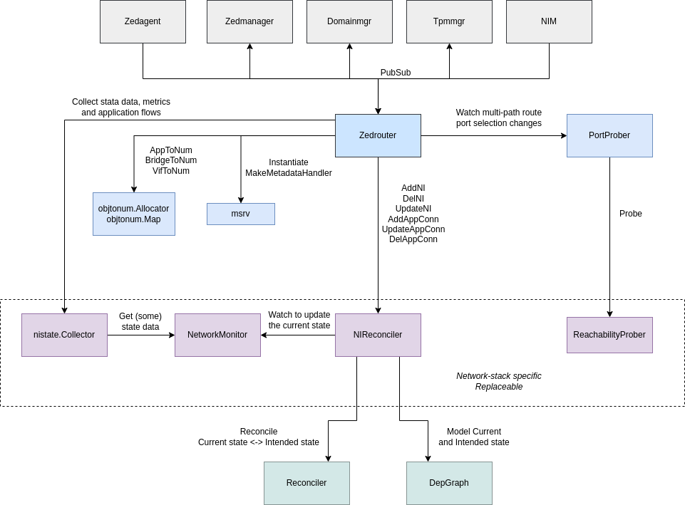

# Application Network Connectivity Management Agent in EVE (aka zedrouter)

## Overview

Zedrouter manages network connectivity for application instances.
It uses the underlying network stack and some open-source tools to provision virtual
networks, aka *network instances*, providing connectivity services for applications,
such as traffic routing/forwarding, DHCP, DNS, NAT, ACL, flow monitoring, etc.
It works in conjunction with the NIM microservice to provide external connectivity
for these network instances and applications that connect to them.
It also cooperates with domainmgr to attach applications to selected network instances
using virtual interfaces, aka *VIFs*.

## Zedrouter Objects

### Network instance

Network instance is a virtual network segment, enabling applications to talk with
each other and potentially also with external endpoints (unless configured as "air-gapped").
Currently, zedrouter provides two types of network instances: *Switch* and *Local*.

Switch network instances are simple L2 bridges, potentially extending external network
segments all the way to applications.

Local network instances have their own IP space and internal services (DHCP, DNS, etc.)
and are isolated from external networks with network address translation (NAT) operating
in between. This for example means that while applications connected via switch network
instances are directly accessible from outside, with local network instances it is necessary
to define port mapping rules (part of ACLs). More information can be found in the top-level
EVE documentation, in the file `NETWORK_MODELS.md`.

Creation and management of network instances is a sole responsibility of zedrouter
microservice. However, since physical interfaces are managed by NIM, zedrouter and NIM
must work together to provide external connectivity for applications. In reality,
zedrouter is fully aware of NIM and subscribes to its pubsub publications to react to port
changes. On the other hand, NIM is not really aware of zedrouter and it is therefore
zedrouter's responsibility to ensure that configuration jointly applied into the network
stack remains consistent and that there are no conflicts (in routing, ACLs, ...), etc.

Please note that "network instance" is often times abbreviated to *NI* (in code,
logs and documentation).

### VIF

VIF stands for virtual interface - a virtual network interface that is attached to a network
instance on one side and to the application container or to a guest VM domain on the other side.

By default (with Linux-based networking), zedrouter uses TAP interface to connect application
running as VM with the NI bridge inside the host. With default settings, interface will be
para-virtualized and use `virtio-net-pci` driver under the hood. However, with `LEGACY`
`virtualizationMode` selected (see `VmConfig` in `vm.proto`), `e1000` network interface
will be emulated instead.

For applications running as native containers, zedrouter uses veth pair, with one end
of the pair being placed inside the namespace of the container, while the other end is inside
the main network namespace and attached to the NI bridge.

Please note that the creation of VIF interfaces is a responsibility of [domainmgr](domainmgr.md)
(incl. attachment to the NI bridge).
Zedrouter then configures ACLs, potentially also (access) VLANs, updates dnsmasq parameters, etc.

## Key Input/Output

**Zedrouter consumes** (see `zedrouter.initSubscriptions()`):

* configuration for Network Instances
  * an instance of the `NetworkInstanceConfig` structure
  * published by `zedagent` microservice
  * it specifies the network instance type (local / switch / ...)
  * it references which port to use for external connectivity
    * it can reference specific port (e.g. `eth0`) or a group of ports (`uplink`, `freeuplink`)
      to fail-over between (load spreading not yet supported)
  * it contains IP configuration (subnet network address, gateway IP), etc.
  * it may contain DNS configuration (upstream DNS servers to use, static DNS entries, etc.)
* configuration for application connectivity
  * an instance of the `AppNetworkConfig` structure
  * published by `zedmanager` microservice
    * `zedmanager` orchestrates the process of application deployment - it must ensure
      that app image, app connectivity, volumes and the domain itself and created
      in the right order
  * contains a list of virtual interfaces (VIFs) and their configurations
    (instances of `AppNetAdapterConfig`)
  * every VIF references a network instance to connect into
  * VIF configuration contains a list of ACLs (firewall rules) to apply
  * optionally, VIF configuration contains static MAC and IP addresses to assign
    to the VIF
* various pubsub messages are additionally consumed by zedrouter just to extract
  and expose all kinds of metadata, state data and metrics to applications via the Metadata
  HTTP server running as part of each network instance (that has L3 endpoint in EVE).

**Zedrouter publishes** (see `zedrouter.initPublications()`):

* Network Instance status
  * an instance of the `NetworkInstanceStatus` structure
  * it contains the same information as in `NetworkInstanceConfig` plus additional
    state data, such as info about the port currently used for external connectivity,
    list of VIFs connected to the network instance and their IP and MAC addresses,
    error message if the network instance is in a failed state, etc.
* application connectivity status
  * an instance of the `AppNetworkStatus` structure
  * it contains the same information as in `AppNetworkConfig` plus additional
    state data, such as info about every application VIF incl. assigned MAC and IP addresses,
    error message if the application connectivity is in a failed state, etc.
* network instance metrics
  * an instance of the `NetworkInstanceMetrics` structure
  * it contains various metrics for the network instance, such as number of packets
    and bytes sent/received, number of ACL hits, external connectivity probing metrics, etc.
* application flow logs
  * instances of the `IPFlow` structure
  * contains information about every application traffic flow, such as source
    and destination IP addresses and ports, protocol, number of packets and bytes
    sent/received, ID of the ACL entry applied, etc.

## Components

Internally, zedrouter is split into several components following the principle of separation
of concerns. The interaction between these components is well-defined using Go interfaces.
This allows to (unit-)test components individually and even to have them replaceable
(with alternative implementations or with mock objects). For example, the default method
of NI [uplink connectivity probing](#uplinkprober), based on a simple HTTP GET
request made towards the controller URL, is wrapped by `ControllerReachProber`, implementing
`ReachabilityProber` interface. Should a different connectivity testing method be required
for a specific use-case, the default prober can be easily swapped with a different
implementation without affecting the rest of the zedrouter microservice.
Moreover, all interactions with the underlying network stack are limited to components
[NIReconciler](#nireconciler), [NetworkMonitor](#networkmonitor) and [NI State Collector](#ni-state-collector).
Therefore, in order to support an alternative to the Linux network stack (e.g. a 3rd party
vswitch), only these 3 components need to be replaced.

The following diagram depicts all zedrouter components and their interactions
(defined by interfaces):



### Zedrouter main event loop

The core of the zedrouter is the main event loop, implemented in `pkg/pillar/zedrouter`.
On startup, zedrouter first instantiates all components described below, then it subscribes
to several pubsub topics to receive input from other microservices (most notably zedagent and
zedmanager), creates publications to output status and metrics for network instances
and application connectivity (see [Key Input/Output](#key-inputoutput) above) and finally
it enters the main event loop (endless `for` loop with `select`).

Inside the main event loop, zedrouter processes:

* all pubsub messages received from other microservices. For each it triggers
  the corresponding handler - for example, `handleNetworkInstanceCreate` is called
  when config for a new network instance is received from zedagent. The handler then
  creates the network instance in cooperation with other zedrouter components.
* periodic signals from a timer to publish network instance metrics
* config reconciliation updates from [NIReconciler](#nireconciler). These updates inform
  zedrouter about the state of configuration applied inside the network stack
  * Have all config items been applied successfully?
  * Are there any errors?
  * Are there any Create/Modify/Delete operations still being asynchronously
    processed or have they completed?
  * Any change in the current state detected that requires config reconciliation?
    (i.e. the intended and the current config are no longer in sync)
* Flow records captured by [NI State Collector](#ni-state-collector). These are just further
  published via pubsub to zedagent.
* VIF IP assignment changes detected by [NI State Collector](#ni-state-collector). Zedrouter
  records these IP assignments in the corresponding network instance and application network
  statuses and publishes them via pubsub.
* uplink selection updates from [UplinkProber](#uplinkprober). These updates inform zedrouter
  about the current state of uplink connectivity probing and the currently selected uplink
  for every (local, non air-gapped) network instance. On change, zedrouter updates
  NI parameters passed to [NIReconciler](#nireconciler), which then performs all necessary
  config changes in the network stack.

### NIReconciler

[NIReconciler](../nireconciler/nireconciler.go) translates the currently applied configuration
of all Network Instances (`NetworkInstanceConfig`) and application networks (`AppNetworkConfig`)
into the corresponding low-level network configuration items (bridges, routes, IP rules,
ARP entries, iptables rules, etc.) of the target network stack and applies them using
the [Reconciler](../../../libs/reconciler/README.md).

Internally, NIReconciler maintains two [dependency graphs](../../../libs/depgraph/README.md),
one modelling the current state of the network stack and the other the intended state.
The current state is being updated during each state reconciliation and potentially also when
a state change notification is received from [NetworkMonitor](#networkmonitor) (e.g. a network
interface (dis)appearing from/in the host OS or a network route being added/deleted by the kernel).
The intended state is rebuilt by NIReconciler based on the input from Zedrouter, which
is received through interface methods such as `AddNI`, `UpdateNI`, `DelNI`, `AddAppConn`, etc.
This means that in order to understand how application connectivity is realized in a network
stack (what low-level config it maps to), one only needs to look into the NIReconciler.

Currently, there is only one implementation of NIReconciler, created for the Linux network
stack. To learn what configuration items are used in Linux and how they are represented
with a dependency graph, see ASCII diagram at the top of the [nireconciler/linux_config.go](../nireconciler/linux_config.go)
file. For example, every network instance is represented by a separate sub-graph, meaning
that all configuration items related to a network instance are grouped together and methods
`AddNI/UpdateNI/DelNI` require to trigger state reconciliation only for the corresponding
sub-graph. `DelNI` is implemented as easily as removing the NI sub-graph from the intended
state and triggering state reconciliation. However, additionally there is also a `Global`
sub-graph, which contains all configuration items that are either not specific to any network
instance or are shared by multiple network instances. `Global` sub-graph needs to be reconciled
pretty-much on every change in the intended state.

### UplinkProber

[UplinkProber](../uplinkprober/uplinkprober.go) is responsible for probing uplink connectivity
for every network instance configured with a group uplink label, such as `uplink` (use any
management interface) or `freeuplink` (use any management interface with zero cost).

The probing algorithm of UplinkProber tries to determine the state of connectivity for every
suitable port and then select the cheapest one with working connectivity.
Additionally, it tries to avoid port flapping, i.e. switching between ports too often.
For example, a certain number of continuous failures is required before a port is considered
without connectivity. Similarly, a certain number of continuous successes is required before
a port is selected over the previous one. See `Config` structure defined in `uplinkprober.go`
for more details and how the behaviour can be tweaked through config options. However, note
that the default configuration cannot be currently changed in run-time through `EdgeDevConfig`.

Whenever the selected uplink for a given NI changes, zedrouter is notified by the prober.
It is up to zedrouter to perform the re-routing from one port to another (and it does so
with the help from NIReconciler).

### NetworkMonitor

[NetworkMonitor](../netmonitor/netmonitor.go) allows to:

* list network interfaces present in the network stack
* obtain (and possibly cache) interface index (aka interface handle)
* obtain (and possibly cache) interface attributes, addresses, DNS info, etc.
* watch for interface/address/route/DNS changes
* clear internal cache to avoid working with stale data

Provided is implementation for Linux network stack based on the netlink interface.
Also available is a *mock* NetworkMonitor, allowing to simulate a state of a fake
network stack for the sake of unit-testing of other Zedrouter components.

NetworkMonitor is used by both zedrouter and NIM.

### NI State Collector

[NI State Collector](../nistate/statecollector.go) is responsible for collecting
state data and metrics from network instances (IP address assignments, network flows,
interface counters, etc.) and publishing them to zedrouter.
The main entry point is the interface `Collector`, which is expected to eventually
have multiple implementations, one for every supported network stack.

The default Linux-based implementation, watches `dnsmasq` lease file to learn
IP assignments for Local network instances, sniffs DHCP, ARP and ICMPv6 packets
to learn IP assignments for Switch network instances, sniffs DNS traffic to collect
records of DNS queries, reads conntrack table to build records of network flows and
finally uses `github.com/shirou/gopsutil/net` package to collect interface counters.

## Debugging

### PubSub

Provided that an SSH or a console access to a device is available, it is possible
to retrieve the status info for a given network instance (from the pillar container)
with: `cat /run/zedrouter/NetworkInstanceStatus/<UUID>.json  | jq`.
If UUID is not known, you can print all jsons in the directory and locate the NI
for example by `DisplayName` or `Subnet`.
From this JSON-formatted data, it is possible to learn:

* the set of VIFs connected to the NI (with their interface names and MAC addresses)
* the set of IP addresses assigned to endpoints connected to the NI (apart from app-side
  of VIFs it may also include the IP address of the NI bridge itself).
* which uplink port is currently used by the NI (if any) - from field `SelectedUplinkLogicalLabel`
* error message if NI is in a failed state

Similarly, it is possible to retrieve network instance metrics with:
`cat /run/zedrouter/NetworkInstanceMetrics/<UUID>.json  | jq`.
This includes NI bridge interface counters, but also probe metrics (e.g. how many successful
continuous probes were performed for a given uplink port) and essentially provides insights
into the uplink selection decision made by UplinkProber at the given moment.
To get interface metrics for all interfaces (physical, VIFs, bridges) obtain the content of
`/run/zedrouter/NetworkMetrics/global.json`.

And finally, to get state info specifically for VIFs of a given application, use:
`cat /run/zedrouter/AppNetworkStatus/<UUID>.json  | jq`.
Just like with network instances, you can alternatively grep `DisplayName` to find
the app of interest.

### Current/Intended state

NIReconciler outputs the current and the intended state of the configuration into
`/run/zedrouter-current-state.dot` and `/run/zedrouter-intended-state.dot`, respectively.
This is updated on every change.
The content of the files is a [DOT](https://graphviz.org/doc/info/lang.html) description
of the dependency graph modeling the respective state.
Copy the content of one of the files and use an online service
`https://dreampuf.github.io/GraphvizOnline` to plot the graph.
Alternatively, generate an SVG image locally with:
`dot -Tsvg ./zedrouter-current-state.dot -o zedrouter-current-state.svg`
(similarly for the intended state)

### Logs

#### NIReconciler logs

Log messages produced by [NIReconciler](#nireconciler) and therefore related to config
reconciliation inside the network stack are prefixed with `NI Reconciler:`.
Every time NI Reconciler recognizes that reconciliation is needed, it will inform about it
before initiating the process:

```text
time="2023-04-27T09:38:47+01:00" level=info msg="NI Reconciler: Running state reconciliation for subgraph Global, reasons: initial reconciliation"
```

This log message describes which sub-graph is going to be reconciled (either `Global`
or for a given NI) and the reason for reconciliation.
For example, when config for a new NI has arrived from the controller, NIReconciler
will log:

```text
time="2023-04-27T09:39:29+01:00" level=info msg="NI Reconciler: Running state reconciliation for subgraph NI-82a32003-09f8-44c1-989a-d0c676286ca5, reasons: adding new NI (82a32003-09f8-44c1-989a-d0c676286ca5)"
```

Config reconciliation may also be triggered because something changed in the current
state (detected using NetworkMonitor):

```text
time="2023-04-27T09:39:58+01:00" level=info msg="NI Reconciler: Running state reconciliation for subgraph NI-82a32003-09f8-44c1-989a-d0c676286ca5, reasons: uplink IP change, route change"
```

Notice that there can be multiple reasons for the reconciliation, like in the log above.

NIReconciler then informs about every individual configuration change (`create`,
`modify`, `delete`) made during the reconciliation, for example:

```text
time="2023-04-27T09:38:47+01:00" level=info msg="NI Reconciler: Executed create for DummyInterface/blackhole, content: DummyIf: {ifName: blackhole, arpOff: true}"
time="2023-04-27T09:38:47+01:00" level=info msg="NI Reconciler: Executed create for IPv6Route/IPv6/400/default/blackhole, content: Network route for output interface 'blackhole' with priority 0: {Ifindex: 0 Dst: <nil> Src: <nil> Gw: <nil> Flags: [] Table: 400 Realm: 0}"
time="2023-04-27T09:38:47+01:00" level=info msg="NI Reconciler: Executed create for IPv4Route/IPv4/400/default/blackhole, content: Network route for output interface 'blackhole' with priority 0: {Ifindex: 0 Dst: <nil> Src: <nil> Gw: <nil> Flags: [] Table: 400 Realm: 0}"
time="2023-04-27T09:38:47+01:00" level=info msg="NI Reconciler: Executed create for IPRule/1000/all/all/800000/800000/400, content: IP rule: {prio: 1000, Src: all, Dst: all, Table: 400, Mark: 800000/800000}"
time="2023-04-27T09:38:47+01:00" level=info msg="NI Reconciler: Executed create for Iptables-Rule/mangle/POSTROUTING-apps/Drop-blackholed-traffic, content: iptables rule: -t mangle -I POSTROUTING-apps --match connmark --mark 8388608/8388608 ! -o blackhole -j DROP (Rule to ensure that packets marked with the drop action are indeed dropped and never sent out via downlink or uplink interfaces)"
time="2023-04-27T09:38:47+01:00" level=info msg="NI Reconciler: Executed create for IPSet/ipv4.local, content: IPSet: {setName: ipv4.local, typeName: hash:net, addrFamily: 2, entries: [224.0.0.0/4 0.0.0.0 255.255.255.255]}"
time="2023-04-27T09:38:47+01:00" level=info msg="NI Reconciler: Executed create for IPSet/ipv6.local, content: IPSet: {setName: ipv6.local, typeName: hash:net, addrFamily: 10, entries: [fe80::/10 ff02::/16]}"
```

Notice that every configuration item is described in detail (`content: ...`).
If a given operation failed, the log message will contain the error message, e.g.:

```text
time="2023-04-27T09:58:47+01:00" level=info msg="NI Reconciler: Executed create for IPv4Route/IPv4/801/10.11.12.0/24/bn1 with error: network unreachable, content: Network route for output interface 'bn1' with priority 0: {Ifindex: 10 Dst: 10.11.12.0/24 Src: 10.11.12.1 Gw: <nil> Flags: [] Table: 801 Realm: 0}"
```

Note that some longer operations may execute asynchronously (from a separate Go routine,
i.e. not within the zedrouter main event loop). In this case you will see when the operation
started:

```text
time="2023-04-27T10:10:40+01:00" level=info msg="NI Reconciler: Started async execution of create for Dnsmasq/bn1, content: Dnsmasq: {instanceName: bn1, listenIf: bn1, DHCPServer: {subnet: 10.11.12.0/24, allOnesNetmask: true, ipRange: <10.11.12.2-10.11.12.254>, gatewayIP: 10.11.12.1, domainName: , dnsServers: [10.11.12.1], ntpServers: [], staticEntries: [{00:16:3e:00:01:01 10.11.12.2 19418180-f61d-4d00-925b-c9c54a953798}]}, DNSServer: {listenIP: 10.11.12.1, uplinkIf: eth0, upstreamServers: [10.18.18.2], staticEntries: [{router 10.11.12.1} {eclient 10.11.12.2}], linuxIPSets: []}}"
```

And how it completed (and was followed-up on from another reconciliation run):

```text
time="2023-04-27T10:10:42+01:00" level=info msg="NI Reconciler: Running state reconciliation for subgraph NI-82a32003-09f8-44c1-989a-d0c676286ca5, reasons: async op finalized"
time="2023-04-27T10:10:42+01:00" level=info msg="NI Reconciler: Finalized async execution of create for Dnsmasq/bn1, content: Dnsmasq: {instanceName: bn1, listenIf: bn1, DHCPServer: {subnet: 10.11.12.0/24, allOnesNetmask: true, ipRange: <10.11.12.2-10.11.12.254>, gatewayIP: 10.11.12.1, domainName: , dnsServers: [10.11.12.1], ntpServers: [], staticEntries: [{00:16:3e:00:01:01 10.11.12.2 19418180-f61d-4d00-925b-c9c54a953798}]}, DNSServer: {listenIP: 10.11.12.1, uplinkIf: eth0, upstreamServers: [10.18.18.2], staticEntries: [{router 10.11.12.1} {eclient 10.11.12.2}], linuxIPSets: []}}"
...
```

#### UplinkProber logs

Log messages produced by [UplinkProber](#uplinkprober) and therefore related to uplink probing
and uplink selection process are prefixed with `UplinkProber:`.

These are for example logs produced when uplink probing started for a new NI:

```text
time="2023-04-27T09:38:48+01:00" level=info msg="UplinkProber: Added eth0 to list of probed uplinks"
time="2023-04-27T09:38:48+01:00" level=info msg="UplinkProber: Added eth1 to list of probed uplinks"
time="2023-04-27T09:38:48+01:00" level=info msg="UplinkProber: Initial NH status for uplink eth0: true (probe err: <nil>)"
time="2023-04-27T09:38:48+01:00" level=info msg="UplinkProber: Initial Remote status for uplink eth0: true (probe err: <nil>)"
time="2023-04-27T09:38:48+01:00" level=info msg="UplinkProber: Initial NH status for uplink eth1: true (probe err: <nil>)"
time="2023-04-27T09:38:48+01:00" level=info msg="UplinkProber: Initial Remote status for uplink eth1: true (probe err: <nil>)"
time="2023-04-27T09:39:29+01:00" level=info msg="UplinkProber: Started uplink probing for NI 82a32003-09f8-44c1-989a-d0c676286ca5"
time="2023-04-27T09:39:29+01:00" level=info msg="UplinkProber: Selecting uplink eth0 for NI 82a32003-09f8-44c1-989a-d0c676286ca5 (cost = 0, UP count = 2)"
```

Fail-over from `eth0`, where broken connectivity was just detected, to `eth1`:

```text
time="2023-04-27T13:21:19+01:00" level=info msg="UplinkProber: Setting NH to DOWN for uplink eth0 (continuously DOWN; probe err: uplink eth0 has no suitable next hop IP address)"
time="2023-04-27T09:39:29+01:00" level=info msg="UplinkProber: Changing uplink from eth0 to eth1 for NI 3b75c981-f1d5-4b83-8135-8194a3808ff2 (cost = 0, UP count = 2)"
```

#### NI State Collector logs

Log messages produced by [NI State Collector](#ni-state-collector) and therefore related
to state data and metrics collecting are prefixed with `NI State:`.
However, for application flow recording the prefix is further extended to `NI State (FlowStats):`.

For example, log message produced when IP assignment was detected on a Local NI:

```text
time="2023-04-27T13:19:25+01:00" level=info msg="NI State: IP Lease event '"/run/zedrouter/dnsmasq.leases/bn1": WRITE' revealed IP address changes for VIF {App:6f47a423-e41c-48db-8339-acc3e1f7dad5 NI:3b75c981-f1d5-4b83-8135-8194a3808ff2 AppNum:1 NetAdapterName:local1-0 HostIfName:nbu1x1 GuestIfMAC:00:16:3e:00:01:01}, prev: {IPv4Addr:<nil> IPv6Addrs:[]}, new: {IPv4Addr:10.11.12.2 IPv6Addrs:[]}"
```

IP assignment detected on a Switch NI (using DHCPv4 sniffing in this case):

```text
time="2023-04-27T13:30:14+01:00" level=info msg="NI State: Captured packet (DHCPv4  {Contents=[..300..] Payload=[] Operation=Reply HardwareType=Ethernet HardwareLen=6 HardwareOpts=0 Xid=877023306 Secs=3 Flags=0 ClientIP=0.0.0.0 YourClientIP=172.22.1.14 NextServerIP=172.22.1.1 RelayAgentIP=0.0.0.0 ClientHWAddr=02:16:3e:5d:13:35 ServerName=[..64..] File=[..128..] Options=[Option(MessageType:Ack), Option(ServerID:172.22.1.1), Option(LeaseTime:3600), Option(Timer1:1800), Option(Timer2:3150), Option(SubnetMask:255.255.255.0), Option(BroadcastAddress:172.22.1.255), Option(DNS:[10 18 18 2]), Option(Router:[172 22 1 1]), Option(DomainName:sdn)]}) revealed IP address changes for VIF {App:87671af1-099d-4fea-9725-85431e43d22c NI:a430d193-3c13-412e-ba29-e84347d4cc93 AppNum:2 NetAdapterName:switch1-0 HostIfName:nbu2x2 GuestIfMAC:02:16:3e:5d:13:35}, prev: {IPv4Addr:<nil> IPv6Addrs:[]}, new: {IPv4Addr:172.22.1.14 IPv6Addrs:[]}"
```

Information about captured flows (just their count, not the content):

```text
time="2023-04-27T13:26:47+01:00" level=info msg="NI State (FlowStats): Collected IPFlow {AppUUID:6f47a423-e41c-48db-8339-acc3e1f7dad5 NetAdapterName:local1-0 BrIfName:bn1 NetUUID:3b75c981-f1d5-4b83-8135-8194a3808ff2 Sequence:} with 0 flows and 4 DNS requests"
time="2023-04-27T13:28:41+01:00" level=info msg="NI State (FlowStats): Collected IPFlow {AppUUID:6f47a423-e41c-48db-8339-acc3e1f7dad5 NetAdapterName:local1-0 BrIfName:bn1 NetUUID:3b75c981-f1d5-4b83-8135-8194a3808ff2 Sequence:} with 3 flows and 0 DNS requests"
```
