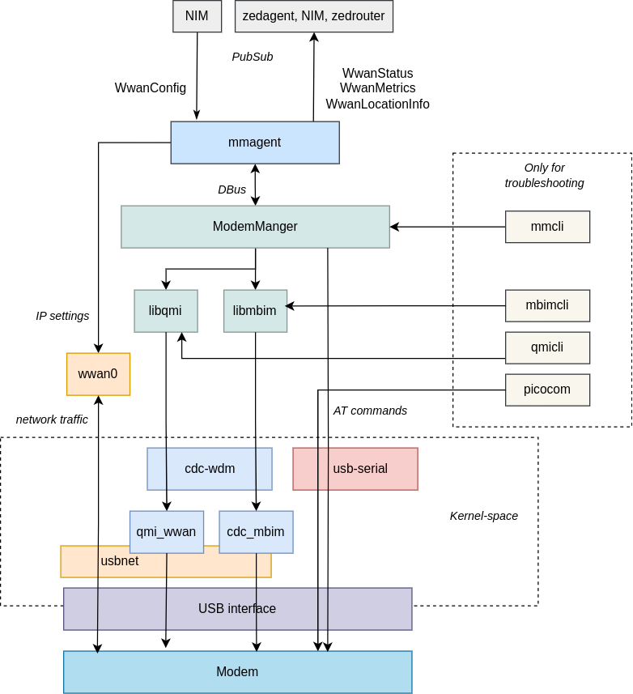

# WWAN microservice

## Overview

WWAN microservice is responsible for the management of cellular modem devices and connections (3G/4G/5G).
On the northbound API side it receives configuration from NIM and publishes the cellular status
and metrics to zedagent and other microservices using pubsub.
On the southbound API side it controls modems (connect, disconnect, enable radio, etc.), obtains
their attributes (modem IMEI, SIM card ICCID, etc.), monitors their state (modem operational state,
power state, SIM card state, etc.) and periodically retrieves metrics (packet and byte counters).

It is build as a single container named `wwan` (i.e. can be entered with `eve enter wwan` from console
or SSH connection), running multiple processes. Instead of developing modem management agent from
scratch, EVE uses [ModemManager](https://modemmanager.org/), just like many other standard Linux
distributions. This daemon does most of the heavy lifting in controlling modems. In cooperation with
[udev](https://wiki.archlinux.org/title/udev) it recognizes all available cellular modems, finds
the right protocol to talk to them (preferably QMI or the standardized MBIM), retrieves their state
and subscribes for updates, and finally performs operations like Connect, Disconnect, SetPowerState,
etc., as requested via [DBus](https://www.freedesktop.org/wiki/Software/dbus/) by a higher-level agent.
In standard Linux distributions this is NetworkManager. However, EVE is quite different and NetworkManager
does not fit into the architecture. Instead, we implemented our own agent controlling ModemManager,
called `mmagent`, tailor-made for the specific requirements and characteristics of EVE OS.

In this document, we describe components of the wwan microservice in detail from the developer perspective.
For a more broad understanding of cellular connectivity in EVE, its use-cases, challenges and high-level
design decisions that were made (such as to use ModemManager), please refer to [WIRELESS.md](../../docs/WIRELESS.md).

## ModemManager

ModemManager (sometimes abbreviated to MM in this document) is a system daemon which controls
WWAN (2G/3G/4G/5G) devices and connections. Alongside NetworkManager, ModemManager is the default mobile
broadband management system in most standard GNU/Linux distributions (Debian, Fedora, Ubuntu,
Arch Linux…), and is also available in custom systems built with e.g. buildroot, yocto/openembedded
or ptxdist. ModemManager may also be used in routers running openwrt.

MM provides a standardized and consistent interface for interacting with different types of modems,
such as USB dongles, embedded cellular modules or RS232 modems, enabling seamless integration of these
devices into the Linux ecosystem. MM uses plugin architecture, where each plugin is a dynamically
loaded library implementing a MMPlugin interface for a class of modems. For example, there is
`libmm-plugin-sierra.so` implementing support for modems from Sierra Wireless. As of this writing,
there are 48 plugins in total, covering all relevant modem manufacturers out there.

ModemManager is an actively developed project with contributions from a diverse group of developers
and maintainers, the main one being [Aleksander Morgado](https://aleksander.es/).
The project is hosted on [freedesktop.org](https://www.freedesktop.org/wiki/) and licensed under
GNU LGPLv2.1. It is written in C, using [glib](https://docs.gtk.org/glib/) and [gio](https://docs.gtk.org/gio/).

Here are some useful links related to ModemManager:

* [Official Website](https://www.freedesktop.org/wiki/Software/ModemManager/) with detailed information
  about ModemManager, its features, and its usage.
* [Repository](https://gitlab.freedesktop.org/mobile-broadband/ModemManager) with the source code
  and issue tracking.
* [Comprehensive documentation](https://www.freedesktop.org/software/ModemManager/api/latest/)
  also describes [ModemManager API](https://www.freedesktop.org/software/ModemManager/api/latest/ref-dbus.html)
* [Mailing List](https://lists.freedesktop.org/archives/modemmanager-devel/) allows to stay updated
  with the latest developments and discussions about ModemManager.

### ModemManager interfaces

Important from the EVE development perspective, is to understand how ModemManager interacts with
the operating system. MM and its dependencies are typically started by [systemd](https://systemd.io/).
However, this is optional and MM can be built without systemd support. MM uses
[libqmi](https://www.freedesktop.org/wiki/Software/libqmi/), [libmbim](https://www.freedesktop.org/wiki/Software/libmbim/)
and sometimes [AT commands](https://en.wikipedia.org/wiki/Hayes_AT_command_set)
to control modems. These libraries are developed under the same project umbrella as MM and by the same
contributors. ModemManager also depends on [udev](https://wiki.archlinux.org/title/udev) to discover
modems and to detect hardware changes (modem (dis)connected from USB port etc.).

ModemManager is controlled using APIs exposed via [DBus](https://www.freedesktop.org/wiki/Software/dbus/).
These APIs are imperative in nature, meaning that for a declaratively defined config, there must be an agent
translating the config into the corresponding sequence of MM API calls with the right arguments.
These APIs allow getting state data, metrics, calling methods and watching for notifications
(aka signals in the DBus terminology). There is a detailed documentation for
[MM application interface](https://www.freedesktop.org/software/ModemManager/api/latest/ref-dbus.html),
describing all DBus interfaces, objects, signals, properties and methods provided by MM. DBus daemon
is therefore a mandatory dependency of MM. Also used is [Polkit](https://wiki.archlinux.org/title/Polkit)
to define and handle policy restricting access to these DBus APIs, but this is optional.
Access can be allowed for any DBus client (that is able to access DBus UNIX socket) and Polkit
does not have to be installed.

MM on its own does not do much, just discovers modems and allows to print some details about them
using a CLI tool [mmcli](https://www.freedesktop.org/software/ModemManager/man/1.0.0/mmcli.8.html).
In standard Linux distributions, it is up to NetworkManager daemon to:

* tell ModemManager what it should do, e.g. connect modem at `<DBus-path>` with parameters `<apn,user,password,...>`
* obtain IP settings (IP address, gateway IP, DNS servers) and apply them in the network stack
  (i.e. this is done by NetworkManager, not MM, which as a result does not depend on the Linux network stack)
* obtain modem state data to then display via UI and nmcli (NetworkManager CLI tool)
* trigger reconnect (if enabled by user) when MM sends notification about a modem losing connection

## mmagent

[mmagent](mmagent) is an EVE microservice, leveraging [agentbase](../pillar/agentbase),
[logging system](../pillar/agentlog), [pubsub](../pillar/pubsub), [types](../pillar/types)
and other common packages from pillar. It has similar set of responsibilities as NetworkManager
in standard Linux distributions:

* Translate declarative configuration of EVE API to imperative DBus calls of MM API.
* Configure wwanX interfaces in the Linux network stack with IP settings obtained from MM (which
  receives them from the network provider)
* Try to reconnect modem when it loses connection
* Publish state data, metrics, location info

The source code of mmagent written in Go is available under the directory [mmagent](mmagent).
The implementation is split into two parts:

* [mmdbus/Client](mmagent/mmdbus/client.go) abstracts the interaction with ModemManager done over
  DBus-based API into a single client object, providing methods to get info about all of available
  modems, watch for changes (modem added/deleted, state changed) and to execute operations,
  such as Connect, Disconnect, EnableRadio, DisableRadio, etc.
* [MMAgent](mmagent/agent.go) tries to keep the state of cellular modems (aka the actual state)
  in-sync with the config received from the controller (aka the desired state). First, it must
  translate declarative configuration (received as `WwanConfig`, see the next section) into imperative
  calls of mmdbus/Client methods. Next, it must react to state changes notified by modems. For example,
  on an event of modem losing connectivity, the agent requests reconnect. MMAgent also periodically
  probes the connectivity by attempting to talk to a remote endpoint over the cellular connection
  and triggers reconnect if there are any issues. Finally, it must collect and publish state data,
  metrics and potentially also location info to zedagent and other microservices.

### Input/Output

**mmagent consumes**:

* configuration for cellular ports:
  * an instance of the `WwanConfig` struct published by NIM
  * contains configuration for every cellular modem, except those which are disabled or directly
    assigned to applications
* global configuration properties
  * an instance of `ConfigItemValueMap` struct received from zedagent
  * option `wwan.query.visible.providers` decides if `mmagent` should scan visible providers
    (once per hour for every modem) and publish results alongside `WwanStatus` (costly operation,
    by default disabled)
  * options `timer.location.cloud.interval` and `timer.location.app.interval` indirectly decide
    how frequently should `mmagent` get location update from a modem (with GNSS receiver)
    and publish it as `WwanLocationInfo` (see below)
* controller and edge node certificates
  * needed to decrypt user password encrypted using [EVE’s object-level encryption method](../../docs/OBJECT-LEVEL-ENCRYPTION.md)

**mmagent publishes**:

* state data for all modems:
  * an instance of `WwanStatus`
  * this includes modem information/status, SIM info/status, network provider info, etc.
* metrics for all connected modems:
  * an instance of `WwanMetrics`
  * includes packet and byte counters (actually, only byte counters are exposed by MM)
* location coordinates obtained from GNSS receiver of one of the modems
  * an instance of `WwanLocationInfo`
  * longitude + latitude + altitude + timestamp from the GNSS receiver
  * only if location tracking is enabled and location info is available (good enough signal)

Subscribers of these publications are:

* zedagent: to forward status, location and metrics to LPS, LOC and controller
* NIM: to build DeviceNetworkStatus
* zedrouter: to publish status and location to apps via metadata HTTP server

## Limitations

There are few things not exposed by ModemManager API. For example, packet and drop counters
are not available and only byte counters can be retrieved. Also, it is not possible to differentiate
between inactive SIM slot with SIM card inserted and inactive SIM slot without SIM card.
With `qmicli --uim-get-slot-status` / `mbimcli --ms-query-slot-info-status` we can tell these
states apart, so it is not a limitation of QMI/MBIM or libqmi/libmbim.
Next, for a visible network provider (which is scanned and published if `wwan.query.visible.providers`
is enabled), we cannot tell if roaming is required (we publish that as a boolean flag).
Again, this is available with QMI/MBIM.
Neither of these are particularly important features and these gaps could be filled in with
our future contributions to ModemManager.

In terms of our `mmagent` implementation, the only notable limitation is that between
[Static, DHCP and PPP bearer IP methods](https://www.freedesktop.org/software/ModemManager/api/latest/ModemManager-Flags-and-Enumerations.html#MMBearerIpMethod),
only Static is supported. With modern modems implementing QMI/MBIM protocols, the PPP method,
which merely emulates a legacy analog modem, is no longer recommended and rarely used these
days due to its performance and other limitations. Only RS232 modems and some older USB modems
with limited capabilities still rely on PPP for host to modem data transfer. It is therefore
up to our consideration if supporting PPP for cellular connectivity in EVE is worth the extra
effort and additional dependencies (pppd or some implementation in Golang). And as for DHCP,
we haven’t yet received any request from EVE users to support DHCP client running on the wwan
interface. It seems, that at least the modems supported and verified on EVE do run DHCP (or IPv6
SLAAC) themselves and always pass full IP configuration to the host, thus it is not necessary
to run a DHCP client (or IPv6 SLAAC) from the host. However, since we already support DHCP
for ethernet interfaces, this could be implemented with little effort and no extra dependencies
(NIM would be told by the wwan microservice to start dhcpcd for wwan* interface as well).
More information on the topic of IP connectivity setup in cellular modems can be found
[here](https://modemmanager.org/docs/modemmanager/ip-connectivity-setup-in-lte-modems/).

## Architecture

Cellular connectivity in EVE involves multiple components operating across different layers
in both user-space and kernel-space. It begins with a physical cellular modem connected via a USB
interface, exchanging control messages with the host over a CDC-WMC channel, operated on the host
side by the cdc-wdm driver. Kernel modules like qmi_wwan and cdc_mbim use this channel to facilitate
communication between the user-space of the host and the cellular modem in the language of QMI/MBIM
protocols, while user-space libraries libqmi and libmbim provide high-level client-facing C-bindings
for these protocols.
The ModemManager user-space daemon serves as a central manager, handling modem initialization,
network registration, and data connection management, ensuring a standardized and unified interface
for cellular modem communication on Linux systems. It uses libqmi and libmbim libraries and in some
cases also AT command set to interact with and manage modems.
On top of that, our `mmagent` acts as an adapter between the declarative EVE API and
the imperative ModemManager API, plus it manages the IP settings of the wwan network interfaces
in the Linux network stack.
Moreover, there are some additional tools installed in the wwan container, such as mmcli, qmicli,
mbimcli, which are provided solely for the troubleshooting purposes.
Diagram belows depicts hierarchy and placements of all components and how they interact with each other:



Further information on the topic of cellular connectivity in Linux (not including EVE-specific components):

* [This document](https://aleksander.es/data/Qualcomm%20Gobi%20devices%20on%20Linux.pdf) describes
  principles of the QMI protocol, compares two alternative `qmi_wwan` and `GobiNet` drivers used
  in Linux to interact with QMI-enabled modems, and explains why `qmi_wwan` is preferred and used
  by ModemManager (in summary: with `qmi_wwan` + `libqmi`, the complexity is moved from the kernel
  space and into the user space).
  Document also mentions why it is no longer needed to setup a PPP session over a serial port
  for a cellular connection data-plane. Instead, packets can be sent and received over an ECM/NCM-like
  USB interface exposed by the device for better performance and lower overhead.
* [This presentation](https://aleksander.es/data/20210421%20-%20Introduction%20to%20ModemManager.pdf)
  introduces ModemManager and depicts how all components involved in cellular connectivity of both
  the user-space and the kernel-space fit together.
* [Documentation for cdc_mbim driver](https://docs.kernel.org/networking/cdc_mbim.html) explains
  interaction between the cdc_mbim and cdc_wdm drivers.
* [This video presentation](https://www.youtube.com/watch?v=NPeMqK_vFFc) provides a brief overview of
  all major components and protocols involved in the cellular modem support in Linux, along with their
  evolution. This presentation also touches on the topic of modern high-speed 5G modems connected
  over the PCI bus instead of the USB bus for even better performance. In this case, data are transmitted
  between the host and the modem using the [MHI protocol](https://docs.kernel.org/mhi/mhi.html).
  Control-plane still relies on QMI/MBIM protocols, running on top of MHI, meaning that there is
  very little change from the user-space perspective. However, it is important to note that testing
  of 5G modems connected via PCI on EVE is still TBD.
* [This document](https://modemmanager.org/docs/modemmanager/ip-connectivity-setup-in-lte-modems/)
  describes IP connectivity setup in cellular modems and signaling between modem and network
  during the registration and connect procedures.
* [This document](https://modemmanager.org/docs/modemmanager/wwan-device-types/) describes different
  control and data ports that cellular modem may expose to the host system.
* [This document](https://modemmanager.org/docs/modemmanager/port-and-device-detection/) explains
  how ModemManager uses udev to detect cellular devices and their ports.

## Troubleshooting

### PubSub

Provided that an SSH or a console access to a device is available, it is possible
to print the currently submitted config from NIM to wwan with:
`cat /run/nim/WwanConfig/global.json  | jq`

Similarly, state data published by the wwan microservice can be printed with:
`cat /run/wwan/WwanStatus/global.json  | jq`

To read metrics:
`cat /run/wwan/WwanMetrics/global.json  | jq`

And finally, provided that location tracking is enabled and location information is available
(good enough signal), print the last published location info with:
`cat /run/wwan/WwanLocationInfo/global.json  | jq`

In all cases, it is preferable to run these commands from the pillar container (enter with `eve enter`),
where the `jq` tool is already available (not necessary but makes output much easier to read).

### mmcli

ModemManager is installed into the wwan container together with its own CLI tool
[mmcli](https://www.freedesktop.org/software/ModemManager/man/1.0.0/mmcli.8.html).
This tool is included purely for debugging/troubleshooting purposes and is not used by EVE to manage
modems in any way.

To use it, first enter the wwan container: `eve enter wwan`.

List all modems recognized by ModemManager with: `mmcli -L`, e.g.:

```console
$ mmcli -L
/org/freedesktop/ModemManager1/Modem/0 [QUALCOMM INCORPORATED] QUECTEL Mobile Broadband Module
/org/freedesktop/ModemManager1/Modem/2 [Sierra Wireless, Incorporated] Sierra Wireless EM7565 Qualcomm® Snapdragon™ X16 LTE-A
```

Notice that every modem is referenced by filesystem-like path, ending with integer number, aka modem index.
Using this index, you can get detailed info for a modem with: `mmcli -m <modem-index>`, e.g.:

```console
$ mmcli -m 2
  ----------------------------------
  General  |                   path: /org/freedesktop/ModemManager1/Modem/2
           |              device id: ffc9b1b812c716917655b1b67c3decda1caa33e1
  ----------------------------------
  Hardware |           manufacturer: Sierra Wireless, Incorporated
           |                  model: Sierra Wireless EM7565 Qualcomm® Snapdragon™ X16 LTE-A
           |      firmware revision: SWI9X50C_01.08.04.00
           |         carrier config: default
           |           h/w revision: EM7565
           |              supported: gsm-umts, lte
           |                current: gsm-umts, lte
           |           equipment id: 353533102301374
  ----------------------------------
  System   |                 device: /sys/devices/platform/scb/fd500000.pcie/pci0000:00/0000:00:00.0/0000:01:00.0/usb1/1-1/1-1.3
           |                drivers: cdc_mbim, qcserial
           |                 plugin: sierra
           |           primary port: cdc-wdm0
           |                  ports: cdc-wdm0 (mbim), ttyUSB0 (gps), wwan0 (net)
  ----------------------------------
  Status   |                   lock: sim-pin2
           |         unlock retries: sim-pin2 (3)
           |                  state: connected
           |            power state: on
           |            access tech: lte
           |         signal quality: 19% (recent)
  ----------------------------------
  Modes    |              supported: allowed: 3g; preferred: none
           |                         allowed: 4g; preferred: none
           |                         allowed: 3g, 4g; preferred: 4g
           |                         allowed: 3g, 4g; preferred: 3g
           |                current: allowed: 4g; preferred: none
  ----------------------------------
  Bands    |              supported: utran-1, utran-4, utran-6, utran-5, utran-8, utran-9,
           |                         utran-2, eutran-1, eutran-2, eutran-3, eutran-4, eutran-5, eutran-7,
           |                         eutran-8, eutran-9, eutran-12, eutran-13, eutran-18, eutran-19,
           |                         eutran-20, eutran-26, eutran-28, eutran-29, eutran-30, eutran-32,
           |                         eutran-41, eutran-42, eutran-43, eutran-46, eutran-48, eutran-66,
           |                         utran-19
           |                current: utran-1, utran-4, utran-6, utran-5, utran-8, utran-9,
           |                         utran-2, eutran-1, eutran-2, eutran-3, eutran-4, eutran-5, eutran-7,
           |                         eutran-8, eutran-9, eutran-12, eutran-13, eutran-18, eutran-19,
           |                         eutran-20, eutran-26, eutran-28, eutran-29, eutran-30, eutran-32,
           |                         eutran-41, eutran-42, eutran-43, eutran-46, eutran-48, eutran-66,
           |                         utran-19
  ----------------------------------
  IP       |              supported: ipv4, ipv6, ipv4v6
  ----------------------------------
  3GPP     |                   imei: 353533102301374
           |          enabled locks: fixed-dialing
           |            operator id: 23106
           |          operator name: Tesco - SK
           |           registration: home
           |   packet service state: attached
  ----------------------------------
  3GPP EPS |    initial bearer path: /org/freedesktop/ModemManager1/Bearer/2
           |     initial bearer apn: o2internet
           | initial bearer ip type: ipv4
  ----------------------------------
  SIM      |       primary sim path: /org/freedesktop/ModemManager1/SIM/1
           |         sim slot paths: slot 1: none
           |                         slot 2: /org/freedesktop/ModemManager1/SIM/1 (active)
  ----------------------------------
  Bearer   |                  paths: /org/freedesktop/ModemManager1/Bearer/3
```

Notice, that for every SIM slot there is also path identifier ending with index number:

```console
  SIM      |       primary sim path: /org/freedesktop/ModemManager1/SIM/1
           |         sim slot paths: slot 1: none
           |                         slot 2: /org/freedesktop/ModemManager1/SIM/1 (active)
```

Beware that while full path is a unique object identifier, every object type (modem, SIM, bearer)
has its own index pool.
In this case, the primary SIM slot has index 1. We can get more info about a SIM slot and the SIM
card it contains with `mmcli -i <SIM-index>`, e.g.:

```console
$ mmcli -i 1
  -------------------------------
  General    |              path: /org/freedesktop/ModemManager1/SIM/1
  -------------------------------
  Properties |            active: yes
             |              imsi: 231063511665993
             |             iccid: 8942104393400779111
             |       operator id: 23106
             |     operator name: Tesco - SK
             |              gid1: FFFFFFFFFFFFFFFFFFFF
             |              gid2: FFFFFFFFFFFFFFFFFFFF
```

In order to debug the data connection, aka Bearer service (see bottom of modem details),
use: `mmcli -b <bearer-index>`, e.g.:

```console
$ mmcli -b
mmcli -b 3
  ------------------------------------
  General            |           path: /org/freedesktop/ModemManager1/Bearer/3
                     |           type: default
  ------------------------------------
  Status             |      connected: yes
                     |      suspended: no
                     |    multiplexed: no
                     |      interface: wwan0
                     |     ip timeout: 20
  ------------------------------------
  Properties         |            apn: o2internet
                     |        roaming: allowed
                     |        ip type: ipv4
  ------------------------------------
  IPv4 configuration |         method: static
                     |        address: 10.133.54.34
                     |         prefix: 30
                     |        gateway: 10.133.54.33
                     |            dns: 37.152.96.1, 31.3.32.1
                     |            mtu: 1500
  ------------------------------------
  Statistics         |     start date: 2023-10-06T08:16:21Z
                     |       duration: 600
                     |   uplink-speed: 600000000
                     | downlink-speed: 600000000
                     |       bytes rx: 81514
                     |       bytes tx: 10878
                     |       attempts: 1
                     | total-duration: 600
                     | total-bytes rx: 81514
                     | total-bytes tx: 10878
```

`mmcli` has many options that allow to query various additional information.
To learn more about them, run `mmcli --help`.

For example, to get the status of location tracking, run:

```console
$ mmcli -m 2 --location-status
  --------------------------------
  Location |         capabilities: 3gpp-lac-ci, gps-raw, gps-nmea, agps-msa, agps-msb
           |              enabled: gps-raw
           |              signals: yes
  --------------------------------
  GPS      |         refresh rate: 10 seconds
           | supported assistance: xtra
           |   assistance servers: https://xtrapath2.izatcloud.net/xtra3grcej.bin
           |                       https://xtrapath3.izatcloud.net/xtra3grcej.bin
           |                       https://xtrapath1.izatcloud.net/xtra3grcej.bin
```

When enabled for a given modem, attribute `enabled` is set to `gps-raw` and `signals` to `yes`.

We can check if modem is able to get location information (if signal is good enough):

```console
$ mmcli -m 2 --location-get
  ----------------
  GPS |       utc: 085945.00
      | longitude: 19.116371
      |  latitude: 48.726629
      |  altitude: 426.400000
```

If it cannot determine the location, output will be empty.

Apart from reading the current state of a modem, it is also possible to use mmcli to execute various
actions and change the modem's state (connect, disconnect, enable, or disable radio, etc.). However,
please note that if ModemManager is running, it will detect and report any changes to mmagent, which,
in turn, can instruct ModemManager to reverse the manually made changes, potentially interfering
with your troubleshooting session.

### Logs

`mmagent` uses logger with source set to "wwan".
if connected to a device over SSH or console, these logs can be grep-ed (and potentially followed) with:

```console
logread | grep '"source":"wwan"'
```

The content of these logs is generally self-explanatory. Here are some examples and brief descriptions
of some log messages reflecting important events that you may see in the log file:

* When a new modem is found (initially or in run-time):

  ```text
  2023-10-06T08:16:19.197079481Z;wwan.out;{"file":"/mmagent/agent.go:666","func":"main.(*MMAgent).processModemNotif","level":"info","msg":"New modem was added at path /org/freedesktop/ModemManager1/Modem/2, physical addresses: {Interface:wwan0 USB:1:1.3 PCI:0000:01:00.0 Dev:/dev/cdc-wdm0}","pid":28,"source":"wwan"}
  2023-10-06T08:16:19.197267665Z;wwan.out;{"file":"/mmagent/agent.go:753","func":"main.(*MMAgent).findConfigForNewModem","level":"info","msg":"Associated modem at path /org/freedesktop/ModemManager1/Modem/2 with logical label modem1","pid":28,"source":"wwan"}
  ```

* The process of establishing a connection:

  ```text
  2023-10-06T08:16:19.198739081Z;wwan.out;{"file":"/mmagent/agent.go:948","func":"main.(*MMAgent).logReconcileOp","level":"info","msg":"Succeeded to remove (obsolete) IP settings for modem modem1 (/org/freedesktop/ModemManager1/Modem/2) (run due to: modem not connected)","pid":28,"source":"wwan"}
  2023-10-06T08:16:21.05135799Z;wwan.out;{"file":"/mmagent/agent.go:948","func":"main.(*MMAgent).logReconcileOp","level":"info","msg":"Succeeded to establish connection for modem modem1 (/org/freedesktop/ModemManager1/Modem/2) (run due to: modem not connected)","pid":28,"source":"wwan"}
  ```

* When location tracking is started:

  ```text
  2023-10-06T08:16:26.495981911Z;wwan.out;{"file":"/mmagent/agent.go:948","func":"main.(*MMAgent).logReconcileOp","level":"info","msg":"Succeeded to start location tracking for modem modem1 (/org/freedesktop/ModemManager1/Modem/2)","pid":28,"source":"wwan"}
  ```

* When connection attempt fails (in this case the SIM card is missing):

  ```text
  2023-10-06T08:17:16.387946182Z;wwan.out;{"file":"/mmagent/agent.go:950","func":"main.(*MMAgent).logReconcileOp","level":"error","msg":"Failed to establish connection for modem modem2 (/org/freedesktop/ModemManager1/Modem/0) (run due to: modem not connected): SIM card is absent","pid":28,"source":"wwan"}
  2023-10-06T08:17:16.38800457Z;wwan.out;{"file":"/mmagent/agent.go:886","func":"main.(*MMAgent).reconcileModem","level":"warning","msg":"SIM card is absent","pid":28,"source":"wwan","time":"2023-10-06T08:17:16.387903682Z"}
  ```

* If you see that reconciliation was suspended for a modem, this is because some config change
  was made and `mmagent` wants to give the modem some time (30 seconds) to apply the change:

  ```text
  2023-10-06T08:16:26.496260891Z;wwan.out;{"file":"/mmagent/agent.go:928","func":"main.(*MMAgent).suspendReconcile","level":"info","msg":"Suspended reconciliation for modem modem1 (/org/freedesktop/ModemManager1/Modem/2) until 2023-10-06 08:16:56.495884523 +0000 UTC m=+402.493881974","pid":28,"source":"wwan"}
  ```

* If data connection is actually broken (packets not getting through) despite modem claiming
  that it is OK, `mmagent` will eventually notice it (probing run every 5 minutes) and restart it:

  ```text
  2023-10-06T09:11:41.295122113Z;wwan.out;{"file":"/mmagent/agent.go:1005","func":"main.(*MMAgent).probeConnectivity","level":"warning","msg":"Connectivity probing failed for modem modem1: read udp 10.133.182.81:36633-\u003e37.152.96.1:53: i/o timeout; read udp 10.133.182.81:53986-\u003e31.3.32.1:53: i/o timeout; no ping response received from 8.8.8.8","pid":28,"source":"wwan"}
  2023-10-06T09:11:41.547290979Z;wwan.out;{"file":"/mmagent/agent.go:948","func":"main.(*MMAgent).logReconcileOp","level":"info","msg":"Succeeded to remove (obsolete) IP settings for modem modem1 (/org/freedesktop/ModemManager1/Modem/2) (run due to: modem not connected)","pid":28,"source":"wwan"}
  2023-10-06T09:11:46.386529591Z;wwan.out;{"file":"/mmagent/agent.go:948","func":"main.(*MMAgent).logReconcileOp","level":"info","msg":"Succeeded to establish connection for modem modem1 (/org/freedesktop/ModemManager1/Modem/2) (run due to: modem not connected)","pid":28,"source":"wwan"}
  2023-10-06T09:11:46.563987646Z;wwan.out;{"file":"/mmagent/agent.go:948","func":"main.(*MMAgent).logReconcileOp","level":"info","msg":"Tried to fix connectivity for modem modem1: <nil>","pid":28,"source":"wwan"}
  2023-10-06T09:11:46.868374255Z;wwan.out;{"file":"/mmagent/agent.go:948","func":"main.(*MMAgent).logReconcileOp","level":"info","msg":"Succeeded to start location tracking for modem modem1 (/org/freedesktop/ModemManager1/Modem/2)","pid":28,"source":"wwan"}
  ```

* When modem is unplugged from device (if it is USB dongle):

  ```text
  2023-10-06T09:11:26.011452905Z;wwan.out;{"file":"/mmagent/agent.go:708","func":"main.(*MMAgent).processModemNotif","level":"info","msg":"Modem at path /org/freedesktop/ModemManager1/Modem/0 was removed","pid":28,"source":"wwan"}
  ```

If these logs are not enough to determine the root cause of an issue, it is possible to increase
the log level of the wwan microservice to `debug` or even `trace` for more detailed logging.
This is done by setting [config property](../../docs/CONFIG-PROPERTIES.md) `agent.wwan.debug.loglevel`
to value `debug` or `trace`.
Debug level will enable pretty much all logs of mmagent and ModemManager will additionally log all
operations triggered via DBus method calls.
With trace level, you will be able to see traces of all QMI/MBIM messages exchanged between ModemManager
and cellular modems. This is an example of a single QMI indication received by ModemManager:

```text
2023-10-09T11:48:11.018473289Z;wwan;[22]: <debug> [1696852091.018185] [/dev/cdc-wdm0] received generic indication (translated)...
2023-10-09T11:48:11.018547011Z;wwan;<<<<<< QMUX:
2023-10-09T11:48:11.018549751Z;wwan;<<<<<<   length  = 85
2023-10-09T11:48:11.018588436Z;wwan;<<<<<<   flags   = 0x80
2023-10-09T11:48:11.018590695Z;wwan;<<<<<<   service = "loc"
2023-10-09T11:48:11.018628491Z;wwan;<<<<<<   client  = 1
2023-10-09T11:48:11.018630565Z;wwan;<<<<<< QMI:
2023-10-09T11:48:11.018668509Z;wwan;<<<<<<   flags       = "indication"
2023-10-09T11:48:11.018670602Z;wwan;<<<<<<   transaction = 63939
2023-10-09T11:48:11.018708361Z;wwan;<<<<<<   tlv_length  = 73
2023-10-09T11:48:11.018710398Z;wwan;<<<<<<   message     = "NMEA" (0x0026)
2023-10-09T11:48:11.018763453Z;wwan;<<<<<< TLV:
2023-10-09T11:48:11.018765582Z;wwan;<<<<<<   type       = "NMEA String" (0x01)
2023-10-09T11:48:11.018804656Z;wwan;<<<<<<   length     = 70
2023-10-09T11:48:11.018807193Z;wwan;<<<<<<   value      = 24:47:50:47:53:56:2C:33:2C:31:2C:31:32:2C:30:37:2C:36:32:2C:31:38:34:2C:32:31:2C:31:31:2C:33:38:2C:32:37:35:2C:31:38:2C:33:30:2C:33:33:2C:32:30:36:2C:32:35:2C:30:33:2C:30:32:2C:31:33:33:2C:2C:31:2A:36:41:0D:0A
2023-10-09T11:48:11.018848415Z;wwan;<<<<<<   translated = $GPGSV,3,1,12,07,62,184,21,11,38,275,18,30,33,206,25,03,02,133,,1*6A
```

Please use the trace level carefully and only temporarily. The rate of new logs produced will likely
outmatch the rate at which device is able to publish them.

### QMI/MBIM CLI tools

The wwan container is shipped with CLI tools from libqmi and libmbim: `qmicli` and `mbimcli`, respectively.
This enables you to go one layer deeper than ModemManager in the [architecture](#architecture)
and communicate with a modem in a more direct manner using the QMI/MBIM protocols.

To use these commands, connect to a device over SSH or a console and type:

```console
eve enter wwan
# For QMI device:
qmicli -p -d /dev/<cdc-wdm-device> <command>
# For MBIM device:
mbimcli -p -d /dev/<cdc-wdm-device> <command>
```

For example, to get the IP settings of the currently established data connection:

```console
qmicli -p -d /dev/cdc-wdm0 --wds-get-current-settings
[/dev/cdc-wdm0] Current settings retrieved:
           IP Family: IPv4
        IPv4 address: 10.65.17.48
    IPv4 subnet mask: 255.255.255.224
IPv4 gateway address: 10.65.17.49
    IPv4 primary DNS: 31.3.32.1
  IPv4 secondary DNS: 37.152.96.1
                 MTU: 1500
             Domains: none
```

```console
mbimcli -p -d /dev/cdc-wdm0 --query-ip-configuration

[/dev/cdc-wdm0] IPv4 configuration available: 'address, gateway, dns, mtu'
     IP [0]: '10.65.17.48/27'
    Gateway: '10.65.17.49'
    DNS [0]: '31.3.32.1'
    DNS [1]: '37.152.96.1'
        MTU: '1500'

[/dev/cdc-wdm0] IPv6 configuration available: 'none'
```

With these CLI tools, it is also possible to execute various actions and change the modem's state
(connect, disconnect, enable, or disable radio, etc.). However, please note that if ModemManager
is running, it will detect and report any changes to mmagent, which, in turn, can instruct
ModemManager to reverse the manually made changes, potentially interfering with your troubleshooting
session.

Run `qmicli/mbimcli` with `--help-all` to learn about all the options available.

### AT interface

All the configuration that makes your modem connect to a desired wireless provider resides
in SIM and modem's NVRAM. Both of these settings are expected to be done once before the hardware
unit ships and EVE stays away from fiddling with these. Still, sometimes it is important
to troubleshoot basic (non-data) wireless connectivity issues and most of the time you would
use AT commands for that.

When it comes to controlling cellular modems via AT commands, there's not much of a standard.
Different vendors use different commands and worse yet the state machines of how modems
operate tend to be very different. Some vendors (e.g. Sierra Wireless)
[publish](https://source.sierrawireless.com/resources) reasonably detailed references, but even
those don't really contain enough details. Various [forums](https://wirelessjoint.com/)
tend to be a good source of information for what may work. In addition to that, here's a minimum
set of AT commands to keep in mind when debugging cellular modem issues (they are roughly
in order you'd use them):

* `AT!RESET` and `AT+CFUN=0` followed by `AT+CFUN=1,1` for resetting the modem
* `AT!ENTERCND="A710"` enter super user mode
* `AT+CPIN?` for working with SIM (make sure SIM is ready to use)
* `AT+CREG?` for figuring out network registration (make sure you are registered in the home network)
* `AT+COPS=?` for showing available networks and `AT+COPS=0` for triggering the network registration
  or `AT+COPS=1,2,"xxxxx",7` to manually connect to a given provider
* `AT+CSQ` (and especially `+WIND:`) for finding out signal quality and the connections
* `AT+CGATT=1` for attaching to the service
* `AT+CGDCONT?` and `AT+CGDCONT=1,"IP","apn.tmobile.com"` for defining Packet Data Protocol (PDP) context
* `AT+CGACT=1,1` for activating one of the PDP contexts
* `AT+CGPADDR=1` for requesting an IP address assigned by the context
* `AT!USBCOMP=1,1,10d` for changing USB composition
* `ATI` for general information and `AT!entercnd="A710"` (for Sierra Wireless) to enter extended command set
* `$GPS_START` to start receiving GPS data on a lot of Qualcomm modems

For example, the following may be a reasonable session to initialize your modem using AT commands:

```console
eve enter wwan
picocom -b 115200 /dev/ttyUSB2

ati
at!entercnd="A710"
at+cpin?
  READY
at!custom="IPV6ENABLE",1
at+cgdcont=1,"ipv4v6","vzwinternet"
at!selrat=06
at!usbcomp = 1,1,1009
at!reset
# Press CTRL-A, then CTRL-X to exit
```

## Enabling a new cellular modem

Go through the following steps (more detailed description below):

1. Check that modem is supported by ModemManager.
2. Make sure that the modem device is connected to the host edge node through one of the common buses.
   This doesn't guarantee that the host can communicate with the device, but at least you should see it
   registered on the bus.
3. Make sure that the modem is configured in such a way that you (and more importantly ModemManager)
   can actually communicate with it.
4. Check that ModemManager recognized the modem.
5. Check that ModemManager is able to establish a data connection.

### 1. ModemManager support

Check the up-to-date list of modems supported by ModemManager [here](https://www.freedesktop.org/wiki/Software/ModemManager/SupportedDevices/).

### 2. Basic bus connectivity

Almost all well known cellular modems get hooked to a USB bus (most of them communicate using USB2
but some try USB3 and then [trouble may ensue](https://forum.sierrawireless.com/t/mc7455-not-recognized-at-boot/9735)
and you may need to [do soldering](https://forum.sierrawireless.com/t/effect-of-removing-usb-3-0-pins-of-mc7455/12702/2).
From there, a single device will expose different interfaces to accommodate various ways of interacting
with it. These include:

* Traditional serial interface capable of accepting AT-commands.
  Popular choices of drivers include [Qualcomm's qcserial](https://github.com/torvalds/linux/blob/master/drivers/usb/serial/qcserial.c)
  and [Sierra Wireless serial](https://github.com/torvalds/linux/blob/master/drivers/usb/serial/sierra.c).
  This interface is NOT capable of directly transmitting Ethernet frames and requires an old-school
  PPP support.
* Traditional serial interface used for special purposes such as [GPS NMEA port](https://en.wikipedia.org/wiki/NMEA_0183)
  or [Diagnostic Monitoring](https://forum.sierrawireless.com/t/sierra-linux-qmi-dmcapture-sh-not-working/6373)
* One of the [CDC](https://en.wikipedia.org/wiki/USB_communications_device_class) interfaces capable
  of direct transport of Ethernet frames:
  * [CDC MBIM](https://www.kernel.org/doc/Documentation/networking/cdc_mbim.txt)
  * [CDC QMI](https://en.wikipedia.org/wiki/Qualcomm_MSM_Interface)

To put it all together, a single cellular modem is likely to look something like this when inspected
by the `lsusb -t` command:

```console
/:  Bus 01.Port 1: Dev 1, Class=root_hub, Driver=ehci-pci/2p, 480M
    |__ Port 1: Dev 2, If 0, Class=Hub, Driver=hub/4p, 480M
        |__ Port 2: Dev 3, If 0, Class=Hub, Driver=hub/4p, 480M
            |__ Port 4: Dev 7, If 0, Class=Vendor Specific Class, Driver=qcserial, 480M
            |__ Port 4: Dev 7, If 3, Class=Vendor Specific Class, Driver=qcserial, 480M
            |__ Port 4: Dev 7, If 8, Class=Vendor Specific Class, Driver=qmi_wwan, 480M
            |__ Port 4: Dev 7, If 2, Class=Vendor Specific Class, Driver=qcserial, 480M
```

### 3. Communicating with the modem on various USB interfaces

Our previous example had a modem that is Device 7 on Port 4 exposing 4 different interfaces: 3 serial
ones and one QMI CDC. This magic number of 4 interfaces is interesting because most modems insist
on mapping all of their different APIs to just 3 USB interface endpoints (this is really bizarre since
its not like USB interface endpoints are a scarce commodity). This mapping is called a *usb composition*
and it can be programmed by either issuing an appropriate AT command (typically `at!usbcomp=1,1,10d`)
on a serial end point or by issuing a CDC/QMI command (if one of those interfaces is available).
Sadly, there's no standard when it comes to AT commands (and worse yet whatever AT commands
are available may not actually be able to program all of the usb compositions) and your best bet
is something like (note that swi in --dms-swi stands for Sierra Wireless):

```console
$ qmicli --device-open-mbim -p -d /dev/cdc-wdm0 --dms-swi-get-usb-composition
[/dev/cdc-wdm0] Successfully retrieved USB compositions:
            USB composition 6: DM, NMEA, AT, QMI
        [*] USB composition 8: DM, NMEA, AT, MBIM
            USB composition 9: MBIM
$ qmicli --device-open-mbim -p -d /dev/cdc-wdm0 --dms-swi-set-usb-composition=6
```

Alternatively, you may try to use an AT command to change USB composition. What AT command to use
depends on the manufacturer and possibly also on the particular model of the modem.
For example, for SierraWireless you would use `USBCOMP` from the super user mode:

```console
eve enter wwan
picocom -b 115200 /dev/ttyUSB2
AT!ENTERCND="A710"
AT!USBCOMP=?
!USBCOMP:
AT!USBCOMP=<Config Index>,<Config Type>,<Interface bitmask>
  <Config Index>      - configuration index to which the composition applies, s1

  <Config Type>       - 1:MBIM USBIF, 2:PCIE USBIF, 3:Legacy-Generic, 4:RNDIS

  <Interface bitmask> - DIAG     - 0x00000001,
                        NMEA     - 0x00000004,
                        MODEM    - 0x00000008,
                        RMNET0   - 0x00000100,
                        MBIM     - 0x00001000,
```

If all else fails, you may try [swi_setusbcomp script](https://github.com/mavstuff/swi_setusbcomp)
to switch to a desired USB composition:

```console
$ swi_setusbcomp.pl --device=/dev/cdc-wdm0
  6  => 'DM   NMEA  AT    QMI',
  7  => 'DM   NMEA  AT    RMNET1 RMNET2 RMNET3',
  8  => 'DM   NMEA  AT    MBIM',
  9  => 'MBIM',
  10 => 'NMEA MBIM',
swi_setusbcomp.pl --device=/dev/cdc-wdm0 --usbcomp=6
```

Regardless of how you arrive at the desired USB composition, make sure to reboot and watch out for
the following devices and device drivers:

* `/dev/ttyUSB<index>` with qcserial or "option" driver serving as serial AT command capable endpoint
* `/dev/cdc-wdm<index>` with either qmi_wwan or cdc_mbim driver for QMI or MBIM endpoint

### 4. Detecting modem with ModemManager

ModemManager normally listens, probes and detects cellular devices automatically when operating
correctly but a forced scan can be triggered with command:

```console
eve enter wwan
mmcli --scan-modems
successfully requested to scan devices
```

To list detected cellular devices, use the command:

```console
mmcli --list-modems
    /org/freedesktop/ModemManager1/Modem/0 [Sierra Wireless, Incorporated] MC7455
```

If ModemManager failed to recognize your modem, you can [enable debug logging](#logs) and reboot,
then investigate logged ModemManager output using `logger`. However, a much quicker solution is to
simply kill ModemManager running inside the wwan container and start a new instance with output
redirected to a file for further analysis:

```console
eve enter debug
pkill ModemManager
ModemManager --debug 2>&1 | tee mm.stdout
```

Wait few seconds, then analyze the output collected in `mm.stdout`. Look for any messages related
to your modem that could give hints as to why ModemManager failed to recognize and initialize the modem.

### 5. Establishing data connection with ModemManager

Before trying to establish data connection, check with `mmcli` that your modem is not in some error state.
For example, here we see a modem with missing (or maybe not recognized) SIM card:

```console
mmcli -m 0
...
  -----------------------------
  Status   |             state: failed
           |     failed reason: sim-missing
           |       power state: on
  -----------------------------
...
```

Also, make sure that `state` is not `locked`, which would suggest that your SIM card requires PIN
code, which is not supported by EVE.

```console
mmcli -m 0
...
  Status   |              lock: sim-pin
           |    unlock retries: sim-pin (3), sim-puk (10), sim-pin2 (3), sim-puk2 (10)
           |             state: locked
           |       power state: on
           |    signal quality: 0% (cached)
...
```

If the modem is `disabled`, run `mmcli -m=<modem-index> --enable`.

Desired modem state before connecting is `registered` or at least `searching`.

Then try to establish data connection using an appropriate APN:

```console
mmcli -m <modem-index> --simple-connect='apn=<apn>,ip-type=<ip-type>'
```

Where `<ip-type>` should be either `ipv4` or `ipv4v6` (try both to find which one works with your
provider). mmagent would do the same.
For example:

```console
mmcli -m 0 --simple-connect='apn=internet,ip-type=ipv4'
successfully connected the modem
```

If we check modem status again, we can see that a bearer has been established.

```console
mmcli -m 0
...
  ----------------------------------
  Bearer   |                  paths: /org/freedesktop/ModemManager1/Bearer/5
...
```

Next we obtain IP configuration assigned to the bearer:

```console
mmcli -b 5
  ------------------------------------
  General            |           path: /org/freedesktop/ModemManager1/Bearer/5
                     |           type: default
  ------------------------------------
  Status             |      connected: yes
                     |      suspended: no
                     |    multiplexed: no
                     |      interface: wwan0
                     |     ip timeout: 20
  ------------------------------------
  Properties         |            apn: internet
                     |        roaming: allowed
                     |        ip type: ipv4
  ------------------------------------
  IPv4 configuration |         method: static
                     |        address: 10.49.140.93
                     |         prefix: 30
                     |        gateway: 10.49.140.94
                     |            dns: 213.151.233.252, 213.151.233.249
                     |            mtu: 1500
  ------------------------------------
  Statistics         |       duration: 60
                     |       attempts: 1
                     | total-duration: 60
```

From here we can see the IP details we have been assigned by the cellular network and the network
interface corresponding to the modem (`wwan0`).
ModemManager does not assign IPv4 address details to the network interface in Linux by itself.
When ModemManager is used in conjunction with NetworkManager and the cellular connection is managed
by it, then the IPv4 address details will be collected by NetworkManager through ModemManager
and automatically assigned to the network interface when connection is established.
In EVE, it is the responsibility of mmagent to manage the IP configuration of the network interface.

When testing a new modem on EVE manually, the IP and routing configuration needs to be applied
using the ip command. Taking the IP config from the above as an example, we would run:

```console
# Enable network interface in Linux.
ip link set wwan0 up

# Set the IPv4 address acquired from the bearer information above.
ip addr add 10.49.140.93/30 dev wwan0

# Disable ARP.
ip link set dev wwan0 arp off

# Set MTU value acquired from network.
ip link set dev wwan0 mtu 1500

# Add a default route for the cellular network device pointing to the received gateway IP.
ip route add default via 10.49.140.94 dev wwan0 metric 1000

# Add the DNS servers reported by cellular network:
echo 'nameserver 213.151.233.252' >> /etc/resolv.conf
echo 'nameserver 213.151.233.249' >> /etc/resolv.conf
```

We should now have a network interface passing data successfully, we can try it out by doing ping requests:

```console
ping -4 -c 4 -I wwan0 8.8.8.8
PING 8.8.8.8 (8.8.8.8) from 10.49.140.93 wwan0: 56(84) bytes of data.
64 bytes from 8.8.8.8: icmp_seq=1 ttl=117 time=123 ms
64 bytes from 8.8.8.8: icmp_seq=2 ttl=117 time=46.2 ms
64 bytes from 8.8.8.8: icmp_seq=3 ttl=117 time=51.4 ms
64 bytes from 8.8.8.8: icmp_seq=4 ttl=117 time=44.2 ms

--- 8.8.8.8 ping statistics ---
4 packets transmitted, 4 received, 0% packet loss, time 3005ms
rtt min/avg/max/mdev = 44.159/66.162/122.881/32.853 ms
```

Now you have verified that your modem is compatible with EVE OS and you can try to configure
cellular connection properly from the controller.
